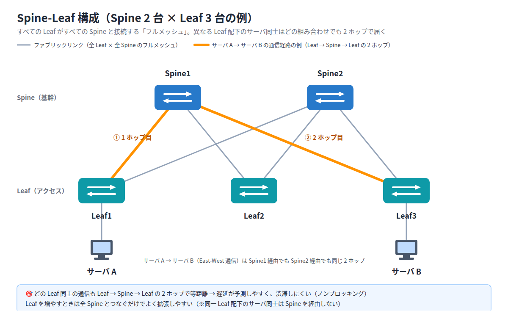
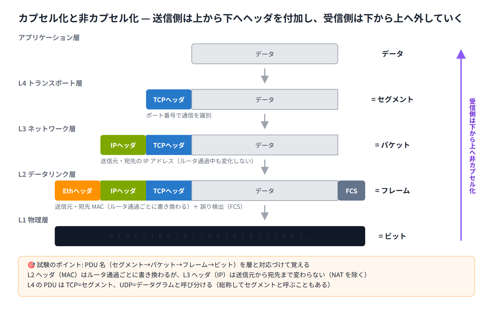

# Exercise 1 講義: ネットワークの全体像と OSI / TCP-IP モデル

> 配置先: ドキュメント `01_教材 > LESSON1_ネットワーク基礎 > Exercise01`
> 学習時間の目安: 3.5 時間 ／ 準拠: CCNA 200-301 v1.1 ドメイン 1

## 学習目標

この講義を終えると、次のことができるようになります。

1. OSI 参照モデルの 7 階層と TCP/IP モデルの対応関係と、各層に代表的なプロトコル（TCP / UDP・IP・ICMP・ARP、HTTP など）があることを説明できる
2. ネットワークを構成する機器の役割と動作する層（ルータ = L3、スイッチ = L2、ハブ = L1 など）を説明できる
3. 2 階層 / 3 階層・Spine-Leaf といったネットワークトポロジの特徴を説明できる
4. データがカプセル化されて送信される流れを、PDU の名前とともに説明できる

---

## 1. ネットワークとは何か

ネットワークとは、複数のコンピュータ（エンドポイント）同士がデータをやり取りできる
ように接続した仕組みです。会社の LAN も、世界中の網の目であるインターネットも、
基本の構成要素は同じです。

この Exercise では、まず通信の役割を階層に分けて整理する「参照モデル」から学びます。
層の考え方を先に押さえると、続いて登場する機器（ルータ・スイッチ・ハブ）を
「どの層で仕事をするか」で整理でき、理解が一気に楽になるからです。そのあと機器・
トポロジ・カプセル化へと進み、ネットワークの全体像をつかみます。

## 2. OSI 参照モデルと TCP/IP モデル

通信の機能を階層に分けて整理したものが**参照モデル**です。層ごとに役割を分けることで、
「どこまで正常で、どこから壊れているか」を切り分けられるようになります。

| OSI（7 層） | 役割 | 代表例 | TCP/IP モデル |
|---|---|---|---|
| 7 アプリケーション | ユーザに近いサービス | HTTP, DNS, SMTP | アプリケーション |
| 6 プレゼンテーション | データ形式の変換・暗号化 | TLS, JPEG | アプリケーション |
| 5 セッション | 対話の開始・維持・終了 | — | アプリケーション |
| 4 トランスポート | 端末間の通信の信頼性・ポート番号 | TCP, UDP | トランスポート |
| 3 ネットワーク | ネットワーク間の経路選択（IP アドレス） | IP, ICMP | インターネット |
| 2 データリンク | 隣接機器間の転送（MAC アドレス） | Ethernet, ARP | ネットワークアクセス |
| 1 物理 | ビットを電気・光・電波で伝送 | UTP, 光ファイバ | ネットワークアクセス |

表中の **MAC アドレス**（L2）は、通信用の部品（ネットワークカード）1 つひとつに割り当てられた
固有の識別番号です。LESSON0 P3・P5 で学んだ IP アドレス（ネット上の住所）とは別の番号で、
機器そのものに製造時に刻まれた「製造番号」のようなものだと考えてください。世界中で
重複しないよう、製造メーカーごとに使える番号の範囲が決められています。

> 💼 **実務では**: 保守運用の現場でも、障害の切り分けは OSI の下位層から順に
> 上げていくのが定石です。監視でアラートが上がったら『`show interface` で
> L1/L2、`ping` と `show ip route` で L3』のように、層ごとに使う確認コマンドを
> 対応づけて状況を絞り込みます。大事なのは、どこまで自分で確認したかを手順書や
> チケットに残しながら進めることです。設定変更が必要そうだと分かった時点、あるいは
> 原因が特定の層に絞り込めない時点で、先輩や上位チームへエスカレーションします。
> 切り分け（原因究明）までが新人の仕事で、対処（設定変更）は保守で信頼を積んだ
> 先に任されるようになります。

> **暗記のコツ**: 7→1 の頭文字「ア・プ・セ・ト・ネ・デ・ブ」。
> 実務・試験では特に L1〜L4 の理解が重要です。

### TCP/IP モデルと代表的なプロトコル

TCP/IP モデルは、実際のインターネットで使われているプロトコル（通信の約束事）を
4 つの層に整理したものです。各層には「顔」となる代表的なプロトコルがあります。

- **トランスポート層 — TCP / UDP**: TCP は届いたかを確認しながら送る「確実さ重視」、
  UDP は確認を省いて送る「速さ重視」のプロトコルです。宅配便の「受領印あり」と
  「ポスト投函」の違いにたとえられます。
- **インターネット層 — IP・ICMP**: IP は宛先アドレスをもとにネットワークを越えて
  データを運ぶ主役です。ICMP は「届いたか」を知らせる連絡係で、疎通確認コマンド
  `ping` が使っているのがこの ICMP です。
- **ネットワークアクセス層 — Ethernet・ARP**: Ethernet はケーブル上でフレームを運ぶ
  仕組み、ARP は「この IP アドレスを持つのはどの MAC アドレスの機器か」を調べる、
  IP と MAC の橋渡し役です。

アプリケーション層の代表的なプロトコルには、それぞれ**ポート番号**（通信の種類を
見分けるための番号。IP アドレスが建物の住所なら、その部屋番号にあたるもの）が
決められています。

| プロトコル | 役割 | ポート番号 |
|---|---|---|
| HTTP | Web ページの閲覧（暗号化なし） | 80 |
| HTTPS | Web ページの閲覧（暗号化あり） | 443 |
| DNS | ドメイン名と IP アドレスの変換 | 53 |
| SSH | 機器への遠隔ログイン（暗号化あり） | 22 |
| Telnet | 機器への遠隔ログイン（暗号化なし） | 23 |
| DHCP | IP アドレスの自動割り当て | 67 / 68 |
| SMTP | メールの送信 | 25 |
| FTP | ファイル転送 | 20 / 21 |

ここでは「各層に代表的なプロトコルがある」という全体像がつかめれば十分です。
ポート番号をこの時点ですべて暗記する必要はありません。TCP / UDP の詳しい仕組みと
ウェルノウンポートの暗記は Exercise 5 で改めて取り組みます。

## 3. 主な構成機器

前の章で学んだ層の考え方を使うと、ネットワーク機器は「**どの層の情報を見て転送を
判断するか**」で整理できます。まず全体を眺めてから、実機操作で特に重要な
ルータ・スイッチ・ハブを詳しく見ていきます。

| 機器 | 役割 | 動作する層 |
|---|---|---|
| **ルータ** | 異なるネットワーク同士を接続し、IP アドレスをもとに転送経路を選ぶ | L3 |
| **L2 スイッチ** | 同一ネットワーク内で MAC アドレスをもとにフレームを転送する | L2 |
| **L3 スイッチ** | スイッチにルーティング機能を加えたもの。VLAN 間通信などに使う | L2 / L3 |
| **アクセスポイント（AP）** | 無線 LAN クライアントを有線ネットワークに接続する | L2 |
| **ハブ** | 受信した信号を全ポートへそのまま繰り返し送信する（宛先を判断しない） | L1 |
| **ファイアウォール / IPS** | 通信を検査し、許可されていない通信を遮断・検知する | L3〜L7 |
| **エンドポイント** | PC・スマートフォン・プリンタなど、通信の始点・終点となる機器 | — |
| **サーバ** | Web・メール・ファイルなどのサービスを提供する機器 | — |

表中の **IPS**（Intrusion Prevention System、侵入防止システム）は、既知の攻撃パターンを
検知して通信を自動的に遮断する仕組みです。ファイアウォールと合わせて使われます。

### ルータ — L3: IP アドレスで経路を選ぶ

異なるネットワーク同士を接続する機器です。受け取ったパケットの宛先 IP アドレスを、
自分が持つ経路情報（**ルーティングテーブル**）と照らし合わせて「次にどこへ渡すか」を
選びます。郵便局が郵便番号を見て配送ルートを決めるイメージです。またルータは、
宛先を指定しない一斉送信（ブロードキャスト）を別のネットワークへ中継しない、
つまり**ブロードキャストドメインを分割する**機器でもあります（本章の最後で整理します）。

### L2 スイッチ — L2: MAC アドレスを学習して転送する

同一ネットワーク内でフレームを運ぶ機器です。ポイントは **MAC アドレスの学習**です。

1. フレームを受信すると、その**送信元** MAC アドレスと受信ポートの対応を
   **MAC アドレステーブル**に記録する
2. **宛先** MAC アドレスがテーブルにあれば、そのポート**だけ**へ転送する
3. 宛先がまだテーブルになければ、受信ポート以外の全ポートへ送る（**フラッディング**）

学習が進むほど「宛先のいるポートだけに送る」効率的な転送になります。スイッチは
**ポートごとにコリジョンドメインを分割**しますが、ブロードキャストは全ポートへ
中継するため、**ブロードキャストドメインは分割しません**。コリジョンドメインと
ブロードキャストドメインの意味は、本章の最後で整理します。なお、ルーティング機能を
加えた **L3 スイッチ**は VLAN 間通信などに使われます（VLAN 間ルーティングの詳細は
Exercise 8 で学びます）。

### ハブ — L1: 信号を繰り返すだけ

受信した電気信号を、宛先を判断せず**全ポートへそのまま繰り返し送信**する機器です。
L1（物理層）の機器なので、MAC アドレスも IP アドレスも見ません。全機器が 1 本の線を
共有している状態のため、**全ポートで 1 つのコリジョンドメイン**となり、
2 台が同時に送信するとデータが衝突（コリジョン）して再送が必要になります。

現在の現場でハブがほぼ使われなくなった理由は、次の 3 つです。

1. スイッチが十分に安価になり、衝突のない効率的な転送が当たり前になった
2. 無関係な機器にも全通信が届いてしまうため、盗聴されやすい
3. 送信と受信を同時に行えない（半二重）ため、性能が出ない

ただし試験では「スイッチとの対比」で登場し続けるため、動作の違いは押さえておきます。

### コリジョンドメインとブロードキャストドメイン

**コリジョンドメイン**とは、複数の機器が同時に信号を送るとデータ同士がぶつかる
（衝突する）可能性がある範囲のことです。**ブロードキャストドメイン**とは、宛先を
指定しない同報通信（ブロードキャスト）が届く範囲のことです。3 つの機器の違いを
表で整理します。

| 機器 | 動作する層 | コリジョンドメイン | ブロードキャストドメイン |
|---|---|---|---|
| ハブ | L1 | 分割しない（全体で 1 つ） | 分割しない |
| L2 スイッチ | L2 | ポートごとに分割 | 分割しない |
| ルータ | L3 | 分割する | インターフェースごとに分割 |

> **試験のポイント**: 「どの機器がどの層で判断して転送するか」（ハブ = L1、
> スイッチ = L2〈MAC アドレス〉、ルータ = L3〈IP アドレス〉）と、「コリジョン
> ドメインを分割するのはスイッチ、ブロードキャストドメインを分割するのはルータ」は
> 最頻出です。構成図中のドメインの数を数えさせる問題もよく出ます。

## 4. ネットワークトポロジ

### 2 階層（Collapsed Core）と 3 階層

- **3 階層**: アクセス層（端末収容）→ ディストリビューション層（集約・ポリシー）→
  コア層（高速転送）。大規模ネットワーク向け。
- **2 階層**: コアとディストリビューションを 1 つにまとめた構成。中小規模向けで
  コストを抑えられる。

### Spine-Leaf

データセンターで主流の構成です。すべての Leaf（アクセス）スイッチが、すべての Spine
（基幹）スイッチと接続されます。Leaf 同士、Spine 同士は直接つなぎません。

この形にすると、**異なる Leaf 配下**のサーバ同士の通信（**East-West 通信**。
データセンター内のサーバ間でやり取りされる横方向の通信を指します）は、どの組み合わせでも
Leaf → Spine → Leaf の 2 ホップになります。経路の長さがどこでも等しいため、遅延が
予測しやすいのが利点です。さらに、どのサーバ同士が同時に通信しても途中の回線が渋滞して
待たされにくい構造（**ノンブロッキング**）にもなります。なお、同一 Leaf 配下のサーバ
同士は Spine を経由しません。

下図は Spine 2 台 × Leaf 3 台の例です。**Leaf–Spine 間だけがフルメッシュ**
（すべての Leaf がすべての Spine と結ばれた状態）になっている点と、どの Leaf 同士の
間にも同じ長さの経路があることを確認してください。



> **試験のポイント**: Spine-Leaf の利点は「予測可能な低遅延」と「拡張性」です。
> 「必ず 2 ホップ」という絶対的な言い回しよりも、「どの Leaf 同士も等距離」という
> 本質を押さえておきましょう。

### その他の用語

- **SOHO**: 小規模オフィス・自宅オフィス。ルータ・スイッチ・AP・FW が 1 台に
  統合された機器を使うことが多い
- **WAN**: 拠点間を結ぶ広域網。専用線・MPLS・インターネット VPN などの回線で構成する
  - **MPLS**（Multi-Protocol Label Switching）: 通信事業者が提供する広域網サービスの
    一種です。パケットに「ラベル」という短い荷札を付けて高速に転送し、拠点間を事業者の
    網でつなぎます。品質が安定している反面、費用は高くなりがちです
  - **VPN**（Virtual Private Network、仮想私設網）: インターネットのような公衆網の上に
    暗号化した通路を作り、専用線でつながっているかのように拠点間や在宅端末を接続する
    仕組みです（詳細は Exercise 18 で学びます）
- **オンプレミスとクラウド**: 自社設備で持つか、事業者のサービス（AWS 等）を使うか

## 5. カプセル化と PDU

アプリケーションのデータは、下の層に渡されるたびに**ヘッダが付加**されます。
これを**カプセル化**と呼び、各層でのデータの単位を **PDU** と呼びます。

```
アプリケーションデータ
  └─ L4: [TCPヘッダ | データ]                = セグメント
      └─ L3: [IPヘッダ | セグメント]          = パケット
          └─ L2: [Ethヘッダ | パケット | FCS] = フレーム
              └─ L1: 0101110… の信号          = ビット
```



- 送信側は上から下へカプセル化、受信側は下から上へ**非カプセル化**する
- L2 ヘッダの**送信元・宛先 MAC アドレスは、ともにルータを通過するたびに書き換わる**が、
  L3 ヘッダ（IP アドレス）は原則、送信元から宛先まで変わらない（NAT〈Network Address
  Translation、IP アドレスを変換する技術〉を除く。詳しくは Exercise 14 で学びます）
- L4 の PDU は TCP = **セグメント**、UDP = **データグラム**と呼び分ける
  （総称してセグメントと呼ぶこともある）

> 💼 **実務では**: この「各層でヘッダが付く」構造は、監視ログだけでは
> 切り分けが進まないときに Wireshark などのパケットキャプチャで実際に確認します。
> ただし客先常駐の保守現場では、キャプチャを「勝手に」取ることはしません。作業手順書に
> 沿って対象区間と取得のタイミングをあらかじめ決め、作業前後の状態を記録した上で
> 行うのが基本です。新人がやりがちなのは、ルータを越えた先で採ったキャプチャの
> 読み違えです。宛先 MAC が「相手 PC ではなく直前のルータの MAC」になっているのを見て、
> 「宛先が違う、壊れている」と誤解してしまいます。MAC はホップごとに書き換わるのが
> 正常だと理解した上で、それでも原因が特定できなければキャプチャ結果を添えて
> 先輩へエスカレーションします。

> **試験のポイント**: 「セグメント / パケット / フレーム」がどの層の PDU かを
> 即答できるようにしてください。TCP のセグメントと UDP のデータグラムの
> 呼び分けも問われることがあります。

## まとめ

- OSI 7 層と TCP/IP 4 層の対応と、各層の代表的なプロトコルを全体像として押さえる
  （ポート番号の定着は Exercise 5 で行う）
- ネットワーク機器は動作する層で役割が決まる（ハブ = L1、スイッチ = L2、ルータ = L3）
- コリジョンドメインを分割するのはスイッチ、ブロードキャストドメインを分割するのはルータ
- トポロジは規模と目的で選ぶ（2 階層 / 3 階層 / Spine-Leaf）
- カプセル化の順序と PDU 名（セグメント → パケット → フレーム → ビット）

---

## 確認問題（自己チェック・解答は末尾）

1. TCP はどの層のプロトコルか。OSI の層番号と層名で答えよ。
2. スイッチがフレームの転送先を決めるときに参照するアドレスは何か。
3. データセンターで East-West 通信の遅延が一定になりやすいトポロジは何か。
4. L3 の PDU の名称は何か。
5. ルータを 2 台経由して通信するとき、宛先 MAC アドレスは何回書き換わるか。

<details><summary>解答</summary>

1. 第 4 層・トランスポート層
2. 宛先 MAC アドレス
3. Spine-Leaf
4. パケット
5. 2 回（各ルータで次のホップの MAC に書き換わる）

</details>

## 次のステップ

この Exercise のラボ課題「[Exercise01] ラボ: PT入門 — 最小構成の作成とカプセル化の観察」
に進み、ここまでに学んだカプセル化を Packet Tracer のシミュレーションモードで実際に
確認してください。
