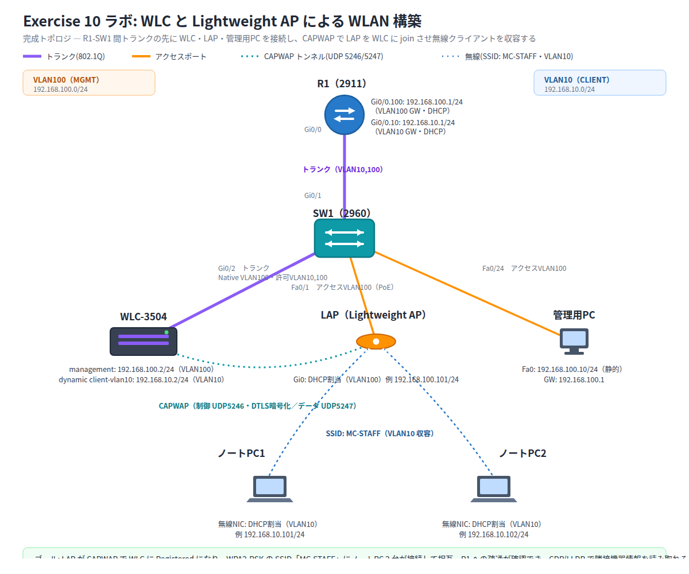

# Exercise 10 ラボ手順書: WLC と Lightweight AP による WLAN 構築、CDP/LLDP による隣接機器確認

> 配置先: ドキュメント `02_ラボ手順書 > LESSON2 > Exercise10`
> 所要時間の目安: 2.5 時間 ／ 使用ツール: Cisco Packet Tracer 9.x

## ゴール

- WLC と Lightweight AP（LAP）を **CAPWAP** で接続し、正常に join した状態を
  確認できる
- WLC の GUI で **WPA2-PSK** の WLAN を 1 つ構築できる
- 無線クライアント（ノート PC）2 台を SSID に接続し、相互および有線側の
  ルータとの疎通を確認できる
- **CDP** と **LLDP** を CLI から確認し、隣接機器の情報（IP アドレス・
  プラットフォーム・接続ポート）を読み取り、両者の違いを説明できる

> **このラボの進め方**: 手順 1〜11 が**必須**（約 2 時間）で、これだけで上記の
> ゴールと提出物をすべて満たせます。有線側（VLAN・トランク・DHCP）は
> Exercise 6〜8 の既習内容なので開始ファイルに設定済みにしてあり、手順 1 では
> **確認だけ**を行います。時間が余った人向けに、末尾に**発展課題**
> （有線側をゼロから構築する／2 つ目の WLAN を作る／QoS プロファイルを変える）
> を用意しています。**発展課題は提出物に含まれません。**

## 完成トポロジ



### IP アドレス表

| 機器 | インターフェース | 所属 VLAN | IP アドレス | サブネットマスク | 備考 |
|---|---|---|---|---|---|
| R1 | Gi0/0.100 | 100 | 192.168.100.1 | 255.255.255.0 | 管理 VLAN ゲートウェイ・DHCP サーバ |
| R1 | Gi0/0.10 | 10 | 192.168.10.1 | 255.255.255.0 | クライアント VLAN ゲートウェイ・DHCP サーバ |
| WLC-3504 | management | 100 | 192.168.100.2 | 255.255.255.0 | セットアップウィザードで静的に設定 |
| WLC-3504 | dynamic（クライアント収容用） | 10 | 192.168.10.2 | 255.255.255.0 | GUI の Controller > Interfaces で作成 |
| LAP | Gi0 | 100 | DHCP 割当（例: 192.168.100.101） | 255.255.255.0 | VLAN100 の DHCP プールから取得 |
| 管理用 PC | Fa0 | 100 | 192.168.100.10 | 255.255.255.0 | 静的設定（WLC GUI へのアクセス用） |
| ノート PC 1 | 無線 NIC | 10 | DHCP 割当（例: 192.168.10.101） | 255.255.255.0 | SSID: MC-STAFF |
| ノート PC 2 | 無線 NIC | 10 | DHCP 割当（例: 192.168.10.102） | 255.255.255.0 | SSID: MC-STAFF |

> 使用機器: Router 2911 × 1、WLC-3504 × 1、Lightweight AP（LAP-PT、**PoE**（Power
> over Ethernet：LAN ケーブル経由で電力を供給する仕組み）対応）× 1、Switch 2960
> （PoE 対応ポートを持つモデル）× 1、ノート PC × 2、管理用 PC × 1

---

## 手順 1: 事前設定の確認（15 分）

このラボの主題は**無線 LAN（WLC / LAP）**です。有線側（VLAN・トランク・
サブインターフェース・DHCP）は Exercise 6〜8 で学んだ内容なので、
**開始ファイル `exercise10_start.pkt` に設定済み**です。ここでは打ち込み直すのではなく、
**なぜその設定になっているのかを読み取ること**に時間を使ってください。

> ゼロから自分で構築したい場合は、末尾の**発展課題 1** に手順があります。
> まずは無線の本題（手順 2 以降）を終えてから取り組んでください。

### 1-1. 配線を確認する

| 接続元 | 接続先 |
|---|---|
| R1 Gi0/0 | SW1 Gi0/1 |
| WLC-3504 管理ポート | SW1 Gi0/2 |
| LAP Gi0 | SW1 Fa0/1 |
| 管理用 PC Fa0 | SW1 Fa0/24 |

ノート PC 2 台は有線接続しません（あとの手順で無線接続します）。

### 1-2. VLAN とアクセスポートを確認する

SW1 で次を実行し、VLAN 10（クライアント用）と VLAN 100（管理用）が作られ、
Fa0/1（LAP）と Fa0/24（管理用 PC）が VLAN100 に割り当てられていることを確認します。

```
SW1# show vlan brief
SW1# show interfaces status
```

LAP を収容する Fa0/1 には `power inline auto`（PoE 給電）が入っています。
**LAP は電源アダプタを持たず、スイッチから給電を受けて起動します**（Exercise 2 の PoE）。

### 1-3. トランクとネイティブ VLAN を確認する（ここが無線特有の要点）

```
SW1# show interfaces trunk
```

Gi0/1（R1 側）と Gi0/2（WLC 側）がトランクで、許可 VLAN は 10 と 100 です。
**Gi0/2 だけネイティブ VLAN が 100 に設定されている**ことに注目してください。

> **なぜ Gi0/2 のネイティブ VLAN を 100 にするのか**: WLC の管理インターフェースは、
> あとの手順で VLAN 識別子に `0`（＝タグなし）を設定します。タグなしフレームは
> トランクではネイティブ VLAN として扱われるため、ここを VLAN100 に合わせることで
> 管理トラフィックが正しく VLAN100（192.168.100.0/24）に乗ります。
> **ここが不一致だと管理トラフィックが既定のネイティブ VLAN（VLAN1）に流れてしまい、
> R1 にも管理用 PC にも到達できず、GUI ログインが失敗します。**
> 無線の設定が正しくても「つながらない」ときは、まずここを疑ってください。

### 1-4. R1 のサブインターフェースと DHCP を確認する

```
R1# show ip interface brief
R1# show running-config | section dhcp
```

- `Gi0/0.100`（VLAN100・192.168.100.1）と `Gi0/0.10`（VLAN10・192.168.10.1）の
  2 つのサブインターフェースがあること
- DHCP プールが 2 つ（`VLAN100-MGMT` / `VLAN10-CLIENT`）あること
- `VLAN100-MGMT` に **`option 43 hex f104.c0a8.6402`** が入っていること

> **オプション 43 とは**: LAP は起動時に「WLC がどこにいるか」を知りません。
> DHCP のオプション 43 で WLC の管理 IP を教えることで、LAP が自動的に WLC を
> 見つけて CAPWAP で参加できます。値 `f104.c0a8.6402` は
> 「タイプ `f1`（WLC IP 通知）＋ 長さ `04`（4 バイト）＋ WLC の管理 IP
> 192.168.100.2 を 16 進数にした `c0a86402`」を連結したものです。
> WLC の管理 IP を変えたら、この値も計算し直す必要があります。

## 手順 2: WLC のコンソール初期セットアップ（15 分）

1. WLC-3504 をコンソール接続する。Packet Tracer 上では物理ケーブルは不要で、
   WLC-3504 をクリックして **[CLI]** タブを開くとコンソール接続した状態になる。
   ここまでのスイッチやルータでは自分でコンフィグレーションモードに入って
   1 行ずつコマンドを打ってきましたが、WLC は初回起動時、画面に表示される
   質問に順番に答えていく **セットアップウィザード**（対話形式の設定画面）が
   自動的に始まります。主な入力項目は次のとおり

   | 質問項目 | 入力する値 |
   |---|---|
   | System Name | `WLC1` |
   | 管理者ユーザ名 / パスワード | 任意（例: `admin` / `Cisco123`） |
   | Management Interface IP Address | `192.168.100.2` |
   | Management Interface Netmask | `255.255.255.0` |
   | Management Interface Default Router | `192.168.100.1` |
   | Management Interface VLAN Identifier | `0`（タグなし＝ネイティブ VLAN 扱い。接続先は Gi0/2 のトランク側で、手順 1 で当該トランクのネイティブ VLAN を VLAN100 に設定済みのため、管理トラフィックは VLAN100 として扱われる） |
   | DHCP Server IP Address | `192.168.100.1`（手順 1 で DHCP サーバとして構成した R1 のアドレス。無線クライアントの DHCP 要求を R1 へ中継する **リレーエージェントの役割は WLC 自身が担う**） |

2. 設定完了後、WLC が再起動またはログインプロンプトに戻ることを確認する

## 手順 3: WLC GUI へのログイン（5 分）

1. 管理用 PC に IP アドレス `192.168.100.10 / 255.255.255.0`（ゲートウェイ
   `192.168.100.1`）を設定する
2. 管理用 PC の [Desktop] タブにある [Web Browser] アプリを開き、アドレス欄に
   `https://192.168.100.2` と入力してアクセスする
3. 手順 2 で設定したユーザ名・パスワードでログインする

## 手順 4: ダイナミックインターフェースの作成（10 分）

1. GUI 上部メニューの **Controller > Interfaces** を開く
2. **New** から、クライアント収容用のダイナミックインターフェースを作成する
   - Interface Name: `client-vlan10`
   - VLAN Identifier: `10`
   - IP Address: `192.168.10.2`
   - Netmask: `255.255.255.0`
   - Gateway: `192.168.10.1`
3. 作成後、一覧に `client-vlan10` が VLAN10 として表示されることを確認する

## 手順 5: WLAN の作成（General タブ）（10 分）

1. 上部メニューの **WLANs > Create New** を開く
2. SSID に `MC-STAFF` と入力し、**Apply** で新規 WLAN を作成する
3. 作成された WLAN の **General** タブで次を設定する
   - Status: **Enabled**
   - Interface/Interface Group(G): 手順 4 で作成した `client-vlan10` を選択する

## 手順 6: セキュリティの設定（Security タブ）（10 分）

1. 同じ WLAN 編集画面の **Security > Layer 2** タブを開く
2. Layer 2 Security に **WPA2** を選択し、暗号方式が **AES** になっていることを
   確認する
3. Authentication Key Management で **PSK** を選択し、パスフレーズ（例:
   `MoodCinema2026`）を設定する
4. **Apply** して設定を保存する

## 手順 7: LAP の CAPWAP join 確認（10 分）

1. LAP の電源を確認し、SW1 Fa0/1 経由で DHCP から IP アドレスを取得させる
2. WLC GUI の **Wireless** メニューを開き、Access Points の一覧に LAP が
   表示され、Status が **Registered**（登録済み）になっていることを確認する
3. 表示された LAP の詳細から、CAPWAP で正常に join していること（IP アドレス・
   AP モードが Local になっていること）を確認する

## 手順 8: 無線クライアントの接続（15 分）

1. ノート PC 1 の NIC を有線から無線に交換する（モジュールの差し替えは
   電源を切ってから行う必要があります）
   1. ノート PC 1 をクリックし、**[Physical]** タブを開く
   2. 本体右側の電源ボタンをクリックして電源を **オフ** にする
   3. スロットに刺さっている有線モジュール（Copper）を、右側の空きスペースへ
      ドラッグして取り外す
   4. 左側のモジュール一覧から **PT-LAPTOP-NM-1W**（無線 NIC）を選び、空いた
      スロットへドラッグして装着する
   5. 電源ボタンを再度クリックして電源を **オン** に戻す
   6. **[Desktop]** タブ → **[PC Wireless]** を開く

   ノート PC 2 についても同じ手順（①〜⑥）を行う
2. SSID の一覧から `MC-STAFF` を選択して接続する
3. セキュリティ方式として WPA2-PSK を選び、手順 6 で設定したパスフレーズを
   入力する
4. 接続後、IP Configuration を確認し、VLAN10 の DHCP プール（192.168.10.0/24）
   から IP アドレスが自動取得されていることを確認する

## 手順 9: 疎通確認（10 分）

1. ノート PC 1 の Command Prompt から、ノート PC 2 と R1 へ ping する

   ```
   PC> ping 192.168.10.102
   PC> ping 192.168.10.1
   ```

2. **確認**: いずれも `Reply from ... ` が返ること。初回は CAPWAP・DHCP・
   無線アソシエーションの完了待ちでタイムアウトすることがあるため、時間を
   置いて再実行する

## 手順 10: CDP による隣接機器確認（10 分）

1. SW1 で CDP の隣接情報を確認する

   ```
   SW1# show cdp neighbors
   ```

2. 一覧に表示される R1・WLC-3504 の **デバイス ID・ローカルポート・接続先
   ポート・プラットフォーム** を記録する
3. より詳細な情報を確認する

   ```
   SW1# show cdp neighbors detail
   ```

4. 表示された **IP アドレス・IOS（またはソフトウェア）バージョン・
   プラットフォーム** を記録する

## 手順 11: LLDP の有効化と確認（10 分）

1. SW1 で LLDP を有効化する（既定では無効のため）

   ```
   SW1(config)# lldp run
   ```

2. LLDP の隣接情報を確認する

   ```
   SW1# show lldp neighbors
   ```

3. 手順 10 の CDP の結果と比較し、表示される項目や取得できた隣接機器の
   数に違いがないかを確認する

### 観察レポート（コメント提出用）

以下 3 問に答えて、課題のコメントに記入してください。

1. `show cdp neighbors detail` で表示された隣接機器の IP アドレス・
   プラットフォーム・接続ポートを 1 つ挙げ、`show lldp neighbors` の出力と
   比べて情報の違いを述べてください。
2. 作成した WLAN で選択したセキュリティ方式（WPA2・AES・PSK）を書き、
   なぜ WEP やオープン認証を選ばなかったのか理由を述べてください。
3. LAP が WLC に join するために必要だった条件（IP アドレスの取得と WLC の
   IP アドレスを知る手段）を、CAPWAP のトンネルと関連づけて説明してください。

## 発展課題（余裕があれば）

**ここから先は必須ではありません。** 手順 11 までで、この Exercise のゴールと
提出物はすべて満たせます。時間が余った人、もっと手を動かしたい人だけ取り組んでください。
本試験の出題という観点では、手順 2〜7（WLC の GUI 設定）と手順 10〜11（CDP / LLDP）が
最も重要です。

### 発展課題 1: 有線側をゼロから構築する（約 55 分）

手順 1 で「設定済み」として確認した有線側を、初期状態から自分で作ります。
Exercise 6〜8 の総復習になります。開始ファイルを別名でコピーしてから、
SW1 と R1 の設定を `erase startup-config` → 再起動で消して始めてください。

1. **SW1**: ホスト名、VLAN 10（`WIRELESS-CLIENT`）/ VLAN 100（`MGMT`）の作成
2. **SW1**: Fa0/1 を VLAN100 のアクセスポートにし `power inline auto` を設定、
   Fa0/24 も VLAN100 のアクセスポートにする
3. **SW1**: Gi0/1・Gi0/2 をトランクにし、許可 VLAN を 10,100 に。
   **Gi0/2 のネイティブ VLAN を 100** にする（手順 1-3 の理由を思い出しながら）
4. **R1**: `Gi0/0.100`（192.168.100.1）と `Gi0/0.10`（192.168.10.1）の
   サブインターフェースを作成
5. **R1**: 除外アドレスと DHCP プール 2 つを作成。VLAN100 側には
   `option 43 hex f104.c0a8.6402` を忘れずに

作り終えたら手順 2 以降をもう一度通し、無線クライアントが接続できることを確認します。

### 発展課題 2: 2 つ目の WLAN を作る（約 20 分）

ゲスト用に SSID `CCNA-GUEST` を追加し、**別のダイナミックインターフェース**
（VLAN を分ける）に紐づけます。同じ AP から 2 つの SSID が見えること、
それぞれが別の VLAN・別のサブネットになることを確認してください。
実務では「社内用」と「ゲスト用」をこの形で分離します。

### 発展課題 3: QoS プロファイルを変えてみる（約 10 分）

WLAN の **QoS タブ**で、プロファイルを `Silver（best effort）` から
`Platinum（voice）` に変更し、設定が反映されることを確認します。
4 つのプロファイル（Platinum / Gold / Silver / Bronze）がそれぞれ
どんな通信を想定しているかは、Exercise 14 の QoS で詳しく学びます。

## 提出方法

1. ファイルを `exercise10_氏名.pkt` の名前で保存する（例: `exercise10_山田太郎.pkt`）
2. Backlog のラボ課題に `.pkt` ファイルを**添付**する
3. 手順 7・10・11 で確認した画面（スクリーンショット可）と、上記の観察
   レポートを課題の**コメント**に貼る
4. 課題の状態を「処理済み」に変更する

## うまくいかないとき

| 症状 | 確認すること |
|---|---|
| LAP が WLC に join しない（Registered にならない） | LAP が DHCP で IP を取得できているか、DHCP オプション 43 の値（16 進数）が WLC の管理 IP と一致しているか、SW1 の Fa0/1 が VLAN100 のアクセスポートかつ PoE 給電されているか |
| 手順 3 で `https://192.168.100.2` に接続できない | SW1 Gi0/2 のネイティブ VLAN が VLAN100 に設定されているか（手順 1）。WLC の Management Interface VLAN Identifier が `0` のままネイティブ VLAN 側が不一致だと、管理トラフィックが VLAN1 に流れてしまい到達不能になる |
| ノート PC が SSID を発見できない | LAP が Registered になっているか、WLAN の Status が Enabled になっているか、無線 NIC への切り替えが完了しているか |
| ノート PC が接続できるが IP を取得できない | ダイナミックインターフェース `client-vlan10` の VLAN ID・IP 設定、SW1 の Gi0/2（WLC 側）トランクで VLAN10 が許可されているか |
| ノート PC 間 / R1 への ping が通らない | R1 のサブインターフェースの encapsulation dot1Q 番号と VLAN 番号の対応、SW1 の各トランクで VLAN10・VLAN100 が許可されているか |
| `show lldp neighbors` に何も表示されない | `lldp run` を投入し忘れていないか、相手機器が LLDP に対応しているか |

30 分試して解決しない場合は、状況（スクリーンショット + 試したこと）を
課題のコメントに書いて質問してください。
