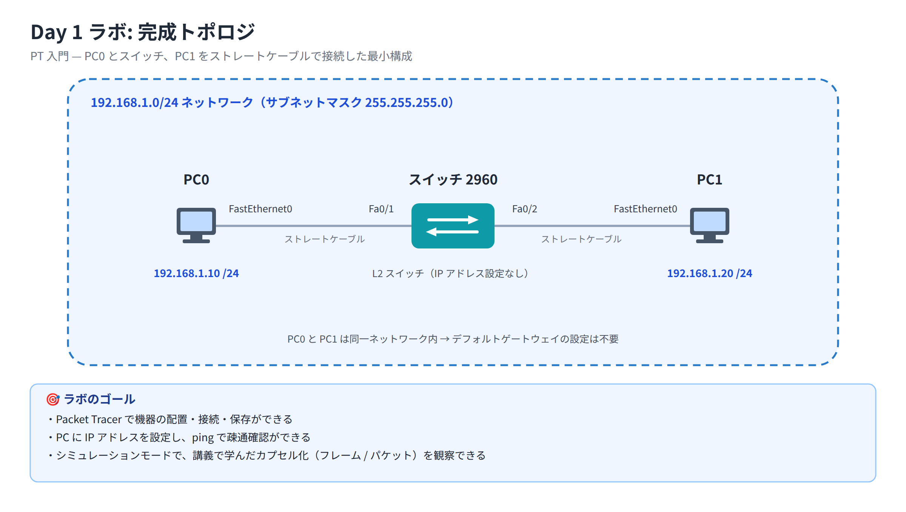

# Day 1 ラボ手順書: PT 入門 — 最小構成の作成とカプセル化の観察

> 配置先: ドキュメント `02_ラボ手順書 > Week1 > Day01`
> 所要時間の目安: 2.5 時間 ／ 使用ツール: Cisco Packet Tracer 9.x

## ゴール

- Packet Tracer で機器の配置・接続・保存ができる
- PC に IP アドレスを設定し、ping で疎通確認ができる
- シミュレーションモードで、講義で学んだカプセル化（フレーム / パケット）を観察できる

## 完成トポロジ



---

## 手順 1: トポロジの作成（20 分）

1. Packet Tracer を起動し、新規ファイルを開く
2. 左下のデバイスボックス → [End Devices] → **PC** をワークスペースに 2 台配置
3. [Network Devices] → [Switches] → **2960** を 1 台配置
4. 接続（稲妻アイコン）→ **ストレートケーブル**（実線）を選択
   - PC0 をクリック → `FastEthernet0` → スイッチをクリック → `FastEthernet0/1`
   - PC1 も同様に `FastEthernet0/2` へ接続
5. 両リンクの●が**緑**になるまで待つ（スイッチ起動直後は橙 → 約 30 秒で緑）

> 橙のままの場合: スイッチの **STP**（Spanning Tree Protocol、ループを防ぐしくみ）が
> ポートを確認中です。焦らず待ちましょう（詳しい動作は Day 9 の STP で学びます）。

## 手順 2: PC の IP 設定（15 分）

1. PC0 をクリック → [Desktop] タブ → **IP Configuration**
   - IP Address: `192.168.1.10` ／ Subnet Mask: `255.255.255.0`
2. PC1 も同様に `192.168.1.20` / `255.255.255.0` を設定
3. ファイルを保存: `File > Save As` → `day01_氏名.pkt`

## 手順 3: 疎通確認（15 分）

1. PC0 の [Desktop] → **Command Prompt** を開く
2. 次のコマンドを 1 行ずつ入力し、そのつど Enter キーを押して実行する。結果を記録する

   ```
   ipconfig
   ping 192.168.1.20
   arp -a
   ```

   `arp -a` は、この PC がこれまでの通信で学習した「IP アドレスと MAC アドレスの
   対応表」を表示するコマンドです。

3. **確認**: ping が `Reply from 192.168.1.20 ...` になること
   - 1 回目の ping は最初の 1〜2 発がタイムアウトすることがあります。
     これは ARP 解決に時間がかかるためで正常です（もう一度実行すると全て成功します）

## 手順 4: シミュレーションモードでカプセル化を観察（60 分・本日のメイン）

ここが今日の山場です。時間をかけて構いません。

1. 右下の **Simulation** タブに切り替える（**Realtime** タブの隣にあります）
2. **Edit Filters** をクリックしてフィルタの一覧を開き、**Show All/None** で一旦すべての
   チェックを外す
3. IPv4 タブの中にある **ICMP** にチェックを入れ、一覧内で独立した項目になっている
   **ARP** にもチェックを入れる（ARP は IP アドレス→MAC アドレスを解決するプロトコルで、
   IPv4 の中には含まれていないため、別途チェックが必要です）。チェックしたらフィルタの
   一覧を閉じる
4. 画面下部ツールバーの **Power Cycle Devices** ボタンをクリックし、PC0・PC1・スイッチを
   再起動する（手順 3 の疎通確認で PC0 に登録済みの ARP キャッシュをクリアし、
   Simulation モードで ARP から観察できるようにするため。リンクが緑に戻るまで待つ）
5. PC0 から `ping 192.168.1.20` を実行し、画面下部の再生（▶）ボタンをクリックする。
   1 回クリックするごとに通信が 1 コマ（1 つのイベント）だけ進む
6. PC0 から出た封筒（パケット）のアイコンをクリックすると詳細画面が開く。その中の次の
   タブを開いて観察し、記録する
   - **OSI Model タブ**: 何層から何層までヘッダが付いているか
   - **Outbound PDU Details タブ**: Ethernet ヘッダの Src/Dest MAC、IP ヘッダの Src/Dest IP
7. スイッチ通過時にも同じように封筒（このときはスイッチの上に表示されているもの）を
   クリックし、**スイッチが L2（MAC）だけを見て転送している**ことを確認する
8. 最初の通信で **ARP**（誰が 192.168.1.20 ですか？）が先に流れることを確認する

### 観察レポート（コメント提出用）

以下 3 問に答えて、課題のコメントに記入してください。

1. PC0 が送信した ICMP フレームの宛先 MAC アドレスは、どの機器のものだったか
2. スイッチはフレームの IP ヘッダを書き換えたか（Yes/No とその理由）
3. ping の前に ARP が流れたのはなぜか（1〜2 文で）

## 手順 5: 提出（10 分）

1. `day01_氏名.pkt` を Backlog のラボ課題に**添付**する
2. 手順 3 のコマンド結果（スクリーンショット可）と手順 4 の観察レポートを
   課題の**コメント**に貼る
3. 課題の状態を「処理済み」に変更する

## うまくいかないとき

| 症状 | 確認すること |
|---|---|
| ping が全てタイムアウト | 両 PC の IP / サブネットマスクの入力ミス、ケーブルが緑か |
| リンクが赤い | ケーブル種類（ストレートか）、接続ポートの選択ミス |
| Simulation で何も表示されない | フィルタで ICMP/ARP にチェックが入っているか |

30 分試して解決しない場合は、状況（スクリーンショット + 試したこと）を
課題のコメントに書いて質問してください。
