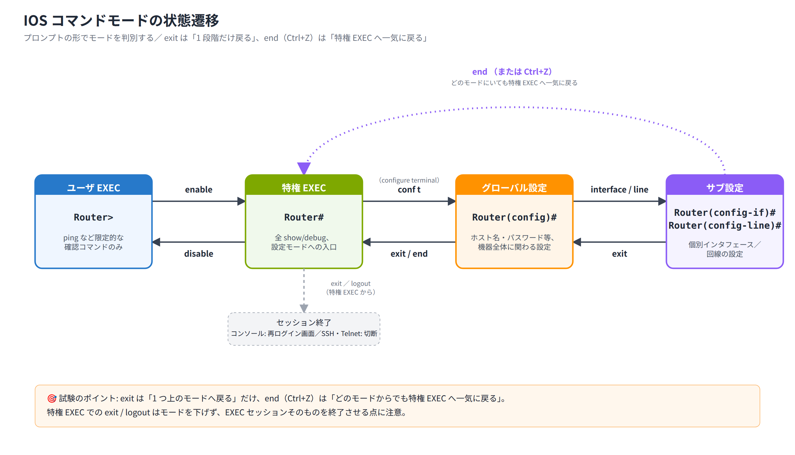

# Day 2 講義: Cisco IOS の基本操作とデバイス初期設定

> 配置先: ドキュメント `01_教材 > Week1_ネットワーク基礎 > Day02`
> 学習時間の目安: 3.5 時間 ／ 準拠: CCNA 200-301 v1.1 ドメイン 1・5

## 学習目標

この講義を終えると、次のことができるようになります。

1. コンソール・Telnet・SSH それぞれの接続方法と用途の違いを説明できる
2. IOS のコマンドモード（ユーザ EXEC・特権 EXEC・グローバル設定・サブ設定）を識別し、モード間を正しく遷移できる
3. ホスト名・パスワード・バナーなど、デバイスの基本設定を IOS コマンドで行える
4. スイッチとルータそれぞれに管理用 IP アドレスを設定し、到達性を確認できる
5. SSH を有効化し、Telnet より安全にリモート管理できる状態を作れる
6. running-config と startup-config の違いを理解し、設定を正しく保存・確認できる

---

## ウォームアップ（朝の想起クイズ）

> 教材を見ずに、まず自力で思い出してください（分散学習: Day 1「ネットワークの
> 全体像と OSI / TCP-IP モデル」の範囲から出題）。

**W1.** ルータと L2 スイッチは、それぞれ何ドメイン（コリジョンドメイン／
ブロードキャストドメイン）を分割するか。

**W2.** カプセル化における L4 の PDU 名を、TCP と UDP それぞれについて答えよ。

**W3.** OSI 参照モデルで TCP が動作するのは第何層・何という層か。

<details><summary>解答</summary>

W1. ルータ = ブロードキャストドメインを分割／L2 スイッチ = ポートごとに
コリジョンドメインを分割
W2. TCP = セグメント／UDP = データグラム（総称としてセグメントと呼ぶこともある）
W3. 第 4 層・トランスポート層

</details>

---

## 1. CLI へのアクセス方法（コンソール / Telnet / SSH）

Cisco IOS（Internetwork Operating System。Cisco 製ネットワーク機器の OS）を操作するには、
まず CLI（コマンドラインインタフェース）へ接続する方法を理解する必要があります。

### コンソール接続

初期構成がまだ済んでいない機器や、パスワードを忘れてしまった機器にアクセスする唯一の
方法が、機器背面の**コンソール（Console）ポート**への物理接続です。PC とはロールオーバー
ケーブル（両端のピン配列が逆になっている専用ケーブル）と、RJ45-to-USB 変換ケーブル
（または DB9 シリアル）を使って接続します。

端末エミュレータ（Tera Term や Packet Tracer の Terminal など）側の設定は、次の値が
デフォルトです。

| 項目 | 値 |
|---|---|
| ビットレート | 9600 bps |
| データビット | 8 |
| パリティ | なし（N） |
| ストップビット | 1 |
| フロー制御 | なし |

この組み合わせをまとめて「**9600 / 8-N-1**」と呼びます。

### AUX ポート

**AUX（補助）ポート**は、モデムを接続して電話回線経由で遠隔管理するためのレガシー
（旧世代）な仕組みです。現在の実務ではほとんど使われず、遠隔管理は後述の SSH、
現地での初期設定はコンソールが主流です。

### Telnet と SSH

リモートから CLI に接続する方法には、Telnet と SSH の 2 つがあります。

- **Telnet（TCP ポート 23）**: ユーザ名・パスワードを含む通信内容が**平文**のまま
  ネットワークを流れます。盗聴されると認証情報が漏えいするため、現在は非推奨です。
- **SSH（Secure Shell、TCP ポート 22）**: セッション全体が**暗号化**されるため、
  実務でも CCNA 試験でも標準的に推奨される方式です。

### インバンド管理とアウトオブバンド管理

- **アウトオブバンド管理**: コンソールポートや専用の管理ポートなど、本番のデータ
  通信経路とは別の経路で行う管理。ネットワーク障害時でもアクセスできるのが利点です。
- **インバンド管理**: SSH や Telnet のように、本番のネットワーク経路そのものを
  使って行う管理。

リモート管理（SSH/Telnet）は機器の **VTY（Virtual TeletYpe）回線**を経由して行われ、
機器に到達できる管理用 IP アドレスが設定されている必要があります。SSH を使う場合は
これに加えて、ホスト名・ドメイン名・RSA 鍵ペア・ローカルユーザアカウントの設定が
必須です（詳細は「5. SSH の有効化手順」で扱います）。

> **試験のポイント**: コンソール接続のデフォルトパラメータ（9600 / 8-N-1・フロー
> 制御なし）と、コンソール・VTY・AUX 各回線の用途の違いを問う問題が頻出です。

## 2. IOS のコマンドモードと遷移

IOS は操作できるコマンドの範囲によって、複数の「モード」に分かれています。プロンプト
（コマンド入力を促す記号）の形を見れば、今どのモードにいるかが分かります。

| モード | プロンプト例 | できること |
|---|---|---|
| ユーザ EXEC | `Router>` | ping など限定的な確認コマンドのみ |
| 特権 EXEC | `Router#` | すべての show/debug コマンド、再起動、設定モードへの入口 |
| グローバル設定 | `Router(config)#` | ホスト名やパスワードなど、機器全体に関わる設定 |
| サブ設定（インタフェース） | `Router(config-if)#` | 個別インタフェースの設定 |
| サブ設定（回線） | `Router(config-line)#` | コンソールや VTY など回線の設定 |

### モード間の移動

```
Router>                       ← ユーザ EXEC モード
Router> enable
Router#                       ← 特権 EXEC モード（enable で移行）
Router# configure terminal
Router(config)#               ← グローバル設定モード（conf t が省略形）
Router(config)# interface g0/0
Router(config-if)#            ← サブ設定モード（インタフェース）
Router(config-if)# exit
Router(config)#               ← 1 つ上のモードへ戻る
Router(config)# end
Router#                       ← end（または Ctrl+Z）で特権 EXEC へ一気に戻る
Router# disable
Router>                       ← disable でユーザ EXEC へ戻る
```

- `exit` は「1 つ上のモードへ戻る」動作、`end`（または `Ctrl+Z`）は「どのモードに
  いても特権 EXEC まで一気に戻る」動作です。この違いを混同しないようにしましょう。
- 特権 EXEC から `disable` を実行するとユーザ EXEC（`Router>`）に戻ります。一方、
  特権 EXEC で `exit`（または `logout`）を実行してもユーザ EXEC には戻らず、EXEC
  セッションそのものが終了します（コンソールでは再びログインプロンプトに戻り、
  SSH/Telnet では接続が切断されます）。
- 語呂で覚えるなら「`end` = 一気に `#` まで、`exit` = 一段だけ（ただし特権 EXEC
  の `exit` はセッション終了）、`disable` = `#` から `>` へ」です。



### 編集ショートカット

| キー操作 | 動作 |
|---|---|
| `Tab` | コマンドの補完 |
| `?` | ヘルプ表示（入力可能なコマンド・パラメータの一覧） |
| `Ctrl+C` | 実行中のコマンド入力を中断 |
| `Ctrl+Shift+6` | ping などの実行中プロセスを中断 |

IOS の設定コマンドは、入力して Enter を押した瞬間に **running-config（稼働中の設定）**
へ即座に反映されます。多くのソフトウェアのような「保存（コミット）」操作は不要です。
設定を取り消したい場合は、同じコマンドの先頭に `no` を付けて実行します（例:
`no ip address`）。

### 設定モードのまま確認コマンドを使う（do）

`Router(config)#` などの設定モードにいるまま `show` コマンドを実行したい場合は、
コマンドの先頭に `do` を付けます。

```
R1(config)# do show ip interface brief
```

`do` を使えば、わざわざ `end` で特権 EXEC に戻って `show` を実行し、また
`configure terminal` で設定モードに戻る…という往復操作が不要になります。

> **試験のポイント**: `(config)#` のまま確認コマンドを実行するテクニックは
> `do <command>` です。

> **試験のポイント**: 各コマンドモードのプロンプト表記（`>` `#` `(config)#`
> `(config-if)#`）と、そのモードへ入る／戻るコマンド（`enable` / `configure
> terminal` / `exit` / `end`）はセットで暗記しておきましょう。

## 3. 基本設定 — 名前・パスワード・バナー

### ホスト名

```
Router(config)# hostname SW1
SW1(config)#
```

`hostname` コマンドを実行すると、設定した瞬間にプロンプトへ反映されます。

### 特権 EXEC のパスワード

特権 EXEC モードへの入室を保護するパスワードには 2 種類ありますが、実務では
`enable secret` を使います。

```
SW1(config)# enable secret cisco123
```

- `enable secret`: パスワードを **MD5 相当のハッシュ**（不可逆な変換値）として
  running-config に保存します。`show running-config` を見ても元のパスワードは
  分かりません。
- `enable password`: パスワードを**平文**のまま保存する古い方式です。
- 両方が設定されている場合は **`enable secret` が優先**されます。

### コンソールと VTY の保護

```
! コンソール回線の保護
SW1(config)# line console 0
SW1(config-line)# password consolepw
SW1(config-line)# login

! VTY（リモート接続）回線の保護
SW1(config)# line vty 0 4
SW1(config-line)# password vtypw
SW1(config-line)# login
```

- `login` はパスワード入力を要求する設定です。`password` だけを設定して `login`
  を忘れると、実際には認証が求められません。
- ローカルユーザデータベース（`username` コマンドで作成したアカウント）で認証したい
  場合は、`login` の代わりに **`login local`** を使います。

### パスワードの隠蔽

```
SW1(config)# service password-encryption
```

`service password-encryption` を実行すると、running-config 内にある平文パスワード
（`enable password` や、コンソール・VTY の `password` コマンドで設定した値）が
**Type 7** と呼ばれる弱い暗号化方式で見た目上隠されます。Type 7 は解読ツールで
容易に元に戻せるため強固な保護ではありませんが、肩越しの盗み見程度は防げます。
なお、この設定は `enable secret`（すでに強固なハッシュ）には影響しません。

> 💼 **実務では**: Type 7（`service password-encryption`）は「暗号化」ではなく
> 「肩越しの覗き見よけ」程度の扱いで、専用ツールで一瞬のうちに復号できるため
> 機密保護とは見なしません。実際の保護は `enable secret`（現行 IOS では Type 8/9 =
> SHA-256/scrypt）側が担います。新人がやりがちなのは Type 7 を「暗号化済みだから
> 安全」と誤解し、running-config をそのままチケットや Wiki・Git に貼ってしまう
> ことです。設定を外部と共有するときは、Type 7 の行を必ずマスクしましょう。

### その他の便利な設定

```
SW1(config-line)# exec-timeout 5 0
SW1(config-line)# logging synchronous
```

- `exec-timeout <分> <秒>`: 無操作状態が続いた場合に自動でログアウトするまでの時間。
- `logging synchronous`: コンソールへのログメッセージが、入力中のコマンド行に
  割り込んで表示を乱すのを防ぎます。

### バナー

```
SW1(config)# banner motd #Authorized access only#
```

`banner motd`（Message Of The Day）は、ログイン**前**に表示される警告メッセージです。
`#` の部分は「区切り文字（デリミタ）」で、メッセージ本文に含まれない任意の 1 文字を
選び、その文字でメッセージ全体を囲みます。無断アクセスを禁止する法的な警告文を
表示する目的でよく使われます。

> **試験のポイント**: `enable secret` と `enable password` の違い（ハッシュ保存 vs
> 平文、優先順位）、および `service password-encryption` が何を暗号化し、何を
> 暗号化しないかは頻出テーマです。

## 4. 管理 IP アドレスとリモート到達性の設定

リモートから機器を管理するには、機器に IP アドレスを設定する必要があります。この
設定方法は**スイッチとルータで異なる**ため、しっかり区別しましょう。

### スイッチの管理 IP（SVI）

L2 スイッチはデータ転送そのものには IP アドレスを使わないため、個々のアクセス
ポートには IP を設定しません。代わりに、**SVI（Switch Virtual Interface。VLAN に
対応する仮想インタフェース）**に管理用の IP アドレスを設定します。

```
SW1(config)# interface vlan 1
SW1(config-if)# ip address 192.168.1.11 255.255.255.0
SW1(config-if)# no shutdown
```

スイッチが自分と異なるサブネットの端末から管理される場合、L2 スイッチはルーティング
機能を持たないため、戻りの通信を送り出す先として**デフォルトゲートウェイ**を
明示的に教えてやる必要があります。

```
SW1(config)# ip default-gateway 192.168.1.1
```

### ルータの管理 IP

ルータは L3（ネットワーク層）で動作する機器なので、**物理インタフェースに直接**
IP アドレスを設定します。

```
R1(config)# interface gigabitEthernet 0/0
R1(config-if)# ip address 192.168.1.1 255.255.255.0
R1(config-if)# no shutdown
```

### no shutdown の重要性

**スイッチのアクセスポート（物理ポート）は既定で有効**なため、`no shutdown` は
基本的に不要です。一方、**ルータの物理インタフェース**と**スイッチの SVI**
（`interface vlan`）は既定で **administratively down（管理者によって無効化された
状態）**になっているため、IP アドレスを正しく設定していても `no shutdown` を
実行しないと通信できません。

> **試験のポイント**: `no shutdown` が必要になるのは (1) ルータの物理インタフェース
> (2) スイッチの SVI の 2 パターンです。スイッチのアクセスポートは既定で up のため
> 混同しないようにしましょう。

### 状態の確認

```
R1# show ip interface brief
```

`show ip interface brief` は、各インタフェースの IP アドレスと **Status**（物理層の
状態）・**Protocol**（データリンク層の状態）を一覧表示します。両方が `up` であれば
正常に通信可能な状態です。

```
Interface              IP-Address      OK? Method Status                Protocol
GigabitEthernet0/0     192.168.1.1     YES manual up                    up
GigabitEthernet0/1     unassigned      YES unset   administratively down down
```

インタフェースには `description` コマンドで用途のメモを付けられます（例:
`description Link to SW1`）。設定内容には影響せず、運用時の可読性を高めるための
コマンドです。

> **試験のポイント**: スイッチの管理 IP は SVI（`interface vlan`）に設定し、
> 別サブネットから管理する場合は `ip default-gateway` が必要という、L2 スイッチ
> 特有の設定パターンは頻出です。また `show ip interface brief` の Status/Protocol
> の意味と `no shutdown` の必要性も必ず押さえてください。

## 5. SSH の有効化手順

SSH を有効化するには、いくつかの前提設定を順番どおりに行う必要があります。

### 手順 1: ホスト名とドメイン名

```
R1(config)# hostname R1
R1(config)# ip domain-name example.local
```

RSA 鍵（後述）の名前には「ホスト名 + ドメイン名」が使われるため、この 2 つは
鍵生成より**先**に設定しておく必要があります。

### 手順 2: RSA 鍵ペアの生成

```
R1(config)# crypto key generate rsa
```

鍵の長さ（モジュラス）を聞かれたら、**768 ビット以上**を指定します。SSH バージョン 2
の要件を満たすには 1024 ビット以上が推奨されます。

```
How many bits in the modulus [512]: 1024
```

### 手順 3: SSH バージョンの固定

```
R1(config)# ip ssh version 2
```

初期の SSH（バージョン 1）には脆弱性が知られているため、脆弱な SSHv1 を排除して
**SSHv2 のみ**を許可するようにします。

### 手順 4: ローカルユーザの作成

```
R1(config)# username admin privilege 15 secret adminpw
```

`privilege 15` は最高権限（特権 EXEC 相当）でログインさせる指定です。`secret` に
することでパスワードはハッシュ化されて保存されます。

### 手順 5: VTY 回線で SSH を強制

```
R1(config)# line vty 0 4
R1(config-line)# transport input ssh
R1(config-line)# login local
```

`transport input ssh` は VTY 回線で許可する接続プロトコルを SSH のみに制限する
コマンドです。これにより Telnet 接続は拒否されます。`login local` によって、
ステップ 4 で作成したローカルユーザデータベースを使って認証します。

### 動作確認

```
R1# show ip ssh
R1# show ssh
```

- `show ip ssh`: SSH のバージョンや設定状態を確認します。
- `show ssh`: 現在アクティブな SSH セッションの一覧を確認します。

> 💼 **実務では**: 本番機では SSHv2 のみ・Telnet 全廃が大前提で、認証もローカル
> `username` ではなく AAA（TACACS+/RADIUS）に寄せ、鍵長も 2048 ビット以上が
> 一般的です。新人が最もやりがちな事故は、VTY を `transport input ssh` /
> `login local` に切り替える作業中に打ち間違いや設定漏れで「唯一のリモート管理
> 経路から自分を締め出す」ことです。VTY を触る間はコンソールセッションを 1 本
> 開けたままにし、別端末で SSH ログインが成功するのを確認してからコンソールを
> 閉じるのが定石です。もう一つの定番事故は `copy running-config startup-config`
> を忘れたまま `reload` や停電で全設定が飛ぶこと。VTY/SSH を変更したら即座に
> 保存する癖をつけましょう。

> **試験のポイント**: SSH 有効化に必要な前提条件（`hostname` → `ip domain-name`
> → `crypto key generate rsa` → ローカルユーザ → `transport input ssh`）の
> 順序と組み合わせを選ばせる問題が頻出です。1 つでも欠けると SSH は動作しません。

## 6. 設定ファイルの保存と確認コマンド

### running-config と startup-config

| 名称 | 保存場所 | 特徴 |
|---|---|---|
| running-config | RAM | 現在稼働中の設定。**揮発性**（電源断で消える） |
| startup-config | NVRAM | 起動時に読み込まれる設定。**不揮発性**（電源を切っても残る） |

設定コマンドは即座に running-config に反映されますが、電源が切れると消えてしまいます。
変更を恒久的に残すには、明示的に startup-config へ保存する必要があります。

```
R1# copy running-config startup-config
```

省略形として `copy run start` もよく使われます。同じ意味を持つコマンドとして
`write memory`（省略形 `wr`）もあります。

```
R1# write memory
```

### 設定の表示と初期化

```
R1# show running-config
R1# show startup-config
```

機器を工場出荷時の状態に戻したい場合は、次の手順で startup-config を消去してから
再起動します。

```
R1# erase startup-config
R1# reload
```

### 主要な show コマンド

| コマンド | 表示内容 |
|---|---|
| `show ip interface brief` | 各インタフェースの IP アドレスと状態（Status/Protocol） |
| `show version` | IOS のバージョン、稼働時間（uptime）、コンフィグレジスタなど |
| `show mac address-table` | スイッチが学習した MAC アドレスとポートの対応（スイッチ専用） |
| `show running-config` | 現在の全設定 |
| `show interfaces` | 各インタフェースの詳細な統計情報（エラー数・速度・デュプレックスなど） |

`show running-config` は「今どんな設定が入っているか」を確認するコマンドであるのに
対し、`show interfaces` は「回線がどのくらい正常に動いているか（エラー・速度など）」
を確認するコマンドという役割の違いを意識しましょう。

### IOS の起動順序（概略）

1. **POST**（Power-On Self Test。電源投入時の自己診断）
2. **ブートストラップ**プログラムの実行（IOS の場所を特定）
3. **IOS のロード**（通常はフラッシュメモリから）
4. **startup-config を running-config へ適用**（NVRAM から読み込み）

> **試験のポイント**: running-config（RAM）と startup-config（NVRAM）の格納場所の
> 違い、そして変更を永続化するための `copy running-config startup-config` は
> 非常によく出題されます。

## まとめ

- CLI へのアクセスにはコンソール・Telnet・SSH があり、SSH が暗号化通信のため推奨される
- IOS には ユーザ EXEC・特権 EXEC・グローバル設定・サブ設定 の 4 段階のモードがあり、
  `enable` / `configure terminal` / `exit` / `end` で行き来する
- `enable secret` はハッシュ保存、`enable password` は平文保存で、両方あれば
  `enable secret` が優先される
- スイッチの管理 IP は SVI（`interface vlan`）に設定し、ルータは物理インタフェースに
  直接設定する。いずれも `no shutdown` が必要
- SSH の有効化には hostname・ドメイン名・RSA 鍵・ローカルユーザ・
  `transport input ssh` が必須
- running-config（RAM・揮発性）と startup-config（NVRAM・不揮発性）を区別し、
  `copy running-config startup-config` で確実に保存する

---

## 確認問題（自己チェック・解答は末尾）

1. 特権 EXEC モードからグローバル設定モードへ移行するコマンドは何か。
2. `enable secret` と `enable password` の両方が設定されている場合、どちらが
   有効になるか。
3. スイッチの管理用 IP アドレスは、どのインタフェースに設定するか。
4. SSH を有効化する際、RSA 鍵を生成する前に必ず設定しておくべき 2 つの項目は何か。
5. 電源を切っても設定を残すために実行するコマンドは何か。

<details><summary>解答</summary>

1. `configure terminal`（省略形 `conf t`）
2. `enable secret`（優先される）
3. SVI（`interface vlan 1` などの VLAN インタフェース）
4. ホスト名（`hostname`）とドメイン名（`ip domain-name`）
5. `copy running-config startup-config`（または `write memory`）

</details>

## 次のステップ

本日のラボ課題「[Day02] ラボ: IOS の基本操作とデバイス初期設定」に進み、実機
（Packet Tracer 上のルータ・スイッチ）に対してホスト名・パスワード・管理 IP・SSH を
実際に設定し、Admin-PC から SSH でリモートログインできることを確認してください。
