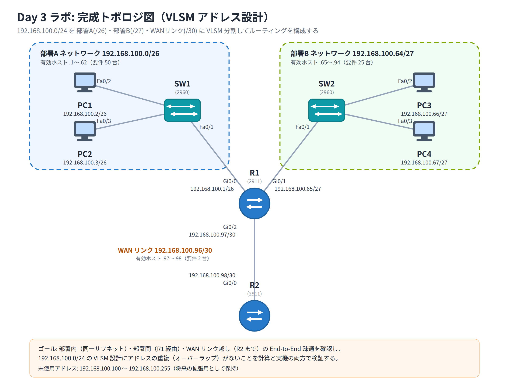

# Day 3 ラボ手順書: VLSM によるアドレス設計とルーティング

> 配置先: ドキュメント `02_ラボ手順書 > Week1 > Day03`
> 所要時間の目安: 2.5 時間 ／ 使用ツール: Cisco Packet Tracer 9.x

## ゴール

- 部署別ホスト数の要件書をもとに `192.168.100.0/24` を VLSM（可変長サブネット
  マスク）で設計できる
- 算出したサブネットをルータのインターフェースと PC に正しく割り当てられる
- 部署内（同一サブネット）の疎通と、部署間（ルータ経由）の疎通、および
  WAN リンク越しの End-to-End 疎通を確認できる
- アドレスのオーバーラップ（重複）がない設計であることを、計算と実機の両方で検証できる

## 完成トポロジ



### IP アドレス割り当て表（VLSM 設計結果）

要件: 部署 A = 50 台、部署 B = 25 台、R1-R2 の WAN リンク = 2 台
（必要数の多い順に、`192.168.100.0/24` の先頭から連続して割り当てています）

| 用途 | ネットワークアドレス | プレフィックス | サブネットマスク | ブロードキャスト | 有効ホスト範囲 | 割り当て機器 |
|---|---|---|---|---|---|---|
| 部署 A（50 台） | 192.168.100.0 | /26 | 255.255.255.192 | 192.168.100.63 | .1〜.62 | R1 Gi0/0, PC1, PC2 |
| 部署 B（25 台） | 192.168.100.64 | /27 | 255.255.255.224 | 192.168.100.95 | .65〜.94 | R1 Gi0/1, PC3, PC4 |
| WAN リンク（2 台） | 192.168.100.96 | /30 | 255.255.255.252 | 192.168.100.99 | .97〜.98 | R1 Gi0/2, R2 Gi0/0 |

| 機器 | インターフェース | IP アドレス | サブネットマスク | デフォルトゲートウェイ |
|---|---|---|---|---|
| R1 | Gi0/0 | 192.168.100.1 | 255.255.255.192 | — |
| R1 | Gi0/1 | 192.168.100.65 | 255.255.255.224 | — |
| R1 | Gi0/2 | 192.168.100.97 | 255.255.255.252 | — |
| R2 | Gi0/0 | 192.168.100.98 | 255.255.255.252 | — |
| PC1 | NIC | 192.168.100.2 | 255.255.255.192 | 192.168.100.1 |
| PC2 | NIC | 192.168.100.3 | 255.255.255.192 | 192.168.100.1 |
| PC3 | NIC | 192.168.100.66 | 255.255.255.224 | 192.168.100.65 |
| PC4 | NIC | 192.168.100.67 | 255.255.255.224 | 192.168.100.65 |

`192.168.100.100`〜`192.168.100.255` は将来の拡張用として未使用のまま残します。

---

## 手順 1: VLSM 設計とアドレスの確定（20 分）

1. 要件（部署 A = 50 台 ／ 部署 B = 25 台 ／ WAN リンク = 2 台）を確認する
2. 必要ホスト数の多い順に並べ替える: 部署 A（50）→ 部署 B（25）→ WAN（2）
3. それぞれに必要な最小のプレフィックス長を求める
   - 部署 A: 2^6 − 2 = 62 ≥ 50 → **/26**
   - 部署 B: 2^5 − 2 = 30 ≥ 25 → **/27**
   - WAN: 2 台ちょうど → **/30**
4. `192.168.100.0/24` の先頭から順に、ブロックが重ならないように連続して割り当てる
   （上の「IP アドレス割り当て表」を参照）
5. 各サブネットのネットワークアドレス・ブロードキャストアドレス・ホスト範囲を紙または
   メモに書き出し、**範囲が交差していない**ことを目視で確認する

## 手順 2: トポロジの作成（20 分）

1. Packet Tracer を起動し、新規ファイルを開く
2. [Network Devices] → [Routers] → **2911** を 2 台配置（R1, R2）
3. [Network Devices] → [Switches] → **2960** を 2 台配置（SW1, SW2）
4. [End Devices] → **PC** を 4 台配置（PC1〜PC4）
5. ケーブル（すべて**ストレートケーブル**）で接続する
   - R1 `GigabitEthernet0/0` — SW1 `FastEthernet0/1`
   - R1 `GigabitEthernet0/1` — SW2 `FastEthernet0/1`
   - R1 `GigabitEthernet0/2` — R2 `GigabitEthernet0/0`（WAN リンク）
   - SW1 `Fa0/2` — PC1、SW1 `Fa0/3` — PC2
   - SW2 `Fa0/2` — PC3、SW2 `Fa0/3` — PC4
6. PC-スイッチ間リンクの●が緑になることを確認する（R1 が絡むリンク〔R1-SW1、
   R1-SW2、R1-R2〕は、ルータのインタフェースが既定でシャットダウン状態のため、
   手順 4 で `no shutdown` を投入するまで赤〔down〕のままとなる点に注意する）

## 手順 3: ルータの基本設定（10 分）

Packet Tracer では、Day 2 で行ったロールオーバーケーブルによるコンソール接続をしなくても、
ルータのアイコンを直接クリックすると開く **[CLI] タブ**から同じ CLI（コマンドライン
インタフェース）を操作できます（実機では必ずケーブル接続が必要ですが、これはシミュレータ
上の簡易操作です）。R1・R2 それぞれのアイコンをクリックして [CLI] タブを開き、以下を
実行します。

```
enable
configure terminal
hostname R1
```

R2 も同様に `hostname R2` を設定します。

## 手順 4: ルータインターフェースへの IP アドレス設定（25 分）

**R1** で、部署 A・部署 B・WAN リンクの 3 つのインターフェースに設定します。

```
interface gigabitEthernet0/0
 ip address 192.168.100.1 255.255.255.192
 no shutdown
 exit
interface gigabitEthernet0/1
 ip address 192.168.100.65 255.255.255.224
 no shutdown
 exit
interface gigabitEthernet0/2
 ip address 192.168.100.97 255.255.255.252
 no shutdown
 exit
```

**R2** で、WAN リンク側のインターフェースに設定します。

```
interface gigabitEthernet0/0
 ip address 192.168.100.98 255.255.255.252
 no shutdown
 exit
```

## 手順 5: ルーティングの設定（15 分）

**スタティックルート**とは、管理者が `ip route` コマンドで手動で登録する経路情報です
（「この宛先ネットワークへは、このネクストホップ〔次の転送先〕を通ればよい」という
対応を 1 行で教える設定です）。

R1 は部署 A・部署 B・WAN リンクの 3 つのネットワークすべてに**直接接続**されているため、
追加のスタティックルートは不要です（直結ネットワークは自動的にルーティングテーブルへ
登録されます）。

一方 R2 は WAN リンクのネットワークにしか接続されていないため、部署 A・部署 B へ
戻る経路を知りません。R2 にデフォルトルートを設定し、R1 へすべての通信を転送させます。
デフォルトルートは `ip route 0.0.0.0 0.0.0.0 <ネクストホップ>` の形式で設定し、
`0.0.0.0 0.0.0.0` は「どの宛先アドレスにも一致する」ことを表します。

```
ip route 0.0.0.0 0.0.0.0 192.168.100.97
```

> なぜ R1 には静的ルートが不要で R2 には必要なのか、を自分の言葉で説明できるように
> しておきましょう（レポート設問にも関連します）。

## 手順 6: PC の IP 設定（15 分）

各 PC の [Desktop] タブ → **IP Configuration** で、上の「IP アドレス割り当て表」に
従い、IP アドレス・サブネットマスク・デフォルトゲートウェイを入力します。

- PC1: `192.168.100.2` / `255.255.255.192` / GW `192.168.100.1`
- PC2: `192.168.100.3` / `255.255.255.192` / GW `192.168.100.1`
- PC3: `192.168.100.66` / `255.255.255.224` / GW `192.168.100.65`
- PC4: `192.168.100.67` / `255.255.255.224` / GW `192.168.100.65`

設定後、`File > Save As` で `day03_氏名.pkt` として保存します。

## 手順 7: 疎通確認と経路の検証（25 分）

1. R1 で次のコマンドを実行し、全インターフェースが `up` / `up` であることを確認する

   ```
   show ip interface brief
   ```

2. R1 で次のコマンドを実行し、ルーティングテーブルを確認する

   ```
   show ip route
   ```

   直結（`C`：Connected）ルートと、そこから派生する `L`（Local）ルートが、設計したプレフィックス
   （/26, /27, /30）で登録されていることを確認します。

3. PC1 の Command Prompt で `ipconfig` を実行し、設定値が割り当て表と一致することを
   確認する
4. PC1 から PC2 へ `ping 192.168.100.3` を実行し、**同一部署内（同一サブネット）**の
   疎通を確認する
5. PC1 から PC3 へ `ping 192.168.100.66` を実行し、**部署間（R1 経由）**の疎通を
   確認する
6. PC1 から R2 の WAN 側インターフェースへ `ping 192.168.100.98` を実行し、
   **WAN リンク越しの End-to-End 疎通**を確認する

## 手順 8: シミュレーションモードでの経路観察（10 分）

1. [Simulation] タブに切り替え、[Edit Filters] で **ICMP** のみを表示するようにする
2. PC1 から `ping 192.168.100.66`（PC3）を実行し、コマ送りで再生する
3. R1 の `GigabitEthernet0/0` で受信し、`GigabitEthernet0/1` から送出される様子を
   観察する（ルーティングによって出力インターフェースが切り替わる瞬間）
4. パケットをクリックし、**宛先 MAC アドレスが R1 を経由するたびに書き換わる**一方、
   **宛先 IP アドレスは変わらない**ことを確認する（Day 1 で学んだカプセル化の復習）

## 手順 9: 障害の再現と復旧（10 分）

意図的な誤設定によって、アドレス設計ミスがどのような症状を引き起こすかを体験します。

1. PC3 の IP Configuration を開き、サブネットマスクを誤って `255.255.255.128`
   （**/25**、本来の /27 ではない）に変更する
2. PC1 から PC3 へ `ping 192.168.100.66` を実行し、**疎通できなくなる**ことを確認する
   （マスクが広すぎるため、PC3 はリモートの PC1〔`.2`〕を同一サブネットだと誤認し、
   本来経由すべきデフォルトゲートウェイを使わず、部署 B のセグメント上で PC1 を
   直接 ARP しようとして応答が得られないため。なお PC3 → PC4 の ping は同一 /25
   内のため成功したままとなる）
3. 症状を確認したら、PC3 のサブネットマスクを正しい `255.255.255.224`（/27）に
   戻し、再度 ping を実行して疎通が復旧することを確認する

### 観察レポート（コメント提出用）

以下 3 問に答えて、課題のコメントに記入してください。

1. 設計した VLSM 表（各サブネットのネットワークアドレス・プレフィックス・
   ブロードキャスト・ホスト範囲・割り当て用途）を記載し、`192.168.100.0/24` 内で
   アドレスがオーバーラップしていないことをどう確認したか説明せよ。
2. `show ip route` の出力で、各サブネットが `C`（Connected）と `L`（Local）として
   どう表示されたか。`L` ルートのプレフィックスが `/32` になっている理由を述べよ。
3. WAN リンクに `/30` を選んだ理由を、収容ホスト数とアドレス効率の観点から説明せよ。
   `/24` のまま使った場合と比べてどれだけアドレスを節約できたか。

## 手順 10: 提出（5 分）

1. `day03_氏名.pkt` を Backlog のラボ課題に**添付**する
2. 手順 7 のコマンド結果（スクリーンショット可）と、観察レポートの 3 問の回答を
   課題の**コメント**に貼る
3. 課題の状態を「処理済み」に変更する

## うまくいかないとき

| 症状 | 確認すること |
|---|---|
| PC1 → PC2（同一部署内）で ping が失敗する | 両 PC の IP・マスクの入力ミス、ケーブルが緑か |
| PC1 → PC3（部署間）で ping が失敗するが同一部署内は成功する | 各 PC のデフォルトゲートウェイが正しいか、R1 のインターフェースが `no shutdown` 済みか |
| PC1 → R2（WAN 越し）で ping が失敗する | R2 に `ip route 0.0.0.0 0.0.0.0 192.168.100.97` が設定されているか、`show ip route` で経路を再確認 |
| `show ip interface brief` でインターフェースが `down` | `no shutdown` を入力し忘れていないか、ケーブル接続先のポート番号が正しいか |
| ルータへ IP アドレスを入力すると `overlaps with` のエラーが出る | 別のインターフェースと同じアドレス範囲を設定していないか、VLSM 設計を見直す |

30 分試して解決しない場合は、状況（スクリーンショット + 試したこと）を
課題のコメントに書いて質問してください。
