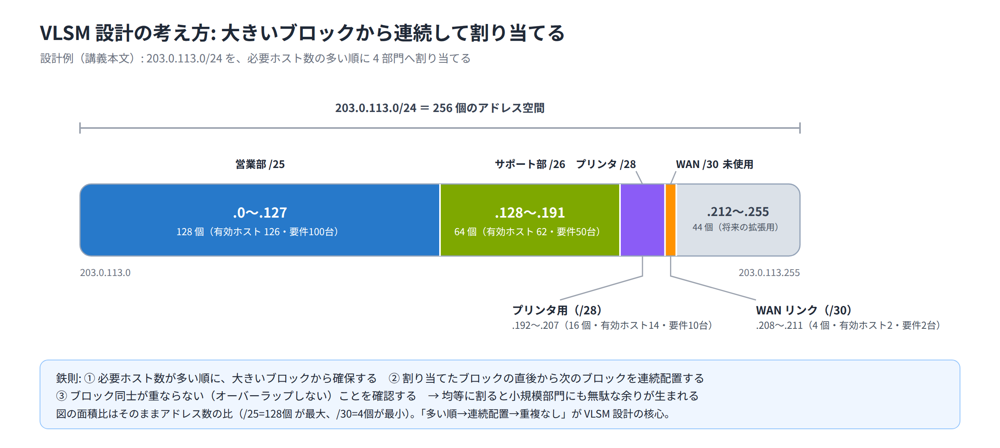

# Day 3 講義: IPv4 アドレッシングとサブネット化

> 配置先: ドキュメント `01_教材 > Week1_ネットワーク基礎 > Day03`
> 学習時間の目安: 3.5 時間 ／ 準拠: CCNA 200-301 v1.1 ドメイン 1

## 学習目標

この講義を終えると、次のことができるようになります。

1. IPv4 アドレスの 32 ビット構造を理解し、2 進数と 10 進数を相互変換できる
2. アドレスクラスと特殊アドレス（ループバック・APIPA・限定ブロードキャストなど）の用途を説明できる
3. RFC1918 の私設（プライベート）アドレス範囲を判別し、NAT が必要になる理由を説明できる
4. サブネットマスク・プレフィックス表記から、ネットワークアドレス・ブロードキャストアドレス・
   有効ホスト範囲・ホスト数を計算できる
5. VLSM（可変長サブネットマスク）を用いて、要件に応じたアドレス設計ができる

---

## ウォームアップ（朝の想起クイズ）

> 教材を見ずに、まず自力で思い出してください（分散学習: Day 2「Cisco IOS の基本操作と
> デバイス初期設定」の範囲から出題）。

**W1.** コンソール接続のデフォルトのビットレートは何 bps か。

**W2.** `enable secret` と `enable password` が両方設定されている場合、どちらが
優先されるか。

**W3.** ルータの物理インタフェースに IP アドレスを設定しても、忘れると通信できない
ままになる設定コマンドは何か。

<details><summary>解答</summary>

W1. 9600 bps（「9600 / 8-N-1」と呼ばれる設定一式の一部）
W2. `enable secret`（MD5 相当のハッシュで保存され、`enable password` より優先される）
W3. `no shutdown`（ルータの物理インタフェースは既定で administratively down のため）

</details>

---

## 1. IPv4 アドレスの構造

IPv4 アドレスは **32 ビット**の数値です。人間が読み書きしやすいように、8 ビットずつ
4 つの**オクテット**（octet）に区切り、それぞれを 10 進数（0〜255）に変換して
ドット（`.`）で区切って表記します。これを**ドット付き 10 進表記**と呼びます。

```
2進数: 11000000.10101000.00000001.00001010
10進数:      192   .   168    .    1    .    10
表記:              192.168.1.10
```

### 2 進数 ⇔ 10 進数の変換

1 オクテット（8 ビット）の各ビットの重みは、左から順に次のとおりです。合計すると
255 になります。

| ビット位置 | 8 | 7 | 6 | 5 | 4 | 3 | 2 | 1 |
|---|---|---|---|---|---|---|---|---|
| 重み | 128 | 64 | 32 | 16 | 8 | 4 | 2 | 1 |

例えば `10101000` は 128 + 32 + 8 = **168** です。試験でも実務でも頻繁に使うため、
この重みは暗記しておきましょう。

### ネットワーク部とホスト部

32 ビットのアドレスは、**ネットワーク部**（どのネットワークに属するか）と
**ホスト部**（そのネットワーク内のどの機器か）の 2 つに分かれます。この境界を
決めるのが後述の**サブネットマスク**です。

- 同一ネットワーク内の機器同士は、ネットワーク部が**同じ**で、ホスト部だけが異なる
- ネットワーク部が異なる 2 台の機器は、直接通信できず、**ルータ（L3 機器）を
  経由**しなければ通信できない

> **試験のポイント**: 2 つの IP アドレスが与えられ、「同一サブネットに属するか、
> ルーティングが必要か」を判定させる問題が頻出です。両方のアドレスにマスクを適用して
> ネットワーク部が一致するかを確認します。

### ネットワークアドレスとブロードキャストアドレス

各ネットワークには、ホストには割り当てられない特別な 2 つのアドレスがあります。

| 名称 | ホスト部のビット | 用途 |
|---|---|---|
| **ネットワークアドレス** | 全て `0` | そのネットワーク自体を指す識別子 |
| **ブロードキャストアドレス** | 全て `1` | そのネットワーク内の全ホスト宛の送信に使う |

この 2 つを除いたアドレスだけが、実際に機器へ割り当てられる**有効ホストアドレス**です。

## 2. アドレスクラスと特殊アドレス

IPv4 の初期設計では、アドレスを先頭ビットのパターンで 5 つの**クラス**に分類していました。

| クラス | 先頭オクテットの範囲 | 先頭ビット | 既定プレフィックス | 用途 |
|---|---|---|---|---|
| A | 1〜126 | `0` | /8 | 大規模ネットワーク |
| B | 128〜191 | `10` | /16 | 中規模ネットワーク |
| C | 192〜223 | `110` | /24 | 小規模ネットワーク |
| D | 224〜239 | `1110` | — | マルチキャスト |
| E | 240〜255 | `1111` | — | 実験用（予約） |

例えば A クラスの先頭ビットは必ず `0` なので、先頭オクテットは 2 進数で
`0xxxxxxx`（0000000〜1111110）の形になり、10 進数に直すと 1〜126 の範囲に収まります
（Week0 P2 で学んだ 2 進数⇔10 進数の変換と同じ考え方です）。

**127.0.0.0/8** はクラス A の範囲内にありますが、実際にはホストへ割り当てず
**ループバック**専用として予約されています。特に `127.0.0.1` は「自分自身」を指す
アドレスとして `localhost` の名前でもよく知られています。

現在の運用では、この「クラスフル」（アドレスクラスをもとにネットワーク部の長さを
固定的に決める考え方）はほぼ使われません。後述する
**CIDR（Classless Inter-Domain Routing、クラスレスアドレッシング）** により、
プレフィックス長を自由に設定してネットワークを柔軟に分割するのが標準です。

### その他の特殊アドレス

ここに出てくる**DHCP（Dynamic Host Configuration Protocol）**とは、ネットワークに
新しく接続した端末へ IP アドレスなどの設定情報をサーバが自動的に配布する仕組みです。
下表の**APIPA（Automatic Private IP Addressing）**は、この DHCP サーバが見つからなかった
場合に、端末自身が暫定的に割り当てる代わりのアドレスを指します。

| アドレス（範囲） | 名称 | 用途 |
|---|---|---|
| `169.254.0.0/16` | APIPA / リンクローカル | DHCP でアドレスを取得できなかった端末が自動的に割り当てる |
| `0.0.0.0` | 未指定アドレス / デフォルトルート | 送信元未指定、またはルーティングテーブルの既定経路を表す |
| `255.255.255.255` | 限定ブロードキャスト | 同一リンク上の全ホスト宛（ルータは転送しない） |

> **試験のポイント**: ループバック（127/8）・APIPA（169.254/16）・`0.0.0.0`・
> `255.255.255.255` は、それぞれの用途を問う問題が頻出です。「PC が DHCP
> サーバを見つけられないと 169.254.x.x が付く」という現象と合わせて覚えましょう。

## 3. 私設アドレス（RFC1918）と NAT の前提

社内 LAN など、インターネットに直接経路広告（他のネットワークへ「ここへの行き方」を
知らせること）されない環境で自由に使ってよいアドレス範囲が、**RFC1918**（RFC は
Request for Comments の略で、インターネット技術の標準・仕様を定めた文書群の呼び名です）
で定義されています。CCNA では次の 3 つの範囲を暗記します。

| 範囲 | プレフィックス | アドレス数 |
|---|---|---|
| `10.0.0.0` 〜 `10.255.255.255` | `10.0.0.0/8` | 約 1,677 万 |
| `172.16.0.0` 〜 `172.31.255.255` | `172.16.0.0/12` | 約 104 万 |
| `192.168.0.0` 〜 `192.168.255.255` | `192.168.0.0/16` | 約 6.5 万 |

これらの**私設（プライベート）アドレス**は、インターネット上ではルーティングされません。
そのため、私設アドレスを持つ端末がインターネットなどの外部と通信するには、
**NAT（Network Address Translation）** や、ポート番号を使って複数の端末で 1 つの
グローバルアドレスを共有する **PAT（Port Address Translation）** で
グローバル（公開）アドレスに変換する必要があります。NAT/PAT の設定詳細は Day 14 で
扱いますが、ここでは「私設アドレスのままではインターネットに出られない」という前提を
押さえておいてください。

私設アドレスは社内で重複さえしなければ自由に設計できるため、（1）限られたグローバル
アドレスの枯渇対策、（2）柔軟なアドレス設計、の両面で広く使われています。

> **試験のポイント**: 与えられた IPv4 アドレスが RFC1918 の私設アドレスか、
> インターネットにルーティング可能なグローバルアドレスかを判別させる問題が頻出です。
> `172.32.x.x` や `192.169.x.x` のように範囲を**わずかに外れる**ひっかけ選択肢に
> 注意してください。

> 💼 **実務では**: 全拠点が安易に `192.168.1.0/24` や `10.0.0.0/8` のような
> デフォルトのアドレス帯をそのまま使い回すと、拠点間 VPN の接続時や企業合併時に
> サブネットが重複し、通信不能や大規模な再採番・NAT 対応が必要になるトラブルが
> よく起こります。特に新人は各拠点で `192.168.1.0/24` を選びがちで、在宅勤務者が
> 自宅ルータの初期設定（多くが同じ `192.168.1.0/24`）と衝突して VPN に繋がらない
> のも定番の問題です。実務では IPAM（IP アドレス管理台帳）などを使い、拠点ごとに
> `10.x.x.x` 空間をあらかじめ計画的に配布し、重複を最初から避けるのが定石です。

## 4. サブネットマスクとプレフィックス表記

**サブネットマスク**は、IP アドレスの何ビット目までがネットワーク部かを示す 32 ビットの
値です。連続する `1`（ネットワーク部）の後に、連続する `0`（ホスト部）が続く構造を
とります（例: `255.255.255.0` = `11111111.11111111.11111111.00000000`）。

もう 1 つの表し方が **CIDR 表記（プレフィックス表記）** です。先頭から連続する `1`
の数をスラッシュに続けて書きます。

| プレフィックス | サブネットマスク | ホスト部ビット数 |
|---|---|---|
| /24 | 255.255.255.0 | 8 |
| /25 | 255.255.255.128 | 7 |
| /26 | 255.255.255.192 | 6 |
| /27 | 255.255.255.224 | 5 |
| /28 | 255.255.255.240 | 4 |
| /29 | 255.255.255.248 | 3 |
| /30 | 255.255.255.252 | 2 |

各オクテットに現れるマスクの 10 進値は、次の **8 種類しかありません**。この並びは
そのまま暗記しておくと計算が速くなります。

```
128, 192, 224, 240, 248, 252, 254, 255
```

> **試験のポイント**: 「255.255.255.192 はプレフィックス何か」「/28 のマスクは何か」
> のような、サブネットマスクの 10 進表記とプレフィックス表記の相互変換を問う問題が
> 頻出です。上の表を即座に再現できるようにしておきましょう。

### ホスト数とサブネット数の公式

- **ホスト部ビット数** = 32 − プレフィックス長
- **有効ホスト数** = 2^(ホスト部ビット数) − 2 （ネットワークアドレスとブロードキャストを除く）
- **サブネット数** = 2^(借用したビット数) （元のプレフィックスから何ビット延長したか）

例えば `192.168.1.0/24` を `/26` に分割すると、借用ビット数は 26 − 24 = 2 なので
2^2 = **4 個**のサブネットに分割できます。各サブネットのホスト部ビット数は
32 − 26 = 6 なので、有効ホスト数は 2^6 − 2 = **62 台**です。

## 5. サブネット計算の実践

> **ここが今日の山場です。** ここから先のブロックサイズを使ったネットワーク・
> ブロードキャストアドレスの計算は、今日の学習の中心であり、CCNA 試験でも最頻出の
> テーマです。焦らず、1 問ずつ手を動かしながら進めてください。時間をかけて構いません。

### ブロックサイズ（増分）

サブネット同士の境界は、一定の間隔で規則的に並びます。この間隔を
**ブロックサイズ（増分）** と呼び、次の式で求められます。

```
ブロックサイズ = 256 − マスクが適用されるオクテットの値
```

例えば `/26`（255.255.255.**192**）なら、ブロックサイズは 256 − 192 = **64**
です。つまり第 4 オクテットは 0, 64, 128, 192 の 64 刻みでサブネットが区切られます。

> **試験のポイント**: ブロックサイズを使って「あるホストアドレスがどのサブネットに
> 属するか」を素早く特定させる問題が頻出です。ホストアドレスの値を境界（ブロックサイズの
> 倍数）で挟み込み、直下の境界がネットワークアドレスになります。

### 計算手順（IP とマスクからネットワーク情報を求める）

1. マスクからブロックサイズを求める
2. 与えられたホストアドレスが、どの境界とどの境界の間にあるかを特定する
3. 下側の境界 = **ネットワークアドレス**
4. 上側の境界 − 1 = **ブロードキャストアドレス**
5. ネットワークアドレス + 1 〜 ブロードキャストアドレス − 1 = **有効ホスト範囲**

#### 例: `192.168.10.70/26`

| 項目 | 値 |
|---|---|
| マスク | 255.255.255.192（ブロックサイズ 64） |
| 境界 | .0, .64, .128, .192 |
| ネットワークアドレス | 192.168.10.**64** |
| ブロードキャストアドレス | 192.168.10.**127** |
| 有効ホスト範囲 | 192.168.10.65 〜 192.168.10.126（**62 台**） |

`.70` は `.64` と `.128` の間にあるため、下側の境界である `.64` がネットワーク
アドレス、上側の境界の 1 つ手前の `.127` がブロードキャストアドレスになります。

> **試験のポイント**: 与えられた IPv4 アドレスとサブネットマスク（またはプレフィックス）
> から、ネットワークアドレス・ブロードキャストアドレス・有効ホスト範囲・ホスト数を
> 求める計算問題は、CCNA 試験全体でも最頻出のテーマの 1 つです。上記の手順を
> 反復練習してください。

### ルータ間リンク専用のマスク: /30 と /31

ルータ同士を直結するポイントツーポイントリンクでは、両端の 2 台分のアドレスしか
必要ありません。

| プレフィックス | マスク | 有効ホスト数 | 特徴 |
|---|---|---|---|
| /30 | 255.255.255.252 | 2 | ネットワーク・ブロードキャストを含め 4 アドレス消費。最も一般的 |
| /31 | 255.255.255.254 | 2（RFC3021） | ネットワーク／ブロードキャストの概念を持たず、2 アドレスとも
  ホストとして使う。さらにアドレス効率が良い |

/24 のような大きなブロックをそのままルータ間リンクに使うと、252 個ものアドレスが
無駄になってしまいます。/30 や /31 を使うことで、必要な分だけを効率よく割り当てられます。

> **試験のポイント**: ルータ間のポイントツーポイントリンクに最も効率的なマスクとして
> /30 または /31 を選ばせる問題が頻出です。「2 台しか収容しない」という条件から
> 即座に導けるようにしましょう。

> 💼 **実務では**: WAN のポイントツーポイントリンクには伝統的に `/30` が
> 使われ、近年はアドレス節約のため `/31`（RFC3021）も広く使われています。
> ルータのループバックインタフェースには `/32` を割り当て、ルータ ID や
> 管理アクセス、OSPF などで利用します。新人が陥りがちなのは、P2P リンクに
> `/24` を割り当てて 252 個ものアドレスを浪費したり、ループバック用アドレスの
> 計画を忘れたりすることです。設計時は「P2P リンク = `/30` か `/31`、
> ループバック = `/32`」をテンプレート化しておくと安全です。

### 必要ホスト数からプレフィックス長を逆算する

VLSM 設計や実務でよくあるのが、「◯台収容できる、最も効率的な（無駄の少ない）
ネットワークが欲しい」という逆算です。有効ホスト数の式
`2^n − 2 ≥ 必要ホスト数` を満たす最小の `n`（ホスト部ビット数）を探します
（`n` が小さいほどプレフィックス長は大きく、無駄なアドレスが少なくなります）。

例えば **100 台**を収容したい場合、2^7 − 2 = 126 ≥ 100 を満たすので、
ホスト部ビット数は 7、プレフィックス長は 32 − 7 = **/25** が必要です
（2^6 − 2 = 62 では 100 台を収容できないため、/26 では不足します）。

### 必要なサブネット数から借用ビット数を逆算する

CCNA 本試験では、必要ホスト数からの逆算だけでなく、**「いくつのサブネットに
分割したいか」から借用ビット数（延長するプレフィックス長）を逆算する**問題も
頻出です。サブネット数の式 `2^m ≥ 必要サブネット数` を満たす最小の `m`
（借用ビット数）を探します。

例えば `192.168.1.0/24` を**最低 6 サブネット**に分割したい場合、
2^2 = 4 では 6 に届かず不足するため、2^3 = 8 ≥ 6 を満たす `m = 3` を採用します。
借用ビット数は **3**、プレフィックス長は 24 + 3 = **/27** です。各サブネットの
有効ホスト数は 2^(8−3) − 2 = **30 台**になります。

> **試験のポイント**: 「必要ホスト数から逆算」と「必要サブネット数から逆算」は
> 混同しやすいので注意してください。前者はホスト部ビット数、後者は借用ビット数
> （延長するプレフィックス長）を求める点が異なります。

## 6. VLSM（可変長サブネットマスク）とアドレス設計

**VLSM（Variable Length Subnet Masking）** とは、1 つの大きなアドレス空間を、
用途ごとに**異なるプレフィックス長**で分割する手法です。全サブネットを同じ
プレフィックス長で均等に割ると、小規模な部署にも大きなブロックが割り当てられ、
アドレスの無駄が生じます。VLSM を使うことで、必要な分だけを過不足なく割り当てられます。

### 設計の鉄則

1. **必要ホスト数の多いサブネットから順に**割り当てる（大きいブロックから確保する）
2. 割り当てたブロックの直後（境界の続き）から、次のサブネットを**連続して**配置する
3. WAN リンク（ルータ間）には **/30 または /31** を割り当て、アドレスを節約する
4. 割り当てたブロック同士が**重ならない（オーバーラップしない）**ことを必ず確認する

> **試験のポイント**: 必要ホスト数の要件（例: 営業部 90 台、開発部 40 台など）から、
> 各サブネットに割り当てるべき最適なプレフィックス長を選ばせる VLSM 設計問題が
> 頻出です。「多い順に割り当てる」という原則を忘れないでください。

### 設計例: `203.0.113.0/24` を 4 部門に分割する

要件: 営業部 100 台、サポート部 50 台、プリンタ用サブネット 10 台、WAN リンク 2 台

| 順序 | 用途 | 必要数 | 割り当てプレフィックス | ネットワークアドレス | ブロードキャスト | 有効ホスト範囲 |
|---|---|---|---|---|---|---|
| 1 | 営業部 | 100 | /25（126 台） | 203.0.113.0 | 203.0.113.127 | .1〜.126 |
| 2 | サポート部 | 50 | /26（62 台） | 203.0.113.128 | 203.0.113.191 | .129〜.190 |
| 3 | プリンタ | 10 | /28（14 台） | 203.0.113.192 | 203.0.113.207 | .193〜.206 |
| 4 | WAN リンク | 2 | /30（2 台） | 203.0.113.208 | 203.0.113.211 | .209〜.210 |

必要数の多い順に大きいブロックから割り当て、直後のアドレスから次のブロックを
続けているため、隙間はあってもオーバーラップは発生していません
（`.212`〜`.255` は将来の拡張用に未使用のまま残せます）。



### 経路集約（サマリー化）の基礎

VLSM で細かく分割したサブネットは、上位のルータから見ると
**連続する複数のサブネットを 1 つの短いプレフィックスでまとめて広告**できる場合が
あります。これを**経路集約（ルートサマリー化）** と呼びます。例えば
`203.0.113.0/25` と `203.0.113.128/26` は、いずれも `203.0.113.0/24` の
範囲に収まっているため、上位には `203.0.113.0/24` の 1 経路としてまとめて
広告できます。詳細な集約の計算は、ルーティングプロトコルを学ぶ後続の Day で扱います。

## まとめ

- IPv4 アドレスは 32 ビット・4 オクテットで構成され、ネットワーク部とホスト部を持つ
- アドレスクラス（A/B/C/D/E）はクラスフルの名残であり、現在は CIDR による
  クラスレスな設計が基本
- ループバック（127/8）・APIPA（169.254/16）・`0.0.0.0`・`255.255.255.255` は
  それぞれ固有の用途を持つ特殊アドレス
- RFC1918 の私設アドレス（10/8、172.16/12、192.168/16）はインターネットに
  直接ルーティングされず、外部通信には NAT/PAT が必要
- サブネットマスク・プレフィックスからネットワーク／ブロードキャスト／有効ホスト範囲を
  求める計算は、ブロックサイズを使うと効率的に行える
- VLSM は必要ホスト数に応じて異なるプレフィックス長を使い分け、アドレスの無駄を減らす
  設計手法。多い順に連続配置するのが鉄則

---

## 確認問題（自己チェック・解答は末尾）

1. `192.168.5.0/24` を `/27` に分割すると、いくつのサブネットができるか。
2. IP アドレス `172.16.50.90`、サブネットマスク `255.255.255.192` が与えられたとき、
   ネットワークアドレスはどれか。
3. `10.0.0.0/8`・`172.16.0.0/12`・`192.168.0.0/16` に共通する性質は何か。
4. ルータ間のポイントツーポイントリンクに `/30` や `/31` が好んで使われる理由を
   1 文で述べよ。
5. 必要ホスト数が 20 台の部署に割り当てるべき、最も効率的な（無駄が最も少ない）
   プレフィックス長はどれか。

<details><summary>解答</summary>

1. 8 個（借用ビット数 = 27 − 24 = 3、2^3 = 8）
2. 172.16.50.64（マスク /26、ブロックサイズ 64。境界は .0/.64/.128/.192 で
   `.90` は `.64`〜`.127` の範囲）
3. RFC1918 で定義された私設（プライベート）アドレスであり、インターネット上では
   ルーティングされない（外部通信には NAT/PAT が必要）
4. 必要なホスト数（2 台）に対して過不足なくアドレスを割り当てられ、アドレスの浪費を
   防げるから
5. /27（2^5 − 2 = 30 ≥ 20 を満たす最小のホスト部ビット数は 5。/28 では
   2^4 − 2 = 14 で不足する）

</details>

## 次のステップ

本日のラボ課題「[Day03] ラボ: VLSM によるアドレス設計とルーティング」に進み、
今日学んだサブネット計算・VLSM 設計を、実際のルータ・スイッチ構成の中で
実践してください。
