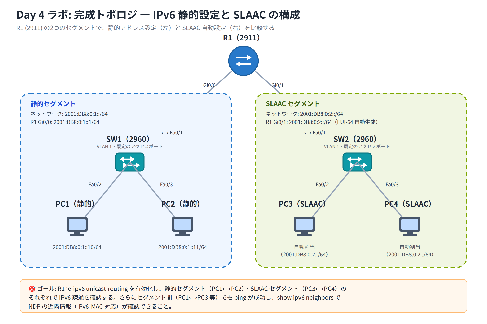

# Day 4 ラボ手順書: IPv6 アドレッシング — 静的設定と SLAAC の構成

> 配置先: ドキュメント `02_ラボ手順書 > Week1 > Day04`
> 所要時間の目安: 2.5 時間 ／ 使用ツール: Cisco Packet Tracer 9.x

## ゴール

- ルータで `ipv6 unicast-routing` を有効化し、2 つの IPv6 セグメントを構成できる
- 片方のセグメントの PC に静的 IPv6 アドレスを設定できる
- もう片方のセグメントの PC に SLAAC（ステートレス自動設定）でアドレスを取得させ、
  EUI-64 によるインターフェース ID の生成を観察できる
- 各インターフェースにリンクローカル（`fe80::`）と GUA が付与されることを確認できる
- 同一セグメント内・異なるセグメント間の両方で IPv6 ping による疎通を確認できる

## 完成トポロジ



\* Gi0/1 は `eui-64` オプションで設定するため、インターフェース ID は R1 の
MAC アドレスから自動生成されます（`::1` のような固定値にはなりません）。

### IP アドレス表

| 機器 | インターフェース | セグメント | IPv6 アドレス | 割り当て方式 |
|---|---|---|---|---|
| R1 | Gi0/0 | 静的セグメント | `2001:DB8:0:1::1/64` | 静的 |
| R1 | Gi0/1 | SLAAC セグメント | `2001:DB8:0:2::/64`（EUI-64、インターフェース ID は MAC から自動生成） | 静的（EUI-64） |
| PC1 | NIC | 静的セグメント | `2001:DB8:0:1::10/64` | 静的 |
| PC2 | NIC | 静的セグメント | `2001:DB8:0:1::11/64` | 静的 |
| PC3 | NIC | SLAAC セグメント | `2001:DB8:0:2::/64` の自動割当 | SLAAC |
| PC4 | NIC | SLAAC セグメント | `2001:DB8:0:2::/64` の自動割当 | SLAAC |

- 使用機器: Router 2911 × 1、Switch 2960 × 2、PC × 4
- 接続: R1 Gi0/0 ─ SW1 Fa0/1、PC1 ─ SW1 Fa0/2、PC2 ─ SW1 Fa0/3、
  R1 Gi0/1 ─ SW2 Fa0/1、PC3 ─ SW2 Fa0/2、PC4 ─ SW2 Fa0/3
- スイッチはデフォルト VLAN のアクセスポートのまま使用（追加設定なし）

---

## 手順 1: トポロジの作成と基本設定（20 分）

1. Packet Tracer を起動し、新規ファイルを開く
2. [Network Devices] → [Routers] から **2911** を 1 台、[Switches] から **2960** を
   2 台、[End Devices] から **PC** を 4 台配置する
3. トポロジ表のとおりにケーブル（ルータ・スイッチ間 / PC・スイッチ間ともにストレート
   ケーブルで自動判定される）を接続する
4. すべてのリンクが緑になるまで待つ
5. R1 の CLI（[CLI] タブ）を開き、次のコマンドでホスト名を設定する

   ```
   Router> enable
   Router# configure terminal
   Router(config)# hostname R1
   ```

## 手順 2: ルータでの IPv6 有効化と静的アドレス設定（25 分）

1. グローバルコンフィギュレーションモードで IPv6 転送を有効化する

   ```
   R1(config)# ipv6 unicast-routing
   ```

2. Gi0/0（静的セグメント側）にアドレスを設定する

   ```
   R1(config)# interface gigabitEthernet 0/0
   R1(config-if)# ipv6 address 2001:DB8:0:1::1/64
   R1(config-if)# no shutdown
   R1(config-if)# exit
   ```

3. Gi0/1（SLAAC セグメント側）に、EUI-64 でインターフェース ID を生成させて
   アドレスを設定する

   ```
   R1(config)# interface gigabitEthernet 0/1
   R1(config-if)# ipv6 address 2001:DB8:0:2::/64 eui-64
   R1(config-if)# no shutdown
   R1(config-if)# exit
   ```

4. Gi0/0 の詳細情報を確認し、リンクローカルアドレス（`fe80::` で始まる）が
   自動的に付与されていることを確認する

   ```
   R1# show ipv6 interface gi0/0
   ```

## 手順 3: PC の IPv6 設定（30 分）

### PC1・PC2（静的セグメント）

1. PC1 をクリック → [Desktop] タブ → **IP Configuration** を開く
2. IPv6 の設定を **Static** にし、次を入力する
   - IPv6 Address: `2001:DB8:0:1::10` ／ Prefix Length: `64`
   - IPv6 Default Gateway: `2001:DB8:0:1::1`
3. PC2 も同様に、アドレス `2001:DB8:0:1::11`、プレフィックス長 `64`、
   デフォルトゲートウェイ `2001:DB8:0:1::1` を設定する

### PC3・PC4（SLAAC セグメント）

1. PC3 をクリック → [Desktop] タブ → **IP Configuration** を開く
2. IPv6 の設定を **Automatic**（SLAAC）にする
3. 数秒待ち、RA（ルータ広告）を受信してアドレスが自動的に入力されることを確認する
4. PC4 も同様に **Automatic** に設定する

4. ファイルを保存する: `File > Save As` → `day04_氏名.pkt`

## 手順 4: アドレス割り当ての確認（30 分）

1. R1 で次のコマンドを実行し、両インターフェースのリンクローカルと GUA を一覧確認する

   ```
   R1# show ipv6 interface brief
   ```

2. R1 で経路テーブルを確認し、connected（C）と local（L）の経路が両セグメント分
   登録されていることを確認する

   ```
   R1# show ipv6 route
   ```

3. PC3・PC4 の [Desktop] → **Command Prompt** を開き、次のコマンドで SLAAC で
   取得したアドレスを確認する

   ```
   ipconfig
   ```

4. PC3・PC4 のインターフェース ID 部分に `fffe` が含まれていることを確認し、
   ノート欄に記録する（EUI-64 で生成されたことの裏付けになります）

> **観察のヒント**: PC3・PC4 の GUA のインターフェース ID 部分と、PC の MAC アドレス
> （`ipconfig /all` 相当。PT では NIC の設定画面で確認可）を見比べ、講義で学んだ
> EUI-64 の変換ルール（中央に `fffe` を挿入・先頭バイトの U/L ビット反転）が
> 実際に成立しているかを確かめてみましょう。

## 手順 5: 疎通確認と NDP の観察（30 分）

1. PC1 の Command Prompt から、同一セグメント内の PC2 へ ping する

   ```
   ping 2001:DB8:0:1::11
   ```

2. PC1（静的セグメント）から、PC3（SLAAC セグメント）の GUA へ ping する
   （PC3 の `ipconfig` で確認したアドレスを使用する）

   ```
   ping 2001:DB8:0:2:xxxx:xxxx:xxxx:xxxx
   ```

3. 疎通が成功したら、R1 で NDP により学習された近隣情報を確認する

   ```
   R1# show ipv6 neighbors
   ```

4. IPv6-MAC の対応が、IPv4 の ARP テーブルと同様の考え方で表示されていることを
   確認する

## 手順 6: 設定保存と提出準備（15 分）

1. R1 で設定を保存する

   ```
   R1# copy running-config startup-config
   ```

2. `day04_氏名.pkt` を上書き保存する

### 観察レポート（コメント提出用）

以下 3 問に答えて、課題のコメントに記入してください。

1. SLAAC で自動取得した PC3/PC4 のインターフェース ID は、EUI-64 の観点で
   どのように生成されているか。MAC アドレスとの対応（`fffe` の挿入位置・U/L
   ビットの反転）を示して説明せよ。
2. `show ipv6 interface brief` で各インターフェースにリンクローカル（`fe80::`）と
   GUA の 2 つが表示された。それぞれのアドレスの役割の違いと、リンクローカルが
   常に存在する理由を述べよ。
3. 静的セグメントの PC1 と SLAAC セグメントの PC3 が通信できたのはなぜか。
   ルータで `ipv6 unicast-routing` を有効にした意味と、両 PC のデフォルト
   ゲートウェイの役割を含めて説明せよ。

## 手順 7: 提出

1. `day04_氏名.pkt` を Backlog のラボ課題に**添付**する
2. 手順 4〜5 のコマンド結果（スクリーンショット可）と観察レポートを課題の
   **コメント**に貼る
3. 課題の状態を「処理済み」に変更する

## うまくいかないとき

| 症状 | 確認すること |
|---|---|
| PC3/PC4 に IPv6 アドレスが表示されない（SLAAC 失敗） | R1 で `ipv6 unicast-routing` を入力し忘れていないか。Gi0/1 が `no shutdown` されているか |
| `show ipv6 interface brief` に GUA が出ない | インターフェースに `ipv6 address` コマンドを入力後、`no shutdown` を実行したか |
| PC1 → PC2 の ping が失敗する | 両 PC のアドレス・プレフィックス長（64）の入力ミス、リンクが緑かを確認 |
| PC1 → PC3（セグメント間）の ping が失敗する | 各 PC のデフォルトゲートウェイの入力ミス、R1 の両インターフェースが `no shutdown` されているか |
| `show ipv6 neighbors` に何も表示されない | 先に ping を実行して NDP のやり取りを発生させたか |

30 分試して解決しない場合は、状況（スクリーンショット + 試したこと）を課題の
コメントに書いて質問してください。
