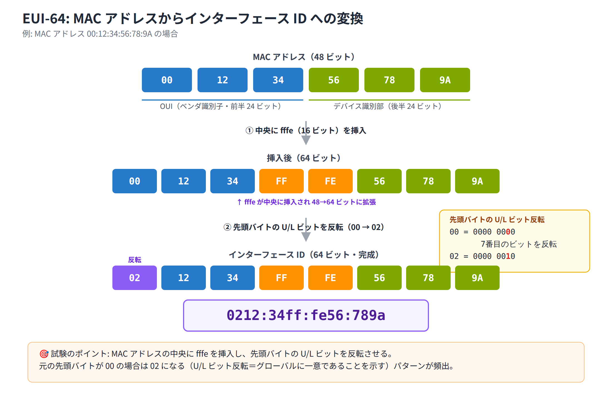

# Day 4 講義: IPv6 アドレッシング

> 配置先: ドキュメント `01_教材 > Week1_ネットワーク基礎 > Day04`
> 学習時間の目安: 3.5 時間 ／ 準拠: CCNA 200-301 v1.1 ドメイン 1

## 学習目標

この講義を終えると、次のことができるようになります。

1. IPv6 が必要とされる背景と、128 ビットアドレスの基本構造を説明できる
2. IPv6 アドレスを正しく省略・復元できる
3. GUA・ULA・LLA・マルチキャスト・エニーキャスト・特殊アドレスを識別し、それぞれの用途を説明できる
4. EUI-64 方式によって MAC アドレスからインターフェース ID が生成される手順を計算できる
5. ルータおよびホストに IPv6 アドレスを設定する方法（静的・SLAAC・DHCPv6）を説明できる
6. 確認コマンドと NDP（近隣探索プロトコル）の役割を説明できる

---

## ウォームアップ（朝の想起クイズ）

> 教材を見ずに、まず自力で思い出してください（分散学習: Day 1「ネットワークの全体像と
> OSI / TCP-IP モデル」 / Day 3「IPv4 アドレッシングとサブネット化」 の範囲から出題）。

**W1.** OSI 参照モデル 7 層のうち、IP アドレスに基づく経路選択（ルーティング）を
担うのは第何層か。またその層の名称を答えよ。

**W2.** クラス C の IPv4 アドレスに `/27` のサブネットマスクを適用した場合、
1 サブネットあたりに割り当てられるホストアドレス数（ネットワークアドレス・
ブロードキャストアドレスを除く）はいくつか。

**W3.** IPv4 アドレス `192.168.10.0/24` を 4 つの同サイズのサブネットに分割した
場合、それぞれのサブネットのプレフィックス長（`/nn`）はいくつになるか。

<details><summary>解答</summary>

- W1: 第 3 層（ネットワーク層）。ルータが IP アドレスをもとにパケットを転送する
- W2: `/27` はホスト部 5 ビット（2^5 − 2 = 30）なので **30 個**
- W3: 4 分割には追加で 2 ビット必要（2^2 = 4）なので `/24 + 2 = /26`

</details>

---

## 1. IPv6 の必要性と基本構造

### なぜ IPv6 が必要か

IPv4（Internet Protocol version 4）は 32 ビットのアドレス空間しか持たず、理論上の
最大アドレス数は約 43 億個です。インターネットに接続する機器の爆発的な増加により、
このアドレス空間は事実上枯渇しました。この問題を解決するために設計されたのが、
128 ビットのアドレス空間を持つ **IPv6**（Internet Protocol version 6）です。

| 項目 | IPv4 | IPv6 |
|---|---|---|
| アドレス長 | 32 ビット | 128 ビット |
| アドレス総数 | 約 43 億（2^32） | 約 3.4×10^38（2^128） |
| 表記 | 10 進数（ドット区切り） | 16 進数（コロン区切り） |
| ブロードキャスト | あり | なし（マルチキャストで代替） |
| ヘッダ長 | 可変長 | 固定 40 バイト（簡素化） |
| NAT | 広く使用 | 前提としない（End-to-End 通信） |

IPv6 は単にアドレス数を増やしただけでなく、ヘッダを固定 40 バイトに簡素化してルータの
処理負荷を下げ、ブロードキャストを廃止してマルチキャストに一本化するなど、通信の
効率性も見直しています。また NAT（Network Address Translation。IP アドレスを変換する
技術）を前提とせず、端末同士が直接通信する **End-to-End 通信**を志向している点も
IPv4 との大きな違いです。

### アドレスの基本構造

IPv6 アドレスは 128 ビット = 16 進数 32 桁で構成されます。これを 16 ビット（16 進数
4 桁）ずつ **8 つのブロック**（**hextet**、ヘクステットと呼びます）に区切り、
コロン `:` で連結して表記します。

```
2001:0db8:0000:0000:0000:0000:0000:0001
└──┘ └──┘ └──┘ └──┘ └──┘ └──┘ └──┘ └──┘
 1    2    3    4    5    6    7    8   （各ブロック 16 ビット）
```

プレフィックス長（ネットワーク部のビット数）は、Day 3 で学んだ IPv4 の CIDR 表記と
同様に `/nn` で表します。IPv6 で最も一般的なサブネットサイズは **/64** で、前半 64 ビットが
ネットワーク部（プレフィックス）、後半 64 ビットが**インターフェース ID**（ホスト部）
となります。

一般的な割り当ての典型例としては、ISP（インターネットサービスプロバイダ）が
組織に **/48** を割り当て、その組織が拠点内の各サブネットに **/64** を切り出す、
という構成がよく使われます。ホスト部は特別な事情がない限り常に 64 ビットとするのが
基本方針です。

### デュアルスタック

IPv4 から IPv6 への移行期には、1 台の機器が IPv4 と IPv6 の両方のアドレスを同時に
持つ **デュアルスタック**が標準的な移行手法として広く使われています。両方のプロトコル
スタックを同時に稼働させることで、通信相手の対応状況に応じて適切な方を使い分けます。

## 2. アドレス表記と省略記法

128 ビットをすべて書き出すと長く読みにくいため、IPv6 には決められた省略ルールが
あります。CCNA 試験でも頻出のポイントです。

### ルール 1: 先頭ゼロの省略

各ブロックの**先頭にある連続した 0** は省略できます。ブロックの途中や末尾の 0 は
省略できません。

```
0db8 → db8
0000 → 0（すべて 0 のブロックは 1 桁の 0 に）
0212 → 212
```

### ルール 2: 連続ゼロブロックの圧縮

**すべて 0 のブロックが連続する箇所**は、`::`（コロン 2 つ）で 1 回だけ置き換える
ことができます。

```
2001:0db8:0000:0000:0000:0000:0000:0001
  → ルール1適用 → 2001:db8:0:0:0:0:0:1
  → ルール2適用 → 2001:db8::1
```

> **重要な制約**: `::` は**アドレス中に 1 回しか使用できません**。2 回使ってしまうと、
> それぞれの `::` が何ブロック分の 0 を表すのか一意に決まらなくなり、アドレスとして
> **無効**になります。

もう 1 つの例を見てみましょう。

```
fe80:0000:0000:0000:0212:00ff:fe00:0001
  → ルール1適用 → fe80:0:0:0:212:ff:fe00:1
  → ルール2適用 → fe80::212:ff:fe00:1
```

### 表記のその他のルール

- 16 進数の**大文字・小文字は区別されません**（`DB8` と `db8` は同じ値）。ただし
  CCNA 試験や実務では**小文字表記**が一般的です。
- `::` を使う位置は、連続する 0 のブロック数が**最も多い箇所**を選ぶのが慣例ですが、
  試験では「与えられた省略表記を正しく復元できるか」が問われることが多いです。

### 復元の考え方

省略されたアドレスから元の 128 ビット（8 ブロック）を復元できることも重要です。
`2001:db8::1` であれば、すでに書かれているブロックは `2001`・`db8`・`1` の 3 つ
なので、`::` は残りの `8 − 3 = 5` ブロック分の `0000` を表している、と計算できます。

```
2001:db8::1
→ 2001:0db8:0000:0000:0000:0000:0000:0001
```

> **試験のポイント**: IPv6 アドレスの省略記法（先頭ゼロ省略・`::` によるゼロ圧縮・
> `::` は 1 回のみ）の正誤や復元を問う問題が頻出です。「`::` が 2 回使われている
> 選択肢は無効」という点を即座に見抜けるようにしておきましょう。

## 3. IPv6 アドレスタイプ

IPv6 では、アドレスの先頭ビットパターン（プレフィックス）によってアドレスの種類が
決まります。主なタイプを整理します。

| タイプ | プレフィックス | 用途 |
|---|---|---|
| グローバルユニキャスト（GUA） | `2000::/3`（2000〜3fff） | インターネットでルーティング可能な一意アドレス |
| ユニークローカル（ULA） | `fc00::/7`（実運用は `fd00::/8`） | 組織内限定。インターネットにはルーティングしない |
| リンクローカル（LLA） | `fe80::/10` | 同一リンク内限定。必ず自動生成される |
| マルチキャスト | `ff00::/8` | 複数の宛先への一斉配信。ブロードキャストの代替 |
| ループバック | `::1` | 自分自身を指す特殊アドレス |
| 未指定アドレス | `::`（全 0） | 送信元アドレスが未確定であることを示す |

### グローバルユニキャストアドレス（GUA）

`2000::/3` の範囲（先頭 3 ビットが `001`、16 進数で先頭が `2000` 〜 `3fff`）に
属するアドレスで、IPv4 のパブリックアドレスに相当します。インターネット上で
一意に識別され、そのままルーティング可能です。

### ユニークローカルアドレス（ULA）

`fc00::/7` の範囲に属するアドレスで、実際の運用では `fd00::/8`（先頭ビットが
`1` に固定された範囲）が使われます。IPv4 における RFC 1918 のプライベートアドレス
（`10.0.0.0/8` など）に相当し、組織内部でのみ通信し、インターネットには
ルーティングされません。

### リンクローカルアドレス（LLA）

`fe80::/10` の範囲に属するアドレスで、**同一リンク（同一セグメント）内でのみ有効**な
アドレスです。IPv6 が有効なインターフェースには**必ず自動的に生成・付与**され、
手動で無効化することはできません。ルータの NDP（近隣探索プロトコル）による通信や、
ルーティングプロトコルのネクストホップアドレスとして使用されます。

> 💼 **実務では**: 保守現場で `show ipv6 route` を見ると、ネクストホップ欄が
> `fe80::` 表示になっているだけで「グローバルアドレスが消えた」と勘違いして
> 手が止まる新人がいますが、これは正常な状態です。まずは手順書に記載された
> 正常値と見比べて切り分け、経路自体が本当に落ちているのかどうかを判断するのが
> 監視・確認コマンドの使い方です。`ipv6 address fe80::1 link-local` のような
> 手動設定は構築時の取り決めに基づくもので、保守作業の中で気づいた点があっても
> 客先で勝手に変更してよいものではなく、変更が必要と判断した場合は独断で投入せず
> 先輩や設計担当にエスカレーションします。

### マルチキャストアドレス

`ff00::/8` の範囲に属するアドレスで、IPv6 には**ブロードキャストが存在しません**。
IPv4 のブロードキャストが担っていた役割は、すべてマルチキャストに置き換えられました。
代表的なマルチキャストアドレスは次のとおりです。

| アドレス | 意味 |
|---|---|
| `ff02::1` | リンク上の**全ノード** |
| `ff02::2` | リンク上の**全ルータ** |
| `ff02::1:ffXX:XXXX` | **Solicited-Node マルチキャストアドレス**（アドレス解決に使用） |

Solicited-Node マルチキャストアドレスは、各ユニキャストアドレスの下位 24 ビットを
そのまま使って自動生成される特殊なマルチキャストアドレスで、NDP によるアドレス解決の
際に、対象ノードだけに絞り込んで問い合わせるために使われます。

### エニーキャストアドレス

エニーキャストは、**複数の機器に同じアドレスを付与**しておき、送信元から見て
経路的に最も近い 1 台にのみパケットが届く、という仕組みです。GUA のアドレス空間から
割り当てられ、アドレスの書式自体はユニキャストアドレス（GUA・ULA・LLA のように、
1 台だけを宛先とする通常のアドレス）と区別がつきません（機器側の設定によって
エニーキャストとして扱われます）。

### 特殊アドレス

- **ループバックアドレス `::1`**: 自分自身を指す特殊なアドレスで、IPv4 の
  `127.0.0.1` に相当します。
- **未指定アドレス `::`**: すべてのビットが 0 のアドレスで、送信元アドレスが
  まだ決まっていない状態（例: DHCPv6 でアドレス取得前のパケット）を表します。

> **試験のポイント**: アドレスタイプとプレフィックス範囲の対応（GUA = `2000::/3`、
> LLA = `fe80::/10`、ULA = `fc00::/7`、マルチキャスト = `ff00::/8`）を識別させる
> 問題が頻出です。数字の丸暗記よりも「先頭が 2 か 3 なら GUA」「fe8 なら LLA」
> といった感覚で見分けられるようにしましょう。

> **試験のポイント**: 特殊マルチキャストアドレス（`ff02::1` = 全ノード、
> `ff02::2` = 全ルータ、Solicited-Node = `ff02::1:ffXX:XXXX`）の意味を問う問題が
> 頻出です。

## 4. EUI-64 によるインターフェース ID の生成

> **ここが今日の山場です。** MAC アドレスからインターフェース ID を組み立てる計算は、
> 16 進数と 2 進数（Week0 P2 で学んだ表記です）を行き来する必要があり、最初は戸惑う
> ところです。焦らず、1 つずつ手を動かして確認すれば時間をかけて構いません。

IPv6 では、48 ビットの MAC アドレスから 64 ビットのインターフェース ID を自動生成する
**EUI-64**（Extended Unique Identifier 64）という方式があります。SLAAC（後述）や
リンクローカルアドレスの自動生成で使われます。

### 生成手順

**手順 1**: MAC アドレス（48 ビット）を前半 24 ビット（**OUI**。Organizationally
Unique Identifier、ベンダ識別子）と後半 24 ビットに分割し、その中央に 16 進数
`fffe`（16 ビット）を挿入します。これで 48 + 16 = 64 ビットになります。

**手順 2**: 先頭バイトの **7 番目のビット**（**U/L ビット**。Universal/Local ビット）を
反転させます。多くの場合、元のビットは `0`（ユニバーサル管理＝グローバルに一意な MAC
アドレスであることを示す）なので `1` に反転します。修正 EUI-64（modified EUI-64、
RFC 4291）ではこの U/L ビットの意味が反転しており、`1` はそのインターフェース ID が
グローバルに一意であることを示します。ここで押さえておくべき操作は、7 番目の
ビットの値を `0` → `1`（またはその逆）に変えることだけです。ビットの意味の解釈が
通常の MAC アドレスと逆になっている、という点は豆知識として知っておけば十分で、
計算そのものは次の例のとおり機械的に行えます。

### 計算例

MAC アドレス `0012.3456.789a` を例に計算してみます。



```
MAC アドレス:        0012.3456.789a
① 前半/後半に分割:   0012:34  |  56:789a
② 中央に fffe 挿入:  0012:34ff:fe56:789a
③ 先頭バイトの U/L ビット反転: 00 → 02
   結果:              0212:34ff:fe56:789a
```

先頭の `00`（2 進数で `0000 0000`）の 7 番目のビットを反転すると `0000 0010`
（16 進数で `02`）になります。**先頭バイトが `00` から `02` に変わる**という
パターンは試験で頻出なので、必ず自分の手で一度計算しておきましょう。

| 元の先頭バイト | 反転後 |
|---|---|
| `00` | `02` |
| `02` | `00` |
| `AC` | `AE` |

### Cisco IOS での設定

Cisco IOS では、インターフェースに対して次のようにコマンドを入力すると、
プレフィックス部分は指定した値、インターフェース ID 部分は EUI-64 方式で
自動生成されます。

```
Router(config-if)# ipv6 address 2001:db8:0:1::/64 eui-64
```

また、リンクローカルアドレスについても、明示的に設定しない限り、デフォルトでは
EUI-64（または一部の OS ではランダム生成）によってインターフェース ID が作られ、
`fe80::` に付与されます。

> **試験のポイント**: EUI-64 で MAC からインターフェース ID を生成する計算
> （中央に `fffe` を挿入・U/L ビット反転で先頭が `02` になる）を問う問題が頻出です。

## 5. アドレスの設定方法（静的・SLAAC・DHCPv6）

### ルータでの IPv6 転送の有効化

Cisco ルータはデフォルトでは IPv6 パケットを転送しません。IPv6 のルーティングを
行うには、グローバルコンフィギュレーションモードで次のコマンドが**必須**です。

```
Router(config)# ipv6 unicast-routing
```

このコマンドを入力しない限り、ルータは IPv6 ホストとして動作するのみで、
異なるセグメント間の IPv6 パケットを中継しません。

### 静的アドレス設定

インターフェースに対して、IPv6 アドレスとプレフィックス長を直接指定する方法です。

```
Router(config)# interface gigabitEthernet 0/0
Router(config-if)# ipv6 address 2001:db8:0:1::1/64
Router(config-if)# no shutdown
```

リンクローカルアドレスも手動で指定することができます。

```
Router(config-if)# ipv6 address fe80::1 link-local
```

### SLAAC（ステートレス自動設定）

**SLAAC**（Stateless Address Autoconfiguration。ステートレスアドレス自動設定）は、
ホストが DHCP サーバに頼らずに自分自身で IPv6 アドレスを決定する仕組みです。

1. ホストが **RS**（Router Solicitation。ルータ要請）をマルチキャスト（`ff02::2`）
   で送信する
2. ルータが **RA**（Router Advertisement。ルータ広告）でネットワークのプレフィックス
   （例: `2001:db8:0:1::/64`）を返す
3. ホストは受け取ったプレフィックスと、自身で生成したインターフェース ID
   （EUI-64 または乱数）を組み合わせて GUA を組み立てる

この RS / RA のやり取りは **NDP**（Neighbor Discovery Protocol。近隣探索プロトコル。
詳細は次節）の一部として、**ICMPv6**（Internet Control Message Protocol version 6。
ping や経路の異常通知などに使われる、制御・エラーメッセージをやり取りするための
プロトコル）のメッセージとして行われます。

### DHCPv6（ステートレス / ステートフル）

SLAAC はアドレスの割り当ては行えますが、DNS サーバのアドレスなどの詳細情報は
配布できません。そのため、用途に応じて次の 2 種類の DHCPv6 が使い分けられます。

| 方式 | 割り当てる情報 | アドレス取得元 |
|---|---|---|
| ステートレス DHCPv6 | DNS サーバなどの補足情報のみ | アドレス自体は SLAAC で取得 |
| ステートフル DHCPv6 | アドレスを含むすべての情報 | すべて DHCPv6 サーバから取得（IPv4 の DHCP に近い動作） |

> 💼 **実務では**: 「特定の Android 端末だけ IPv6 アドレスが振られない」という
> 問い合わせは、保守運用の現場で実際に上がってくる相談です。原因の多くは
> RA の M/O フラグ設計（Android はステートフル DHCPv6 に非対応という制約）に
> あり、保守担当がその場で設定をいじるのではなく、端末側の設定（自動/DHCP）を
> 手順書どおりに確認して事象を切り分け、設計に関わる話として先輩やネットワーク
> 設計チームにエスカレーションするのが基本です。こうした切り分けと報告を丁寧に
> 積み重ねた先に、RA の設計そのものを任される構築案件へのステップアップがあります。

### ホスト側の設定

PC 側では、IPv6 の設定方法として「自動（SLAAC）」または「DHCP」のいずれかを
選択します。ルータ側は、インターフェースが有効になると**デフォルトで RA の送出を
開始**するため、特別な設定を行わなくても SLAAC によるアドレス配布が機能します。

> **試験のポイント**: SLAAC の動作（RS/RA と NDP でプレフィックスを取得し、
> ホストがインターフェース ID を生成する）と、ステートレス／ステートフル DHCPv6 の
> 役割分担の違いを問う問題が頻出です。

> **試験のポイント**: ルータで IPv6 転送に `ipv6 unicast-routing` が必要なこと、
> `ipv6 address .../64 eui-64` などの設定コマンドを問う問題が頻出です。

## 6. 確認・検証コマンドと近隣探索（NDP）

### 主な確認コマンド

| コマンド | 用途 |
|---|---|
| `show ipv6 interface brief` | 各インターフェースのリンクローカルと GUA を一覧表示 |
| `show ipv6 interface gi0/0` | RA 設定・参加中のマルチキャストグループ・DAD 状態など詳細を表示 |
| `show ipv6 route` | IPv6 ルーティングテーブル（connected・local・動的経路）を表示 |
| `show ipv6 neighbors` | NDP で学習した近隣の IPv6-MAC 対応（IPv4 の ARP テーブル相当）を表示 |

`show ipv6 interface brief` を実行すると、1 つのインターフェースに対して
リンクローカルアドレス（`fe80::` で始まる）と GUA（設定していれば）の**両方**が
表示されます。リンクローカルは常に自動生成されるため、GUA を設定していなくても
必ず表示される点を押さえておきましょう。

### NDP（近隣探索プロトコル）

**NDP**（Neighbor Discovery Protocol）は、IPv4 における **ARP**（Address Resolution
Protocol）の役割を IPv6 で担うプロトコルです。ICMPv6 メッセージを使い、主に
次の機能を提供します。

- **アドレス解決**: IPv6 アドレスに対応する MAC アドレスを、Neighbor Solicitation
  （近隣要請）と Neighbor Advertisement（近隣広告）のマルチキャスト交換によって求める
- **重複アドレス検出（DAD）**: DAD（Duplicate Address Detection）は、自分がこれから
  使おうとしているアドレスが、同一リンク上の他の機器とすでに重複していないかを
  Neighbor Solicitation を送って確認する仕組みです
- **RS / RA によるルータ発見とプレフィックス配布**（前節の SLAAC で説明した内容）

`show ipv6 neighbors` の出力は、IPv4 の `show ip arp`（または `arp -a`）に相当し、
学習済みの近隣ノードの IPv6 アドレスと MAC アドレスの対応が確認できます。

### 疎通確認

IPv6 の疎通確認は IPv4 と同様に `ping` コマンドを使用します。

```
Router# ping 2001:db8:0:1::10
```

ただし、**リンクローカルアドレス宛てに ping を打つ場合**は、そのアドレスが
どのリンク（インターフェース）に属するかが一意に決まらないため、**出力
インターフェースを明示的に指定する**必要がある点に注意してください。

```
Router# ping fe80::212:34ff:fe56:789a
Output Interface: GigabitEthernet0/0
```

Cisco IOS の `ping` はリンクローカルアドレスを宛先に指定すると、上記のように
`Output Interface:` という対話プロンプトが表示されるので、そこで出力インターフェース名
（例: `GigabitEthernet0/0`）を入力します。`fe80::...%GigabitEthernet0/0` のように
`%` でインターフェースを付け足す表記は Windows / Linux ホストでの記法であり、
Cisco IOS の `ping` コマンドでは使用できない点に注意してください。

> **試験のポイント**: リンクローカルアドレスが必ず自動生成され、同一リンク内限定で
> NDP やルーティングに使われる、という用途を問う問題が頻出です。

## 7. まとめ

- IPv6 は 128 ビットのアドレス空間を持ち、IPv4 の枯渇問題を解決する。標準的な
  サブネットサイズは `/64`
- 省略記法は「先頭ゼロ省略」と「`::` によるゼロ圧縮（1 回のみ）」の 2 種類
- アドレスタイプは GUA（`2000::/3`）・ULA（`fc00::/7`）・LLA（`fe80::/10`）・
  マルチキャスト（`ff00::/8`）・エニーキャスト・特殊アドレス（`::1`、`::`）に分類される
- EUI-64 は MAC アドレスの中央に `fffe` を挿入し、U/L ビットを反転してインターフェース
  ID を生成する
- ルータで IPv6 を転送するには `ipv6 unicast-routing` が必須。アドレスは静的・
  SLAAC・DHCPv6 のいずれかで設定する
- NDP は ARP の代替で、アドレス解決・DAD・RS/RA によるプレフィックス配布を担う

---

## 確認問題（自己チェック・解答は末尾）

1. `2001:0db8:0000:0000:0000:0000:0000:0001` を省略記法で表記せよ。
2. `2001:db8::1::2` というアドレス表記が無効である理由を説明せよ。
3. `fe80::/10` に属するアドレスの名称と、その用途を答えよ。
4. MAC アドレス `0050.56aa.bbcc` を EUI-64 方式でインターフェース ID に変換した結果を答えよ。
5. ルータで IPv6 パケットを転送できるようにするために必要な、グローバルコンフィギュレーションコマンドは何か。

<details><summary>解答</summary>

1. `2001:db8::1`
2. `::` はアドレス中に 1 回しか使用できないため。2 回使うと、それぞれが何ブロック分の
   ゼロを表すか一意に決まらず無効になる
3. リンクローカルアドレス（LLA）。同一リンク内でのみ有効で、NDP やルーティング
   プロトコルのネクストホップとして使われる
4. `0250:56ff:feaa:bbcc`（前半 `0050:56` と後半 `aa:bbcc` の間に `fffe` を挿入し、
   先頭バイト `00` の U/L ビットを反転して `02` にする）
5. `ipv6 unicast-routing`

</details>

## 次のステップ

本日のラボ課題「[Day04] ラボ: IPv6 アドレッシング — 静的設定と SLAAC の構成」に進み、
今日学んだ静的アドレス設定と SLAAC の動作を、実際にルータと PC に構成しながら
確認してください。
