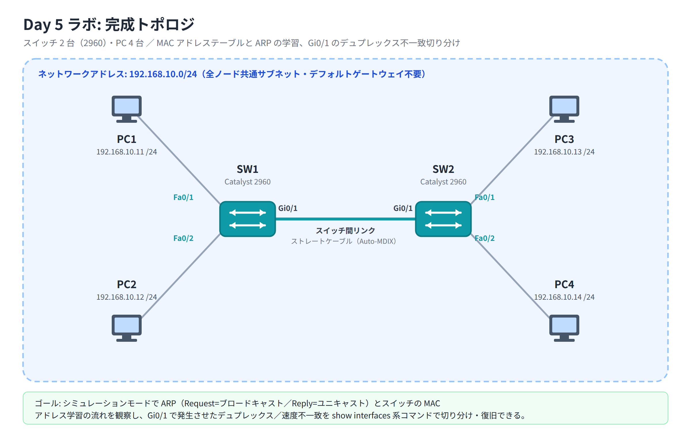

# Day 5 ラボ手順書: MAC アドレステーブルと ARP の観察、デュプレックス不一致の障害切り分け

> 配置先: ドキュメント `02_ラボ手順書 > Week1 > Day05`
> 所要時間の目安: 2.5 時間 ／ 使用ツール: Cisco Packet Tracer 9.x

## ゴール

- スイッチの MAC アドレステーブルと ARP の学習動作をシミュレーションモードで
  観察し、フラッディングと学習の流れを自分の言葉で説明できる
- 速度 / デュプレックス不一致による障害を `show interfaces` 系コマンドで切り分け、
  正しい設定に修正して復旧できる

## 完成トポロジ



### IP アドレス割り当て表

全ノードは同一サブネット `192.168.10.0/24` に属します（デフォルトゲートウェイは
不要です）。

| 機器 | 接続先ポート | IP アドレス | サブネットマスク |
|---|---|---|---|
| PC1 | SW1 Fa0/1 | 192.168.10.11 | 255.255.255.0 |
| PC2 | SW1 Fa0/2 | 192.168.10.12 | 255.255.255.0 |
| PC3 | SW2 Fa0/1 | 192.168.10.13 | 255.255.255.0 |
| PC4 | SW2 Fa0/2 | 192.168.10.14 | 255.255.255.0 |
| SW1 | Gi0/1 | SW2 の Gi0/1 と接続（スイッチ間リンク） | — |
| SW2 | Gi0/1 | SW1 の Gi0/1 と接続（スイッチ間リンク） | — |

---

## 手順 1: トポロジの作成と初期設定（20 分）

1. Packet Tracer を起動し、新規ファイルを開く
2. [Network Devices] → [Switches] → **2960** を 2 台配置（SW1, SW2）
3. [End Devices] → **PC** を 4 台配置（PC1〜PC4）
4. ケーブル（すべて**ストレートケーブル**、スイッチ間は Auto-MDIX により
   ストレートで問題ありません）で接続する
   - PC1 — SW1 `FastEthernet0/1`
   - PC2 — SW1 `FastEthernet0/2`
   - PC3 — SW2 `FastEthernet0/1`
   - PC4 — SW2 `FastEthernet0/2`
   - SW1 `GigabitEthernet0/1` — SW2 `GigabitEthernet0/1`（スイッチ間リンク）
5. 全リンクの●が緑になるまで待つ
6. SW1・SW2 それぞれの CLI で hostname を設定する

   ```
   enable
   configure terminal
   hostname SW1
   ```

   SW2 も同様に `hostname SW2` を設定します。

## 手順 2: PC の IP 設定（10 分）

1. 各 PC の [Desktop] タブ → **IP Configuration** で、上の割り当て表に従い
   IP アドレスとサブネットマスクを設定する（デフォルトゲートウェイは空欄でよい）
2. ファイルを保存: `File > Save As` → `day05_氏名.pkt`

## 手順 3: 通信前の初期状態を確認する（10 分）

1. SW1・SW2 それぞれの CLI で次のコマンドを実行し、MAC アドレステーブルの
   エントリが空、または少ないことを確認する

   ```
   show mac address-table
   ```

2. PC1〜PC4 それぞれの Command Prompt で `arp -a` を実行し、ARP キャッシュが
   空であることを確認する

## 手順 4: シミュレーションモードで ARP とフレームの流れを追跡する（30 分・本日のメイン）

1. 右下の **Simulation** タブに切り替える
2. [Edit Filters] で **ICMP** と **ARP** のみにチェックを入れる
3. PC1 の Command Prompt で `ping 192.168.10.13` を実行し、自動再生を止めて
   コマ送り（▶ の隣のステップボタン）で 1 ステップずつ進める
4. 最初に流れる **ARP Request** をクリックし、次を確認する
   - 画面下部の一覧表（PDU 一覧。通信の 1 コマごとの通過記録が並ぶ表）の
     「At Device」列で、SW1 → SW2 の両方に**同時に転送**されている
     （ブロードキャストのフラッディング）ことを確認する
   - Outbound PDU Details の宛先 MAC アドレスが `FFFF.FFFF.FFFF` であることを確認する
5. PC3 が返す **ARP Reply** をクリックし、次を確認する
   - PC3 から PC1 へのみ**ユニキャスト**で転送されていること（他の PC には
     流れないこと）を確認する
   - 宛先 MAC アドレスが PC1 の MAC アドレスになっていることを確認する
6. 続く **ICMP**（ping）のフレームをクリックし、スイッチがすでに学習した
   MAC アドレステーブルをもとにユニキャストで転送していることを確認する

## 手順 5: 学習結果を確認する（15 分）

1. **Realtime** タブに戻る
2. SW1・SW2 それぞれで再度 MAC アドレステーブルを確認する

   ```
   show mac address-table
   ```

   PC1・PC2 の MAC アドレスが SW1 の該当ポートに、PC3・PC4 の MAC アドレスが
   SW2 の該当ポートに、それぞれ動的エントリ（Type: DYNAMIC）として学習されて
   いることを記録する。また SW1・SW2 双方の MAC アドレステーブルに
   スイッチ間リンク（Gi0/1）を介して相手側 PC の MAC アドレスも学習されている
   ことを確認する

3. PC1 の Command Prompt で `arp -a` を実行し、PC3 の IP アドレス
   （192.168.10.13）に対応する MAC アドレスが学習されたことを確認する

## 手順 6: MAC アドレステーブルのクリアと再学習（15 分）

1. SW1・SW2 それぞれで次のコマンドを実行し、動的エントリを消去する

   ```
   clear mac address-table dynamic
   ```

2. 消去直後に `show mac address-table` を実行し、テーブルが空（またはスタティック
   エントリのみ）になっていることを確認する
3. PC2 から PC4 へ `ping 192.168.10.14` を実行し、再度 MAC アドレステーブルを
   確認して**再学習**されることを確認する
4. 次のコマンドでエージングタイム（既定値）を確認する

   ```
   show mac address-table aging-time
   ```

   既定値が 300 秒（5 分）であることを記録する

## 手順 7: 障害演習 — デュプレックス / 速度不一致の発生（20 分）

> ⚠️ **注意**: Packet Tracer では、デュプレックスミスマッチによるエラーカウンタ
> （CRC / late collision 等）の増加や、それに伴うパケットロスは再現しない場合が
> あります。本演習の主眼は、`show interfaces` / `show interfaces status` の
> **duplex 欄が両端で食い違う**（例: SW1 = `Full`/`a-100`、SW2 = `Half`/`auto`）
> ことを確認する点に置いてください。

1. SW1 の CLI で、スイッチ間リンク側のポートに速度とデュプレックスを固定で設定する

   ```
   interface gigabitEthernet0/1
    speed 100
    duplex full
    exit
   ```

2. SW2 側の `GigabitEthernet0/1` は変更せず、**オートネゴシエーション（auto）**の
   ままにしておく（不一致の状態を作る）
3. SW1・SW2 それぞれで次のコマンドを実行し、速度 / デュプレックスの表示と
   リンク状態を確認する

   ```
   show interfaces gigabitEthernet0/1
   show interfaces status
   ```

4. `runts`、`CRC`、`collisions`、`late collision` などのエラーカウンタの値を記録する
   （Packet Tracer では増加しない場合があります。その場合は「増加なし」と
   記録して構いません）

### 手順 7': 速度ハード不一致でリンクダウンを観察する（発展・推奨）

Packet Tracer で確実に観察できる障害として、速度そのものを両端で完全に
不一致にする方法もあります。時間に余裕があれば試してください。

1. SW1 の `GigabitEthernet0/1` を `speed 1000` に固定する

   ```
   interface gigabitEthernet0/1
    speed 1000
    exit
   ```

2. SW2 の `GigabitEthernet0/1` を `speed 100` に固定する

   ```
   interface gigabitEthernet0/1
    speed 100
    exit
   ```

3. `show interfaces status` を実行し、リンクが `notconnect`（line protocol
   down 相当）になることを確認する
4. PC1 から PC3 へ `ping 192.168.10.13` を実行し、すべて `Request timed out`
   になることを確認する

## 手順 8: 障害の影響を観察する（15 分）

1. 手順 7 のデュプレックス不一致の状態で、PC1 から PC3 へ
   `ping 192.168.10.13` を複数回（`ping 192.168.10.13 -n 10` など）実行し、
   応答時間の増加やパケットロス（Request timed out）が発生するかを観察して
   記録する。Packet Tracer では変化が見られないことも多く、その場合は
   「duplex 欄の不一致のみ確認、通信自体への影響は見られず」と記録してよい
2. 手順 7' を実施した場合は、速度不一致によるリンクダウンで、すべての ping が
   `Request timed out` になることを確認する
3. 手順 7 で確認したエラーカウンタが ping 実行後にさらに増加していないかを
   再度 `show interfaces gigabitEthernet0/1` で確認する

## 手順 9: 復旧（10 分）

1. SW1・SW2 双方の `GigabitEthernet0/1` を元のオートネゴシエーションに戻す

   ```
   interface gigabitEthernet0/1
    speed auto
    duplex auto
    exit
   ```

   （デュプレックスのみを不一致にした場合は、両端を同一の固定値
   `speed 100` / `duplex full` に揃える方法でも解消します。今回は両端を
   auto に統一する方法で復旧します）

2. `show interfaces status` を実行し、SW1・SW2 双方の `GigabitEthernet0/1` が
   同じ速度・デュプレックスで `connected` になっていることを確認する
3. PC1 から PC3 へ再度 `ping 192.168.10.13` を実行し、ロスなく応答が返ることを
   確認する

### 観察レポート（コメント提出用）

以下 3 問に答えて、課題のコメントに記入してください。

1. PC1 から PC3 へ最初に ping したとき、ARP Request と ARP Reply はそれぞれ
   ユニキャスト・ブロードキャストのどちらで送られたか。また ping 前後で
   `show mac address-table` のエントリがどう変化したかを記述せよ。
2. デュプレックス不一致を発生させたとき（手順 7）、`show interfaces status` の
   duplex / speed 欄の表示はどうなったか。エラーカウンタや ping 結果に変化が
   あれば併せて記述せよ（Packet Tracer の制約で変化が見られなくても構わない）。
   手順 7' を実施した場合は、速度ハード不一致によるリンクダウンの表示と ping
   の結果も記述せよ。
3. デュプレックスミスマッチを恒久的に防ぐには、リンク両端の速度 / デュプレックス
   設定をどう構成すべきか。オートネゴシエーションの観点から説明せよ。

## 手順 10: 提出（5 分）

1. `day05_氏名.pkt` を Backlog のラボ課題に**添付**する
2. 手順 5〜9 のコマンド結果（スクリーンショット可）と観察レポート 3 問の回答を
   課題の**コメント**に貼る
3. 課題の状態を「処理済み」に変更する

## うまくいかないとき

| 症状 | 確認すること |
|---|---|
| ping が全てタイムアウトする（初期状態） | 各 PC の IP / サブネットマスクの入力ミス、ケーブルが緑か |
| `show mac address-table` に何も表示されない | 通信（ping）を実際に発生させたか、`clear` 直後でまだ再学習していないだけではないか |
| Simulation で ARP / ICMP が表示されない | [Edit Filters] で ARP・ICMP にチェックが入っているか |
| `speed` / `duplex` コマンドが入力できない | インターフェースモード（`interface gigabitEthernet0/1` の直後）にいるか確認する |
| 障害演習後に ping が完全に通らなくなった | 手順 7'（速度ハード不一致）を実施した場合はリンクダウンによる全滅が正常な結果。手順 7（デュプレックス不一致）のみで通らない場合は、片方だけ固定・片方 auto という意図した組み合わせになっているか再確認する |
| 復旧後も `show interfaces status` の速度 / デュプレックスが揃わない | SW1・SW2 両方に `speed auto` と `duplex auto` を入力し直し、リンクが再ネゴシエーションするまで数秒待つ |

30 分試して解決しない場合は、状況（スクリーンショット + 試したこと）を
課題のコメントに書いて質問してください。
