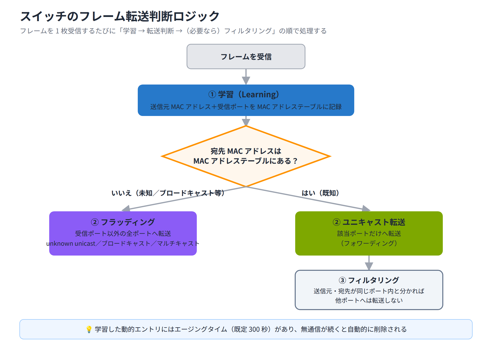

# Day 5 講義: TCP / UDP・スイッチング動作・物理層

> 配置先: ドキュメント `01_教材 > Week1_ネットワーク基礎 > Day05`
> 学習時間の目安: 3.5 時間 ／ 準拠: CCNA 200-301 v1.1 ドメイン 1・4

## 学習目標

この講義を終えると、次のことができるようになります。

1. TCP と UDP の特性の違い（信頼性・順序制御・ヘッダサイズ・用途）を説明できる
2. TCP の 3 ウェイハンドシェイクの流れと、主要なウェルノウンポート番号を挙げられる
3. スイッチの MAC アドレス学習・フォワーディング・フラッディング・フィルタリングの
   動作と、ARP による IP → MAC 解決の流れを説明できる
4. ケーブルの種類、速度 / デュプレックスの不一致が引き起こす障害の原因と症状を説明できる
5. PoE の主要規格と最大給電電力、VM / コンテナの基礎的な違いを説明できる

---

## ウォームアップ（朝の想起クイズ）

> 教材を見ずに、まず自力で思い出してください（分散学習: Day 2「Cisco IOS の基本操作と
> デバイス初期設定」 / Day 4「IPv6 アドレッシング」 の範囲から出題）。

**W1.** running-config を再起動後も有効にするために実行するコマンドは何か。

**W2.** IPv6 のリンクローカルアドレスのプレフィックスは何か。また、明示的に
設定しなくても必ず自動生成される理由を 1 文で説明せよ。

**W3.** SLAAC において、ホストがルータからプレフィックスを取得するために
使う ICMPv6 のメッセージは何か（2 つ）。

<details><summary>解答</summary>

W1. `copy running-config startup-config`（実行中の設定を NVRAM の
startup-config へ保存する）
W2. `fe80::/10`。IPv6 が有効なインターフェースでは NDP や通信の基盤として
必ず必要なため、EUI-64 またはランダム生成により自動的に割り当てられるから
W3. RS（Router Solicitation）と RA（Router Advertisement）

</details>

---

## 1. トランスポート層の役割と TCP / UDP の比較

**トランスポート層**（OSI 第 4 層）は、送信元アプリケーションから宛先アプリケーション
まで、エンドツーエンドでデータを届ける役割を担います。1 台のホストで複数のアプリ
ケーション（Web ブラウザ、メールクライアントなど）が同時に通信できるのは、
**ポート番号**によって通信を識別しているからです。Week0 P5 で学んだ IP アドレス
（PC 自体の住所にあたるもの）が「どの PC 宛か」を示すのに対し、ポート番号は
「その PC の中のどのアプリケーション宛か」を示す番号だと考えると位置づけが
つかみやすくなります。複数のアプリケーションのデータを
1 本の IP 通信にまとめることを**多重化（マルチプレクシング）**、受信側でポート番号を
もとに元のアプリケーションへ振り分けることを**逆多重化（デマルチプレクシング）**と
呼びます。

トランスポート層には性格の異なる 2 つのプロトコルがあります。

| 特性 | TCP（Transmission Control Protocol） | UDP（User Datagram Protocol） |
|---|---|---|
| 接続方式 | コネクション型（事前にセッションを確立） | コネクションレス型（確立なしで送信） |
| 信頼性 | 確認応答・再送により保証する | 保証しない（ベストエフォート） |
| 順序制御 | シーケンス番号で順序を保証・並べ替え | 保証しない |
| フロー制御 | ウィンドウサイズで受信側の処理能力に合わせる | なし |
| 輻輳制御 | あり（ネットワークの混雑度に応じて送信量を調整） | なし |
| ヘッダサイズ | 20 バイト（オプションなし） | 8 バイト |
| 速度・遅延 | オーバーヘッドが大きく相対的に低速 | 軽量で低遅延 |
| PDU 名 | セグメント | データグラム（セグメントと呼ぶこともある） |

TCP は確認応答（**ACK**）と**再送**の仕組みを持ち、パケットが失われても検出して
送り直すため、データの欠落や順序の乱れを防げます。反面、この確実性を実現するための
やり取りが**オーバーヘッド**（本来のデータ転送以外に余分にかかる処理や通信量）となり、
UDP に比べて速度面では不利です。UDP はヘッダが小さく
確認応答の往復もないため低遅延ですが、信頼性が必要な場合はアプリケーション側で
独自に実装する必要があります。

用途は次のように使い分けられます。

- **TCP を使うもの**: HTTP/HTTPS（Web）、SMTP（メール送信）、FTP（ファイル転送）、
  SSH（リモート管理）— データの欠落が許されない通信
- **UDP を使うもの**: DNS 問い合わせ、DHCP、TFTP、VoIP / RTP（音声）、動画
  ストリーミング — 多少の欠落よりも即時性・低遅延を優先する通信

> **試験のポイント**: TCP と UDP の特性比較（信頼性・順序制御・再送の有無、
> 用途の使い分け）は頻出です。「信頼性が必要なら TCP、速度優先なら UDP」を軸に、
> 具体的なアプリケーション例とセットで覚えておきましょう。

## 2. TCP の 3 ウェイハンドシェイクと主要ポート番号

TCP はデータのやり取りを始める前に、双方が「これから通信する」ことを確認し合う
セッション確立の手続きを行います。これを**3 ウェイハンドシェイク**と呼び、3 つの
セグメントのやり取りで構成されます。

```
クライアント                          サーバ
    │ ① SYN（接続要求）                  │
    │ ───────────────────────────────▶ │
    │                ② SYN/ACK（要求への応答＋接続要求）│
    │ ◀─────────────────────────────── │
    │ ③ ACK（応答への確認）              │
    │ ───────────────────────────────▶ │
    │        ここからデータ転送が始まる    │
```

1. **SYN**: クライアントが接続を要求する（シーケンス番号の初期値を提示）
2. **SYN/ACK**: サーバが要求に応答しつつ、自分側からも接続を要求する
3. **ACK**: クライアントがサーバの要求に確認応答する

これで双方向のセッションが確立し、データ転送が始まります。切断時は **FIN**（終了要求）
と ACK を使った **4 way** の手続きで、送信側・受信側それぞれの方向を個別に閉じます。
なお **RST**（リセット）フラグは、正常な手順を踏まない異常な切断（拒否・強制終了）を
示すフラグです。

> **試験のポイント**: TCP 3 ウェイハンドシェイクの順序（SYN → SYN/ACK → ACK）と
> 各フラグの役割は頻出です。順番と、どちら側がどのフラグを送るかまで即答できるように
> しておきましょう。

### ポート番号の範囲

| 範囲 | 名称 | 説明 |
|---|---|---|
| 0〜1023 | ウェルノウンポート | サーバ側の標準サービスに割り当て（HTTP, SSH など） |
| 1024〜49151 | 登録ポート | ベンダー・アプリケーション固有のサービス用 |
| 49152〜65535 | 動的 / エフェメラルポート | クライアントが接続のたびに一時的に使う送信元ポート |

クライアントは接続のたびに動的ポートを**送信元**に、サーバのウェルノウンポートを
**宛先**に指定して接続します。**ソケット**とは「IP アドレス + ポート番号」の組み合わせ
のことで、1 つの通信は送信元ソケットと宛先ソケットのペアによって一意に識別されます。

### 主要ポート番号

| プロトコル | ポート番号 | トランスポート |
|---|---|---|
| FTP（データ / 制御） | 20 / 21 | TCP |
| SSH | 22 | TCP |
| Telnet | 23 | TCP |
| SMTP | 25 | TCP |
| DNS | 53 | UDP（ゾーン転送等は TCP も使用） |
| DHCP（サーバ / クライアント） | 67 / 68 | UDP |
| TFTP | 69 | UDP |
| HTTP | 80 | TCP |
| NTP | 123 | UDP |
| SNMP（エージェント / トラップ） | 161 / 162 | UDP |
| HTTPS | 443 | TCP |
| Syslog | 514 | UDP |

> **試験のポイント**: 主要ポート番号と TCP / UDP の別（HTTP 80、HTTPS 443、SSH 22、
> Telnet 23、FTP 20/21、DNS 53、DHCP 67/68、TFTP 69、SNMP 161、NTP 123、
> Syslog 514）は非常に高頻度で出題されます。表を暗記するだけでなく、
> 「なぜその番号がその層のプロトコルなのか」まで理解しておくと定着します。

## 3. スイッチの MAC アドレス学習とフレーム転送

L2 スイッチは、受信したフレームの**送信元 MAC アドレス**と**受信したポート番号**を
対応づけて記録します。この対応表を **MAC アドレステーブル**（CAM テーブルとも呼ぶ）と
呼び、通信のたびに自動的に更新される動的エントリです。

### MAC アドレスの構造

MAC アドレスは 48 ビット（6 バイト）で構成されます。

```
00-1A-2B  |  3C-4D-5E
OUI（前半24bit） | 機器固有値（後半24bit）
ベンダ識別子      | シリアル的な値
```

- 前半 24 ビット: **OUI**（Organizationally Unique Identifier）。ベンダを識別する ID
- 後半 24 ビット: 各ベンダが割り当てる機器固有の値

### 転送・フラッディング・フィルタリングの動作

スイッチはフレームを受信するたびに、次の判断を行います。

1. **学習**: 送信元 MAC アドレスと受信ポートを MAC アドレステーブルに記録する
2. **転送判断**: 宛先 MAC アドレスを MAC アドレステーブルと照合する
   - 一致するエントリがあれば、そのポートだけへ**ユニキャスト転送（フォワーディング）**
   - 一致するエントリがない（**unknown unicast**）場合や、宛先が
     **ブロードキャスト**（`FFFF.FFFF.FFFF`）、**マルチキャスト**の場合は、
     受信ポート以外の全ポートへ**フラッディング**する
3. **フィルタリング**: 送信元と宛先が同じポートの先にあると分かっている場合、
   スイッチはそのフレームを他のポートへ転送しない



> **試験のポイント**: スイッチの学習・フォワーディング・フラッディング・
> フィルタリングの動作、特に unknown unicast とブロードキャストで
> フラッディングする点は頻出です。「宛先が分からなければ全部に流す」という
> 原則を押さえておきましょう。

動的に学習されたエントリには**エージングタイム**（既定 300 秒 = 5 分）があり、
一定時間フレームを受信しなかった MAC アドレスはテーブルから自動的に削除されます。

```
show mac address-table              ! MAC アドレステーブルを表示
show mac address-table aging-time   ! エージングタイムを確認
show mac address-table address <MAC>     ! 特定 MAC アドレスの学習ポートを検索
show mac address-table interface <port>  ! 特定ポートで学習された MAC を検索
clear mac address-table dynamic     ! 動的エントリをすべて消去
```

> 💼 **実務では**: `show mac address-table address <MAC>` /
> `interface <port>` は「この機器はどのスイッチのどのポートに繋がっているか」を
> 最短で突き止める、監視・切り分けの道具です。パッチ盤やラベルが当てにならない
> 現場での定番の一次切り分け手段ですが、そこで得られた事実を報告するところまでが
> 仕事で、原因を推測して自分で設定を変えるのは越権になります。同じ MAC アドレスが
> 短時間に複数ポートを行き来する MAC flapping のログ（`%SW_MATM-4-MACFLAP`）は
> ループや二重接続のサインで、STP や port-security の設定には手を出さず、ログを
> 添えて上位へエスカレーションする判断ポイントです。新人がやりがちなのは、
> ping していない相手のエントリが無いのを見て「壊れている」と誤判断することで、
> エントリは通信して初めて学習され 300 秒無通信でエージアウトする点を押さえて
> おくと切り分けが速くなります。

### ARP による IP → MAC アドレスの解決

**ARP**（Address Resolution Protocol）は、L3 の IP アドレスから L2 の MAC アドレスを
解決する仕組みです。

1. **ARP Request**: 「192.168.1.20 の MAC アドレスを教えてください」を
   **ブロードキャスト**で送信する
2. **ARP Reply**: 該当する IP アドレスを持つホストが、自分の MAC アドレスを
   **ユニキャスト**で返信する

解決結果は各ホストの ARP キャッシュに保存されます。PC では `arp -a`、ルータでは
`show ip arp` で確認できます。

> **試験のポイント**: ARP の動作（Request はブロードキャスト、Reply はユニキャスト）
> は頻出です。同一 LAN 内で初めて通信する相手に対して必ず先に流れる点も
> 押さえておきましょう。

### スイッチの転送方式

- **ストア・アンド・フォワード**: フレーム全体を受信してから FCS（フレームチェック
  シーケンス）で誤り検査を行い、正常なものだけを転送する。信頼性が高い
- **カットスルー**: 宛先 MAC アドレスを読み取った時点で転送を開始する。誤り検査を
  待たないため低遅延だが、破損フレームも転送してしまう可能性がある

## 4. 物理層 — ケーブルと接続不良（速度 / デュプレックス）

### 銅線ケーブル（UTP）

**UTP**（Unshielded Twisted Pair）は、2 本の銅線をより合わせた芯線を、
外側の金属シールドなしで束ねたケーブルです。オフィスや家庭で PC とスイッチ
（ルータ）をつなぐ、いわゆる「LAN ケーブル」の多くがこの UTP です。

| カテゴリ | 対応速度 | 備考 |
|---|---|---|
| Cat5e | 1 Gbps | 広く普及した従来規格 |
| Cat6 | 1〜10 Gbps | 10 Gbps は短距離のみ対応 |
| Cat6a | 10 Gbps | Cat6 より高性能でノイズに強い |

UTP の最大配線長はいずれも **100 m** です。

### ケーブルの種類の使い分け

ストレート / クロスの判断は「異種機器同士か、同種機器同士か」で決まります。

- **ストレートケーブル**（異種機器同士）: PC — スイッチ、スイッチ — ルータ
- **クロスケーブル**（同種機器同士）: スイッチ — スイッチ、PC — PC、
  ルータ — ルータ、PC — ルータ、スイッチ — ハブ

「ルータ — ルータ」「PC — ルータ」「スイッチ — ハブ」はいずれも同種扱いで
クロスケーブルになる点が試験の引っかけになりやすいので注意しましょう。

現在の多くの機器は **Auto-MDIX**（送受信ペアを自動判別する機能）を備えており、
ストレート / クロスのどちらを使っても自動的に調整してくれます。

### 光ファイバ

| 種類 | 光源 | 用途 |
|---|---|---|
| シングルモード | レーザ | 長距離伝送（キャンパス間・拠点間） |
| マルチモード | LED | 短距離伝送（データセンター内など） |

光ファイバは電磁ノイズの影響を受けにくく、銅線より長距離の伝送に向いています。

### デュプレックスモード

- **全二重（Full Duplex）**: 送信と受信を同時に行える。コリジョン（データの衝突）
  が発生しない
- **半二重（Half Duplex）**: 送信と受信を交互にしか行えない。**CSMA/CD**
  （Carrier Sense Multiple Access with Collision Detection）でコリジョンを検出する

速度とデュプレックスは既定で**オートネゴシエーション**により両端の機器が
自動的に最適な設定へ合意します。

### デュプレックスミスマッチ

ここが今日の山場です。時間をかけて構いません。

リンクの片方が `auto`、もう片方が `full` や `half` に固定されていると、
オートネゴシエーションが正しく機能せず、**デュプレックスミスマッチ**が発生します。

オートネゴシエーションが無効な相手に対して、`auto` 側は**パラレルディテクション**
（相手からの信号の有無や電気的な特徴だけを見て、速度だけを推定する簡易な手段）
により速度自体は相手に合わせられますが、デュプレックスまでは判別できず、既定で
**半二重にフォールバック**します。このため、固定側が全二重・auto 側が半二重という
不一致が生じます。ミスマッチが起きてもリンク自体は `up` のままで、リンクダウンには
ならず、性能低下やエラー増加という形で現れる点が試験の落とし穴です。

| 側 | 症状 |
|---|---|
| 半二重側（auto 側がフォールバック） | late collision（遅延コリジョン）が増加する |
| 全二重側（固定側） | FCS / CRC エラーが増加し、スループットが低下する |

> **試験のポイント**: デュプレックスミスマッチの原因（オートネゴシエーション設定
> 不一致）と症状（late collision / CRC エラー / 性能低下）は頻出です。
> 「片方だけ固定設定」がトラブルの典型パターンだと覚えておきましょう。覚え方の
> 対比は次のとおりです。

| 覚え方 | 固定側 | auto 側 |
|---|---|---|
| デュプレックス | 指定どおり（例: Full） | 判別不能のため Half にフォールバック |
| 主な症状 | CRC / FCS エラー増加 | late collision 増加 |
| リンク状態 | up のまま（ダウンしない） | up のまま（ダウンしない） |

`show interfaces` の出力で `errors` や `collisions` のカウンタを確認することで
障害を切り分けられます。

> 💼 **実務では**: 現場でよく見る標準は「両端を auto/auto に統一する」構成で、
> 1G/10G の SFP+ 系ではオートネゴシエーションがほぼ前提になっています。ただし
> 保守の現場では、不一致に気づいてもその場で speed/duplex を打ち替えて直すのでは
> なく、手順書や変更履歴で「なぜ手動固定になっているのか」を確認してから判断する
> のが基本で、ベンダー間接続や旧機器の相性で意図的に固定しているケースもあるため
> 独断で変更しません。実務での一次検知は、CDP/LLDP が出す
> `%CDP-4-DUPLEX_MISMATCH` のようなログや、監視の CRC / late collision カウンタの
> 上昇であることが多く、「リンクは上がっているのに遅い・特定の通信だけ詰まる」
> という症状で気づくのが典型です。原因をログとカウンタで裏付けて報告するところ
> までが仕事で、設定変更が必要と判断した場合はその根拠を添えて上長にエスカレー
> ションします。

### 設定コマンド

```
interface gigabitEthernet0/1
 speed {10 | 100 | 1000 | auto}
 duplex {full | half | auto}
```

```
show interfaces status   ! 各ポートの速度・デュプレックス・リンク状態を一覧表示
```

## 5. PoE（Power over Ethernet）

**PoE**（Power over Ethernet）は、LAN ケーブル（UTP）を使ってデータと同時に
電力を供給する技術です。AP（アクセスポイント）、IP 電話、監視カメラなど、
電源コンセントの確保が難しい場所への設置に役立ちます。

| 規格 | 通称 | 最大給電電力（PSE 側） |
|---|---|---|
| 802.3af | PoE | 15.4 W |
| 802.3at | PoE+ | 30 W |
| 802.3bt | PoE++（Type3/Type4） | 60〜90 W |

> 注: Cisco の **UPOE**（Universal PoE、60W）は IEEE 標準化前からある Cisco 独自
> 規格で、IEEE 802.3bt とは厳密には別物です。名称が似ていますが混同しないよう
> 注意しましょう。

- **PSE**（Power Sourcing Equipment）: 給電する側。通常はスイッチ
- **PD**（Powered Device）: 受電する側。AP や IP 電話など

PSE は接続された機器が PD であることを検出したうえで給電を開始するため、
PoE 非対応の機器に誤って電力を流してしまうことはありません。

```
show power inline   ! 各ポートの給電状態・消費電力・PoE 予算を確認
```

> **試験のポイント**: PoE 規格の最大給電電力（af = 15.4 W、at / PoE+ = 30 W、
> bt / PoE++ = 60〜90 W）は頻出です。CCNA では詳細な回路動作ではなく、
> 規格名と電力値、PSE / PD の役割の理解が問われます。

## 6. 仮想化の基礎 — 仮想マシン（VM）とコンテナ

**サーバ仮想化**とは、1 台の物理サーバの上で複数の**仮想マシン（VM）**を動作させ、
CPU・メモリなどのリソースを効率よく共有する技術です。VM を動かす基盤ソフトウェアを
**ハイパーバイザ**と呼びます。

| タイプ | 動作場所 | 例 |
|---|---|---|
| Type 1（ベアメタル） | ハードウェア上で直接動作 | VMware ESXi など |
| Type 2（ホスト型） | ホスト OS の上で動作 | デスクトップ用の仮想化ソフトなど |

各 VM は独立した**ゲスト OS**を持つため、他の VM から隔離された環境を実現できますが、
VM ごとに OS 分のリソースを消費するオーバーヘッドがあります。

一方、**コンテナ**はホスト OS の**カーネルを共有**し、アプリケーションとその依存関係
だけをパッケージ化します。ゲスト OS を個別に持たないため、VM よりも軽量で
起動が高速です。

VM やコンテナ同士、および外部のネットワークとの通信は、物理スイッチに相当する
**仮想スイッチ（vSwitch）**が仲介します。

クラウドサービスは提供する範囲によって次のように分類されます。

| モデル | 提供範囲 | 例 |
|---|---|---|
| IaaS | インフラ（サーバ・ストレージ・ネットワーク） | 仮想サーバの貸し出し |
| PaaS | インフラ + 実行環境 | アプリ実行プラットフォーム |
| SaaS | 完成したアプリケーション | Web メール、Web 会議ツールなど |

> **試験のポイント**: VM とコンテナの違い（ゲスト OS を持つか、ホスト OS の
> カーネルを共有するか）と、Type 1 / Type 2 ハイパーバイザの区別は頻出です。
> 「軽量・高速起動 = コンテナ」「隔離性が高い = VM」で対比させて覚えましょう。

## まとめ

- TCP は信頼性重視（確認応答・再送・順序制御）、UDP は軽量・低遅延。用途に応じて
  使い分けられる
- TCP は SYN → SYN/ACK → ACK の 3 ウェイハンドシェイクでセッションを確立する
- 主要ポート番号（HTTP 80、HTTPS 443、SSH 22、DNS 53 など）と TCP / UDP の対応を
  正確に覚える
- スイッチは MAC アドレステーブルをもとに学習・フォワーディング・フラッディング・
  フィルタリングを行い、ARP が IP → MAC の解決を担う
- デュプレックスミスマッチはオートネゴシエーション設定の不一致で発生し、
  late collision や CRC エラーとして現れる
- PoE 規格ごとの最大給電電力、VM とコンテナの違いを押さえる

---

## 確認問題（自己チェック・解答は末尾）

1. TCP の 3 ウェイハンドシェイクにおいて、2 番目に送られるセグメントのフラグは何か。
2. HTTPS が使用する TCP ポート番号は何番か。
3. スイッチが宛先 MAC アドレスをテーブルに見つけられなかった場合、フレームは
   どのように扱われるか。
4. デュプレックスミスマッチが起きたとき、半二重側で増加するエラーの種類は何か。
5. コンテナが VM よりも軽量に動作できる理由を、OS の観点から 1 文で説明せよ。

<details><summary>解答</summary>

1. SYN/ACK
2. 443
3. 受信ポート以外の全ポートへフラッディング（unknown unicast として扱われる）
4. late collision（遅延コリジョン）
5. コンテナはゲスト OS を個別に持たず、ホスト OS のカーネルを共有するため、
   OS 分のオーバーヘッドが少なく済むから

</details>

## 次のステップ

本日のラボ課題「[Day05] ラボ: MAC アドレステーブルと ARP の観察、デュプレックス
不一致の障害切り分け」に進み、講義で学んだスイッチの学習動作と ARP の流れを
シミュレーションモードで確認したうえで、意図的に発生させたデュプレックス
ミスマッチを `show interfaces` 系コマンドで切り分けて復旧させてください。
