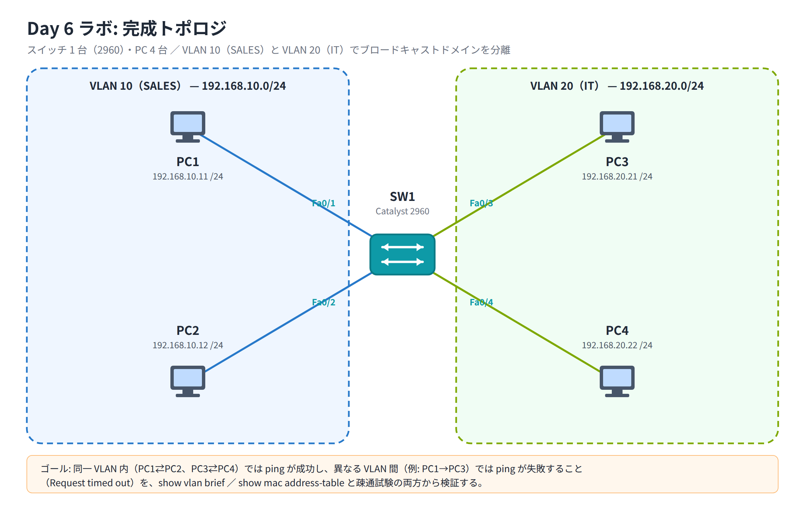

# Day 6 ラボ手順書: VLAN の作成とブロードキャストドメインの分離検証

> 配置先: ドキュメント `02_ラボ手順書 > Week2 > Day06`
> 所要時間の目安: 2.5 時間 ／ 使用ツール: Cisco Packet Tracer 9.x

## ゴール

- 1 台のアクセススイッチ上に 2 つの VLAN（VLAN 10 / VLAN 20）を作成できる
- 4 台の PC を、部署ごとに異なる VLAN のアクセスポートへ収容できる
- 同一 VLAN 内では ping が通り、異なる VLAN 間では ping が通らない
  （ブロードキャストドメインが分離されている）ことを、`show` コマンドと
  疎通試験の両方から検証できる

## 完成トポロジ



### IP アドレス表

| 機器 | 接続ポート | VLAN | IP アドレス | サブネットマスク | デフォルトゲートウェイ |
|---|---|---|---|---|---|
| PC1 | SW1 Fa0/1 | 10（SALES） | 192.168.10.11 | 255.255.255.0 | 未設定 |
| PC2 | SW1 Fa0/2 | 10（SALES） | 192.168.10.12 | 255.255.255.0 | 未設定 |
| PC3 | SW1 Fa0/3 | 20（IT） | 192.168.20.21 | 255.255.255.0 | 未設定 |
| PC4 | SW1 Fa0/4 | 20（IT） | 192.168.20.22 | 255.255.255.0 | 未設定 |

> 本ラボでは VLAN 間ルーティングを扱わないため、デフォルトゲートウェイは
> 設定不要です（Day 8 で VLAN 間ルーティングを学んだ後に再度使用します）。

---

## 手順 1: トポロジの作成と PC の IP 設定（30 分）

1. Packet Tracer を起動し、新規ファイルを開く
2. [End Devices] → **PC** を 4 台配置し、PC1〜PC4 という名前にする
3. [Network Devices] → [Switches] → **2960** を 1 台配置し、SW1 という名前にする
4. ストレートケーブルで次のとおり接続する
   - PC1 の `FastEthernet0` ─ SW1 の `FastEthernet0/1`
   - PC2 の `FastEthernet0` ─ SW1 の `FastEthernet0/2`
   - PC3 の `FastEthernet0` ─ SW1 の `FastEthernet0/3`
   - PC4 の `FastEthernet0` ─ SW1 の `FastEthernet0/4`
5. 各リンクの●が緑になるまで待つ
6. 各 PC の [Desktop] → **IP Configuration** で、IP アドレス表のとおりに
   IP アドレスとサブネットマスクを設定する（デフォルトゲートウェイは空欄のまま）
7. `File > Save As` でファイルを保存する: `day06_氏名.pkt`

## 手順 2: 初期状態の確認（10 分）

1. SW1 をクリックし [CLI] タブを開く
2. 特権 EXEC モードに入る

   ```
   Switch> enable
   ```

3. 初期状態を確認する

   ```
   Switch# show vlan brief
   ```

4. **確認**: Fa0/1〜Fa0/4 を含む全ポートが、まだ **VLAN 1（default）** に
   所属していることを記録する

## 手順 3: VLAN の作成（20 分）

1. グローバルコンフィグモードに入る

   ```
   Switch# configure terminal
   Switch(config)# hostname SW1
   ```

2. VLAN 10 を作成し、名前を付ける

   ```
   SW1(config)# vlan 10
   SW1(config-vlan)# name SALES
   SW1(config-vlan)# exit
   ```

3. VLAN 20 を作成し、名前を付ける

   ```
   SW1(config)# vlan 20
   SW1(config-vlan)# name IT
   SW1(config-vlan)# exit
   ```

4. `show vlan brief` を実行し、VLAN 10（SALES）と VLAN 20（IT）が
   作成されたことを確認する（この時点ではまだどのポートも所属していない）

## 手順 4: アクセスポートへの VLAN 割り当て（30 分）

1. Fa0/1〜Fa0/2 を VLAN 10 に割り当てる

   ```
   SW1(config)# interface range fastEthernet 0/1 - 2
   SW1(config-if-range)# switchport mode access
   SW1(config-if-range)# switchport access vlan 10
   SW1(config-if-range)# exit
   ```

2. Fa0/3〜Fa0/4 を VLAN 20 に割り当てる

   ```
   SW1(config)# interface range fastEthernet 0/3 - 4
   SW1(config-if-range)# switchport mode access
   SW1(config-if-range)# switchport access vlan 20
   SW1(config-if-range)# exit
   ```

3. 設定を終了する

   ```
   SW1(config)# end
   ```

## 手順 5: 設定内容の確認（20 分）

1. VLAN の割り当て状況を確認する

   ```
   SW1# show vlan brief
   ```

   **確認**: Fa0/1, Fa0/2 が VLAN 10 に、Fa0/3, Fa0/4 が VLAN 20 に
   表示されていること

2. Fa0/1 の詳細を確認する

   ```
   SW1# show interfaces fastEthernet 0/1 switchport
   ```

   **確認**: `Administrative Mode: static access`、
   `Access Mode VLAN: 10 (SALES)` のように表示されること

## 手順 6: 疎通試験（40 分）

1. PC1 の [Desktop] → **Command Prompt** から、同一 VLAN 内の PC2 へ ping する

   ```
   ping 192.168.10.12
   ```

   **確認**: `Reply from 192.168.10.12 ...` と表示され、同一 VLAN 10 内で
   疎通することを確認する

2. PC3 の Command Prompt から、同一 VLAN 内の PC4 へ ping する

   ```
   ping 192.168.20.22
   ```

   **確認**: 同一 VLAN 20 内で疎通することを確認する

3. PC1 の Command Prompt から、異なる VLAN の PC3 へ ping する

   ```
   ping 192.168.20.21
   ```

   **確認**: `Request timed out.` となり、異なる VLAN 間では疎通しないことを確認する

4. SW1 の CLI に戻り、学習した MAC アドレステーブルを確認する

   ```
   SW1# show mac address-table
   ```

   **確認**: 学習された MAC アドレスが、VLAN 列で **10** と **20** に
   分かれて表示されていることを確認する

## 手順 7: 設定の保存（10 分）

```
SW1# copy running-config startup-config
```

- VLAN の定義（VLAN 10 / VLAN 20 とその名前）自体は、`running-config` とは別に
  フラッシュメモリ上の **`vlan.dat`** にすでに保存されています。
  `copy running-config startup-config` は、ポートへの割り当てなど
  `running-config` 側の設定を `startup-config` に反映するために実行します

### 観察レポート（コメント提出用）

以下 3 問に答えて、課題のコメントに記入してください。

1. PC1→PC2 は成功し PC1→PC3 は失敗しました。この差が生まれる理由を
   「ブロードキャストドメイン」という語を使って説明してください。
2. `show vlan brief` の出力を貼り付け、Fa0/1〜Fa0/4 がそれぞれどの VLAN に
   所属しているかを記してください。また、VLAN 1 に残っているポートは
   何かを答えてください。
3. PC1 と PC3 を通信させるには、本ラボの構成に何が追加で必要でしょうか。
   不足している機器または機能を答えてください。

## 手順 8: 提出（10 分）

1. `day06_氏名.pkt` を Backlog のラボ課題に**添付**する
2. 手順 5・6 の実行結果（スクリーンショット可）と観察レポートを課題の**コメント**に貼る
3. 課題の状態を「処理済み」に変更する

## うまくいかないとき

| 症状 | 確認すること |
|---|---|
| 同一 VLAN 内なのに ping が通らない | PC の IP アドレス・サブネットマスクの入力ミス、リンクが緑になっているか |
| `show vlan brief` にポートが表示されない、または inactive | 対象 VLAN が正しく作成されているか、`switchport access vlan` の番号にタイプミスがないか |
| `interface range` の入力でエラーになる | `fastEthernet 0/1 - 2` のように、ポート番号とハイフンの前後に半角スペースが入っているか確認する |
| PC1→PC3 で ping が通ってしまう | ポートの VLAN 割り当てを取り違えていないか `show vlan brief` で再確認する |

30 分試して解決しない場合は、状況（スクリーンショット + 試したこと）を
課題のコメントに書いて質問してください。
