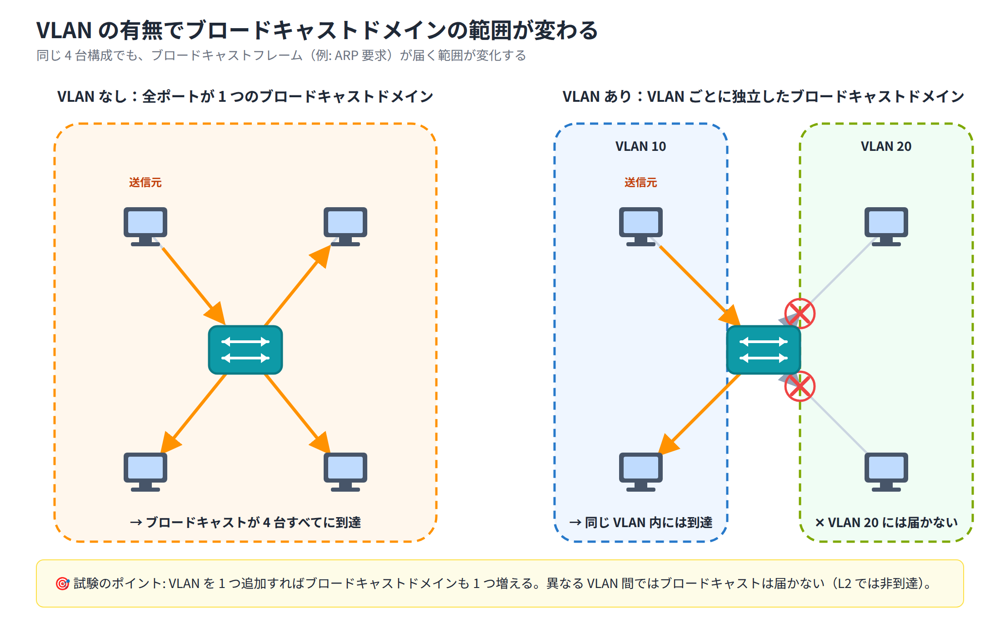

# Day 6 講義: VLAN の基礎

> 配置先: ドキュメント `01_教材 > Week2 > Day06`
> 学習時間の目安: 3.5 時間 ／ 準拠: CCNA 200-301 v1.1 ドメイン 2

## 学習目標

この講義を終えると、次のことができるようになります。

1. VLAN（Virtual LAN）がブロードキャストドメインをどのように分割するかを説明できる
2. デフォルト VLAN・データ VLAN・音声 VLAN・管理 VLAN の違いと、VLAN 番号の範囲を説明できる
3. VLAN の作成・名前付け・削除のコマンドを実行できる
4. アクセスポートに VLAN を割り当てるコマンドを正しい順序で実行できる
5. `show vlan brief` などの確認コマンドの出力から、ポートの所属 VLAN や障害の原因を読み取れる

---

## ウォームアップ（朝の想起クイズ）

> 教材を見ずに、まず自力で思い出してください（分散学習: Day 3「IPv4 アドレッシングとサブネット化」 / Day 5「TCP / UDP・スイッチング動作・物理層」 の範囲から出題）。

**W1.** （Day 3）`/26` のサブネットマスクをドット付き 10 進表記で答えよ。また、このサブネットで使用できるホストアドレスは何台か。

**W2.** （Day 5）TCP と UDP のうち、コネクション型（3 ウェイハンドシェイクで接続を確立する）プロトコルはどちらか。また、そのプロトコルを使う代表的なアプリケーション層プロトコルを 1 つ挙げよ。

**W3.** （Day 5）スイッチが受信したフレームの宛先 MAC アドレスが MAC アドレステーブルに存在しない場合、スイッチはこのフレームをどのように処理するか。

<details><summary>解答</summary>

- W1: `255.255.255.192`。使用可能ホスト数は `2^6 - 2 = 62` 台
- W2: TCP（コネクション型）。代表例: HTTP/HTTPS、FTP、SMTP など
- W3: 宛先ポートが不明なため、受信ポートを除く全ポートへフラッディング（送信）する

</details>

---

## 1. VLAN とは何か — ブロードキャストドメインの分割

**VLAN（Virtual LAN、仮想 LAN）** とは、1 台の物理スイッチを論理的に複数の LAN に
分割する仕組みです。VLAN ごとに独立した**ブロードキャストドメイン**（ブロードキャスト
フレームが届く範囲）になります。

VLAN を使わないスイッチでは、全ポートが 1 つの巨大なブロードキャストドメインを
形成します。この状態では、ある端末が送信した ARP 要求や DHCP Discover などの
ブロードキャストフレームが、スイッチに接続された**すべての端末**に届いてしまいます。
端末数が増えるほど不要なブロードキャストが増え、ネットワーク全体の性能が低下します。

### VLAN 分割の主な目的

| 目的 | 内容 |
|---|---|
| **ブロードキャストの抑制** | ブロードキャストドメインを小さく保ち、無駄なトラフィックと処理負荷を減らす |
| **セキュリティ** | 部署間（例: 営業部と経理部）のトラフィックを論理的に分離する |
| **論理的な管理の柔軟さ** | 端末の物理的な設置場所に関係なく、業務や役割でグループ化できる |

### 同一 VLAN 内と異なる VLAN 間の通信

- 同一 VLAN に所属する端末同士は、L2（データリンク層）で直接通信できます。
- **異なる VLAN に属する端末同士は、L2 だけでは通信できません**。通信するには、
  ルータや L3 スイッチのような **L3（ネットワーク層）機器**が必要です
  （VLAN 間ルーティングの詳細は Day 8 で扱います）。



### VLAN と IP サブネットの対応

VLAN 設計の基本原則として、**1 つの VLAN は原則 1 つの IP サブネットに対応**させます。
たとえば VLAN 10 に `192.168.10.0/24` を割り当てる、といった具合です。この結果、
アクセス層スイッチ上で「ブロードキャストドメイン = VLAN = IP サブネット」という
3 つの単位が一致するのが基本設計になります。

> **試験のポイント**: VLAN を増やすとブロードキャストドメインの数がどう変化するかを
> 問う問題が頻出です。VLAN を 1 つ追加すれば、ブロードキャストドメインも 1 つ増えます。

## 2. VLAN の種類とデフォルト VLAN

### デフォルト VLAN

Cisco スイッチの初期状態では、**すべてのポートが VLAN 1 に所属**しています。
VLAN 1 は**デフォルト VLAN**と呼ばれ、次の特徴があります。

- **削除できない**（`no vlan 1` は実行できない）
- **名前を変更できない**
- 工場出荷状態のスイッチでは、CDP や DTP などの管理系トラフィックの一部が
  デフォルトで VLAN 1 を流れる

### VLAN の用途による分類

| 種類 | 用途 |
|---|---|
| **データ VLAN（ユーザ VLAN）** | PC などエンドユーザの一般的な業務トラフィックを運ぶ VLAN |
| **音声 VLAN（Voice VLAN）** | IP 電話の音声トラフィックを、PC のデータトラフィックと分離するための VLAN。音声品質を保つための QoS（優先制御）をかけやすくする |
| **管理 VLAN** | スイッチ自身の管理通信（SSH ログイン、SVI の IP アドレスなど）に使う VLAN |
| **ネイティブ VLAN** | トランクリンク上で、タグを付けずに送受信する VLAN。既定値は VLAN 1（詳細は Day 7 のトランクで扱う） |

音声 VLAN の特徴として、**1 つのアクセスポートにデータ VLAN と音声 VLAN を共存**
させられる点があります。IP 電話の下に PC を接続する構成（PC → IP 電話 → スイッチ）
で、PC のデータは データ VLAN、IP 電話の音声は音声 VLAN として別々に扱えます。

管理 VLAN については、セキュリティ上の理由から、**デフォルトの VLAN 1 とは別の
VLAN を管理専用に用意する**ことが推奨されます。VLAN 1 はどのポートにも
存在しやすく、悪意ある端末からの攻撃対象になりやすいためです。

### VLAN 番号の範囲

| 範囲 | 名称 | 備考 |
|---|---|---|
| 1〜1005 | 標準範囲 VLAN | 一般的に使用する範囲 |
| 1002〜1005 | 予約 VLAN | FDDI / トークンリング用に予約済み（通常は使用しない） |
| 1006〜4094 | 拡張範囲 VLAN | 大規模環境向け。スイッチの動作モードによっては制限あり |

> **試験のポイント**: 標準範囲は VLAN **1〜1005**、拡張範囲は VLAN **1006〜4094**
> と覚えます。標準範囲の中でも VLAN 1（デフォルト）と VLAN **1002〜1005**
> （FDDI / トークンリング予約）は、削除も名前の変更もできません。

### セキュリティのベストプラクティス

- 未使用ポートは、業務で使わない VLAN（いわゆる「ブラックホール VLAN」）に
  隔離しておく
- ユーザの業務トラフィックを VLAN 1 に置かない（VLAN 1 は管理系トラフィックが
  流れやすく、攻撃の起点になりやすいため）

> 💼 **実務では**: セキュリティ監査では「VLAN 1 に業務トラフィックや管理用の
> SVI（IP アドレス）が乗っていないか」が必ず確認対象になります。管理通信は
> 専用の VLAN（例: VLAN 99）に分離し、未使用ポートは `shutdown` のうえ業務外の
> VLAN に収容しておくのがキッティングの定石です。初期設定のまま全ポートを
> VLAN 1 で運用してしまうミスは新人にありがちなので、最初に押さえておきましょう。

> **試験のポイント**: デフォルト VLAN が VLAN 1 であること、VLAN 1 は削除・改名
> できないことは頻出です。確実に覚えておきましょう。

## 3. VLAN の作成と命名

### VLAN の作成

VLAN はグローバルコンフィグモードから、次のコマンドで作成します。

```
Switch(config)# vlan 10
Switch(config-vlan)# name SALES
Switch(config-vlan)# exit
```

- `vlan <ID>` を実行すると VLAN コンフィグモードに入り、指定した ID の VLAN が
  作成されます（すでに存在する場合はそのモードに入るだけです）
- `name <名前>` は任意ですが、`VLAN0010` のような自動生成名のままにせず、
  部署名や用途がわかる名前を付けるのが管理上のベストプラクティスです

### VLAN 情報の保存場所

作成した VLAN の情報（VLAN 番号・名前など）は、`running-config` ではなく
**`vlan.dat`** というファイルにフラッシュメモリ上へ保存されます。つまり VLAN 情報は
`running-config` / `startup-config` とは**別に管理**されている点に注意が必要です。

> 💼 **実務では**: スイッチを別部署へ転用したり RMA 品として返却したりする際、
> `erase startup-config` だけを実行しても `vlan.dat` に VLAN 定義が残ったままになり、
> 旧 VLAN が復活して構成事故につながることがあります。完全に初期化したい場合は
> `delete flash:vlan.dat` も併せて実行し、リロードしてください。
> 「`copy running-config startup-config` で全部保存した」という思い込みで
> `vlan.dat` の存在を見落とすのはよくあるミスなので、機器の転用・キッティング前の
> 必須チェックとして覚えておきましょう。

### VLAN の削除

```
Switch(config)# no vlan 10
```

VLAN を削除する際に注意したいのは、**その VLAN をポートに割り当てたまま削除すると、
該当ポートが非アクティブ（inactive）状態になる**ことです。ポートは物理的には
アップしていても、フレームを転送できない状態になります。

### 設定例

部署単位で VLAN を設計する例です。

```
Switch(config)# vlan 10
Switch(config-vlan)# name SALES
Switch(config-vlan)# exit
Switch(config)# vlan 20
Switch(config-vlan)# name IT
Switch(config-vlan)# exit
```

### 確認コマンド

複数の VLAN の状態をまとめて確認するには `show vlan brief` を使います（詳細は
第 5 節を参照してください）。

> **試験のポイント**: VLAN 情報が `vlan.dat` に保存され、`running-config` とは
> 別管理であることを問う問題が出ます。「`write memory` だけでは VLAN が消える／消えない」
> といったひっかけに注意しましょう（`vlan.dat` はフラッシュに直接保存されるため、
> `copy running-config startup-config` を忘れても VLAN 自体の定義は残ります）。

## 4. アクセスポートの設定と割り当て

**アクセスポート**とは、1 つの VLAN だけに所属し、タグの付かない通常のイーサネット
フレームを 1 台のエンドポイント（PC など）とやり取りするポートです。

### ポートをアクセスモードに固定する

```
Switch(config)# interface fastEthernet 0/1
Switch(config-if)# switchport mode access
```

Cisco スイッチのポートは、初期状態では DTP（Dynamic Trunking Protocol）により
モードが自動ネゴシエーションされる場合があります。意図しないトランク化を防ぐため、
**`switchport mode access` で明示的にアクセスモードへ固定する**のが推奨されます。

### データ VLAN の割り当て

```
Switch(config-if)# switchport access vlan 10
```

指定した VLAN 番号がまだ作成されていない場合、IOS は該当 VLAN を**自動的に作成**
します。ただし、名前は `VLAN0010` のような自動生成名になるため、後から
`vlan 10` → `name` で明示的に命名し直すのが望ましい運用です。

### 音声 VLAN の割り当て

```
Switch(config-if)# switchport voice vlan 20
```

PC を IP 電話経由でスイッチに接続する構成で使用します。この場合、
`switchport access vlan` でデータ VLAN、`switchport voice vlan` で音声 VLAN を
別々に指定することで、1 つの物理ポートに 2 つの VLAN のトラフィックを流せます。

### 複数ポートの一括設定

同じ設定を複数ポートに適用する場合は `interface range` が便利です。

```
Switch(config)# interface range fastEthernet 0/1 - 12
Switch(config-if-range)# switchport mode access
Switch(config-if-range)# switchport access vlan 10
```

### 未使用ポートの保護

```
Switch(config)# interface fastEthernet 0/24
Switch(config-if)# switchport mode access
Switch(config-if)# switchport access vlan 999
Switch(config-if)# shutdown
```

未使用ポートは、業務で使わない VLAN に収容したうえで `shutdown` しておくのが
セキュリティの定石です。

> **試験のポイント**: `switchport mode access` → `switchport access vlan <ID>`
> という一連のコマンドの**順序と役割**（モードを固定してから VLAN を割り当てる）を
> 問う問題が頻出です。また、アクセスポートに割り当てられる**データ VLAN は 1 つのみ**
> であり、複数の VLAN を同時に扱えるのはトランクポートだけである点も重要です。

| ポート種別 | 扱える VLAN 数 |
|---|---|
| アクセスポート | データ VLAN 1 つ（＋音声 VLAN 1 つまで併用可） |
| トランクポート | 複数 VLAN（タグ付きで同時に転送可） |

> **試験のポイント**: **アクセスポートはデータ VLAN 1 つ（＋音声 VLAN 1 つ）まで、
> 複数の VLAN を同時に扱えるのはトランクポートだけ**です。`switchport access vlan`
> （データ VLAN）と `switchport voice vlan`（音声 VLAN）は同一ポートで共存できる点も、
> あわせて押さえましょう。

## 5. VLAN の確認とトラブルシューティング

### 主要な確認コマンド

| コマンド | 確認できる内容 |
|---|---|
| `show vlan brief` | VLAN 番号・名前・状態（active/inactive）・所属ポートの一覧 |
| `show interfaces <IF> switchport` | 該当ポートの動作モード（access/trunk）、アクセス VLAN・音声 VLAN の設定値 |
| `show vlan id <ID>` | 特定 VLAN の詳細情報 |
| `show mac address-table` | 学習した MAC アドレスが、どの VLAN・どのポートに紐づいているか |

`show vlan brief` の出力イメージは次のとおりです。

```
Switch# show vlan brief

VLAN Name                             Status    Ports
---- -------------------------------- --------- -------------------------------
1    default                          active    Fa0/5, Fa0/6, Fa0/7, Fa0/8
10   SALES                            active    Fa0/1, Fa0/2
20   IT                               active    Fa0/3, Fa0/4
1002 fddi-default                     act/unsup
```

### よくある障害と切り分け方

| 症状 | 原因の候補 |
|---|---|
| 意図した端末同士で ping が通らない | ポートが別の VLAN に割り当てられている |
| ポートが `show vlan brief` で inactive と表示され通信できない | 割り当て済みの VLAN を `no vlan` で削除した（または VLAN が suspend/shutdown 状態） |
| `switchport mode access` を設定したはずなのに動作が不安定 | 実際には dynamic auto/desirable のまま残っている（DTP による意図しないネゴシエーション） |
| 同一 VLAN 内なのに ping が通らない | 端末側の IP アドレス・サブネットマスクが VLAN のサブネットと一致していない |

**VLAN 間で ping が通らないのは、多くの場合「正常な分離動作」**です。VLAN は
ブロードキャストドメイン（= L2 到達性の範囲）を分けるものなので、異なる VLAN 間の
端末が ping で疎通しないのは設計どおりの挙動です。VLAN 間で通信させたい場合は、
L3 機器によるルーティングを別途構成する必要があります（Day 8）。

障害切り分けの基本的な考え方は次の順序です。

1. `show vlan brief` で、対象ポートが期待する VLAN に入っているか確認する
2. `show interfaces <IF> switchport` で、モードが access になっているか、
   アクセス VLAN の番号が正しいか確認する
3. 端末側の IP アドレス・サブネットマスクが、その VLAN に割り当てたサブネットと
   一致しているか確認する
4. 異なる VLAN 間の通信であれば、そもそも L3 機器が必要であることを踏まえて
   期待値を見直す

> **試験のポイント**: `show vlan brief` の出力を見せて「どのポートがどの VLAN に
> 所属しているか」「なぜこのポートが inactive なのか」を問う問題が頻出です。
> inactive の代表的な原因は、**割り当て済みの VLAN を `no vlan` で削除したこと**
> です（VLAN が suspend/shutdown 状態の場合も同様に inactive になります）。
> 存在しない VLAN 番号をアクセスポートに割り当てた場合は、第 4 節のとおり IOS が
> 自動的に VLAN を作成するため inactive にはならない点に注意してください。

## まとめ

- VLAN は 1 台の物理スイッチを論理的に分割し、VLAN ごとに独立したブロードキャスト
  ドメインを作る仕組みで、「VLAN = ブロードキャストドメイン = 1 サブネット」が基本設計
- デフォルト VLAN は VLAN 1（削除・改名不可）。データ / 音声 / 管理 VLAN を目的に
  応じて使い分ける
- VLAN の作成は `vlan <ID>` + `name <名前>`。情報は `vlan.dat` に保存され、
  `running-config` とは別管理
- アクセスポートには `switchport mode access` → `switchport access vlan <ID>`
  の順で設定する。データ VLAN は 1 ポートにつき 1 つのみ
- `show vlan brief` を中心とした確認コマンドで、ポートの所属や inactive の原因を
  切り分けられるようにする

---

## 確認問題（自己チェック・解答は末尾）

1. VLAN を使わないスイッチにおいて、あるポートから送信されたブロードキャストフレームは、他のどのポートまで届くか。
2. デフォルト VLAN の番号はいくつか。また、このVLANに対してできない操作を 2 つ挙げよ。
3. アクセスポートに VLAN 10 を割り当てるための 2 つのコマンドを、実行する順序どおりに書け。
4. `switchport access vlan 30` を実行したとき、VLAN 30 がまだ作成されていなかった場合、IOS はどう振る舞うか。
5. VLAN 10 に所属する PC と VLAN 20 に所属する PC の間で ping が通らない。これは異常か、正常な動作か。理由とともに答えよ。

<details><summary>解答</summary>

1. 同一スイッチに接続された、その VLAN（＝すべてのポート）に属する他のすべてのポート
2. VLAN 1。削除できない・名前を変更できない
3. `switchport mode access` → `switchport access vlan 10`
4. VLAN 30 を自動的に作成する（ただし名前は自動生成名になる）
5. 正常な動作。VLAN が異なればブロードキャストドメインが分かれるため L2 では
   到達できず、通信させるには L3 機器によるルーティングが必要

</details>

## 次のステップ

本日のラボ課題「[Day06] ラボ: 1 台のスイッチに 2 つの VLAN を構成し、
ブロードキャストドメインの分離を検証する」に進み、講義で学んだ VLAN の作成・
アクセスポートへの割り当て・`show vlan brief` による確認を、Packet Tracer 上で
実際に手を動かして確認してください。
