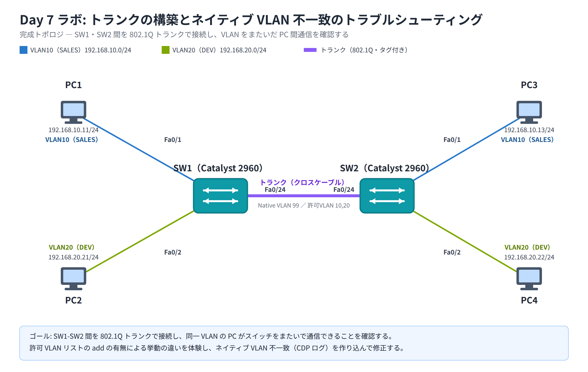

# Day 7 ラボ手順書: トランクの構築とネイティブ VLAN 不一致のトラブルシューティング

> 配置先: ドキュメント `02_ラボ手順書 > Week2 > Day07`
> 所要時間の目安: 2.5 時間 ／ 使用ツール: Cisco Packet Tracer 9.x

## ゴール

- 2 台の Catalyst 2960 スイッチ間を 802.1Q トランクで接続し、同一 VLAN に
  属する PC がスイッチをまたいで相互通信できることを確認する
- 許可 VLAN リストの `add` の有無による挙動の違いを実際に体験する
- ネイティブ VLAN 不一致を意図的に作り込み、CDP ログという症状を観察した
  うえで修正し、トランクの動作原理を体得する

## 完成トポロジ



### IP アドレス割り当て表

| 機器 | 接続ポート | VLAN | IP アドレス | サブネットマスク |
|---|---|---|---|---|
| PC1 | SW1 Fa0/1 | 10（SALES） | 192.168.10.11 | 255.255.255.0 |
| PC2 | SW1 Fa0/2 | 20（DEV） | 192.168.20.21 | 255.255.255.0 |
| PC3 | SW2 Fa0/1 | 10（SALES） | 192.168.10.13 | 255.255.255.0 |
| PC4 | SW2 Fa0/2 | 20（DEV） | 192.168.20.22 | 255.255.255.0 |
| SW1 - SW2 | Fa0/24 - Fa0/24 | トランク（予定） | — | — |

デフォルトゲートウェイは各 PC とも**未設定**とします。本ラボはレイヤ 2
（VLAN・トランク）の疎通確認のみを目的とするためです。

---

## 手順 1: トポロジの作成と VLAN 作成（20 分）

1. Packet Tracer を起動し、新規ファイルを開く
2. **2960** スイッチを 2 台（SW1, SW2）、**PC** を 4 台（PC1〜PC4）配置する
3. ケーブル接続（ストレートケーブル）
   - PC1 ─ SW1 Fa0/1、PC2 ─ SW1 Fa0/2
   - PC3 ─ SW2 Fa0/1、PC4 ─ SW2 Fa0/2
4. SW1 Fa0/24 ─ SW2 Fa0/24 を**クロスケーブル**で接続する
5. 各スイッチの CLI（Config タブ → CLI、または CLI タブ）を開き、VLAN を作成する

   ```
   Switch> enable
   Switch# configure terminal
   Switch(config)# vlan 10
   Switch(config-vlan)# name SALES
   Switch(config-vlan)# exit
   Switch(config)# vlan 20
   Switch(config-vlan)# name DEV
   Switch(config-vlan)# exit
   ```

6. SW1・SW2 の両方で同様に作成し、`show vlan brief` で VLAN10（SALES）・
   VLAN20（DEV）が登録されていることを確認する

   ```
   Switch# show vlan brief
   ```

## 手順 2: アクセスポートへの VLAN 割り当て（15 分）

1. SW1 で `interface range` を使い、Fa0/1・Fa0/2 をまとめて設定する

   ```
   SW1(config)# interface range fastEthernet 0/1 - 2
   SW1(config-if-range)# switchport mode access
   SW1(config-if-range)# exit
   ```

2. Fa0/1 を VLAN10、Fa0/2 を VLAN20 に個別に割り当てる

   ```
   SW1(config)# interface fastEthernet 0/1
   SW1(config-if)# switchport access vlan 10
   SW1(config-if)# exit
   SW1(config)# interface fastEthernet 0/2
   SW1(config-if)# switchport access vlan 20
   SW1(config-if)# exit
   ```

3. SW2 でも同様に、Fa0/1 を VLAN10、Fa0/2 を VLAN20 に設定する
4. 各 PC の [Desktop] → IP Configuration で、IP アドレス割り当て表のとおりに
   IP アドレスとサブネットマスクを設定する
5. ファイルを保存: `File > Save As` → `day07_氏名.pkt`

## 手順 3: トランク未設定での疎通確認（10 分）

1. PC1 の Command Prompt から、同一 VLAN10・スイッチをまたぐ PC3 へ ping する

   ```
   ping 192.168.10.13
   ```

2. **確認**: SW1-SW2 間がまだアクセスリンク（既定は `dynamic auto`）のため、
   トランクが成立しておらず、ping が**失敗する**（Request timed out）ことを
   記録する

## 手順 4: トランクの静的設定（20 分）

1. SW1 の Fa0/24 をトランクに設定する

   ```
   SW1(config)# interface fastEthernet 0/24
   SW1(config-if)# switchport mode trunk
   SW1(config-if)# exit
   ```

2. SW2 の Fa0/24 も同様にトランクへ設定する

   ```
   SW2(config)# interface fastEthernet 0/24
   SW2(config-if)# switchport mode trunk
   SW2(config-if)# exit
   ```

3. 両スイッチで確認コマンドを実行し、トランクが成立していること、
   ネイティブ VLAN が 1、許可 VLAN・転送中 VLAN がすべて（1-4094 相当）に
   なっていることを確認する

   ```
   SW1# show interfaces trunk
   ```

## 手順 5: トランク成立後の疎通確認（15 分）

1. PC1 → PC3（VLAN10 同士）、PC2 → PC4（VLAN20 同士）へ ping し、いずれも
   成功することを確認する

   ```
   ping 192.168.10.13
   ping 192.168.20.22
   ```

2. 比較のため、PC1 → PC4（VLAN10 → VLAN20、異なる VLAN 間）へ ping し、
   **失敗する**ことを確認する（デフォルトゲートウェイ未設定のため VLAN 間
   ルーティングができない。VLAN 間通信は Day 8 で学ぶ）

## 手順 6: 許可 VLAN 制御の演習（25 分）

1. SW1 の Fa0/24 で、許可 VLAN を VLAN10 のみに絞り込む

   ```
   SW1(config)# interface fastEthernet 0/24
   SW1(config-if)# switchport trunk allowed vlan 10
   ```

2. `show interfaces trunk` で、Allowed VLANs が `10` のみになったことを確認する
3. PC2 → PC4（VLAN20）の ping が**失敗する**ことを確認する（VLAN20 の
   トラフィックがトランクを通れなくなったため）
4. VLAN20 を許可リストに**追加**する

   ```
   SW1(config-if)# switchport trunk allowed vlan add 20
   ```

5. `show interfaces trunk` で Allowed VLANs が `10,20` に戻ったこと、
   PC2 → PC4 の疎通が回復したことを確認する
6. （体験用・任意）手順 4 の代わりに `switchport trunk allowed vlan 20` を
   `add` なしで実行すると、リストが VLAN20 のみに**上書き**され VLAN10 が
   不通になることを、余裕があれば実際に試して確認する（確認後は必ず
   `switchport trunk allowed vlan 10,20` に戻すこと）

## 手順 7: ネイティブ VLAN 不一致の演習（25 分）

1. 両スイッチで VLAN99 を作成する（`vlan 99` → `name NATIVE` → `exit`）
2. SW1 の Fa0/24 のみ、ネイティブ VLAN を VLAN99 に変更する

   ```
   SW1(config)# interface fastEthernet 0/24
   SW1(config-if)# switchport trunk native vlan 99
   ```

3. SW2 側は既定のまま（ネイティブ VLAN = VLAN1）にしておく
4. 両スイッチで CDP が有効であることを確認し（既定で有効）、しばらく待つ。
   操作をしなくても、開いたままの CLI 画面に次のログが自動的に表示される
   （出るまで数十秒かかることがあるので、その場で待つ）

   ```
   %CDP-4-NATIVE_VLAN_MISMATCH: Native VLAN mismatch discovered ...
   ```

   **注記**: タグ付きで流れる VLAN10・VLAN20 の PC 間通信は、ネイティブ VLAN
   不一致の間も**継続します**（タグ付きフレームは影響を受けないため）。
   Packet Tracer 上で観察できる主症状は、この `%CDP-4-NATIVE_VLAN_MISMATCH`
   ログです。実機ではネイティブ VLAN（タグなし）側で STP の PVID（Port VLAN ID、
   そのポートに設定されているネイティブ VLAN の番号を指す用語）不整合に
   よりポートがブロックされることがありますが、Packet Tracer では通常
   再現しません。ping が失敗しないからといって「手順が間違っている」
   わけではないので注意してください。

5. `show interfaces trunk` を両スイッチで実行し、Native VLAN の列が
   それぞれ異なる値（SW1=99、SW2=1）になっていることを確認する
6. SW2 の Fa0/24 もネイティブ VLAN を VLAN99 に揃える

   ```
   SW2(config)# interface fastEthernet 0/24
   SW2(config-if)# switchport trunk native vlan 99
   ```

7. しばらく待ち、`%CDP-4-NATIVE_VLAN_MISMATCH` の警告が再発しなくなること、
   `show interfaces trunk` の Native VLAN が両スイッチとも 99 で揃っている
   ことを確認する

## 手順 8: DTP 無効化と最終確認（20 分）

1. 両スイッチの Fa0/24 で DTP のネゴシエーションを停止する

   ```
   SW1(config)# interface fastEthernet 0/24
   SW1(config-if)# switchport nonegotiate
   ```

   SW2 側にも同様に設定する

2. 設定後も静的トランクとして維持されていることを `show interfaces trunk`
   で確認する
3. Administrative Mode と Operational Mode を確認する

   ```
   SW1# show interfaces fastEthernet 0/24 switchport
   ```

4. すべての設定が完了したら、両スイッチで実行コンフィグをスタートアップ
   コンフィグへ保存する

   ```
   SW1# copy running-config startup-config
   ```

### 観察レポート（コメント提出用）

以下 3 問に答えて、課題のコメントに記入してください。

1. 手順 3（トランク未設定）と手順 5（トランク設定後）で PC1→PC3 の疎通結果が
   どう変わったか。なぜトランクが必要なのかを 802.1Q タギングの観点から
   説明してください。
2. ネイティブ VLAN 不一致を作ったとき（手順 7）、どのようなログが観察
   されましたか。また、タグなしで送られるネイティブ VLAN のトラフィックだけが
   影響を受け、タグ付きの VLAN10・VLAN20 の通信は継続する理由を説明して
   ください。
3. `switchport trunk allowed vlan 10` の直後に VLAN20 が不通になり
   （手順 6-3）、`add 20` で回復した（手順 6-5）理由を、許可 VLAN リストの
   上書き挙動から説明してください。

## 提出方法

1. ファイル名を `day07_氏名.pkt` にして保存する（例: `day07_山田太郎.pkt`）
2. Backlog のラボ課題に `day07_氏名.pkt` を**添付**する
3. 手順 3・手順 5・手順 6・手順 7 の ping 結果やログ（スクリーンショット可）と、
   上記の観察レポート 3 問の回答を課題の**コメント**に貼る
4. 課題の状態を「処理済み」に変更する

## うまくいかないとき

| 症状 | 確認すること |
|---|---|
| トランク設定後も PC1→PC3 の ping が失敗する | 両スイッチの Fa0/24 が `switchport mode trunk` になっているか。`show interfaces trunk` にポートが表示されているか |
| `show interfaces trunk` に Fa0/24 が出てこない | ケーブルが緑（アップ状態）か。片方が `access` モードのままになっていないか |
| VLAN20 だけ疎通しない | `switchport trunk allowed vlan` の設定を確認し、`add` を付け忘れてリストを上書きしていないか |
| `%CDP-4-NATIVE_VLAN_MISMATCH` が消えない | 両スイッチの `switchport trunk native vlan` の値が完全に一致しているか。反映まで数秒〜数十秒待つ |
| `switchport nonegotiate` 後にリンクがダウンする | 対向ポートも静的モード（trunk または access）に固定されているか（両方が動的モードのままだと不整合が起きることがある） |

30 分試して解決しない場合は、状況（スクリーンショット + 試したこと）を
課題のコメントに書いて質問してください。
