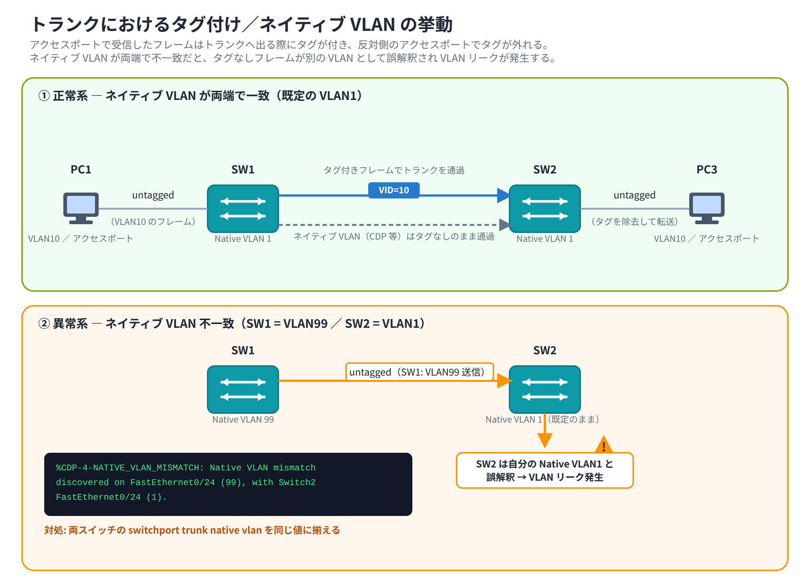

# Day 7 講義: トランクと VLAN 設計

> 配置先: ドキュメント `01_教材 > Week2 > Day07`
> 学習時間の目安: 3.5 時間 ／ 準拠: CCNA 200-301 v1.1 ドメイン 2

## 学習目標

この講義を終えると、次のことができるようになります。

1. トランクリンクが必要になる理由と、IEEE 802.1Q によるタギングの仕組みを説明できる
2. ネイティブ VLAN の役割と、不一致が起きたときの症状を説明できる
3. `switchport mode trunk` を用いてトランクを設定し、許可 VLAN を制御できる
4. DTP（Dynamic Trunking Protocol）のポートモードの組み合わせと、成立可否を判断できる
5. `show interfaces trunk` などの確認コマンドから、トランクの状態を読み取り典型的な障害を切り分けられる

---

## ウォームアップ（朝の想起クイズ）

> 教材を見ずに、まず自力で思い出してください（分散学習: Day 4「IPv6 アドレッシング」 /
> Day 6「VLAN の基礎」 の範囲から出題）。

**W1.** （Day 4）EUI-64 方式で MAC アドレスをインターフェース ID に変換する際に
行う 2 つの操作（挿入する 16 進数の値と、反転するビット）を答えよ。

**W2.** （Day 6）標準範囲 VLAN と拡張範囲 VLAN の境界となる番号はいくつか。また、
FDDI / トークンリング用に予約され通常は使用しない VLAN 番号の範囲はいくつか。

**W3.** （Day 6）1 つのアクセスポートにデータ VLAN と音声 VLAN を共存させる
典型的な物理接続構成と、その目的を 1 文で述べよ。

<details><summary>解答</summary>

- W1: MAC アドレスの上位 24 ビットと下位 24 ビットの間に `FFFE` を挿入し、
  上位バイトの 7 ビット目（U/L ビット）を反転する
- W2: 標準範囲は 1〜1005、拡張範囲は 1006〜4094 で境界は 1005/1006。予約 VLAN は
  1002〜1005（FDDI / トークンリング用）
- W3: PC → IP 電話 → スイッチという構成で、PC のデータはデータ VLAN、IP 電話の
  音声は音声 VLAN として分離し、音声品質を保つための QoS をかけやすくするため

</details>

---

## 1. トランクが必要になる理由と 802.1Q タギング

Day 6 で学んだアクセスポート（access port）は、1 本のリンクにつき **1 つの VLAN**
しか運べません。しかし実際のネットワークでは、複数のスイッチにまたがって同じ
VLAN の端末が存在します。たとえば SW1 と SW2 の両方に VLAN10 と VLAN20 の端末が
いる場合、スイッチ間のリンクを VLAN の数だけ用意するのは非効率です。

そこで使うのが **トランク（trunk）** です。トランクは 1 本の物理リンクの上で
**複数の VLAN のフレームを同時に運ぶ** ためのリンクです。トランク上を流れる
フレームには、そのフレームがどの VLAN に属するかを示す**タグ（VLAN タグ）**が
付与されます。

### IEEE 802.1Q

VLAN タグを付与する標準規格が **IEEE 802.1Q**（通称 dot1q）です。802.1Q タグは、
イーサネットフレームの**送信元 MAC アドレスと EtherType（上位プロトコルを示す
フィールド）の間**に 4 バイトの領域として挿入されます。

なお、Cisco には **ISL（Inter-Switch Link）** という独自のタギング方式が
以前存在しましたが、フレーム全体をカプセル化する独自方式であり、現在は
非推奨（obsolete）です。CCNA の試験範囲および現行機種で使われるのは
標準規格である 802.1Q のみです。

> **試験のポイント**: ISL と 802.1Q の違い（Cisco 独自かオープン標準か、
> カプセル化方式かタグ挿入方式か）を問う問題が頻出です。現行の Catalyst
> スイッチ（2960 など）は 802.1Q のみに対応します。

### 802.1Q タグの内訳

> **ここが今日の山場です。** ここから先に出てくるビット数の内訳は、Week0 P2 で
> 学んだ 2 進数の考え方（桁が 1 つ増えるごとに表現できる数が 2 倍になること）を
> 使って読み解きます。焦らず、1 つずつ表を確認しながら進めれば時間をかけて
> 構いません。

802.1Q タグは合計 4 バイトで、次の 2 つのフィールドから構成されます。

| フィールド | サイズ | 内容 |
|---|---|---|
| **TPID**（Tag Protocol Identifier） | 2 バイト | 固定値 `0x8100`。このフレームに 802.1Q タグが付いていることを示す |
| **TCI**（Tag Control Information） | 2 バイト | 下記 3 つのサブフィールドで構成 |

TCI はさらに次のように分かれます。

| サブフィールド | ビット数 | 内容 |
|---|---|---|
| **PCP**（Priority Code Point） | 3 ビット | 優先度（CoS: Class of Service）。0〜7 の 8 段階 |
| **DEI/CFI** | 1 ビット | 廃棄適格性の表示（伝統的には CFI と呼ばれた） |
| **VID**（VLAN ID） | 12 ビット | フレームが属する VLAN 番号 |

```
+--------+--------+------+------+------------------+
| 宛先MAC | 送信元MAC | TPID | TCI  | EtherType | データ … |
|        |         |0x8100|(PCP+DEI+VID)|         |         |
+--------+--------+------+------+------------------+
                    └────── 4バイト ──────┘
```

### VLAN ID の範囲

VID は 12 ビットのフィールドなので、表現できる値は 2^12 = **4096 通り**
（0〜4095）です。ただし、VLAN 0 と VLAN 4095 は予約されており、実際に
ユーザーが使用できる VLAN 番号は **1〜4094** です。このうち **1〜1005** を
**ノーマルレンジ（標準範囲）**、**1006〜4094** を**エクステンデッドレンジ
（拡張範囲）**と呼びます。また **1002〜1005** は FDDI / トークンリング用に
予約された既定 VLAN で、通常のイーサネット VLAN としては使いません
（Day 6 で扱った内容の再確認です）。

> **試験のポイント**: 「VLAN ID は 12 ビットで、使用可能な VLAN は 1〜4094」
> という数字は頻出です。ビット数（12）と使用可能範囲（1〜4094）を
> セットで覚えてください。予約: `0`・`4095`（VID フィールド自体の予約）と
> `1002〜1005`（既定の予約 VLAN）を区別できるようにしましょう。

### フレームサイズへの影響

802.1Q タグを追加すると、標準的なイーサネットフレームの最大サイズは
**1518 バイトから 1522 バイトへ拡張**されます。この 1522 バイトのフレームは
俗に「ベビージャイアント（baby giant）」フレームと呼ばれます。

### タグの付け外し

- 送信スイッチは、フレームがどの VLAN に属するかに応じて 802.1Q タグを付与し、
  トランクへ送信します
- 受信側のスイッチは、タグの VID を見てそのフレームの所属 VLAN を判別します
- タグ付きフレームを**アクセスポートへ転送する際は、タグを取り除いて**
  （アンタグして）送信します。アクセスポートに接続された PC などの端末は
  タグ付きフレームを理解できないためです

## 2. ネイティブ VLAN

### タグを付けない特別な VLAN

トランクリンク上では、通常すべての VLAN のフレームに 802.1Q タグが付きますが、
**ネイティブ VLAN（native VLAN）** に属するフレームだけは例外で、**タグを付けずに
（アンタグのまま）**送信されます。

ネイティブ VLAN は、802.1Q タグに対応していない古い機器との互換性や、
スイッチ自身が生成する管理系トラフィック（CDP など）をやり取りするための
仕組みとして用意されています。

### 既定値と変更方法

トランクポートのネイティブ VLAN の既定値は **VLAN 1** です。次のコマンドで
変更できます。

```
Switch(config-if)# switchport trunk native vlan 99
```

ネイティブ VLAN は、**トランクの両端で必ず一致させる**必要があります。

### 不一致が起きるとどうなるか

トランクの両端でネイティブ VLAN の設定が異なると、次のような問題が起こります。

- **VLAN リーク**: 片方のスイッチがネイティブ VLAN として扱っているフレーム
  （タグなしで送信）を、もう片方のスイッチは別の VLAN のタグなしフレームとして
  受信してしまい、異なる VLAN 間でトラフィックが漏れてしまう
- **STP（Spanning Tree Protocol、ループが起きないようスイッチ間の経路を自動調整する
  仕組み。詳しくは Day 9 で学びます）の不整合**: BPDU（Bridge Protocol Data Unit、
  STP がスイッチ間で経路の情報をやり取りするために使う制御フレーム）の扱いに
  ずれが生じ、スパニングツリーの計算に悪影響を与えることがある

両端で **CDP（Cisco Discovery Protocol、隣接する Cisco 機器同士が情報交換する
プロトコル）** が有効な場合、この不一致は自動的に検出され、次のようなログが
出力されます。

```
%CDP-4-NATIVE_VLAN_MISMATCH: Native VLAN mismatch discovered on FastEthernet0/24 (99), with Switch2 FastEthernet0/24 (1).
```



### セキュリティ上の推奨 — VLAN ホッピング攻撃

**VLAN ホッピング攻撃**とは、本来アクセスできないはずの VLAN へ不正に
侵入する攻撃の総称で、CCNA では次の 2 方式の区別が問われます。

1. **スイッチスプーフィング（switch spoofing）**: 攻撃者の PC が DTP の
   ネゴシエーションフレームを送りつけ、自分のポートを相手にトランクとして
   認識させてしまう手法です。トランクが成立すると、そのポートから
   すべての VLAN へアクセスできてしまいます。対策は `switchport mode
   access` と `switchport nonegotiate` の併用で、DTP そのものを無効化する
   ことです。
2. **ダブルタギング（double tagging）**: 攻撃者が、外側にネイティブ VLAN の
   タグ、内側に侵入したい標的 VLAN のタグという **2 重の 802.1Q タグ**を
   付けたフレームを送信する手法です。最初のスイッチはネイティブ VLAN の
   タグ（外側）だけを外してトランクへ転送するため、次のスイッチには
   内側の標的 VLAN タグだけが残ったフレームが届き、標的 VLAN へ越境
   してしまいます。この手法は仕組み上**攻撃者からスイッチへ向かう片方向
   のみ**で成立します。対策は、ネイティブ VLAN を**ユーザーが使わない
   未使用の VLAN 番号に変更**し、かつそのネイティブ VLAN をどのアクセス
   ポートにも割り当てないことです。

> **試験のポイント**: 「ネイティブ VLAN のトラフィックはタグなしで送信される」
> こと、「既定値は VLAN 1」であること、そして不一致時の症状（CDP ログ・
> VLAN リーク）は頻出テーマです。加えて、VLAN ホッピングの 2 方式
> （スイッチスプーフィング／ダブルタギング）とそれぞれの対策の対応関係も
> 問われます。

## 3. トランクの設定と許可 VLAN 制御

### トランクの静的設定

インターフェースをトランクとして固定するには、次のコマンドを使用します。

```
Switch(config)# interface fastEthernet 0/24
Switch(config-if)# switchport mode trunk
```

ISL と 802.1Q の両方に対応する古い機種（Catalyst 3560 など）では、
`switchport mode trunk` の前にカプセル化方式を明示する必要があります。

```
Switch(config-if)# switchport trunk encapsulation dot1q
Switch(config-if)# switchport mode trunk
```

一方、**Catalyst 2960 は 802.1Q 専用機**であるため、`switchport trunk
encapsulation` コマンド自体が存在せず、このコマンドは不要です。

> **試験のポイント**: 2960 系では encapsulation の指定が不要な理由
> （dot1q 専用機であるため）を理解しておきましょう。

### 許可 VLAN の制御

トランクリンクの既定の動作では、**すべての VLAN（1〜4094）が許可**され、
それらのトラフィックがトランク上を流れます。特定の VLAN のみをトランク上に
通したい場合は、次のコマンドで許可 VLAN のリストを指定します。

```
Switch(config-if)# switchport trunk allowed vlan 10,20,30
```

許可 VLAN リストは、後から追加・削除するためのキーワードが用意されています。

| キーワード | 動作 |
|---|---|
| `switchport trunk allowed vlan <list>` | リストを**新しく指定（上書き）**する |
| `switchport trunk allowed vlan add <list>` | 既存のリストに VLAN を**追加**する |
| `switchport trunk allowed vlan remove <list>` | 既存のリストから VLAN を**除外**する |
| `switchport trunk allowed vlan all` | すべての VLAN を許可（既定値に戻す） |
| `switchport trunk allowed vlan none` | すべての VLAN を許可しない |
| `switchport trunk allowed vlan except <list>` | 指定した VLAN 以外すべてを許可 |

> **注意**: `add` を付け忘れて `switchport trunk allowed vlan 30` とだけ
> 実行すると、既存の許可リストが**丸ごと VLAN30 のみに上書き**されます。
> 「追加のつもりが他の VLAN を全部止めてしまった」という事故につながる
> ため、既存リストへの追加時は必ず `add` を付けましょう。

> 💼 **実務では**: 稼働中トランクでの `add` 付け忘れは、本番 VLAN を丸ごと
> 落とす代表的な事故です。多くの現場では変更前に必ず `show interfaces trunk`
> の Allowed VLANs を控え、`add` / `remove` だけで差分変更し、上書きになる
> 素の `allowed vlan <list>` は初期構築時以外使わないルールにしています。
> 特にリモートから SSH 中のトランクで管理 VLAN を許可リストから外すと
> 自分の接続ごと切れて復旧に現地対応が必要になるため、新人は変更対象の
> トランクに管理経路が乗っていないかを先に確認する習慣を付けましょう。

運用上は、必要な VLAN のみをトランク上に許可することで、不要な
ブロードキャストトラフィックの拡散やセキュリティリスクを最小限に絞る
運用がベストプラクティスとされています。

### 確認コマンド

```
Switch# show interfaces trunk
```

このコマンドは、トランクとして動作しているポート、モード（動的か静的か）、
encapsulation の種類、ネイティブ VLAN、許可 VLAN のリスト、実際にトラフィックが
転送されている VLAN（Vlans allowed and active in management domain）を
一覧表示します。トランクの状態を確認する際の**第一手**となる重要なコマンドです。

実際の出力例（一部）は次のとおりです。

```
Port      Mode         Encapsulation  Status        Native vlan
Fa0/24    on           802.1q         trunking      1

Port      Vlans allowed on trunk
Fa0/24    1-4094

Port      Vlans allowed and active in management domain
Fa0/24    1,10,20

Port      Vlans in spanning tree forwarding state and not pruned
Fa0/24    1,10,20
```

各セクションの意味は次のとおりです。

- **Native vlan**: そのトランクのネイティブ VLAN（この例では `1`）
- **Vlans allowed on trunk**: `switchport trunk allowed vlan` で**許可設定**
  されている VLAN の範囲（この例では既定のまま `1-4094`）
- **Vlans allowed and active in management domain**: 許可設定の中で、実際に
  スイッチ上に**存在し active な VLAN だけ**（`vlan.dat` に定義されていない
  VLAN や shutdown 中の VLAN は、許可されていてもここには出ません）
- **Vlans in spanning tree forwarding state and not pruned**: 上記のうち、
  **STP によって実際に転送（forwarding）状態にある VLAN**（STP でブロック
  中の VLAN はここから外れます）

```
Switch# show interfaces fastEthernet 0/24 switchport
```

このコマンドでは、そのポートの Administrative Mode（設定上のモード）と
Operational Mode（実際に動作しているモード）、トランキングの状態（Trunking
VLANs Enabled など）を細かく確認できます。

> **試験のポイント**: `show interfaces trunk` の出力から、モード・ネイティブ
> VLAN・許可 VLAN・転送中 VLAN を読み取る問題が頻出です。出力の見方に
> 慣れておきましょう。

## 4. DTP（Dynamic Trunking Protocol）

Day 6 では、意図しないトランク化を防ぐという文脈で DTP の名前だけに軽く触れました。
ここからは、DTP がどのようにトランクを自動成立させるのか、その仕組みを詳しく
見ていきます。

### DTP とは

**DTP（Dynamic Trunking Protocol）** は、隣接するスイッチ同士がネゴシエーション
（交渉）を行い、リンクを自動的にトランクへ移行させる Cisco 独自のプロトコルです。
ポートには次の 4 種類のモードがあります。

| モード | 動作 |
|---|---|
| `access` | 常にアクセスポートとして動作。トランクにならない |
| `trunk` | 常にトランクポートとして動作（静的トランク） |
| `dynamic desirable` | 積極的に相手へトランク化を働きかける |
| `dynamic auto` | 自分からは働きかけず、相手から要求された場合のみトランクになる（受け身） |

### モードの組み合わせと成立可否

| 自分 \ 相手 | trunk | desirable | auto | access |
|---|---|---|---|---|
| **trunk** | トランク成立 | トランク成立 | トランク成立 | 不整合（設定ミス） |
| **desirable** | トランク成立 | トランク成立 | トランク成立 | アクセス |
| **auto** | トランク成立 | トランク成立 | **アクセス**（双方が受け身のため） | アクセス |

`dynamic auto` 同士は、互いに相手からの働きかけを待つだけで、どちらも
自分からトランク化を要求しないため、**トランクは成立せずアクセスポートの
ままとなります**。

多くの Catalyst 2960 スイッチのポートの既定モードは **`dynamic auto`** です。

> **試験のポイント**: `desirable × desirable`・`desirable × auto`・
> `desirable × trunk` はトランクが成立し、`auto × auto` だけはアクセスの
> ままという組み合わせは非常によく出題されます。

### DTP の無効化

DTP のネゴシエーションフレーム自体の送受信を止めたい場合は、次のコマンドを
使用します。

```
Switch(config-if)# switchport nonegotiate
```

`switchport nonegotiate` は、**そのポート自身が静的モード**（`switchport
mode access` または `switchport mode trunk`）に設定されている場合のみ
適用できます。ポートのモードが `dynamic auto` や `dynamic desirable` の
ままで `switchport nonegotiate` を設定しようとすると、IOS はコマンドを
**拒否**します。

```
Switch(config-if)# switchport nonegotiate
Command rejected: Conflict between nonegotiate and dynamic status of interface FastEthernet0/24.
```

したがって、必ず先に `switchport mode access` か `switchport mode trunk`
でモードを固定してから `switchport nonegotiate` を実行する順序を守って
ください。加えて、意図せぬ不整合を避けるため、対向のポートも静的モードに
固定しておくことが推奨されます。

> **試験のポイント**: `switchport nonegotiate` は dynamic モードのポートには
> **そもそも設定できない**（Command rejected）点が問われます。「DTP フレームを
> 受け取れなくなる」のではなく「コマンド自体が拒否される」という挙動を
> 正確に覚えておきましょう。

### セキュリティのベストプラクティス

未使用のポートや、エンドユーザー端末を接続するアクセスポートは、次のように
**静的に固定**しておくことが強く推奨されます。

```
Switch(config-if)# switchport mode access
Switch(config-if)# switchport nonegotiate
```

これにより、悪意のある第三者が PC を装って DTP のネゴシエーションフレームを
送りつけ、ポートをトランクへ昇格させてしまう「トランクの乗っ取り」を
未然に防ぐことができます。

> **試験のポイント**: `switchport nonegotiate` と `switchport mode access`
> の組み合わせによる DTP 悪用防止は、セキュリティ関連の問題として
> 頻出です。

> 💼 **実務では**: 「トランクは全ポートで手動固定・DTP は全面無効」が
> 定石です。アクセスポートは `switchport mode access` + `switchport
> nonegotiate`、スイッチ間トランクは `switchport mode trunk` +
> `switchport nonegotiate` と両端を静的化し、`dynamic auto` /
> `dynamic desirable` の自動ネゴシエーションには依存しません。理由は
> ネゴシエーション遅延・意図しないトランク化・DTP 悪用の 3 点です。新人が
> やりがちなのは、既定の `dynamic auto` のままポートを放置し、相手が
> `desirable` のポートやハブ経由で意図せずトランクが立ち上がり VLAN が
> 越境してしまう事故です。構築時には「このポートは access か trunk か」を
> 必ず明示する運用を身につけましょう。

## 5. VTP（VLAN Trunking Protocol）の概要

**VTP（VLAN Trunking Protocol）** は、複数の Cisco スイッチ間で VLAN
データベース（VLAN 番号や名前の一覧）を自動的に同期するための Cisco 独自
プロトコルです。CCNA 試験では深掘りされる範囲ではありませんが、実務知識
として概要を押さえておきましょう。

### VTP のモード

| モード | 説明 |
|---|---|
| `server`（既定） | VLAN の作成・変更・削除が可能。変更内容を他のスイッチへ広告する |
| `client` | VLAN の作成・変更は不可。server から受け取った内容に同期するのみ |
| `transparent` | VTP の同期に参加しない。自身の VLAN データベースのみを保持するが、受け取った VTP 広告は他のポートへそのまま転送する |

### 同期の仕組みとリスク

VTP の同期は、**VTP ドメイン名が一致するスイッチ同士でのみ**行われます。
また、VLAN データベースには**リビジョン番号**が付与されており、より
**リビジョン番号が高い広告が優先**されて他のスイッチに反映されます。

ここに重大なリスクがあります。もし、過去に高いリビジョン番号を記録した
（例えば以前のテストで VLAN を何度も作成・削除した）スイッチを、
既存の稼働中ネットワークにうっかり接続してしまうと、そのスイッチの
（古いかもしれない）VLAN データベースが正としてネットワーク全体に広告され、
**既存の VLAN データベースが上書き・消去されてしまう**ことがあります。

このリスクを避けるため、ネットワークに新しいスイッチを導入する前には、
一度 `transparent` モードに設定してリビジョン番号をリセットしてから
接続する、という運用がよく行われます。

### VTP プルーニング

**VTP プルーニング（pruning）** は、あるトランクの先に存在しない VLAN の
ブロードキャストトラフィックを、そのトランクへ送らないように自動的に
抑制する機能です。不要なトラフィックを削減し、帯域を効率的に使えます。

### 実務上の選択

VTP はリビジョン番号による事故のリスクが大きいことから、実務では
`transparent` モードで運用する、あるいは VTP 自体を無効化して各スイッチの
VLAN データベースを個別に管理するという選択がよく取られます。

> **試験のポイント**: VTP のモード（server/client/transparent）の違いと、
> リビジョン番号による VLAN データベース上書きのリスクは、記述式で
> 問われることがあります。

## 6. トランクの検証とトラブルシューティング

トランクに関する障害は、次の 2 つのコマンドを軸に切り分けます。

| コマンド | 確認できること |
|---|---|
| `show interfaces trunk` | トランクとして成立しているポート、モード、ネイティブ VLAN、許可 VLAN、転送中の VLAN |
| `show vlan brief` | 各 VLAN の名前と、そこに割り当てられた**アクセスポート**の一覧（**トランクポートはここには表示されない**点に注意） |

### 典型的な障害パターン

**① ネイティブ VLAN 不一致**

- 症状: CDP による `%CDP-4-NATIVE_VLAN_MISMATCH` ログ、または意図しない
  VLAN 間でのトラフィック漏れ（VLAN リーク）
- 対処: トランク両端の `switchport trunk native vlan` を同じ値に揃える

**② 片側 access・片側 trunk**

- 症状: トランクが成立せず、複数 VLAN の通信ができない
- 対処: `show interfaces <if> switchport` で両端の Administrative Mode を
  確認し、モードを揃える（両端とも `switchport mode trunk` にする）

**③ 許可 VLAN からの除外**

- 症状: 特定の VLAN だけが、スイッチをまたいで通信できない
- 対処: `show interfaces trunk` の Allowed VLANs を確認し、`switchport
  trunk allowed vlan add <vlan>` で対象 VLAN を追加する（`add` を付け忘れて
  リストを上書きしていないか確認する）

### 切り分けの手順

トラブルシューティングでは、**まずレイヤ 2（トランクの状態・VLAN の割り当て）
を確認**し、それで問題がなければ**レイヤ 3（IP アドレス・サブネット・
デフォルトゲートウェイ）**の確認に進む、という順序が効率的です。下位層から
上位層へ向かって切り分けることで、無駄な確認作業を減らせます。

> **試験のポイント**: `show interfaces trunk` の出力を読み、どの VLAN が
> 許可・転送されているか、ネイティブ VLAN は何かを答えさせる問題は
> 頻出です。落ち着いて出力の各列を確認しましょう。

## 7. まとめ

- トランクは 1 本のリンクで複数 VLAN のフレームを運ぶ仕組みで、802.1Q は
  そのための標準タギング方式（4 バイト、TPID + TCI、VID は 12 ビット）
- ネイティブ VLAN（既定は VLAN 1）のトラフィックだけはタグなしで送信され、
  両端で不一致があると CDP ログや VLAN リークが発生する
- `switchport mode trunk` で静的トランクを設定し、`switchport trunk
  allowed vlan` で許可 VLAN を制御する（`add` の付け忘れによる上書きに注意）
- DTP は `access` / `trunk` / `dynamic auto` / `dynamic desirable` の
  組み合わせでトランクの自動成立可否が決まり、`auto × auto` はアクセスの
  ままになる
- `switchport nonegotiate` と `switchport mode access` の併用で、DTP
  悪用によるトランク乗っ取りを防止できる
- VTP は VLAN データベースを同期する仕組みだが、リビジョン番号による
  上書き事故のリスクがあるため、実務では transparent 運用や無効化が
  選ばれることも多い
- 障害切り分けは `show interfaces trunk` と `show vlan brief` を軸に、
  レイヤ 2 → レイヤ 3 の順で行う

---

## 確認問題（自己チェック・解答は末尾）

1. 802.1Q タグは何バイトで、フレームのどの 2 つのフィールドの間に挿入されるか。
2. VLAN ID は何ビットで表現され、実際に使用できる VLAN の範囲はいくつか。
3. トランク上でネイティブ VLAN のトラフィックはどのように送信されるか。また既定の VLAN 番号はいくつか。
4. `dynamic auto` モード同士のポートを接続した場合、トランクは成立するか。
5. `switchport trunk allowed vlan 30` を実行するとき、既存の許可 VLAN リストに VLAN30 を追加したいなら、正しくはどう書くべきか。

<details><summary>解答</summary>

1. 4 バイト。送信元 MAC アドレスと EtherType の間
2. 12 ビット（4096 通り）。実際に使用できるのは 1〜4094（0 と 4095 は予約）
3. タグを付けずに（アンタグのまま）送信される。既定の VLAN 番号は VLAN 1
4. 成立しない（アクセスポートのまま）。`dynamic auto` はどちらも受け身のため
5. `switchport trunk allowed vlan add 30`（`add` を付けないと既存リストが VLAN30 のみに上書きされてしまう）

</details>

## 次のステップ

本日のラボ課題「[Day07] ラボ: トランクの構築とネイティブ VLAN 不一致の
トラブルシューティング」に進み、実際に 2 台のスイッチ間で 802.1Q トランクを
構築し、講義で学んだ許可 VLAN 制御・ネイティブ VLAN 不一致の症状を
Packet Tracer 上で体験してください。
