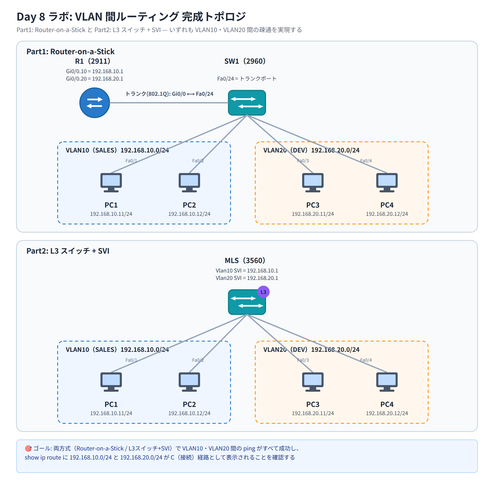

# Day 8 ラボ手順書: VLAN 間ルーティング — Router-on-a-Stick と L3 スイッチ + SVI

> 配置先: ドキュメント `02_ラボ手順書 > Week2 > Day08`
> 所要時間の目安: 2.5 時間 ／ 使用ツール: Cisco Packet Tracer 9.x

## ゴール

- Router-on-a-Stick 方式で、ルータのサブインターフェースを使って VLAN10・VLAN20
  間の疎通を実現できる
- L3 スイッチ + SVI 方式に置き換えて、同じ VLAN 間疎通を実現できる
- 両方式で全 PC 間の ping が成功し、`show ip route` 上に両 VLAN サブネットが
  接続経路（C）として現れることを確認できる

## 完成トポロジ



### IP アドレス表

| 機器 | インターフェース | IP アドレス | サブネットマスク | デフォルトゲートウェイ |
|---|---|---|---|---|
| R1（Part1） | Gi0/0.10 | 192.168.10.1 | 255.255.255.0 | — |
| R1（Part1） | Gi0/0.20 | 192.168.20.1 | 255.255.255.0 | — |
| MLS（Part2） | Vlan10（SVI） | 192.168.10.1 | 255.255.255.0 | — |
| MLS（Part2） | Vlan20（SVI） | 192.168.20.1 | 255.255.255.0 | — |
| PC1 | NIC | 192.168.10.11 | 255.255.255.0 | 192.168.10.1 |
| PC2 | NIC | 192.168.10.12 | 255.255.255.0 | 192.168.10.1 |
| PC3 | NIC | 192.168.20.11 | 255.255.255.0 | 192.168.20.1 |
| PC4 | NIC | 192.168.20.12 | 255.255.255.0 | 192.168.20.1 |

使用機器: Router 2911 x1、Switch 2960 x1（Part1 用の L2 スイッチ）、
Multilayer Switch 3560 x1（Part2 用の L3 スイッチ）、PC x4

---

## 手順 1: Part1 用トポロジの作成と VLAN 設定（20 分）

1. Packet Tracer で Router **2911**、Switch **2960**、PC を 4 台配置し、
   PC1・PC2 を SW1 の `Fa0/1`・`Fa0/2`、PC3・PC4 を `Fa0/3`・`Fa0/4` に
   ストレートケーブルで接続する
2. R1 の `GigabitEthernet0/0` と SW1 の `Fa0/24` をストレートケーブルで接続する
3. SW1 をクリックし [CLI] タブを開き、VLAN を作成する

   ```
   Switch> enable
   Switch# configure terminal
   Switch(config)# vlan 10
   Switch(config-vlan)# name SALES
   Switch(config-vlan)# exit
   Switch(config)# vlan 20
   Switch(config-vlan)# name DEV
   Switch(config-vlan)# exit
   ```

4. `interface range` を使って PC 収容ポートをアクセスポート化する

   ```
   Switch(config)# interface range fastethernet0/1-2
   Switch(config-if-range)# switchport mode access
   Switch(config-if-range)# switchport access vlan 10
   Switch(config-if-range)# exit
   Switch(config)# interface range fastethernet0/3-4
   Switch(config-if-range)# switchport mode access
   Switch(config-if-range)# switchport access vlan 20
   Switch(config-if-range)# exit
   ```

## 手順 2: トランクの設定と確認（15 分）

1. SW1 の `Fa0/24` をトランクにする

   ```
   Switch(config)# interface fastethernet0/24
   Switch(config-if)# switchport mode trunk
   Switch(config-if)# exit
   ```

2. 設定を確認する

   ```
   Switch# show vlan brief
   Switch# show interfaces trunk
   ```

3. `show vlan brief` で `Fa0/1-2` が VLAN10、`Fa0/3-4` が VLAN20 に、
   `show interfaces trunk` で `Fa0/24` がトランクとして表示されることを確認する

## 手順 3: ルータのサブインターフェース設定（30 分）

1. R1 の物理インターフェースを有効化する（**IP は付与しない**）

   ```
   Router> enable
   Router# configure terminal
   Router(config)# interface gigabitethernet0/0
   Router(config-if)# no shutdown
   Router(config-if)# exit
   ```

2. VLAN10 用のサブインターフェースを作成する。`encapsulation dot1q` を
   先に設定してから `ip address` を設定すること

   ```
   Router(config)# interface gigabitethernet0/0.10
   Router(config-subif)# encapsulation dot1q 10
   Router(config-subif)# ip address 192.168.10.1 255.255.255.0
   Router(config-subif)# exit
   ```

3. VLAN20 用のサブインターフェースも同様に作成する

   ```
   Router(config)# interface gigabitethernet0/0.20
   Router(config-subif)# encapsulation dot1q 20
   Router(config-subif)# ip address 192.168.20.1 255.255.255.0
   Router(config-subif)# exit
   ```

## 手順 4: PC の設定と疎通確認（30 分）

1. PC1〜PC4 の [Desktop] → [IP Configuration] で、IP アドレス表のとおりに
   IP アドレス・サブネットマスク・デフォルトゲートウェイを設定する
2. ファイルを保存する: `File > Save As` → `day08_氏名.pkt`
3. R1 で経路を確認する

   ```
   Router# show ip route
   ```

   `192.168.10.0/24` と `192.168.20.0/24` が **C（connected）** の経路として
   表示されることを確認する

4. PC1 の Command Prompt から、同一 VLAN・別 VLAN 双方に対して疎通を確認する

   ```
   ping 192.168.10.12
   ping 192.168.20.11
   tracert 192.168.20.11
   ```

5. `tracert` の結果で、宛先までの経路上に **R1（192.168.10.1 または
   192.168.20.1）が 1 ホップ目として現れる**ことを観察する

### Part1 観察ポイント（記録しておく）

- ping・tracert の結果（成功／ホップ数）
- `show ip route` に表示された 2 本の C 経路

## 手順 5: Part2 への移行 — L3 スイッチへの置き換え（20 分）

1. SW1（2960）をクリックして選択し、Delete キーを押して削除する（または右クリック
   → Delete）。代わりに **Multilayer Switch 3560** を配置する（R1 は今回使用しない
   ため配置したままで構わない）
2. PC1〜PC4 を MLS の `Fa0/1`〜`Fa0/4` に、Part1 と同じ割り当てで接続し直す
   （SW1 削除により切れたケーブルを、ストレートケーブルで MLS に接続し直す）
3. MLS をクリックし [CLI] タブを開き、VLAN を作成してアクセスポートを設定する

   ```
   Switch> enable
   Switch# configure terminal
   Switch(config)# vlan 10
   Switch(config-vlan)# name SALES
   Switch(config-vlan)# exit
   Switch(config)# vlan 20
   Switch(config-vlan)# name DEV
   Switch(config-vlan)# exit
   Switch(config)# interface range fastethernet0/1-2
   Switch(config-if-range)# switchport mode access
   Switch(config-if-range)# switchport access vlan 10
   Switch(config-if-range)# exit
   Switch(config)# interface range fastethernet0/3-4
   Switch(config-if-range)# switchport mode access
   Switch(config-if-range)# switchport access vlan 20
   Switch(config-if-range)# exit
   ```

## 手順 6: ip routing の有効化と SVI の設定（30 分）

1. グローバルコンフィギュレーションで `ip routing` を有効化する

   ```
   Switch(config)# ip routing
   ```

2. VLAN10 用の SVI を作成する

   ```
   Switch(config)# interface vlan 10
   Switch(config-if)# ip address 192.168.10.1 255.255.255.0
   Switch(config-if)# no shutdown
   Switch(config-if)# exit
   ```

3. VLAN20 用の SVI も同様に作成する

   ```
   Switch(config)# interface vlan 20
   Switch(config-if)# ip address 192.168.20.1 255.255.255.0
   Switch(config-if)# no shutdown
   Switch(config-if)# exit
   ```

4. SVI の状態と経路を確認する

   ```
   Switch# show ip interface brief
   Switch# show ip route
   ```

   `Vlan10`・`Vlan20` の Status/Protocol が両方とも **up/up** になっていること、
   `show ip route` に両サブネットが **C** として表示されていることを確認する

5. PC のデフォルトゲートウェイはそのまま（`192.168.10.1` / `192.168.20.1`）で、
   VLAN 間 ping を再実行する

   ```
   ping 192.168.20.11
   ```

## 手順 7: ip routing 無効化の検証（15 分）

1. MLS で一時的に `ip routing` を無効化する

   ```
   Switch(config)# no ip routing
   ```

2. PC1 から PC3 へ ping を実行し、**失敗する**ことを確認する（同一 VLAN 内の
   PC1 → PC2 の ping は成功したままであることも合わせて確認する）
3. 確認できたら、必ず `ip routing` を再度有効化しておく

   ```
   Switch(config)# ip routing
   ```

## 手順 8（発展）: ルーテッドポートの確認（10 分）

1. MLS の空きポート（例: `Fa0/23`）をルーテッドポート化する

   ```
   Switch(config)# interface fastethernet0/23
   Switch(config-if)# no switchport
   Switch(config-if)# ip address 192.168.99.1 255.255.255.252
   Switch(config-if)# no shutdown
   Switch(config-if)# exit
   ```

2. `show ip interface brief` を実行し、`Fa0/23` が SVI とは異なり**物理
   インターフェースに直接** IP アドレスを持っていることを確認する

### 観察レポート（コメント提出用）

以下 3 問に答えて、課題のコメントに記入してください。

1. Router-on-a-Stick 構成で、ルータの物理インターフェースに IP を付けず
   サブインターフェースに付けたのはなぜか。また 1 本のトランクリンクを
   全 VLAN が共有することの帯域上の制約を説明せよ。
2. Part2 で SVI（`interface vlan10`/`vlan20`）が up/up になるために必要な
   3 つの条件を挙げ、`ip routing` を無効化したときに VLAN 間 ping が
   どう変化したかを観察結果とともに述べよ。
3. Router-on-a-Stick と L3 スイッチ + SVI の `show ip route` 出力の違い
   （経路の出方・転送の仕組み）を比較し、性能・コスト・拡張性の観点で
   どちらをどの場面で選ぶべきかを論じよ。

## 手順 9: 提出（10 分）

1. `day08_氏名.pkt` を Backlog のラボ課題に**添付**する
   （Part1・Part2 いずれも構築した最終状態を保存すること）
2. 手順 4・手順 6・手順 7 の確認結果（スクリーンショット可）と観察レポートを
   課題の**コメント**に貼る
3. 課題の状態を「処理済み」に変更する

## うまくいかないとき

| 症状 | 確認すること |
|---|---|
| Part1 で VLAN 間 ping が失敗する | サブインターフェースの `encapsulation dot1q` の VLAN-ID、SW1 の Fa0/24 がトランクになっているか |
| Part1 で同一 VLAN 内も失敗する | SW1 のアクセスポート割り当て（`switchport access vlan`）、PC の IP/マスク |
| Part2 で SVI が down/down のまま | 対応する VLAN が `vlan` コマンドで作成済みか、その VLAN のポートが 1 つ以上 up しているか |
| Part2 で SVI は up/up だが VLAN 間 ping が失敗する | `ip routing` が有効になっているか（`show running-config` で確認） |
| ルーテッドポートで IP が付かない | `no switchport` を先に実行したか（アクセス/トランク設定が残っていると失敗する） |

30 分試して解決しない場合は、状況（スクリーンショット + 試したこと）を
課題のコメントに書いて質問してください。
