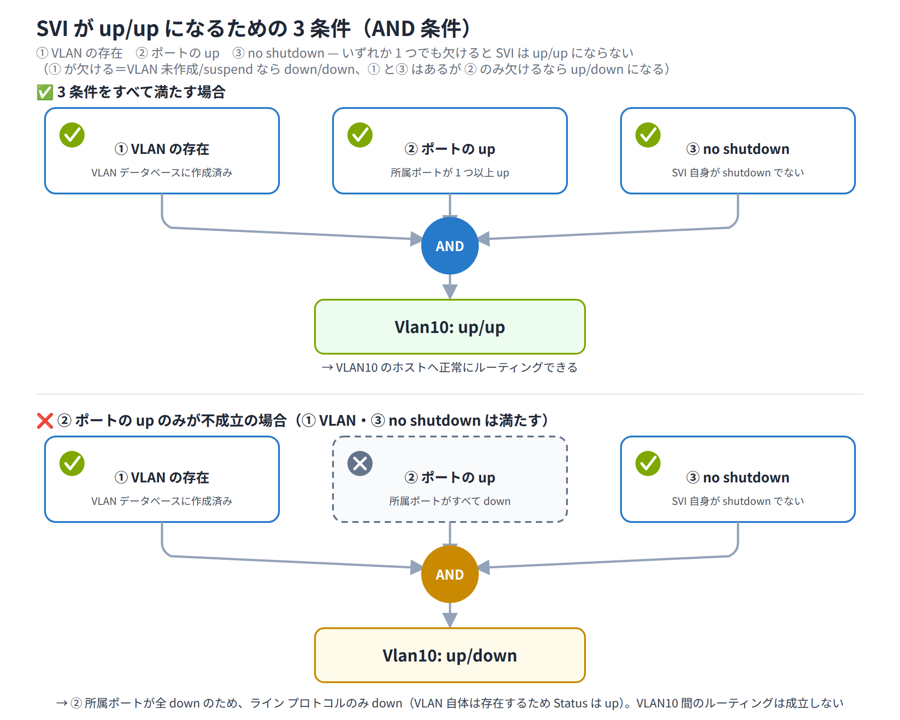

# Day 8 講義: VLAN 間ルーティング

> 配置先: ドキュメント `01_教材 > Week2 > Day08`
> 学習時間の目安: 3.5 時間 ／ 準拠: CCNA 200-301 v1.1 ドメイン 1・2

## 学習目標

この講義を終えると、次のことができるようになります。

1. VLAN 間で通信するために L3（ネットワーク層）機器が必要な理由を説明できる
2. Router-on-a-Stick（サブインターフェース + `encapsulation dot1q`）を設定できる
3. L3 スイッチで `ip routing` と SVI（Switch Virtual Interface）を設定できる
4. ルーテッドポートと SVI の違いを説明できる
5. VLAN 間ルーティングの各方式を比較し、状況に応じて選択できる
6. 確認コマンドの出力を読み、典型的な障害の原因を切り分けられる

---

## ウォームアップ（朝の想起クイズ）

> 教材を見ずに、まず自力で思い出してください（分散学習: Day 1「ネットワークの
> 全体像と OSI / TCP-IP モデル」 / Day 5「TCP / UDP・スイッチング動作・物理層」 /
> Day 7「トランクと VLAN 設計」 の範囲から出題）。

**W1.** OSI 参照モデルの第 3 層（ネットワーク層）は、TCP/IP モデルでは何層に
対応し、そこで使われる代表的なアドレスは何か。

**W2.** スイッチが宛先 MAC アドレスを MAC アドレステーブル上に見つけられなかった
とき、受信ポート以外の全ポートへフレームを転送する動作を何と呼ぶか。

**W3.** IEEE 802.1Q のタグで VLAN ID に割り当てられているビット数と、それにより
表現できる VLAN の理論上の最大数はいくつか。

<details><summary>解答</summary>

- W1: インターネット層。代表的なアドレスは IP アドレス。
- W2: フラッディング（unknown unicast flooding）。
- W3: 12 ビット。理論上 4096 個（0 と 4095 は予約のため実用上は 4094 個）。

</details>

## 1. VLAN 間ルーティングの必要性と全体像

Day 6・7 で学んだ VLAN（Virtual LAN、仮想 LAN）は、1 台の物理スイッチを複数の
**ブロードキャストドメイン**に分割する仕組みでした。ブロードキャストドメインが
分かれるということは、それぞれの VLAN が**独立した IP サブネット**になる、という
ことでもあります。

L2 スイッチは MAC アドレステーブルにもとづいてフレームを転送しますが、VLAN が
異なるとそもそも同じブロードキャストドメインに属さないため、**L2 スイッチだけでは
VLAN をまたいだ通信はできません**。VLAN10 の PC から VLAN20 の PC へ通信するには、
IP アドレスを見て転送先を判断できる **L3 機器**（ルータ、または L3 スイッチ）が
必ず必要になります。

各 VLAN が別サブネットである以上、VLAN ごとに**デフォルトゲートウェイ**（Week0 P5
で学んだとおり、そのサブネットの出入り口となる L3 機器側の IP アドレス）を用意する
必要があります。
PC 側では、自分が所属する VLAN のサブネットに合った IP アドレスとデフォルト
ゲートウェイが設定されていることが、VLAN 間通信が成立するための大前提です。

### VLAN 間ルーティングの 3 方式

| 方式 | 概要 |
|---|---|
| レガシー方式 | ルータの物理インターフェースを VLAN ごとに 1 本ずつ割り当てる |
| Router-on-a-Stick | ルータとスイッチを 1 本のトランクリンクで接続し、論理サブインターフェースを VLAN ごとに作る |
| L3 スイッチ + SVI | マルチレイヤスイッチ内部で、VLAN ごとの仮想インターフェース（SVI）にルーティングさせる |

レガシー方式は VLAN の数だけルータの物理ポートを消費するため、VLAN が増えると
すぐにポート不足になり非効率です。そのため現在の実務・試験では、
**Router-on-a-Stick** か **L3 スイッチ + SVI** のいずれかが使われます。

> **試験のポイント**: 各 VLAN は別サブネットであり、VLAN 間通信には L3 機器と
> 各 VLAN 用のデフォルトゲートウェイが必要である、という原則を問う問題が頻出です。

## 2. Router-on-a-Stick（サブインターフェースと encapsulation dot1q）

**Router-on-a-Stick**（ルータオンアスティック）は、ルータと L2 スイッチを
**1 本のトランクリンク**で接続し、ルータの物理インターフェース上に VLAN ごとの
**論理サブインターフェース**（1 本の物理インターフェースを、設定上は VLAN の数だけ
存在する独立したインターフェースであるかのように分割したもの）を作成して、それぞれに
デフォルトゲートウェイの IP アドレスを割り当てる方式です。1 本の「棒（stick）」に
ルータがぶら下がっているように見えることから、この名前が付いています。

スイッチ側の接続ポートは `switchport mode trunk` でトランクにします。ルータは
DTP（Dynamic Trunking Protocol）を話さないため、スイッチ側だけを自動ネゴシエーション
に任せることはできず、**手動でトランクに固定**しておく必要があります。

> **注意（機種による違い）**: 2960 のような dot1q 専用スイッチではこのまま
> `switchport mode trunk` を実行すれば問題ありませんが、ISL もサポートする
> 機種（Catalyst 3560/3650 など）ではポートの trunk encapsulation が既定で
> `negotiate`（auto）になっており、`switchport mode trunk` がそのまま拒否
> されることがあります（`Command rejected: An interface whose trunk
> encapsulation is Auto can not be configured to trunk mode` というエラー）。
> その場合は先に `switchport trunk encapsulation dot1q` を実行してから
> `switchport mode trunk` を設定します。「トランクモードにできない原因は？」
> という形で本試験にも出題されるため、押さえておきましょう。

### サブインターフェースの作成

サブインターフェースは、物理インターフェース名の後ろにピリオドと番号を付けて
作成します。番号は自由に選べますが、慣習的に**対応する VLAN 番号に合わせる**と
管理しやすくなります（必須ではありません）。

```
Router(config)# interface gigabitethernet0/0.10
Router(config-subif)# encapsulation dot1q 10
Router(config-subif)# ip address 192.168.10.1 255.255.255.0
```

ここで重要なのが**設定順序**です。サブインターフェースでは、先に
`encapsulation dot1q <VLAN-ID>` で「このサブインターフェースがどの VLAN の
タグ付きフレームを扱うか」を宣言してから、`ip address` を割り当てます。
`encapsulation` を設定する前に `ip address` を入力しようとしても、
サブインターフェースがまだ VLAN に紐付いていないため意図通りに機能しません。

各サブインターフェースに割り当てた IP アドレスが、そのまま**その VLAN の
デフォルトゲートウェイ**になります。

```
Router(config)# interface gigabitethernet0/0.20
Router(config-subif)# encapsulation dot1q 20
Router(config-subif)# ip address 192.168.20.1 255.255.255.0
```

### 物理インターフェースの扱い

物理インターフェース自体には、通常 IP アドレスを付与しません。トランクリンクを
アップさせるために `no shutdown` だけを行います。

```
Router(config)# interface gigabitethernet0/0
Router(config-if)# no shutdown
```

物理インターフェースが down すると、その上に乗っているサブインターフェースは
**すべて道連れで down** します。物理層に障害が出た場合は全 VLAN の通信が
同時に止まる、という点は覚えておいてください。

### ネイティブ VLAN の扱い

トランクには、タグを付けずに送受信する**ネイティブ VLAN**という特別な VLAN が
あります（Day 7 参照）。ネイティブ VLAN 用のサブインターフェースを設定する場合は、
`encapsulation dot1q <VLAN-ID> native` のように `native` キーワードを付けます。

```
Router(config-subif)# encapsulation dot1q 1 native
```

トランクの両端でネイティブ VLAN が一致していないと、タグなしフレームの解釈が
食い違い、通信不良や VLAN リーク（本来届かないはずの VLAN にフレームが漏れる
現象）の原因になります。

### 帯域上の制約

Router-on-a-Stick は、**全 VLAN のトラフィックが 1 本の物理リンクを共有**します。
1 本のリンクが単位時間あたりに運べるデータ量（帯域）には上限があるため、VLAN が
増えて通信量（トラフィック）が増えるほど、このリンクが**ボトルネック**（処理や
通信が集中して詰まる箇所）になりやすいという弱点があります。

> 💼 **実務では**: Router-on-a-Stick を採用するかどうかは構築側の設計判断であり、
> 保守担当として着任した現場でこの構成を選び直す・組み替えるといった場面は
> まずありません。保守側の出番は、「特定のトランクリンクの帯域使用率が高い」
> 「1 本のリンク障害で複数 VLAN が同時にダウンした」といった監視アラートを
> 最初に受け取ったときで、`show interfaces` の入出力レートやエラーカウンタを
> 見て状況を切り分け、手順書に定められた閾値・エスカレーション基準に沿って
> 一次対応・報告を行うのが実際の役割です。構成そのものを見直す提案ができる
> ようになるのは、こうした切り分けと報告を積み重ねて信頼を得たあと、
> 構築側の仕事として関わるようになってからです。

> **試験のポイント**: サブインターフェースでは `encapsulation dot1q <ID>` を
> 先に設定してから `ip address` を付ける、という設定順序が頻出です。ネイティブ
> VLAN 用には `encapsulation dot1q <ID> native` を使うことも押さえておきましょう。

## 3. L3 スイッチと SVI（Switch Virtual Interface）

マルチレイヤスイッチ（L3 スイッチ、L2 のスイッチング機能に L3 のルーティング
機能を加えたスイッチ）を使うと、1 台の機器の中で VLAN 間ルーティングを完結
できます。

### ip routing の有効化

L3 スイッチは、初期状態では L2 スイッチとしてしか動作しません。VLAN 間を
ルーティングさせるには、グローバルコンフィギュレーションモードで
**`ip routing`** を有効化する必要があります。

```
Switch(config)# ip routing
```

この 1 行を設定し忘れると、SVI（後述）を作成して IP アドレスを付けても
VLAN 間の通信ができません。実機・試験の両方で非常によく見落とされる
落とし穴です。

### SVI の作成

**SVI**（Switch Virtual Interface）は、VLAN ごとに作成する**論理インターフェース**
です。`interface vlan <VLAN-ID>` で作成し、IP アドレスを割り当てます。

```
Switch(config)# interface vlan 10
Switch(config-if)# ip address 192.168.10.1 255.255.255.0
Switch(config-if)# no shutdown
```

```
Switch(config)# interface vlan 20
Switch(config-if)# ip address 192.168.20.1 255.255.255.0
Switch(config-if)# no shutdown
```

SVI に割り当てた IP アドレスが、その VLAN の**デフォルトゲートウェイ**になります。

### SVI が up/up になる 3 条件

ここが今日の山場です。時間をかけて構いません。

SVI はサブインターフェースと違って物理リンクの上に直接乗っているわけではないため、
「なぜ up にならないのか」がわかりにくいポイントです。SVI が up/up になるには、
次の 3 条件がすべて満たされている必要があります。

| 条件 | 内容 |
|---|---|
| ① VLAN の存在 | 対応する VLAN が VLAN データベースに作成済みであること |
| ② ポートの up | その VLAN に所属するポートが 1 つ以上 up していること（アクセスポートに限らず、その VLAN を許可した up 状態のトランクポートでも条件を満たします） |
| ③ no shutdown | SVI 自身が管理上 shutdown されていないこと |

いずれか 1 つでも欠けると SVI は down のままになり、その VLAN 宛のルーティングが
成立しません。



> **試験のポイント**: SVI が up/up になる 3 条件（VLAN 存在・所属ポート up・
> no shutdown）は頻出です。あわせて `ip routing` の有効化が必須であることも
> セットで覚えましょう。

### ハードウェアスイッチングの利点

L3 スイッチの VLAN 間転送は、Week0 P1 で学んだ **CPU** によるソフトウェア処理では
なく、**ASIC**（Application Specific Integrated Circuit、特定の処理専用に設計
された集積回路）による**ハードウェアスイッチング**で行われます。そのため、
Router-on-a-Stick のような「1 本のリンクに全 VLAN が集中する」ボトルネックが
発生しにくく、高速・高**スループット**（単位時間あたりに実際に転送できるデータ量）
な転送が可能です。

### 経路の確認

`show ip route` を実行すると、各 SVI のサブネットが**直接接続（C: connected）**
の経路として表示されます。

```
Switch# show ip route
...
C    192.168.10.0/24 is directly connected, Vlan10
C    192.168.20.0/24 is directly connected, Vlan20
```

> 💼 **実務では**: `show ip route` に自分の VLAN の C（直接接続）経路が並んで
> いるかを確認するのは、保守現場で「どこまでは生きていて、どこから壊れて
> いるか」を切り分ける基本動作です。「GW への ping は通るのに他 VLAN とだけ
> 疎通しない」という一次切り分けまでは自分で対応する範囲ですが、
> `show running-config | include ip routing` で `ip routing` の未設定が
> 原因だと分かっても、客先環境の設定はその場で勝手に変更してよいものでは
> なく、手順書・変更申請の枠組みに沿うのが原則です。切り分け結果を正確に
> まとめて先輩やエスカレーション先に報告し、対応可否の判断を仰ぎましょう。
> HSRP/VRRP による SVI 冗長化のような構成変更まで踏み込む仕事は、保守での
> 切り分け精度が評価されて構築へステップアップしてから任されるようになります。

## 4. ルーテッドポート（Routed Port）

L3 スイッチの物理ポートに対して **`no switchport`** を実行すると、そのポートは
VLAN に所属しない、純粋な**ルーテッドポート**（Routed Port）になります。

```
Switch(config)# interface fastethernet0/23
Switch(config-if)# no switchport
Switch(config-if)# ip address 192.168.99.1 255.255.255.252
Switch(config-if)# no shutdown
```

ルーテッドポートには、SVI のように VLAN を介さず**物理ポートそのものに直接
IP アドレス**を割り当てられます。これはルータの物理インターフェースと同じ
感覚で扱える、という意味です。

**SVI との違い**を整理すると次のとおりです。

| 項目 | SVI | ルーテッドポート |
|---|---|---|
| 種別 | 論理インターフェース（VLAN 単位） | 物理インターフェース単位 |
| 主な用途 | VLAN 内の端末を収容するゲートウェイ | スイッチ間・ルータとの point-to-point な L3 直結リンク |
| 作成コマンド | `interface vlan <ID>` | 物理 IF で `no switchport` |

ルーテッドポートは、VLAN をまたがせる必要のない、機器同士を 1 対 1 で直結する
リンク（例: L3 スイッチ間のアップリンク）で使うのが典型的です。ルーテッドポート
を含め、L3 スイッチで VLAN 間・機器間のルーティングを行うには、ここでも
`ip routing` の有効化が前提になります。

> **試験のポイント**: `no switchport` でスイッチポートをルーテッドポート化し
> 物理インターフェースに IP を付ける操作と、SVI（論理インターフェース）との
> 違いは頻出です。

## 5. 方式の比較と選択

ここまで見た方式を、コスト・性能・拡張性の観点で比較します。

| 方式 | コスト | スループット | 特徴 |
|---|---|---|---|
| レガシー方式 | 低〜中 | 低 | VLAN ごとに物理 IF が必要でポート効率が悪い（比較の基準として理解） |
| Router-on-a-Stick | 低（既存ルータ + L2 スイッチで実現） | 中（単一リンクがボトルネック） | 設定がわかりやすく小規模向け |
| L3 スイッチ + SVI | 高（機器コスト） | 高（ハードウェア転送） | VLAN 増設も容易で企業の社内標準構成 |

判断軸は「**規模・必要スループット・コスト・拡張性**」です。将来的なトラフィック
の増加や VLAN の増設を見込む場合は、L3 スイッチのほうが有利になります。小規模な
検証環境や、既存のルータを流用したい場合は Router-on-a-Stick が適しています。

L3 スイッチを使う場合の使い分けとしては、**端末を収容する VLAN のデフォルト
ゲートウェイには SVI**、**機器間の L3 直結リンクにはルーテッドポート**、という
組み合わせが一般的です。

> **試験のポイント**: Router-on-a-Stick（単一リンクのボトルネック）と L3 スイッチ
> （ハードウェア転送）の方式比較・選択基準は頻出です。

## 6. 確認コマンドとトラブルシューティング

### 構成確認の基本コマンド

| コマンド | 確認できること |
|---|---|
| `show vlan brief` | VLAN の一覧と、各 VLAN に所属するポート |
| `show interfaces trunk` | トランクになっているポート、許可 VLAN、ネイティブ VLAN |
| `show ip interface brief` | 各インターフェースの IP アドレスと状態（up/down） |
| `show ip route` | 各 VLAN サブネットが接続経路（C）として載っているか |

> **注意**: トランクに設定したポート（例: Fa0/24）は `show vlan brief` の
> どの VLAN 行にも表示されません（表示されるのはアクセスポートに割り当てられた
> ポートのみです）。トランクの状態を確認したいときは `show interfaces trunk`
> を使う、と覚えておきましょう。exhibit の読解問題として本試験にも出題されます。

### 典型的な障害パターン

**Router-on-a-Stick 側**

- サブインターフェースに `encapsulation dot1q` を設定し忘れている、または
  VLAN-ID を間違えている
- スイッチ側の接続ポートがトランクになっていない（アクセスポートのまま）
- 両端のネイティブ VLAN が一致していない

**L3 スイッチ側**

- グローバルコンフィギュレーションで `ip routing` を有効化していない
- SVI に対応する VLAN が VLAN データベースに存在しない、またはそのポートが
  1 つも up していないため SVI が down のまま
- SVI に `no shutdown` を入れ忘れている

**エンドポイント側**

- PC のデフォルトゲートウェイが未設定、または誤った IP を指している
- PC の IP アドレス・サブネットマスクが所属 VLAN のサブネットと一致していない

### 切り分けの順序

障害の切り分けは、**L2 から L3 へ段階的**に確認していくのが基本です。

1. **同一 VLAN 内の疎通**を確認する（L2 レベルの問題を切り分け）
2. **自分のデフォルトゲートウェイへの ping** を確認する（L3 機器側の設定を切り分け）
3. **他 VLAN の PC への ping** を確認する（VLAN 間ルーティングそのものを確認）

この順序で確認すれば、「どこまでは正常で、どこから壊れているか」を効率よく
特定できます。

> **試験のポイント**: `show ip route` / `show vlan brief` / `show interfaces trunk`
> といった確認コマンドの出力読解は頻出です。障害の原因（encapsulation 漏れ・
> トランク未設定・ip routing 未有効・GW 誤設定）と合わせて覚えておきましょう。

## 7. まとめ

- VLAN は別々のブロードキャストドメイン＝別々のサブネットであり、VLAN 間通信には
  L3 機器と各 VLAN 用のデフォルトゲートウェイが必要
- Router-on-a-Stick は 1 本のトランクリンク上にサブインターフェースを作り、
  `encapsulation dot1q <ID>` を先に設定してから `ip address` を割り当てる
- L3 スイッチでは `ip routing` の有効化が必須で、SVI（`interface vlan`）が
  各 VLAN のデフォルトゲートウェイになる
- SVI が up/up になるには「VLAN の存在・所属ポートの up・no shutdown」の
  3 条件が必要
- ルーテッドポート（`no switchport`）は物理 IF に直接 IP を持たせる方式で、
  SVI とは論理／物理の違いがある
- 方式選択はコスト・スループット・拡張性で判断し、企業の社内標準は
  L3 スイッチ + SVI

---

## 確認問題（自己チェック・解答は末尾）

1. VLAN10 と VLAN20 の PC が直接 L2 スイッチだけを介して通信できない理由を説明せよ。
2. Router-on-a-Stick のサブインターフェースで、`ip address` より先に設定すべき
   コマンドは何か。
3. L3 スイッチで VLAN 間ルーティングを有効化するために、グローバル
   コンフィギュレーションで入力する 1 行のコマンドは何か。
4. SVI が up/up になるための 3 条件を挙げよ。
5. `no switchport` を実行した物理ポートは何と呼ばれ、SVI と何が違うか。

<details><summary>解答</summary>

1. VLAN10 と VLAN20 はそれぞれ独立したブロードキャストドメイン（別サブネット）
   であり、L2 スイッチは MAC アドレスをもとにしか転送できず IP アドレスを
   見て別サブネットへ転送する判断ができないため。VLAN 間通信には L3 機器が必要。
2. `encapsulation dot1q <VLAN-ID>`（ネイティブ VLAN の場合は
   `encapsulation dot1q <VLAN-ID> native`）
3. `ip routing`
4. ① 対応する VLAN が VLAN データベースに存在する、② その VLAN に所属するポートが
   1 つ以上 up している（アクセスポートに限らず、そのVLANを許可した up 状態の
   トランクポートでも可）、③ SVI 自身が `no shutdown` されている
5. ルーテッドポートと呼ばれる。SVI は VLAN 単位の論理インターフェースだが、
   ルーテッドポートは物理インターフェースそのものに直接 IP アドレスを割り当てる
   点が異なる。

</details>

## 次のステップ

本日のラボ課題「[Day08] ラボ: VLAN 間ルーティング — Router-on-a-Stick と
L3 スイッチ + SVI」に進み、Router-on-a-Stick と L3 スイッチの両方式で
VLAN10・VLAN20 間の疎通を実際に構築・比較してください。
