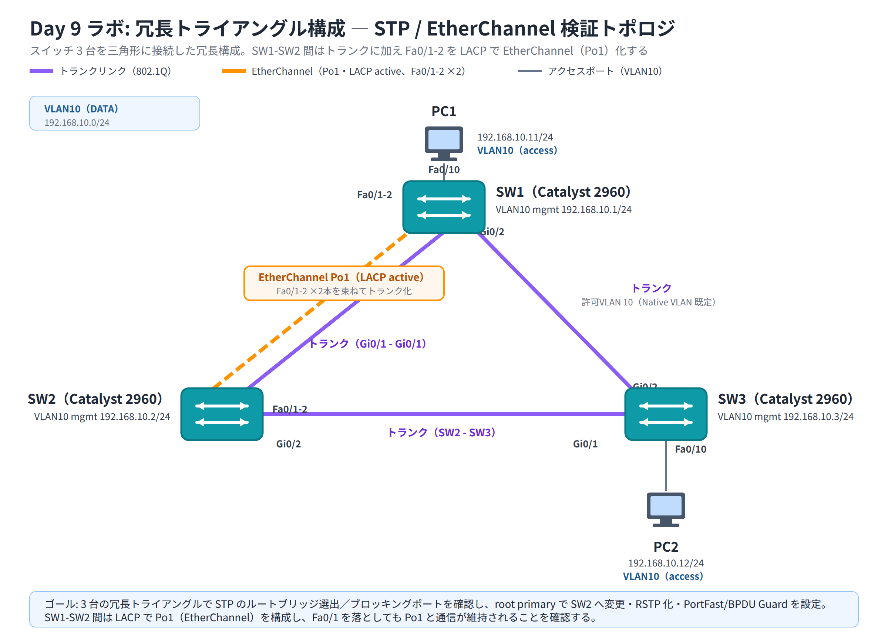

# Day 9 ラボ手順書: STP の動作観察とルートブリッジの変更、EtherChannel の構成

> 配置先: ドキュメント `02_ラボ手順書 > Week2 > Day09`
> 所要時間の目安: 2.5 時間 ／ 使用ツール: Cisco Packet Tracer 9.x

## ゴール

- スイッチ 3 台による冗長トライアングル構成で、STP のルートブリッジ選出結果と
  各ポートのロール・ステートを `show spanning-tree` から読み取れる
- ブロッキングされているポートを特定し、その理由を BID にもとづいて説明できる
- コマンドでルートブリッジを意図したスイッチへ変更し、ポートロールが
  再計算されることを確認できる
- RSTP（Rapid-PVST）へ切り替え、PortFast / BPDU Guard を端末ポートに設定できる
- LACP で 2 台のスイッチ間の物理リンクを EtherChannel（Port-channel）として束ね、
  帯域集約と冗長性を確認できる

## 完成トポロジ



SW1 ⇔ SW2 間は上記の Gi0/1-Gi0/1 トランクに加えて、Fa0/1-2 ⇔ Fa0/1-2 を
LACP で EtherChannel 化（Port-channel 1、トランク）します（図には表現しきれ
ないため、下記の結線一覧で確認してください）。

> 上図は概略図です。各リンクの正確な両端ポートは、必ず下記の結線一覧を
> 正として配線してください。

- **SW1 ⇔ SW2**: Gi0/1 - Gi0/1（トランク）／ Fa0/1-2 ⇔ Fa0/1-2 を LACP で
  EtherChannel 化（Port-channel 1、トランク）
- **SW2 ⇔ SW3**: Gi0/2 - Gi0/1（トランク）
- **SW3 ⇔ SW1**: Gi0/2 - Gi0/2（トランク）
- **PC1 ⇔ SW1**: Fa0/10（VLAN10、アクセスポート）
- **PC2 ⇔ SW3**: Fa0/10（VLAN10、アクセスポート）

### IP アドレス表

| 機器 | インタフェース | IP アドレス | サブネットマスク |
|---|---|---|---|
| PC1 | NIC | 192.168.10.11 | 255.255.255.0 |
| PC2 | NIC | 192.168.10.12 | 255.255.255.0 |
| SW1 | VLAN10（管理用・任意） | 192.168.10.1 | 255.255.255.0 |
| SW2 | VLAN10（管理用・任意） | 192.168.10.2 | 255.255.255.0 |
| SW3 | VLAN10（管理用・任意） | 192.168.10.3 | 255.255.255.0 |

> 使用機器: Switch 2960 × 3、PC × 2。SW1・SW2・SW3 を三角形に相互接続する
> 3 本のリンクに加え、SW1-SW2 間には EtherChannel 用の Fa0/1-2 の 2 本を
> 別途接続します。

---

## 手順 1: 基本設定と VLAN の作成（20 分）

1. Packet Tracer で Switch 2960 を 3 台、PC を 2 台配置し、トポロジ図のとおりに
   接続する。**PC ⇔ スイッチ間はストレートケーブル**、**スイッチ ⇔ スイッチ間は
   クロスオーバーケーブル**を使用する（同種機器同士の接続のため）。Packet Tracer
   では自動判別の "Automatically Choose Connection Type"（稲妻アイコン）を
   使ってもよい
   - Gi0/1・Gi0/2 同士、Fa0/1・Fa0/2 同士の接続を間違えないよう注意する
2. 各スイッチに hostname を設定する

   ```
   Switch(config)# hostname SW1
   ```

   （SW2、SW3 も同様）

3. 各スイッチで VLAN10 を作成する

   ```
   SW1(config)# vlan 10
   SW1(config-vlan)# name DATA
   SW1(config-vlan)# exit
   ```

4. SW1 の Fa0/10、SW3 の Fa0/10 をアクセスポートとして VLAN10 に割り当てる

   ```
   SW1(config)# interface fastEthernet 0/10
   SW1(config-if)# switchport mode access
   SW1(config-if)# switchport access vlan 10
   ```

5. PC1・PC2 に IP アドレス表のとおり IP アドレスを設定する

## 手順 2: トランクの設定と疎通確認（20 分）

1. スイッチ間の 3 本のリンク（SW1-SW2 の Gi0/1、SW2-SW3 の Gi0/2-Gi0/1、
   SW3-SW1 の Gi0/2）をすべてトランクポートに設定する

   ```
   SW1(config)# interface gigabitEthernet 0/1
   SW1(config-if)# switchport mode trunk
   ```

   （他のスイッチ・インタフェースも同様に設定する。この時点では EtherChannel
   用の Fa0/1-2 はまだ設定しない）

2. PC1 から PC2 への疎通を確認する

   ```
   PC> ping 192.168.10.12
   ```

3. **確認**: `Reply from 192.168.10.12 ...` が返ること。初回は STP の収束待ちで
   タイムアウトすることがあるため、時間を置いて再実行する

## 手順 3: デフォルト状態の STP を観察する（25 分）

1. 各スイッチで VLAN10 の STP 状態を確認する

   ```
   SW1# show spanning-tree vlan 10
   ```

2. 出力の **Root ID** と **Bridge ID** を 3 台とも記録し、次を確認する
   - どのスイッチの Bridge ID が Root ID と一致しているか（＝ルートブリッジ）
   - 各スイッチの各ポートの **Role**（Root / Desg / Altn）と **Sts**（ステート）
3. 3 台のうち、非ルートブリッジのスイッチでは 1 つのポートが **Blocking**
   （802.1D）または **Altn/Discarding**（RSTP 表記）になっているはずである。
   どのスイッチのどのポートがブロッキングされているか記録する
4. 記録した Bridge ID を比較し、最も小さい MAC アドレスを持つスイッチが
   デフォルトでルートブリッジになっていることを確認する
   （プライオリティは全スイッチとも既定の 32768 + VLAN ID のため同値）

## 手順 4: ルートブリッジを SW2 へ変更する（20 分）

1. SW2 で、VLAN10 のルートブリッジを SW2 に変更する

   ```
   SW2(config)# spanning-tree vlan 10 root primary
   ```

2. 3 台すべてで再度 `show spanning-tree vlan 10` を実行し、次を確認する
   - Root ID が SW2 の Bridge ID に変わっていること
   - 各スイッチのポートロールが再計算され、ブロッキングされるポートが
     手順 3 とは変わっている可能性があること
3. Root ID・各ポートの Role・ブロッキングされているポートを記録する

## 手順 5: RSTP への切り替え（15 分）

1. 3 台すべてで STP の動作モードを Rapid-PVST に変更する

   ```
   SW1(config)# spanning-tree mode rapid-pvst
   ```

2. `show spanning-tree vlan 10` を再実行し、次を確認する
   - ポートステートの表記が Discarding / Learning / Forwarding になっていること
   - ブロッキングされていたポートが **Altn**（Alternate）ロールとして
     表示されるようになっていること

## 手順 6: PortFast と BPDU Guard の設定（15 分）

1. PC が接続されている SW1 Fa0/10、SW3 Fa0/10 に PortFast と BPDU Guard を設定する

   ```
   SW1(config)# interface fastEthernet 0/10
   SW1(config-if)# spanning-tree portfast
   SW1(config-if)# spanning-tree bpduguard enable
   ```

   （SW3 の Fa0/10 も同様に設定する）

2. 設定を確認する

   ```
   SW1# show spanning-tree interface fastEthernet 0/10 detail
   ```

3. **確認**: 対象ポートが Edge ポートとして扱われ、即座に Forwarding
   ステートになっていること

## 手順 7: LACP による EtherChannel の構成（30 分）

1. SW1 で Fa0/1-2 を EtherChannel（Port-channel 1）にまとめ、LACP を active
   モードで有効化する

   ```
   SW1(config)# interface range fastEthernet 0/1-2
   SW1(config-if-range)# channel-group 1 mode active
   ```

2. SW2 側でも同様に、対応する Fa0/1-2 を同じチャネル番号・active モードで
   設定する

   ```
   SW2(config)# interface range fastEthernet 0/1-2
   SW2(config-if-range)# channel-group 1 mode active
   ```

3. 両スイッチの論理インタフェース `Port-channel 1` をトランクポートとして
   設定する

   ```
   SW1(config)# interface port-channel 1
   SW1(config-if)# switchport mode trunk
   ```

   （SW2 の Port-channel 1 も同様に設定する）

4. バンドル状態を確認する

   ```
   SW1# show etherchannel summary
   ```

5. **確認**: `Po1` の行が `(SU)`、メンバーである Fa0/1・Fa0/2 の行が `(P)`
   と表示されていること

## 手順 8: STP から見た EtherChannel の確認（15 分）

1. `show spanning-tree vlan 10` を SW1・SW2 で実行し、Port-channel 1（Po1）が
   **1 つの論理ポート**として STP に扱われていることを確認する
   （Fa0/1・Fa0/2 が個別にブロッキングされていないこと）

## 手順 9: リンク障害時の挙動確認（10 分）

1. SW1 の Fa0/1 を shutdown する

   ```
   SW1(config)# interface fastEthernet 0/1
   SW1(config-if)# shutdown
   ```

2. PC1 から PC2 へ ping を実行し、通信が維持されていることを確認する
3. `show etherchannel summary` を再実行し、Po1 のメンバーが 1 本に縮退しても
   バンドル自体は `(SU)` のまま維持されていることを確認する
4. 確認後、Fa0/1 を `no shutdown` で復旧する

### 観察レポート（コメント提出用）

以下 3 問に答えて、課題のコメントに記入してください。

1. 手順 3〜4 で観察したデフォルト状態のルートブリッジはどのスイッチでしたか。
   その根拠（BID の比較）と、Blocking になっていたポートを答えてください。
2. 手順 4 で `root primary` を実行した後、ルートブリッジとブロッキングポートは
   どう変化しましたか。ポートロールが再計算された理由もあわせて説明してください。
3. 手順 7〜9 で、`show etherchannel summary` のフラグ（P / SU）は何を示していましたか。
   また、物理リンクを 1 本落としても通信が維持できた理由を、EtherChannel と STP の
   観点から説明してください。

## 提出方法

1. ファイルを `day09_氏名.pkt` の名前で保存する（例: `day09_山田太郎.pkt`）
2. Backlog のラボ課題に `.pkt` ファイルを**添付**する
3. 手順 3・4・7・9 で記録した `show spanning-tree` / `show etherchannel summary`
   の出力（スクリーンショット可）と、上記の観察レポートを課題の**コメント**に貼る
4. 課題の状態を「処理済み」に変更する

## うまくいかないとき

| 症状 | 確認すること |
|---|---|
| PC1-PC2 間で ping が通らない | 3 本のトランクリンクの `switchport mode trunk` 設定漏れ、VLAN10 の作成漏れ、アクセスポートの VLAN 割り当てミス |
| ルートブリッジが想定と違う | `root primary` を実行したスイッチ・VLAN 番号の指定を間違えていないか。`show spanning-tree vlan 10` で Bridge ID を再確認する |
| `channel-group` を投入すると片側のポートが err-disable になる | SW1・SW2 双方の speed / duplex / トランク設定・許可 VLAN が一致しているか確認する |
| `show etherchannel summary` で `(P)` にならず個別ポートのまま | 両スイッチのモードが `active`（または `passive` との組み合わせ）になっているか、`on` と `active` を混在させていないか確認する |
| PortFast を設定したポートがすぐ err-disable になる | そのポートにスイッチ・ハブなど BPDU を送出する機器が接続されていないか確認する（BPDU Guard が正しく動作している証拠でもある） |

30 分試して解決しない場合は、状況（スクリーンショット + 試したこと）を
課題のコメントに書いて質問してください。
