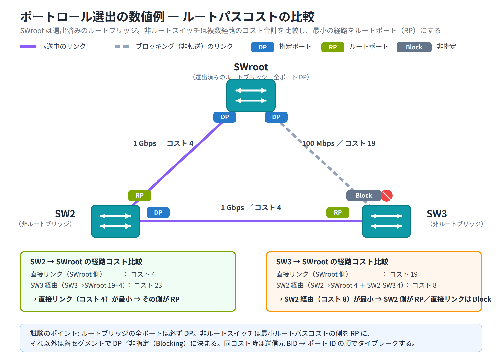

# Day 9 講義: STP と EtherChannel

> 配置先: ドキュメント `01_教材 > Week2 > Day09`
> 学習時間の目安: 3.5 時間 ／ 準拠: CCNA 200-301 v1.1 ドメイン 2

## 学習目標

この講義を終えると、次のことができるようになります。

1. 冗長化されたレイヤ 2 トポロジでブリッジングループが発生する仕組みと、その 3 つの症状を説明できる
2. BID（Bridge ID）の構成要素と、ルートブリッジ選出の手順（タイブレーク順序）を説明できる
3. ポートロール（ルートポート・指定ポート・非指定ポート）とポートステートの遷移、STP の各種タイマを説明できる
4. RSTP（802.1w）が高速収束を実現する仕組みと、PortFast・BPDU Guard の役割を説明できる
5. EtherChannel の目的と、LACP・PAgP・静的モードの違い、`show etherchannel summary` の出力を読み取れる

---

## ウォームアップ（朝の想起クイズ）

> 教材を見ずに、まず自力で思い出してください（分散学習: Day 2「Cisco IOS の基本操作とデバイス初期設定」 / Day 6「VLAN の基礎」 / Day 8「VLAN 間ルーティング」 の範囲から出題）。

**W1.** running-config（実行コンフィグレーション）の内容を、再起動しても消えない
startup-config（NVRAM）に保存するコマンドは何ですか。

**W2.** 1 本の物理リンクで複数 VLAN のフレームを伝送できるようにするポートモードの
名称と、そのタグ付けを規定する IEEE 標準規格の番号は何ですか。

**W3.** Router on a Stick 構成で、ルータのサブインタフェースに特定の VLAN（例: VLAN20）
のタグを紐付けるために使うコマンドは何ですか。

<details><summary>解答</summary>

W1. `copy running-config startup-config`（`write memory` でも可）
W2. トランクポート／IEEE 802.1Q
W3. `encapsulation dot1Q 20`

</details>

---

## 1. ブリッジングループと STP の必要性

### なぜ冗長リンクが問題になるのか

ネットワークの可用性（アベイラビリティ）を高めるために、スイッチ間には**冗長リンク**
（複数の物理経路）を用意するのが一般的です。1 本のリンクが故障しても、もう 1 本の
リンクで通信を継続できるからです。

しかし、複数のスイッチをループ状（三角形やメッシュ）に接続すると、レイヤ 2 の世界
では大きな問題が起こります。IP パケットには **TTL（Time To Live）** というフィールドが
あり、ルータを通過するたびに減算されて 0 になると破棄されるため、IP レベルのループは
自然に収束します。ところが**イーサネットフレームのヘッダには TTL に相当する仕組みが
存在しません**。そのため、ループ状のトポロジにブロードキャストフレームなどが入り込むと、
スイッチ間を無限に転送され続けてしまいます。

この「論理的にループのないツリー構造」を、冗長な物理トポロジの上に自動的に作り出す
プロトコルが **STP（Spanning Tree Protocol、IEEE 802.1D）** です。

### ブリッジングループが引き起こす 3 つの症状

| 症状 | 内容 |
|---|---|
| **ブロードキャストストーム** | **BUM フレーム**（Broadcast / Unknown unicast / Multicast の頭文字。宛先が全体・不明・複数のフレーム）がループを回り続け、複製されながら帯域を急速に飽和させる現象 |
| **MAC アドレステーブルの不安定化（フラッピング）** | 同じ送信元 MAC アドレスを持つフレームが複数のポートから届き続け、MAC アドレステーブルの学習内容が短時間で何度も書き換わる |
| **多重フレーム配送** | 同じフレームの複製が複数の経路を通って宛先に届き、受信側が同じデータを何度も受け取ってしまう |

これら 3 つはいずれも深刻な障害で、最悪の場合ネットワーク全体が数秒〜数分で
使用不能になります。

### STP の目的

STP の目的は、**物理的には冗長（ループを含む）なトポロジの上に、論理的にはループの
ない 1 本のツリー構造を作ること**です。具体的には、ループの原因となる冗長ポートの
一部を一時的に**ブロッキング**状態にしてフレームの転送を止め、待機させます。

障害（リンクダウンなど）が発生した場合には、ブロックしていたポートを自動的に
昇格させて新しい経路を有効にし、通信を復旧させます。この動作を**フェイルオーバー**
と呼びます。つまり STP は「普段はループを断ち切り、必要なときだけ迂回路を開く」
仕組みだと理解してください。

> **試験のポイント**: イーサネットフレームには TTL がないため、レイヤ 2 ループは
> IP のように自然消滅しない、という点を理由として問う問題が出題されます。

## 2. ルートブリッジ選出と BID / ブリッジプライオリティ

STP はまず、ツリーの根（基準点）となる 1 台のスイッチ ―― **ルートブリッジ** ――
を選出するところから始まります。すべてのスイッチは、ルートブリッジからの距離を
基準にして、自分のポートの役割を決めていきます。

### BID（Bridge ID）

ルートブリッジの選出には **BID（Bridge ID）** という 8 バイトの値を使います。

```
BID（8バイト）= ブリッジプライオリティ（2バイト）+ MACアドレス（6バイト）
```

- **ブリッジプライオリティ**: 管理者が設定できる優先度の値。デフォルトは **32768**
- **MAC アドレス**: そのスイッチ（バックプレーン）が持つ MAC アドレス

Cisco の PVST+（VLAN ごとに STP インスタンスを持つ方式）/ RPVST+ では、ブリッジ
プライオリティのフィールドの一部を VLAN 番号の格納に使う**拡張システム ID**方式が
使われます。そのため、実質的なプライオリティは次の式で表されます。

```
実効プライオリティ = ブリッジプライオリティ設定値 + VLAN ID
```

たとえば VLAN 10 でプライオリティを既定値（32768）のまま使う場合、実効値は
`32768 + 10 = 32778` になります。

### ルートブリッジの選出手順

すべてのスイッチは **BPDU（Bridge Protocol Data Unit）** と呼ばれる制御フレームを
互いに交換し、この情報をもとにルートブリッジを決定します。**Configuration BPDU**
は、既定では **Hello タイマ（2 秒）ごと**にルートブリッジから送出され続けます。

選出のルールは次のとおりです。

1. **BID が最小のスイッチ**がルートブリッジになる
2. プライオリティを比較し、最も小さいものを選ぶ
3. プライオリティが同値の場合は、**MAC アドレスが最も小さい**スイッチを選ぶ

### プライオリティの設定

ブリッジプライオリティは **4096 の倍数（0, 4096, 8192, … 61440）でのみ設定可能**
です。任意の整数は指定できません。

```
Switch(config)# spanning-tree vlan 10 priority 4096
```

より簡単に、特定のスイッチを意図的にルートブリッジにしたい場合は、次のコマンドが
使えます。

```
Switch(config)# spanning-tree vlan 10 root primary
Switch(config)# spanning-tree vlan 10 root secondary
```

`root primary` は、現在のルートブリッジのプライオリティより低い値（内部的には
24576 など、既存の最小値よりさらに小さい 4096 の倍数）を自動計算して設定します。
`root secondary` はルートブリッジが故障した際のバックアップ用に、やや低めの
プライオリティ（既定で 28672）を設定します。

### 確認コマンド

```
Switch# show spanning-tree vlan 10
```

出力には **Root ID**（ルートブリッジの BID）と **Bridge ID**（自分自身の BID）が
表示されます。両者が一致していれば、そのスイッチ自身がルートブリッジであると
判断できます。

> **試験のポイント**: BID（プライオリティ + MAC アドレス）の比較でルートブリッジを
> 選出する手順（プライオリティ同値時は MAC 最小）は頻出です。プライオリティが
> 4096 の倍数でしか設定できない点、`spanning-tree vlan root primary` の使い方も
> あわせて問われます。

> 💼 **実務では**: ルートブリッジを既定任せ（＝ MAC アドレス最小のスイッチが自動
> 当選）にすることはまずありません。それだと最も古い、多くの場合アクセス層の
> 低スペック機がルートになり、トラフィックが遠回りします。設計段階でコア／
> ディストリビューション機に `spanning-tree vlan <VLAN> root primary`、その冗長機に
> `root secondary` を明示設定するのが定石です。新人は設定を忘れてルート位置が
> 意図せぬ場所になり、後日「特定 VLAN だけ遅い」の原因調査で気づく、という
> のがありがちなミスです。

## 3. ポートロールとポートステート・STP タイマ

ルートブリッジが決まると、残りのすべてのスイッチ（非ルートブリッジ）は、
自分の各ポートに**ロール（役割）**を割り当てていきます。

### ポートロール

| ロール | 説明 |
|---|---|
| **ルートポート（RP）** | 各非ルートスイッチが、ルートブリッジへ到達するための**最小ルートパスコスト**を持つポート。**1 台のスイッチにつき必ず 1 つ**だけ選ばれる |
| **指定ポート（DP: Designated Port）** | 各セグメント（リンク）ごとに、ルートブリッジに最も近い側のポート。**ルートブリッジ自身の全ポートは必ず DP** になる |
| **非指定ポート（ブロッキング / 代替）** | 上記のどちらにも該当しないポート。ループ防止のため、フレームの転送を行わず待機する |

### ルートパスコスト

ルートパスコストは、ルートブリッジまでの経路上にある各リンクのコストを合計した値
です。コストはリンクの帯域幅に応じて、次のような値（IEEE の伝統的な短縮コスト値）
が既定で使われます。

| 帯域幅 | コスト |
|---|---|
| 10 Mbps | 100 |
| 100 Mbps | 19 |
| 1 Gbps | 4 |
| 10 Gbps | 2 |

帯域が太いリンクほどコストが小さくなる（＝優先されやすい）点に注意してください。

### 選出のタイブレーク順序

複数の候補ポートやパスが同じ条件になった場合、STP は次の順序でタイブレーク
（優先順位の決定）を行います。

1. **最小のルートパスコスト**
2. **送信元スイッチの最小 BID**
3. **送信元スイッチの最小ポート ID**

### 数値例で確認するポート選出

次の 3 台構成で、非ルートスイッチのルートポートとブロッキングされるポートを
実際に決定してみましょう。SWroot はすでにルートブリッジに選出されているものとします。

```
              SWroot
             /      \
     1Gbps(コスト4)  100Mbps(コスト19)
           /            \
        SW2 ──1Gbps(コスト4)── SW3
```



- **SW2**: SWroot への直接リンク（コスト 4）と、SW3 経由（4 + 4 = 8）を比較する
  → **直接リンク（コスト 4）が最小** → SWroot 側のポートがルートポートになる
- **SW3**: SWroot への直接リンク（コスト 19）と、SW2 経由（4 + 4 = 8）を比較する
  → **SW2 経由（コスト 8）が最小** → SW2 側のポートがルートポートになり、
  SWroot への直接リンクのポートは非指定（ブロッキング）になる
- SW2 - SW3 間のセグメントでは、ルートへのパスコストが小さい SW2 側のポートが
  指定ポート（DP）になる

> ここではコストだけで決着しましたが、複数の経路でコストが同値になった場合は、
> 次に**送信元スイッチの BID が小さい方**、それも同値なら**送信元スイッチの
> ポート ID が小さい方**が優先されます（タイブレークの 2 番目・3 番目の基準）。

### 802.1D のポートステート遷移

STP（802.1D）のポートは、次の 5 つの状態を順番に遷移します。

```
Disabled → Blocking → Listening → Learning → Forwarding
```

| ステート | フレーム転送 | MAC 学習 | BPDU 受信 |
|---|---|---|---|
| Disabled | しない | しない | しない（ポート無効） |
| Blocking | しない | しない | する |
| Listening | しない | しない | する |
| Learning | しない | **する** | する |
| Forwarding | **する** | する | する |

### STP タイマと収束時間

| タイマ | 既定値 | 内容 |
|---|---|---|
| Hello タイマ | 2 秒 | ルートブリッジが Configuration BPDU を送出する間隔 |
| Forward Delay | 15 秒 | Listening・Learning の各ステートに留まる時間 |
| Max Age | 20 秒 | BPDU を受信できなくなってから、その情報を無効と判断するまでの時間 |

トポロジ変化後、あるポートが Blocking から Forwarding へ遷移するまでの時間は、
障害の種類によって異なります。

- **直接リンク障害**（自ポートに接続されたリンクそのものがダウンした場合）:
  リンクダウンを即座に検知できるため Max Age を待つ必要がなく、
  **2 × Forward Delay = 30 秒**で収束します
- **間接障害**（自分から見えない離れた区間の障害で、古い BPDU 情報が Max Age まで
  有効とみなされ続ける場合）: BPDU が届かなくなってから無効と判断するまでの
  Max Age 20 秒を待ってから Forward Delay の 2 段階（15 秒 + 15 秒）を経るため、
  最大で約 **50 秒**（Max Age 20 秒 + Listening 15 秒 + Learning 15 秒）かかります

これは 802.1D の大きな弱点であり、次章で扱う RSTP が開発された理由の 1 つです。

### 確認コマンド

```
Switch# show spanning-tree vlan 10
```

出力の **Role**（Root / Desg / Altn / Back）、**Sts**（ステート）、**Cost**
（ルートパスコスト）、**Prio.Nbr**（プライオリティ.ポート番号）の各列を読み取ることで、
そのポートの役割と状態を判断できます。

> **試験のポイント**: ポートロールとルートパスコスト（1 Gbps = 4、100 Mbps = 19）
> をもとにしたポート選出の判定、802.1D のステート遷移順序、タイマ値
> （Hello 2 秒 / Forward Delay 15 秒 / Max Age 20 秒）は頻出です。収束時間は
> **直接リンク障害なら 30 秒（2 × Forward Delay）、間接障害なら Max Age を含めて
> 約 50 秒**と、状況に応じて使い分けて問われる点に注意してください。

## 4. RSTP（802.1w）と高速収束・PortFast / BPDU Guard

### RSTP とは

802.1D の収束の遅さを解決するために標準化されたのが **RSTP（Rapid Spanning Tree
Protocol、IEEE 802.1w）** です。RSTP はトポロジ変化に対して**数秒程度**という
高速な収束を実現します。Cisco のスイッチでは、VLAN ごとに RSTP を動かす
**RPVST+（Rapid PVST+）** としてこの機能が実装されています。

### RSTP のポートロール

RSTP では、802.1D のポートロールに加えて次の 2 つが追加されています。

| ロール | 説明 |
|---|---|
| **ルートポート / 指定ポート** | 802.1D と同じ役割 |
| **代替ポート（Alternate）** | ルートポートの**バックアップ**。ルートブリッジへの別経路として、障害時すぐに切り替えられるよう待機する |
| **バックアップポート（Backup）** | 指定ポートのバックアップ。同一セグメントに複数のポートが接続されている場合に発生する |

### RSTP のポートステート

ポートステートも 3 つに簡素化されています。

| RSTP のステート | 対応する 802.1D のステート |
|---|---|
| Discarding | Disabled / Blocking / Listening |
| Learning | Learning |
| Forwarding | Forwarding |

### 高速収束の仕組み

RSTP は、リンクの種別を **ポイントツーポイント（Point-to-Point、全二重リンク）**
と **エッジ（Edge、端末が接続されたポート）** に区別します。ポイントツーポイント
リンクでは、隣接スイッチ同士が **プロポーザル / アグリーメント**というハンドシェイク
（合意手続き）を行うことで、Forward Delay タイマを待たずに即座に Forwarding
ステートへ移行できます。これが RSTP の高速収束の中核となる仕組みです。

### PortFast

**PortFast** は、PC やサーバなど**端末が直接接続されるポート**（エッジポート）
向けの機能です。本来、端末が接続されただけでスイッチ側がループを検出する必要は
ないため、Listening・Learning のステートを飛ばして**即座に Forwarding**へ移行させます。

```
Switch(config-if)# spanning-tree portfast
```

> PortFast は必ず端末が接続されているポートにのみ設定してください。スイッチや
> ハブが接続されたポートに設定すると、ループ防止の仕組みが働かずループが
> 発生する危険があります。

### BPDU Guard

**BPDU Guard** は、PortFast を設定したポートで万一 BPDU を受信した場合に、
そのポートを強制的に **err-disable**（エラーによる無効化）状態にする機能です。
本来 BPDU が届かないはずのエッジポートに BPDU が届いたということは、誤って
スイッチやハブが接続された、あるいは意図しないループが発生している可能性が
高いため、安全のためポートを止めます。

```
Switch(config-if)# spanning-tree bpduguard enable
```

> 💼 **実務では**: BPDU Guard はポート個別ではなく
> `spanning-tree portfast bpduguard default` でアクセスポート全体に一括適用する
> のが定番です。狙いは、利用者が島ハブや安価なスイッチを勝手に挿してループや
> ルート乗っ取りを起こすのを止めること。ただし err-disable になったポートは
> 手動 `shutdown`/`no shutdown` か `errdisable recovery cause bpduguard` を
> 設定しないと自動復旧しない点に注意してください。新人は「ポートが突然
> 落ちた」と現場から呼ばれて、原因がユーザー持ち込み機器の BPDU だった、
> という対応を必ず一度は経験します。

### 動作モードの設定

STP の動作モードは、スイッチ全体で切り替えます。

```
Switch(config)# spanning-tree mode pvst
Switch(config)# spanning-tree mode rapid-pvst
```

既定は PVST（802.1D ベース）で、RSTP の恩恵を受けるには `rapid-pvst` へ
明示的に切り替える必要があります。

### グローバル一括設定

全ポートに個別設定する代わりに、グローバルコンフィグレーションモードで
まとめて有効化することもできます。

```
Switch(config)# spanning-tree portfast default
Switch(config)# spanning-tree portfast bpduguard default
```

> **試験のポイント**: RSTP のポートロール（Alternate / Backup）とステートの簡素化
> （Discarding / Learning / Forwarding）、PortFast と BPDU Guard の役割・組み合わせ
> （BPDU 受信で err-disable）は頻出です。

## 5. EtherChannel と LACP のモード

### EtherChannel とは

**EtherChannel** は、スイッチ間の**複数の物理リンクを 1 本の論理リンク
（Port-channel）として束ねる**技術です。束ねることで帯域幅を集約できるだけでなく、
STP はこの束を**1 本のリンクとして扱う**ため、通常の冗長リンクのようにどれかが
ブロッキングされることがありません。冗長性と帯域集約を両立できる点が最大の利点です。

### ネゴシエーションプロトコル

物理リンクを束ねる際、両端のスイッチで設定内容を確認し合う（ネゴシエーションする）
プロトコルには次の 3 種類があります。

| プロトコル | 標準 | 概要 |
|---|---|---|
| **LACP** | IEEE 802.3ad（業界標準） | 他ベンダーとの相互接続も可能。CCNA では推奨されるプロトコル |
| **PAgP** | Cisco 独自 | Cisco 機器同士でのみ使用可能 |
| **静的（on）** | ― | ネゴシエーションを行わず、強制的に束ねる |

### LACP のモード

| モード | 動作 |
|---|---|
| **active** | 能動的にネゴシエーションを開始する |
| **passive** | 相手側からのネゴシエーションを待つ（自分からは開始しない） |

EtherChannel が成立する組み合わせは次のとおりです。

| 組み合わせ | 成立するか |
|---|---|
| active - active | ○ 成立する |
| active - passive | ○ 成立する |
| passive - passive | ✕ **成立しない**（どちらも相手を待つため） |

### PAgP のモード

PAgP には **desirable**（能動的） と **auto**（受動的）の 2 つのモードがあります。
考え方は LACP の active / passive とよく似ています。ただし CCNA の学習・実務では
業界標準である LACP の使用が推奨されます。

### 静的（on）モード

`on` モードは、ネゴシエーションプロトコルを一切使わずに強制的にリンクを束ねます。
両側を `on` に設定すれば束ねられますが、設定内容の食い違いを検知できないため、
**設定ミスがあってもそのまま束ねてしまい、ループなどの原因になり得る**点に
注意が必要です。

### バンドルの条件

複数の物理ポートが 1 つの EtherChannel としてバンドル（束ねられる）されるには、
束ねる全ポートの次の設定が**一致している**必要があります。

- **速度（speed）**
- **デュプレックス（duplex）**
- **モード**（access ポートか trunk ポートか）
- **許可 VLAN**（トランクの場合）

これらのいずれかが一致していないと、そのポートは個別リンクとしてバンドルされず
（帯域集約に参加せず）、単独のポートとして扱われるか、エラー状態になります。

### 設定コマンド

```
Switch(config)# interface range fastEthernet 0/1-2
Switch(config-if-range)# channel-group 1 mode active
Switch(config-if-range)# exit
Switch(config)# interface port-channel 1
Switch(config-if)# switchport mode trunk
```

物理インタフェースに `channel-group` を設定すると、対応する論理インタフェース
`port-channel <番号>` が自動的に作成されます。トランクや VLAN の設定は、
基本的にこの論理インタフェース側に対して行います。

### 確認コマンド

```
Switch# show etherchannel summary
```

代表的なフラグの意味は次のとおりです。

| フラグ | 意味 |
|---|---|
| **P** | バンドル済み（Port-channel の一部として動作中） |
| **S** | レイヤ 2 として動作 |
| **U** | ポートがアップ（動作中） |
| **D** | ダウン |

Port-channel 自体は `(SU)`、正常にバンドルされた物理ポートは `(P)` と表示されます。

```
Switch# show etherchannel port-channel
```

こちらでは、指定した Port-channel の詳細（束ねられているメンバーポートの一覧など）
を確認できます。

### L3 EtherChannel（ルーテッドポートの束ね）

ここまで扱ってきたのはスイッチポート（L2）を束ねる EtherChannel ですが、
CCNA 200-301 の出題範囲には **L3 EtherChannel**（ルーテッドポートを束ねる方式）
も含まれます（L3 スイッチが対象で、2960 のような L2 専用スイッチでは使えません）。
物理インタフェースを `no switchport` でルーテッドポート化してから `channel-group`
で束ね、論理インタフェース側（`interface port-channel <番号>`）に `ip address`
を設定すると L3 EtherChannel になります。

```
L3Switch(config)# interface range gigabitEthernet 0/1-2
L3Switch(config-if-range)# no switchport
L3Switch(config-if-range)# channel-group 2 mode active
L3Switch(config-if-range)# exit
L3Switch(config)# interface port-channel 2
L3Switch(config-if)# no switchport
L3Switch(config-if)# ip address 10.0.0.1 255.255.255.252
```

L2 と L3 の違いは `switchport` の有無だけです。L2 EtherChannel は `switchport
mode trunk`（または access）を設定しますが、L3 EtherChannel は `no switchport`
でルーテッドポート化し、論理インタフェースに直接 IP アドレスを付与します。

> **試験のポイント**: LACP のモード組み合わせで束ねが成立する条件
> （active/passive、passive-passive は不成立、静的 on）、EtherChannel がバンドル
> されない原因（速度 / デュプレックス / トランク設定 / 許可 VLAN の不一致）、
> `show etherchannel summary` のフラグ読解は頻出です。

## 6. まとめ

- レイヤ 2 にはループを止める仕組み（TTL 相当）がないため、STP による論理的な
  ループフリー化が不可欠
- ルートブリッジは BID（プライオリティ + MAC アドレス）の最小値で選出され、
  プライオリティは 4096 の倍数でのみ設定できる
- ポートロールはルートポート（各スイッチ 1 つ）・指定ポート（各セグメント 1 つ）・
  非指定ポートに分かれ、ルートパスコストの合計で決まる
- 802.1D の収束には直接リンク障害で 30 秒、間接障害で最大約 50 秒かかるが、
  RSTP（802.1w）は数秒で収束する
- PortFast はエッジポートを即 Forwarding にし、BPDU Guard は不正な BPDU 受信時に
  ポートを err-disable にしてループを防ぐ
- EtherChannel は複数リンクを 1 本の論理リンクとして束ね、帯域集約と STP の
  ブロッキング回避を両立する。LACP は active/active・active/passive で成立する

---

## 確認問題（自己チェック・解答は末尾）

1. ブリッジプライオリティが同じ値の 2 台のスイッチがある場合、どちらがルートブリッジに選出されるか。
2. VLAN 20 のブリッジプライオリティを既定値（32768）のまま使う場合、拡張システム ID を含めた実効プライオリティはいくつになるか。
3. 802.1D のポートステートを Blocking から Forwarding まで正しい順序で答えよ。
4. PortFast を設定したポートに BPDU Guard も設定していた場合、そのポートが BPDU を受信するとどうなるか。
5. LACP で片方のスイッチを active、もう片方を passive に設定した。EtherChannel は成立するか。

<details><summary>解答</summary>

1. MAC アドレスがより小さいスイッチ
2. 32788（32768 + VLAN ID 20）
3. Blocking → Listening → Learning → Forwarding
4. ポートが err-disable 状態になる（強制的に無効化される）
5. 成立する（active - passive の組み合わせは成立する）

</details>

## 次のステップ

本日のラボ課題「[Day09] ラボ: STP の動作観察とルートブリッジの変更、EtherChannel
の構成」に進み、3 台のスイッチによる冗長トライアングルでルートブリッジの選出と
ポートのブロッキングを実際に確認し、LACP による EtherChannel の構成を体験して
ください。
