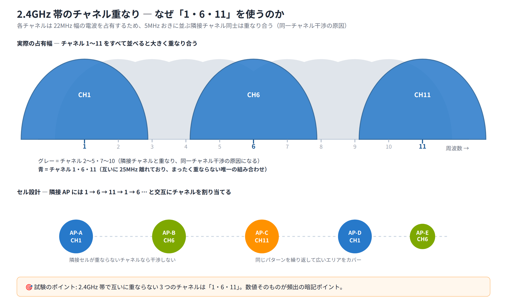

# Day 10 講義: 無線 LAN と検出プロトコル

> 配置先: ドキュメント `01_教材 > Week2 > Day10`
> 学習時間の目安: 3.5 時間 ／ 準拠: CCNA 200-301 v1.1 ドメイン 1・2

## 学習目標

この講義を終えると、次のことができるようになります。

1. 無線 LAN の基本用語（SSID・BSS・ESS・チャネル・周波数帯）と、有線と異なる媒体共有方式（CSMA/CA）を説明できる
2. 自律型 AP と Lightweight AP＋WLC の違い、CAPWAP のトンネル構成と Split MAC による処理分担を説明できる
3. WPA2 と WPA3 のセキュリティ方式の違い（認証・暗号化・PMF）を説明できる
4. WLC の GUI で WLAN を作成する際の主要な設定項目（インターフェース種別・SSID・セキュリティ）を説明できる
5. CDP と LLDP の違いを説明し、基本コマンドで隣接機器情報を確認できる

---

## ウォームアップ（朝の想起クイズ）

> 教材を見ずに、まず自力で思い出してください（分散学習: Day 3「IPv4 アドレッシングと
> サブネット化」 / Day 7「トランクと VLAN 設計」 / Day 9「STP と EtherChannel」 の
> 範囲から出題）。

**W1.** （Day 3）`/29` のサブネットマスクを 10 進表記で答えよ。また、そのサブネット
で使用可能なホストアドレス数はいくつか。

**W2.** （Day 7）トランクポートの既定のネイティブ VLAN 番号はいくつか。また、
トランクリンクの両端でネイティブ VLAN が一致していないと何が起きるか、一言で
答えよ。

**W3.** （Day 9）802.1D の STP における Hello Time・Forward Delay・Max Age の
既定値（秒）をそれぞれ答えよ。

<details><summary>解答</summary>

- W1: `255.255.255.248`。ホスト部 3 ビット（2³−2）で使用可能ホスト数は **6**
- W2: 既定のネイティブ VLAN は **VLAN1**。両端で不一致だと、タグなしフレーム
  （CDP・STP 等の制御トラフィックを含む）が誤った VLAN として転送され、
  警告メッセージが出力される（VLAN ホッピング攻撃の糸口にもなる）
- W3: Hello Time = **2 秒**、Forward Delay = **15 秒**、Max Age = **20 秒**

</details>

## 1. 無線 LAN の基礎（電波・チャネル・SSID・周波数帯）

### 無線は共有媒体であり半二重

有線 Ethernet では、スイッチのポートごとに専用の伝送路（ケーブル）が使えるため、
全二重（送信と受信を同時に行える）通信が一般的です。これに対して**無線 LAN は
「同じ空間の電波」という 1 つの媒体を、周囲のすべての機器が共有**します。1 台の
無線機器が電波を送信している間、同じチャネルの他の機器は基本的に送信できません。
つまり無線 LAN は本質的に**半二重**（送信と受信を同時には行えず、交互に切り替えて
行う方式）の通信です。

有線 Ethernet の初期に使われていた衝突検出の仕組みが **CSMA/CD**
（Carrier Sense Multiple Access with Collision Detection：搬送波感知多重アクセス／
衝突検出）でしたが、無線では衝突そのものを検出することが技術的に難しいため、
**CSMA/CA**（Carrier Sense Multiple Access with Collision Avoidance：衝突**回避**）
という異なる方式が使われます。CSMA/CA では、送信前にチャネルが空いているかを確認し、
さらにランダムな待機時間（バックオフ）を挟むことで、そもそも衝突が起きにくいように
振る舞います。

> **試験のポイント**: 「無線は CSMA/CA、有線は CSMA/CD」という対比は基本知識として
> 頻出です。CD は衝突を検出してから再送、CA は衝突を未然に回避する点の違いを
> 押さえてください。

### SSID・BSS・BSSID・ESS

ここからは無線 LAN の基本用語を整理します。無線で電波を出し、無線クライアントを
収容する機器のことを**AP**（Access Point、アクセスポイント）と呼びます。次の
用語は、この AP を中心に無線ネットワークの範囲や名前を表すものです。

| 用語 | 意味 |
|---|---|
| **SSID**（Service Set Identifier） | 無線ネットワークの名前。人間が識別するための文字列で、**最大 32 文字** |
| **BSS**（Basic Service Set） | 1 台の AP がカバーする電波の届く範囲（セル） |
| **BSSID** | その AP の無線インタフェースが持つ **MAC アドレス**。BSS を一意に識別する |
| **ESS**（Extended Service Set） | 同一 SSID を使う複数の AP を束ねて構成した、より広いエリアのネットワーク |

クライアントが同一 SSID の ESS 内を移動しながら、接続する AP を自動的に切り替える
動作を**ローミング**と呼びます。ESS 化することで、オフィス全体のような広い範囲を
1 つの無線ネットワークとしてシームレスに利用できます。

### 周波数帯の特徴

無線 LAN は主に 3 つの周波数帯を使用します。それぞれ到達距離・速度・混雑具合が
大きく異なります。

| 周波数帯 | 到達距離 | 速度 | 特徴 |
|---|---|---|---|
| **2.4GHz 帯** | 長い（壁などを回り込みやすい） | 低速寄り | Bluetooth や電子レンジなど他機器との干渉が多い |
| **5GHz 帯** | 短い | 高速 | 使えるチャネル数が多い。一部は **DFS**（Dynamic Frequency Selection：気象レーダー等との干渉を避けるための動的チャネル選択）対象で、レーダー検出時にチャネルを自動変更する |
| **6GHz 帯** | 短い | 高速・広帯域 | Wi-Fi 6E で追加された帯域。干渉が少なくクリーンだが、対応するクライアント機器が必要 |

一般に、周波数が高いほど直進性が強く障害物に弱くなる代わりに、広い帯域幅を
確保しやすく高速な通信が可能になります。

### 2.4GHz 帯のチャネルと非重複チャネル

2.4GHz 帯は 1 チャネルあたり 20〜22MHz 幅を占有しますが、チャネル間の間隔が
狭いため、隣接するチャネル同士は電波が重なり合ってしまいます。米国（および
日本の多くの機器）で使われる 2.4GHz 帯のチャネルのうち、互いにまったく
重ならない組み合わせは **1・6・11 の 3 波のみ**です。



隣接する AP のセルが重なるエリアで同じ（または重なる）チャネルを使うと、
**同一チャネル干渉**が発生し、スループットが低下します。そのため実際の
セル設計（AP の配置計画）では、隣り合う AP に **1 → 6 → 11 → 1 → 6 …** と
交互にチャネルを割り当てることで、隣接セル同士の干渉を避けます。

> **試験のポイント**: 2.4GHz 帯で互いに重ならない 3 つのチャネル（**1・6・11**）を
> 選ばせる問題は非常によく出題されます。数値をそのまま暗記しておきましょう。

### IEEE 802.11 の主な規格世代

| 規格 | 周波数帯 | Wi-Fi 世代呼称 |
|---|---|---|
| 802.11b | 2.4GHz | — |
| 802.11g | 2.4GHz | — |
| 802.11a | 5GHz | — |
| 802.11n | 2.4GHz / 5GHz | Wi-Fi 4 |
| 802.11ac | 5GHz | Wi-Fi 5 |
| 802.11ax | 2.4GHz / 5GHz / 6GHz | Wi-Fi 6（6GHz 対応版は **Wi-Fi 6E**） |

802.11ax（Wi-Fi 6/6E）は、複数端末が同時に効率よく通信できる技術（OFDMA など）を
取り入れており、混雑した環境でも高いスループットを維持しやすい点が特徴です。

## 2. WLAN アーキテクチャ（自律型 AP と Lightweight AP＋WLC）

無線 LAN を構築する際のアーキテクチャには、大きく分けて 2 つの方式があります。

### 自律型（Autonomous）AP

**自律型 AP** は、AP 単体に SSID・セキュリティ・電波出力などすべての設定を
個別に持たせる方式です。AP そのものが独立した機器として完結しており、家庭用
ルータの無線機能に近いイメージです。

- 小規模なネットワーク（AP が数台程度まで）には手軽で向いている
- AP の台数が増えると、**1 台ずつ個別に設定・管理**する必要があり、SSID の
  変更やセキュリティポリシーの更新のたびに全台へ作業が発生し、管理コストが
  急激に増大する

### Lightweight AP（LAP）＋ WLC

**Lightweight AP（LAP）** は、設定のほとんどを持たない「軽量な」AP です。
LAP 単体では動作せず、**WLC（Wireless LAN Controller：無線 LAN コントローラ）**
という集中管理機器と対になって初めて機能します。

- SSID・セキュリティポリシー・RF（電波）パラメータなどはすべて **WLC に集中**
  して設定・保持される
- 多数の AP を WLC からまとめて一元管理でき、設定変更も WLC 側の 1 回の操作で
  全 AP に反映できる
- **ローミングの制御**や**RF 最適化**（周辺 AP 同士の電波出力・チャネルの
  自動調整）を WLC 側で行いやすく、中〜大規模のネットワークに適している

### Split MAC ―― AP と WLC の処理分担

Lightweight AP アーキテクチャでは、無線 LAN の処理機能を **AP 側とWLC 側に
分割**して実行します。この考え方を **Split MAC** と呼びます。

| 処理の種類 | 実行場所 | 具体例 |
|---|---|---|
| **リアルタイム処理**（時間的制約が厳しい処理） | **AP** | ビーコンフレームの送出、ACK 応答、無線フレームの暗号化・復号 |
| **管理処理**（リアルタイム性が求められない処理） | **WLC** | クライアントの認証、アソシエーション（接続）管理、セキュリティ・QoS ポリシーの適用 |

無線特有の時間制約が厳しい処理は AP がその場で即座にこなし、ネットワーク
全体にまたがる管理的な判断は WLC に集約する、という役割分担によって、
集中管理のメリットと無線の応答性の両立を図っています。

### CAPWAP ―― LAP と WLC を接続するプロトコル

LAP と WLC の間は、**CAPWAP**（Control And Provisioning of Wireless Access
Points）というプロトコルを使ったトンネルで接続されます。CAPWAP のトンネルは
用途別に 2 本存在します。

| トンネル種別 | 用途 | UDP ポート番号 |
|---|---|---|
| **制御トンネル** | AP の設定・管理メッセージのやり取り | **UDP 5246** |
| **データトンネル** | クライアントの実際の無線トラフィック | **UDP 5247** |

制御トンネルは既定で **DTLS**（Datagram Transport Layer Security）により
暗号化され、AP と WLC 間でやり取りされる設定情報や管理メッセージの盗聴・
改ざんを防ぎます。

LAP が起動すると、まず DHCP でネットワーク層の IP アドレスを取得します。
その後、WLC の IP アドレスをまだ知らない LAP は、**DHCP のオプション 43**
（ベンダ固有情報オプション）などの仕組みを使って WLC の IP アドレスを学習し、
CAPWAP トンネルを確立して WLC に **join（参加）** します。オプション 43 以外にも、
LAP が DNS 名 `CISCO-CAPWAP-CONTROLLER`（+ ドメイン名）を解決して WLC の IP
アドレスを得る **DNS による発見**という手段もあり、実運用ではオプション 43 か
DNS のいずれかを用意しておくのが一般的です（本ラボではオプション 43 のみを
使用します）。

> **試験のポイント**: CAPWAP のトンネル種別と UDP ポート番号（**制御 = 5246・
> データ = 5247**）は頻出です。番号と用途をセットで覚えてください。Split MAC の
> 分担（AP = リアルタイム処理、WLC = 管理・認証処理）もあわせて狙われます。
> また、LAP が WLC の IP アドレスを発見する手段として **DHCP オプション 43 と
> DNS（`CISCO-CAPWAP-CONTROLLER`）の 2 通り**があることも押さえておきましょう。

### AP のモード

WLC に参加した LAP には、用途に応じたいくつかの動作モードを設定できます。

| モード | 用途 |
|---|---|
| **Local**（既定） | 通常のクライアント収容モード。無線クライアントへのサービス提供と、空き時間を使った簡易な電波スキャンを行う |
| **FlexConnect** | WAN 越しの拠点（支店など）に配置する AP 向け。WLC との接続が切れても、ローカルスイッチングによりその拠点内の通信を継続できる |
| **Monitor** | クライアントを収容せず、電波環境の監視・不正 AP 検出に専念する |
| **Sniffer** | 特定チャネルのすべてのフレームをキャプチャし、外部の解析ツールへ転送する |
| **SE-Connect** | スペクトラム解析（電波干渉の調査）専用モード |

> **試験のポイント**: AP モードの中でも、既定モードである **Local** と、WAN 越し
> 拠点で使う **FlexConnect** の用途の違いは頻出です。FlexConnect は WLC との接続が
> 切れてもローカルで通信を継続できる点が最大の特徴です。

> 💼 **実務では**: 新しい AP を繋いだのに WLC で "Registered / Joined" に
> ならないトラブルの大半は、無線ではなくその手前の L1〜L3 が原因です。現場では
> まず ①スイッチポートの PoE 電力バジェット不足（AP が起動しない・再起動を
> 繰り返す）、②AP を収容するアクセス VLAN と WLC 管理 VLAN の間の L3 到達性、
> ③DHCP オプション 43（または DNS）で通知した WLC の IP 誤り、の 3 点を疑います。
> 新人は WLC の GUI ばかり見てスイッチ側の VLAN・PoE・DHCP を確認しないミスを
> しがちで、`show power inline` やスイッチの CDP 情報から物理側を切り分けるのが
> 定石です。

### WLC への管理接続

WLC 自体への初期設定・管理アクセスには、次の 2 通りがあります。

- **コンソール / CLI**: 初回のセットアップウィザード（管理用インタフェースの
  IP アドレス設定など）で使用する
- **HTTPS の GUI**: 初期設定が完了した後、日常の WLAN 作成やポリシー変更などの
  実運用の設定は、主に Web ブラウザからの GUI 操作で行う

## 3. 無線セキュリティ（WPA2 / WPA3 と認証方式）

ここまでは、WLAN をどう構築し管理するかを見てきました。ここからは、その WLAN に
「誰の接続を認めるか」（認証）と「やり取りする通信内容をどう守るか」（暗号化）を
扱います。

### 認証方式の 2 分類

無線クライアントが WLAN に接続する際の認証方式は、大きく 2 つに分けられます。

| 方式 | 概要 | 主な用途 |
|---|---|---|
| **Personal（PSK）** | あらかじめ共有しておいた 1 つのパスフレーズ（**PSK: Pre-Shared Key、事前共有鍵**）を全クライアントが使う | 家庭・小規模オフィス |
| **Enterprise** | **802.1X/EAP** による個別認証を行い、バックエンドの **RADIUS** サーバでユーザーごとに認証する | 企業・大規模組織 |

Personal はパスフレーズさえ知っていれば誰でも接続できるのに対し、Enterprise は
ユーザーごとに個別の資格情報（ユーザー名・証明書など）で認証するため、
利用者ごとのアクセス制御や、退職者のアカウント無効化といった運用がしやすく
なります。ここでいう **802.1X** はポート単位でクライアントを認証する仕組みの
規格、**EAP**（Extensible Authentication Protocol）はその認証情報をやり取りする
ためのプロトコルの総称、**RADIUS** はユーザー名やパスワードなどの認証情報を
一元管理し、接続の可否を判定するサーバです。

### WPA2

**WPA2**（Wi-Fi Protected Access 2）は長く使われてきた無線セキュリティ標準です。
暗号化には **AES**（Advanced Encryption Standard、代表的な共通鍵暗号方式）を
ベースにした **CCMP**（Counter Mode with CBC-MAC Protocol：暗号化と改ざん検知を
同時に行う方式）を使用します。WPA2-Personal では、クライアントと AP の間で
**4-way ハンドシェイク**
と呼ばれる 4 回のメッセージ交換を行い、PSK から実際の暗号鍵を安全に導出します。

### WPA3

**WPA3** は WPA2 の弱点を補強した後継規格です。

- **SAE**（Simultaneous Authentication of Equals）: WPA3-Personal では、PSK の
  鍵交換方式が **SAE** に置き換えられます。SAE は WPA2 の 4-way ハンドシェイクと
  異なり、通信を傍受してもオフラインでパスフレーズを総当たりする**辞書攻撃に
  強い**という利点があります。また、仮に 1 回のセッション鍵が漏えいしても
  過去の通信内容の復号にはつながらない、**前方秘匿性**（Forward Secrecy）を
  持ちます
- **PMF**（Protected Management Frames、IEEE **802.11w**）: WPA3 では PMF が
  **必須**になりました。PMF は認証解除（Deauthentication）などの管理フレームに
  対しても保護を行い、攻撃者が管理フレームを偽装してクライアントを強制的に
  切断させるような攻撃を防ぎます
- **WPA3-Enterprise の高強度モード**: 政府機関や高セキュリティ要件向けに、
  **192bit** 相当の暗号強度を提供するモードが用意されています

| 比較項目 | WPA2 | WPA3 |
|---|---|---|
| 暗号化 | AES（CCMP） | AES（CCMP、Enterprise では 192bit モードあり） |
| Personal の鍵交換 | PSK ＋ 4-way ハンドシェイク | **SAE**（辞書攻撃に強い・前方秘匿性あり） |
| 管理フレーム保護（PMF） | オプション | **必須** |

### 非推奨の方式

**オープン認証**（認証なし・誰でも接続可能）や、旧世代の暗号方式である
**WEP**、**TKIP** は、既知の脆弱性が多数あり現在では非推奨です。CCNA の試験でも
「安全でない、使うべきではない方式」として選択肢に登場することがあります。

> **試験のポイント**: WPA3 の特徴（**SAE による PSK 方式の置換・PMF 必須・
> 前方秘匿性**）を、WPA2 との違いとして問う問題が頻出です。3 つのキーワードを
> セットで覚えておきましょう。

## 4. WLC の GUI 設定項目（WLAN 作成の流れ）

WLC の日常的な設定は、主に HTTPS 経由の GUI から行います。ここでは WLAN を
1 つ作成するまでの典型的な流れを確認します。

### WLC のインタフェース種別

WLC には役割の異なる複数の論理インタフェースがあります。

| インタフェース種別 | 役割 |
|---|---|
| **management**（管理インタフェース） | WLC 自体の管理アクセスや、AP との CAPWAP トンネルを終端するインタフェース |
| **virtual**（仮想インタフェース） | Web 認証のリダイレクトなど、特殊な用途で使われる仮想的な IP アドレス |
| **dynamic**（ダイナミックインタフェース） | 無線クライアントを収容する VLAN に対応するインタフェース。WLAN ごとに紐付ける |

> **試験のポイント**: WLC のインタフェース種別（**management・virtual・
> dynamic**）とその役割を対応させる問題は頻出です。「クライアント VLAN に
> 対応するのは dynamic」という対応関係を押さえておきましょう。

### WLAN 作成の流れ

1. **Controller > Interfaces** で、クライアントを収容したい VLAN に対応する
   **dynamic インタフェース**をあらかじめ作成しておく
2. **WLANs > Create New** から新規 WLAN を作成する
3. **General タブ**: SSID の名前を入力し、Status を**有効（Enabled）**にする。
   さらに、先ほど作成した dynamic インタフェース（＝収容する VLAN）を対応付ける
4. **Security タブ（Layer 2）**: セキュリティ方式（WPA2 / WPA3）、認証方式
   （PSK か 802.1X）、暗号方式（AES）を選択し、PSK の場合はパスフレーズを設定する
5. **QoS**（Quality of Service：音声・映像など遅延に弱い通信を優先して扱う
   仕組み）**/ Advanced タブ**: 帯域制御や FlexConnect の設定、セッションタイムアウト
   などの追加オプションを必要に応じて設定する

### スイッチ側の設定

AP や WLC を収容するスイッチのポートは、通信内容に応じて適切な VLAN で
トランクまたはアクセス設定にしておく必要があります。たとえば、AP や WLC
管理用の VLAN（管理 VLAN）と、無線クライアント用の VLAN（複数ある場合）を
同じアップリンク上でやり取りする場合は、そのポートを**トランクポート**にして
両方の VLAN を許可する必要があります。GUI 側でいくら正しく WLAN や
インタフェースを設定しても、スイッチ側の VLAN 設定が誤っていれば通信は
成立しません。

## 5. 検出プロトコル（CDP と LLDP）

ネットワーク機器同士が、直接接続された隣接機器の情報を自動的に交換する
プロトコルを**検出プロトコル**と呼びます。トポロジの把握やトラブルシュートに
役立ちます。

### CDP（Cisco Discovery Protocol）

**CDP** は Cisco 独自のレイヤ 2 プロトコルで、隣接する Cisco 機器同士が
機種名・IOS バージョン・IP アドレス・接続ポートなどの情報を交換します。

| 項目 | 既定値 |
|---|---|
| アドバタイズ間隔 | **60 秒** |
| ホールドタイム（情報の保持期限） | **180 秒** |
| Cisco 機器での既定状態 | **有効** |

```
Switch# show cdp neighbors
```

隣接機器の**デバイス ID・ローカルポート・接続先ポート・プラットフォーム**
などの概要が一覧表示されます。より詳細な情報（IP アドレスや IOS バージョン
を含む）を確認したい場合は、次のコマンドを使用します。

```
Switch# show cdp neighbors detail
```

`show cdp neighbors detail` の出力では、隣接機器の **IP アドレス**・
**プラットフォーム（機種）**・**IOS バージョン**・接続ポートといった詳細な
情報を確認できます。

CDP を無効化するコマンドは次のとおりです。

```
Switch(config)# no cdp run
```

これはスイッチ全体で CDP を無効にするコマンドです。特定のインタフェースだけ
無効にしたい場合は、インタフェースコンフィグレーションモードで次を使います。

```
Switch(config-if)# no cdp enable
```

### LLDP（Link Layer Discovery Protocol）

**LLDP** は **IEEE 802.1AB** で標準化された、ベンダーに依存しないオープンな
検出プロトコルです。Cisco 機器同士に限らず、他ベンダーの機器が混在する
マルチベンダ環境でも隣接情報を交換できます。

| 項目 | 既定値 |
|---|---|
| 送信間隔 | **30 秒** |
| ホールドタイム | **120 秒** |
| Cisco 機器での既定状態 | **無効**（明示的な有効化が必要） |

CDP と異なり、Cisco 機器では LLDP は既定で無効になっているため、使用する
場合はまずグローバルコンフィグレーションモードで有効化する必要があります。

```
Switch(config)# lldp run
```

有効化後、隣接情報の確認コマンドは CDP とよく似ています。

```
Switch# show lldp neighbors
Switch# show lldp neighbors detail
```

送信・受信の可否はインタフェースごとに個別に制御することもできます。

```
Switch(config-if)# lldp transmit
Switch(config-if)# lldp receive
```

### CDP と LLDP の比較

| 比較項目 | CDP | LLDP |
|---|---|---|
| 標準化 | Cisco 独自 | IEEE **802.1AB**（オープン標準） |
| 対応機器 | 主に Cisco 機器同士 | マルチベンダ対応 |
| 既定の有効 / 無効（Cisco 機器） | **有効** | **無効**（`lldp run` で有効化） |
| アドバタイズ間隔 / ホールドタイム | **60 秒 / 180 秒** | **30 秒 / 120 秒** |

### セキュリティ上の注意

CDP・LLDP はトポロジ把握やトラブルシュートに便利な反面、機種名や IOS
バージョンといった情報が隣接機器に筒抜けになるため、**攻撃者に有用な
情報を与えてしまう**というリスクもあります。インターネットに面したポートや、
社外の機器と接続するポートなど、信頼できない相手と接続するインタフェースでは、
CDP・LLDP の無効化を検討するのが望ましい運用です。

> 💼 **実務では**: CDP/LLDP は「この機器はどのスイッチのどのポートに刺さって
> いるか」を特定する必需ツールで、`show cdp neighbors detail` の IP・
> プラットフォーム・接続ポートを頼りに配線図なしで物理を追跡できます。一方で
> Cisco の IP 電話は CDP（または LLDP-MED）経由で音声 VLAN と PoE の給電
> クラスをネゴシエートするため、セキュリティ目的でアクセスポートの CDP を
> 一律 `no cdp enable` にすると、電話が音声 VLAN に載らない・給電が下がると
> いった事故につながります。マルチベンダの電話環境では LLDP-MED を有効化する
> のが現場の定石です。

> **試験のポイント**: CDP と LLDP の対比（独自 vs 802.1AB、既定有効 / 無効、
> **60/180 秒 vs 30/120 秒**、有効化コマンド `lldp run`）は非常によく出題されます。
> また `show cdp neighbors detail` で得られる情報（隣接機器の **IP アドレス・
> IOS バージョン・プラットフォーム**）を問う問題も頻出です。

## 6. まとめ

- 無線 LAN は共有媒体・半二重で、衝突回避には **CSMA/CA** を使う
- SSID（ネットワーク名）・BSS（1 AP のセル）・BSSID（AP の MAC）・ESS（複数 AP の束）
  の関係を押さえる
- 2.4GHz 帯の非重複チャネルは **1・6・11**。5GHz 帯は高速だが到達距離が短く
  DFS 対象あり、6GHz 帯は Wi-Fi 6E で追加
- 自律型 AP は個別管理、Lightweight AP＋WLC は集中管理。両者は **CAPWAP**
  （制御 UDP 5246・データ UDP 5247）で接続され、**Split MAC**（AP=リアルタイム、
  WLC=管理）で処理を分担する
- WPA3 は WPA2 に対し、**SAE** による PSK 方式の強化・**PMF 必須**・前方秘匿性
  という改善点を持つ
- WLC のインタフェースは management・virtual・dynamic の 3 種類があり、
  WLAN は dynamic インタフェース（＝クライアント VLAN）に対応付けて作成する
- CDP は Cisco 独自（60/180 秒・既定有効）、LLDP は IEEE 802.1AB のオープン標準
  （30/120 秒・既定無効・`lldp run` で有効化）

---

## 確認問題（自己チェック・解答は末尾）

1. 2.4GHz 帯で互いに重ならない 3 つのチャネルはどれか。
2. CAPWAP の制御トンネルとデータトンネルが使用する UDP ポート番号をそれぞれ答えよ。
3. WPA3-Personal において PSK の鍵交換方式を置き換えた仕組みの名称は何か。
4. Split MAC において、無線フレームの暗号化・復号を実行するのは AP と WLC のどちらか。
5. LLDP を Cisco のスイッチで有効化するために実行するグローバルコンフィグレーションコマンドは何か。

<details><summary>解答</summary>

1. 1・6・11
2. 制御トンネル: UDP 5246、データトンネル: UDP 5247
3. SAE（Simultaneous Authentication of Equals）
4. AP（リアルタイム処理を担当するため）
5. `lldp run`

</details>

## 次のステップ

本日のラボ課題「[Day10] ラボ: WLC と Lightweight AP による WLAN 構築、
CDP/LLDP による隣接機器確認」に進み、WLC と LAP を CAPWAP で接続して
WPA2-PSK の WLAN を構築し、無線クライアントの接続確認と CDP/LLDP による
隣接機器情報の確認を実際に行ってください。
