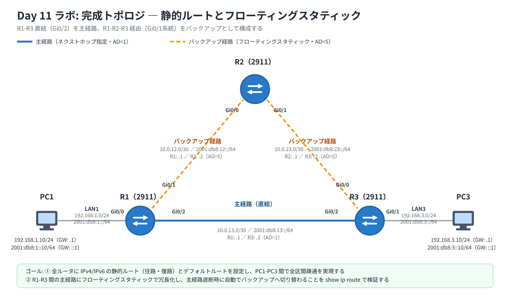

# Day 11 ラボ手順書: 静的ルートとフローティングスタティックの構成

> 配置先: ドキュメント `02_ラボ手順書 > Week3 > Day11`
> 所要時間の目安: 2.5 時間 ／ 使用ツール: Cisco Packet Tracer 9.x

## ゴール

- ルータ 3 台を直列（R1-R2-R3）に接続した環境で、IPv4/IPv6 の静的ルートと
  デフォルトルートを設定し、端末間（PC1-PC3）の全区間疎通を実現できる
- R1-R3 間に冗長リンクを追加し、フローティングスタティックによる
  バックアップ経路への自動切り替えを検証できる
- `show ip route` / `show ipv6 route` の出力から、実際に使われている経路と
  その AD・ネクストホップを読み取れる

## 完成トポロジ



> **注記**: 障害シミュレーション（手順 11）との整合のため、本ラボでは R1-R3 の
> 直結リンク（Gi0/2）を**主経路**、R1-R2-R3 経由を**バックアップ（フローティング
> スタティック）**として構成します。主経路の両端（R1・R3）にフローティング
> スタティックを設定し、主経路側のリンクを切断することで両ルータが同時に
> バックアップへ昇格し、往復とも正しく切り替わります。

### IP アドレス表

| 機器 | インターフェース | IPv4 アドレス | IPv6 アドレス | 備考 |
|---|---|---|---|---|
| PC1 | NIC | 192.168.1.10/24（GW: .1） | 2001:db8:1::10/64（GW: ::1） | LAN1 |
| R1 | Gi0/0 | 192.168.1.1/24 | 2001:db8:1::1/64 | LAN1 側 |
| R1 | Gi0/1 | 10.0.12.1/30 | 2001:db8:12::1/64 | バックアップ経路（R2 方向） |
| R1 | Gi0/2 | 10.0.13.1/30 | 2001:db8:13::1/64 | 主経路（R3 方向） |
| R2 | Gi0/0 | 10.0.12.2/30 | 2001:db8:12::2/64 | バックアップ経路（R1 方向） |
| R2 | Gi0/1 | 10.0.23.1/30 | 2001:db8:23::1/64 | バックアップ経路（R3 方向） |
| R3 | Gi0/0 | 10.0.23.2/30 | 2001:db8:23::2/64 | バックアップ経路（R2 方向） |
| R3 | Gi0/1 | 192.168.3.1/24 | 2001:db8:3::1/64 | LAN3 側 |
| R3 | Gi0/2 | 10.0.13.2/30 | 2001:db8:13::2/64 | 主経路（R1 方向） |
| PC3 | NIC | 192.168.3.10/24（GW: .1） | 2001:db8:3::10/64（GW: ::1） | LAN3 |

各ルータの点対点インターフェースは、若番側（小さい IP を持つルータ）を `.1`、
大番側を `.2` とします（例: `10.0.12.1` = R1、`10.0.12.2` = R2）。

使用機器: Router 2911 × 3（R1・R2・R3）、PC × 2（PC1・PC3）

---

## 手順 1: トポロジの作成とインターフェース設定（40 分）

1. Packet Tracer を起動し、新規ファイルを開く
2. [Network Devices] → [Routers] → **2911** を 3 台配置し、各ルータの CLI で
   `hostname` を `R1` / `R2` / `R3` に設定する

   ```
   Router(config)# hostname R1
   ```

   R2・R3 も同様に、それぞれ `hostname R2` / `hostname R3` を実行する
3. [End Devices] → **PC** を 2 台配置し、`PC1` / `PC3` とする
4. ストレートケーブルで次のように接続する
   - PC1 ⇔ R1 Gi0/0
   - R1 Gi0/1 ⇔ R2 Gi0/0
   - R2 Gi0/1 ⇔ R3 Gi0/0
   - R3 Gi0/1 ⇔ PC3
   - R1 Gi0/2 ⇔ R3 Gi0/2（主経路として使用する直結リンク。次の項目 5 で
     アドレスを設定する）
5. 各ルータで CLI を開き、IP アドレス表に従ってインターフェースへ IPv4/IPv6
   アドレスを設定し、`no shutdown` で有効化する（R1 の例）

   ```
   R1(config)# interface GigabitEthernet0/0
   R1(config-if)# ip address 192.168.1.1 255.255.255.0
   R1(config-if)# ipv6 address 2001:db8:1::1/64
   R1(config-if)# no shutdown
   R1(config-if)# exit
   R1(config)# interface GigabitEthernet0/1
   R1(config-if)# ip address 10.0.12.1 255.255.255.252
   R1(config-if)# ipv6 address 2001:db8:12::1/64
   R1(config-if)# no shutdown
   R1(config-if)# exit
   R1(config)# interface GigabitEthernet0/2
   R1(config-if)# ip address 10.0.13.1 255.255.255.252
   R1(config-if)# ipv6 address 2001:db8:13::1/64
   R1(config-if)# no shutdown
   R1(config-if)# exit
   ```

   R2・R3 も同様に、IP アドレス表の値でそれぞれのインターフェースを設定する
   （R2 は Gi0/0・Gi0/1 の 2 つ、R3 は Gi0/0・Gi0/1・Gi0/2 の 3 つを設定する）

6. 各ルータでグローバルコンフィグモードから IPv6 のユニキャストルーティングを
   有効化する（これを忘れると IPv6 パケットが転送されません）

   ```
   R1(config)# ipv6 unicast-routing
   ```

   R2・R3 でも同じコマンドを実行する

## 手順 2: PC の IP 設定（10 分）

1. PC1 の [Desktop] → **IP Configuration** で次を設定する
   - IPv4 Address: `192.168.1.10` ／ Subnet Mask: `255.255.255.0` ／
     Default Gateway: `192.168.1.1`
   - IPv6 Address: `2001:db8:1::10` ／ Prefix Length: `64` ／
     Default Gateway: `2001:db8:1::1`
2. PC3 も同様に、`192.168.3.10` / `255.255.255.0` / GW `192.168.3.1` と、
   `2001:db8:3::10` / `64` / GW `2001:db8:3::1` を設定する
3. ファイルを保存する: `File > Save As` → `day11_氏名.pkt`

## 手順 3: 直接接続の確認（10 分）

1. 各ルータで次のコマンドを実行し、全インターフェースが `up`/`up` に
   なっていることを確認する

   ```
   R1# show ip interface brief
   R1# show ipv6 interface brief
   ```

2. この時点では、各ルータは**隣接するネットワークのみ**疎通できることを
   確認する（例: PC1 から R1 の Gi0/0 へは ping が通るが、PC3 へはまだ通らない）

## 手順 4: IPv4 静的ルートの設定（25 分）

1. R1 に、遠方の LAN3（`192.168.3.0/24`）向けの静的ルートを、**主経路（R1-R3 直結の
   Gi0/2 経由）**として設定する

   ```
   R1(config)# ip route 192.168.3.0 255.255.255.0 10.0.13.2
   ```

2. R3 に、復路となる LAN1（`192.168.1.0/24`）向けの静的ルートを主経路として設定する

   ```
   R3(config)# ip route 192.168.1.0 255.255.255.0 10.0.13.1
   ```

3. R2 に、両端の LAN 向けの静的ルートを設定する（この経路は手順 9 で
   フローティングスタティックのバックアップ経路として使用する）

   ```
   R2(config)# ip route 192.168.1.0 255.255.255.0 10.0.12.1
   R2(config)# ip route 192.168.3.0 255.255.255.0 10.0.23.2
   ```

> **往路だけでなく復路の設定も忘れずに行ってください**。片方向のみの設定漏れは
> 最も多い疎通トラブルの原因です。

## 手順 5: IPv6 静的ルートの設定（15 分）

1. R1 に IPv6 の静的ルートを、主経路（R1-R3 直結の Gi0/2 経由）として設定する

   ```
   R1(config)# ipv6 route 2001:db8:3::/64 2001:db8:13::2
   ```

2. R3 に復路の IPv6 静的ルートを主経路として設定する

   ```
   R3(config)# ipv6 route 2001:db8:1::/64 2001:db8:13::1
   ```

3. R2 に両端の LAN 向け IPv6 静的ルートを設定する

   ```
   R2(config)# ipv6 route 2001:db8:1::/64 2001:db8:12::1
   R2(config)# ipv6 route 2001:db8:3::/64 2001:db8:23::2
   ```

## 手順 6: 静的ルートの確認と全区間疎通テスト（20 分）

1. 各ルータで静的ルートが登録されたことを確認する

   ```
   R1# show ip route static
   R1# show ipv6 route static
   ```

2. PC1 の Command Prompt から、PC3 へ IPv4/IPv6 の疎通を確認する

   ```
   ping 192.168.3.10
   ping 2001:db8:3::10
   tracert 192.168.3.10
   ```

3. **確認**: `tracert` の結果が `R1 → R3`（R1-R3 直結の主経路。R2 を経由しない）の
   順にホップしていることを記録する

## 手順 7: デフォルトルートの演習（15 分）

1. R3 の LAN3（`192.168.3.0/24`）以外の宛先を R2 へ送るよう、デフォルトルートに
   置き換える演習を行う

   ```
   R3(config)# ip route 0.0.0.0 0.0.0.0 10.0.23.1
   ```

2. `show ip route` を実行し、`S*` と `Gateway of last resort` の行が
   表示されることを確認する

   ```
   R3# show ip route
   ```

## 手順 8: 冗長構成の前提確認（5 分）

1. R1・R3 で `show ip interface brief` を実行し、主経路（Gi0/2、R1-R3 直結）が
   `up`/`up` になっていることを確認する

   ```
   R1# show ip interface brief
   R3# show ip interface brief
   ```

2. R1・R2・R3 で、バックアップ経由となる Gi0/1（R1-R2-R3 側）も `up`/`up` に
   なっていることを確認する（フローティングスタティックの検証には両方の
   リンクが揃っている必要がある）

## 手順 9: フローティングスタティックの設定（15 分）

1. R1 に、LAN3 向けのフローティングスタティック（AD=5、R2 経由のバックアップ経路）を
   設定する

   ```
   R1(config)# ip route 192.168.3.0 255.255.255.0 10.0.12.2 5
   R1(config)# ipv6 route 2001:db8:3::/64 2001:db8:12::2 5
   ```

2. R3 に、LAN1 向けのフローティングスタティック（AD=5、R2 経由のバックアップ経路）を
   設定する

   ```
   R3(config)# ip route 192.168.1.0 255.255.255.0 10.0.23.1 5
   R3(config)# ipv6 route 2001:db8:1::/64 2001:db8:23::1 5
   ```

   主経路の AD（ネクストホップ指定の静的ルートは AD=1）より大きい値を指定している
   ことを確認してください。フローティングスタティックを設定するのは、
   これから切断する主経路（R1-R3 直結の Gi0/2）の**両端**である R1・R3 である点が
   重要です。

## 手順 10: 平常時の確認（10 分）

1. R1 で `show ip route` を実行し、`192.168.3.0/24` 宛の経路が
   **主経路（via 10.0.13.2）のみ**表示され、フローティング側（via 10.0.12.2）は
   表示されていないことを確認する

   ```
   R1# show ip route 192.168.3.0
   ```

## 手順 11: 障害シミュレーションと自動切り替えの確認（15 分）

1. R1 で主リンク（R1-R3 直結の Gi0/2）を切断する

   ```
   R1(config)# interface GigabitEthernet0/2
   R1(config-if)# shutdown
   ```

   > **注意**: 切断するのは主経路である Gi0/2（R1-R3 直結）です。Gi0/1（R2 方向）を
   > 切断すると、R2 側の連結ルートも失われて復路が失われるため、ping が
   > 復旧しません。

2. `show ip route` を再実行し、フローティングスタティック（via 10.0.12.2）が
   テーブルに昇格したことを確認する

   ```
   R1# show ip route 192.168.3.0
   ```

3. PC1 の Command Prompt から `ping 192.168.3.10` を継続して実行し、
   切り替え中に何発ロスしたか、その後 Reply が再開するかを観察する

## 手順 12: 復旧確認（10 分）

1. R1 で主リンク（Gi0/2）を復旧する

   ```
   R1(config)# interface GigabitEthernet0/2
   R1(config-if)# no shutdown
   ```

2. `show ip route` を再実行し、主経路（via 10.0.13.2）がテーブルに復帰し、
   フローティングスタティックが再び待機状態に戻ったことを確認する

## 手順 13: 保存と最終確認（10 分）

1. 各ルータで設定を保存する

   ```
   R1# copy running-config startup-config
   ```

2. `show running-config | include route` で、静的ルート・デフォルトルート・
   フローティングスタティックがすべて正しく設定されていることを最終確認する
   （`ip route` と `ipv6 route` の両方が一致するよう、フィルタ語は `ip route` では
   なく `route` を使うこと。`ipv6 route` の行は文字列として `ip route` を
   部分一致で含まないため、`include ip route` では IPv6 側の設定漏れを
   見逃す）

### 観察レポート（コメント提出用）

以下 3 問に答えて、課題のコメントに記入してください。

1. 主リンクが正常なとき `show ip route` に表示された `192.168.3.0/24` への経路の
   ネクストホップと `[AD/メトリック]` を記し、フローティングスタティックの経路が
   なぜ表示されなかったのかを AD の観点で説明せよ。
2. R1 の Gi0/2 を `shutdown` した前後で `show ip route` の該当行がどう変化したか
   （ネクストホップ・AD）を記録し、PC1→PC3 の ping が復旧するまでに失われた
   パケット数を報告せよ。
3. R3 にデフォルトルート（`0.0.0.0/0`）を設定したとき、`192.168.1.0/24` 宛の
   パケットがデフォルトルートではなく具体的な静的ルートで転送された理由を、
   経路選択ロジックの用語を用いて説明せよ。

## 手順 14: 提出（10 分）

1. `day11_氏名.pkt` を Backlog のラボ課題に**添付**する
2. 手順 6・11 の疎通確認結果（スクリーンショット可）と観察レポートを
   課題の**コメント**に貼る
3. 課題の状態を「処理済み」に変更する

## うまくいかないとき

| 症状 | 確認すること |
|---|---|
| PC1-PC3 間の ping が通らない | 往路・復路**両方**の静的ルートが全ルータに設定されているか（片方向設定漏れが最頻出） |
| IPv6 の ping だけ通らない | 各ルータで `ipv6 unicast-routing` を実行し忘れていないか |
| tracert が意図しない経路を通る | 宛先ネットワーク・サブネットマスク・ネクストホップの入力ミスがないか、`show ip route` でロンゲストマッチの結果を確認 |
| フローティングが切り替わらない | AD の値が主経路より大きいか、末尾の AD 指定を書き忘れていないか（`ip route ... 5` の `5` が抜けると AD=1 になり主経路と競合する） |
| shutdown 後も主経路が残る | `show ip route` の反映に数秒かかることがあるため再実行、インターフェースが本当に down になっているか `show ip interface brief` で確認 |

30 分試して解決しない場合は、状況（スクリーンショット + 試したこと）を
課題のコメントに書いて質問してください。
