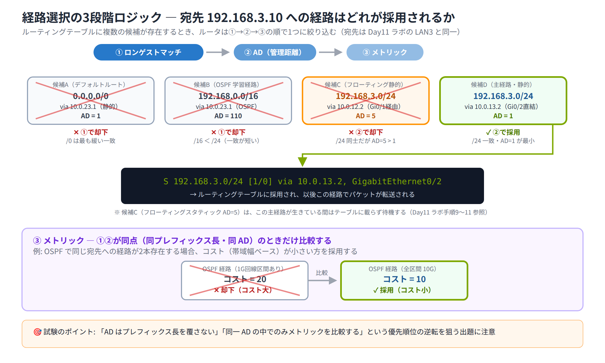

# Day 11 講義: ルーティングの基礎と静的ルート

> 配置先: ドキュメント `01_教材 > Week3 > Day11`
> 学習時間の目安: 3.5 時間 ／ 準拠: CCNA 200-301 v1.1 ドメイン 3

## 学習目標

この講義を終えると、次のことができるようになります。

1. ルーティングテーブルの構成要素（コード・宛先ネットワーク・AD/メトリック・ネクストホップ）を読み解ける
2. ルータが経路を選ぶ際の「ロンゲストマッチ → AD → メトリック」の 3 段階ロジックを説明できる
3. ネクストホップ指定と出力インターフェース指定の違いを理解し、静的ルートを正しく設定できる
4. デフォルトルートとフローティングスタティックの目的・構文・動作原理を説明できる
5. IPv6 の静的ルートを設定し、IPv4 との違い（有効化・完全指定の必要性）を説明できる

---

## ウォームアップ（朝の想起クイズ）

> 教材を見ずに、まず自力で思い出してください（分散学習: Day 4「IPv6 アドレッシング」 /
> Day 8「VLAN 間ルーティング」 / Day 10「無線 LAN と検出プロトコル」 の範囲から出題）。

**W1.** IPv6 アドレス `2001:0DB8:0000:0000:0000:0000:0000:0001` を、省略記法のルール
（先頭ゼロの省略・連続する 0 のグループを `::` で 1 か所のみ圧縮）に従って最も短く
表記せよ。

**W2.** Router on a Stick 構成で、ルータのサブインタフェースに 802.1Q タグ付き VLAN を
割り当てるために使用するコマンドを、構文（引数含む）まで答えよ。

**W3.** CDP（Cisco Discovery Protocol）のデフォルトの「アドバタイズ間隔」と
「ホールドタイム」は、それぞれ何秒か。

<details><summary>解答</summary>

- W1: `2001:db8::1`
- W2: `encapsulation dot1Q <VLAN ID>`（サブインタフェース コンフィグレーションモードで実行）
- W3: アドバタイズ間隔 = 60 秒、ホールドタイム = 180 秒

</details>

---

## 1. ルーティングの全体像とルーティングテーブルの構成要素

### ルータの基本動作

**ルーティング**とは、ルータが受信したパケットの**宛先 IP アドレス**を見て、
自身が持つ**ルーティングテーブル**（経路情報の一覧）の中から最も適合する経路を選び、
その経路が示す**次のホップ（ネクストホップ）**へパケットを転送する処理です。

もし宛先に一致する経路がルーティングテーブルに存在しない場合、ルータはそのパケットを
**破棄**します（このとき ICMP［Internet Control Message Protocol。ping にも使われる、
機器同士が通信の状態を伝え合う制御用プロトコルで、Day4 で学んだ ICMPv6 は
この IPv6 版です］の到達不能メッセージを送信元へ返すことがあります）。

### 経路がテーブルに載る 3 つの方法

ルーティングテーブルに経路情報（**ルートエントリ**）が登録される経路は 3 種類あります。

| 分類 | コード表示 | 説明 |
|---|---|---|
| **直接接続** | `C`（Connected）／ `L`（Local） | ルータのインターフェースに IP アドレスを設定し、有効化（up/up）すると自動生成される |
| **静的（スタティック）** | `S` | 管理者が `ip route` コマンドで手動登録する |
| **動的（ダイナミック）** | `O`（OSPF）、`D`（EIGRP）、`R`（RIP）など | ルーティングプロトコルがルータ同士で経路情報を交換し自動登録する |

動的ルーティングプロトコルの詳細は Week4 以降で扱います。本日は**直接接続**と
**静的ルート**に焦点を当てます。

### show ip route の読み方

`show ip route` はルーティングテーブルを表示する、最も基本的な確認コマンドです。

```
R1# show ip route
Codes: L - local, C - connected, S - static, ...

Gateway of last resort is not set

      192.168.1.0/24 is variably subnetted, 2 subnets, 2 masks
C        192.168.1.0/24 is directly connected, GigabitEthernet0/0
L        192.168.1.1/32 is directly connected, GigabitEthernet0/0
S        192.168.3.0/24 [1/0] via 10.0.12.2, GigabitEthernet0/1
```

1 行の情報は次のように分解して読みます。

| 部分 | 例 | 意味 |
|---|---|---|
| コード | `S` | 経路の由来（直接接続 / 静的 / 動的プロトコル） |
| 宛先ネットワーク/プレフィックス長 | `192.168.3.0/24` | この経路が示す宛先の範囲 |
| `[AD/メトリック]` | `[1/0]` | AD（管理距離）とメトリック（経路のコスト値） |
| `via ネクストホップ` | `via 10.0.12.2` | パケットを転送する次のルータの IP アドレス |
| 出力インターフェース | `GigabitEthernet0/1` | パケットを送り出すインターフェース |
| 経過時間 | （動的ルートのみ表示） | その経路を学習してからの経過時間 |

### L（Local）と C（Connected）の違い

- **C（Connected）**: そのインターフェースが属する**サブネット全体**を表す経路（例:
  `192.168.1.0/24`）
- **L（Local）**: ルータ**自身のインターフェース IP アドレス**を表す `/32` のホストルート
  （例: `192.168.1.1/32`）

どちらも、インターフェースに IP アドレスを設定して `no shutdown` し、
**line protocol が up** になった瞬間に自動的に生成されます。

> **試験のポイント**: `show ip route` の出力を読ませ、コード（C/L/S/S*/O）や
> `[AD/メトリック]` の意味、どの経路が実際に使われるかを問う問題が頻出です。

### 経路が消える条件

インターフェースが **administratively down**（`shutdown` されている）、または
**line protocol down**（物理的な障害やケーブル未接続）の状態になると、
そのインターフェースに紐づく直接接続ルート（C・L）も**ルーティングテーブルから消えます**。
これは静的ルートのトラブルシューティングでも重要な着眼点です。

### 経路確認用コマンド

| コマンド | 用途 |
|---|---|
| `show ip route` | ルーティングテーブル全体を表示 |
| `show ip route <宛先IP>` | 特定の宛先に対する最適経路の詳細を表示 |
| `show ip route static` | 静的ルートのみを表示 |
| `show ip route connected` | 直接接続ルートのみを表示 |

---

## 2. 経路選択の3段階ロジック（ロンゲストマッチ → AD → メトリック）

ここが今日の山場です。優先順位を逆に覚えると経路選択の問題を取り違えるため、
時間をかけて構いません。

同じ宛先 IP アドレスに対して複数の経路情報が存在する場合、ルータは次の**3 段階**で
最終的に使用する 1 つの経路を決定します。

### 第 1 優先: ロンゲストマッチ（最長プレフィックス一致）

宛先 IP アドレスに一致する経路が複数あるとき、**最もプレフィックス長が長い**
（サブネットマスクのビット数が多い＝より限定的な範囲を示す）経路が優先されます。
これを**ロンゲストマッチ（最長一致）の原則**と呼びます。

例えば、宛先 `10.1.1.5` に対して次の 2 つの経路が存在するとします。

- `10.1.0.0/16`
- `10.1.1.0/24`

どちらも宛先に一致しますが、`/24` の方がプレフィックス長が長い（より具体的）ため、
`10.1.1.0/24` の経路が優先されます。

### 第 2 優先: AD（Administrative Distance / 管理距離）

ロンゲストマッチの結果、**同一の宛先ネットワーク・同一のプレフィックス長**に対して
複数の情報源（プロトコル）由来の経路が存在する場合（たとえば、管理者が `ip route`
で設定した静的ルートと、OSPF などの動的プロトコルが自動学習した経路が、
たまたま同じ宛先・同じプレフィックス長を示している場合など）、次に比較されるのが
**AD（管理距離）**です。AD は「その経路情報の情報源をどれだけ信頼するか」を表す指標で、
**値が小さいほど優先度が高く**なります。AD はルーティングテーブルへの登載可否を
決める役割を持ちます。

| 情報源 | AD 値 |
|---|---|
| 直接接続（Connected） | **0** |
| 静的ルート（ネクストホップ指定） | **1** |
| EIGRP（内部） | **90** |
| OSPF | **110** |
| RIP | **120** |
| EIGRP（外部） | **170** |
| 到達不能（Unreachable） | **255**（テーブルに載らない） |

> **試験のポイント**: 主要プロトコルの AD 値（直接接続 0・静的 1・EIGRP 90・
> OSPF 110・RIP 120・外部 EIGRP 170）は数値で問われることが非常に多いため、
> 暗記が必須です。

### 第 3 優先: メトリック

**同一プロトコル内**で同一宛先への経路が複数存在する場合、最後に比較されるのが
**メトリック**（そのプロトコル独自のコスト値）です。メトリックが最も小さい経路が
選ばれます。

| プロトコル | メトリックの基準 |
|---|---|
| OSPF | コスト（帯域幅ベースの計算値） |
| RIP | ホップ数（経由するルータの台数） |
| EIGRP | 帯域幅・遅延などの複合値 |

同一 AD・同一メトリックの経路が複数存在する場合は、**等コストロードバランシング
（ECMP）**によって複数経路に負荷が分散されます。

### 3 段階の順序を取り違えない

```
① ロンゲストマッチ（プレフィックス長が最も長い経路を優先）
        ↓ 同じプレフィックス長の経路が複数あれば
② AD（管理距離が最も小さい経路を優先）
        ↓ 同じ AD の経路が複数あれば
③ メトリック（プロトコル固有のコストが最も小さい経路を優先）
```

**AD はプレフィックス長を覆しません**。たとえ AD が大きい（信頼度が低い）
プロトコルの経路であっても、より長いプレフィックスで宛先に一致していれば
そちらが優先されます。この順序を逆に覚えると経路選択の問題を誤りやすいため
注意してください。

以下は、Day11 ラボと同じ宛先（LAN3・`192.168.3.0/24`）に対して 4 つの経路候補が
存在する場合に、実際にどの順序でどの経路まで絞り込まれるかを示した例です。



> **試験のポイント**: 複数の一致経路を提示し「ロンゲストマッチ → AD → メトリック」の
> 優先順位でどの経路が選ばれるかを問う問題が頻出です。

---

## 3. 静的ルートの設定（ネクストホップ指定 vs 出力インターフェース指定）

**静的ルート（スタティックルート）**とは、管理者が手動でルーティングテーブルに
登録する経路情報です。小規模ネットワークや、変化の少ないスタブネットワーク
（出入り口が 1 つしかないネットワーク）に適しています。

### 基本構文

```
Router(config)# ip route <宛先ネットワーク> <サブネットマスク> <ネクストホップIP または 出力インターフェース>
```

### ネクストホップ指定

隣接ルータの IP アドレスを次のホップとして指定する方法です。

```
R1(config)# ip route 192.168.2.0 255.255.255.0 10.0.0.2
```

この方式では、ルータはパケット送出時に「ネクストホップ（`10.0.0.2`）へ
どうやって到達するか」を**再度ルーティングテーブルで検索**します。これを
**再帰ルックアップ（recursive lookup）**と呼びます。AD は **1** です。

> **試験のポイント**: ネクストホップ指定の静的ルートは、この再帰ルックアップに
> **成功する場合のみ**ルーティングテーブルに登録されます。ネクストホップへの
> 到達性が失われる（回線障害など）と、その静的ルートは自動的にテーブルから
> 外れます — これは後述のフローティングスタティックが昇格する発火条件そのものです。
> 「設定したはずの静的ルートが `show ip route` に出てこない」場合は、ネクストホップへの
> 到達性喪失か、宛先・マスクの入力ミスを疑いましょう。

### 出力インターフェース指定

宛先までの出力インターフェースのみを指定する方法です。

```
R1(config)# ip route 192.168.2.0 255.255.255.0 Serial0/0/0
```

この方式は、対向が 1 台しか存在しない**ポイントツーポイント回線**（シリアル回線など）
に向いています。イーサネットのような**マルチアクセス**媒体（1 本の回線に複数の機器が
ぶら下がり、次にどの機器へ渡せばよいかを 1 つに絞り込めない構成）で出力インターフェース
のみを指定すると、ネクストホップの IP アドレスが特定できず、パケットを送るたびに
宛先ホストの MAC アドレスを解決しようとする **ARP の問題**（プロキシ ARP ──
本来の宛先ではないルータが ARP 要求に自分の MAC アドレスで応答してしまう動作 ──
による非効率な処理）を引き起こすことがあるため、**非推奨**です。

### 完全指定ルート（fully specified route）

出力インターフェースとネクストホップ IP の**両方**を指定する方法です。

```
R1(config)# ip route 192.168.2.0 255.255.255.0 GigabitEthernet0/0 10.0.0.2
```

マルチアクセス環境（イーサネットなど）でも問題なく使用できる、確実な指定方法です。

### 3 方式の比較（マルチアクセスでの可否）

**非推奨なのは「出力インターフェースのみ」の指定だけ**である点に注意してください。
ネクストホップのみの指定はイーサネットでも完全に有効であり、実務でも最も
一般的に使われます。

| 指定方法 | 動作 | マルチアクセス（イーサネット）での可否 |
|---|---|---|
| ネクストホップのみ | 再帰ルックアップでネクストホップへの経路を検索し、ARP で MAC アドレスを解決 | **可・最も一般的** |
| 出力インターフェースのみ | 出力先のみ指定し、ネクストホップは特定しない | **非推奨**（ネクストホップを特定できず、プロキシ ARP に依存した非効率な処理になる） |
| 完全指定（出力インターフェース＋ネクストホップ） | 両方を明示 | 可・確実 |

出力インターフェースのみの指定は、対向が 1 台しかいないポイントツーポイント回線
（専用線など）専用の指定方法と覚えてください。

### ホストルート

サブネットマスクに `255.255.255.255`（`/32`）を指定すると、ネットワーク全体ではなく
**単一のホスト**だけを宛先とする静的ルートを定義できます。

```
R1(config)# ip route 192.168.2.100 255.255.255.255 10.0.0.2
```

### 設定後の確認

| コマンド | 用途 |
|---|---|
| `show ip route static` | 静的ルートが登録されたかを確認 |
| `show running-config \| include ip route` | 設定済みの `ip route` 行を一覧表示 |
| `ping` | 宛先までの疎通を確認 |
| `traceroute` | 実際に経由するルータ（経路）を確認 |

### 静的ルートの長所と短所

| 長所 | 短所 |
|---|---|
| CPU・帯域を消費しない（経路交換をしない） | トポロジ変更に自動追従しない |
| 動作が予測しやすく、セキュリティ上も管理しやすい | ネットワーク規模が大きくなると手動更新の手間が増大する |
| 小規模・スタブネットワークで特に有効 | 変更時に手動での再設定が必要 |

> 💼 **実務では**: `ip route` を新規に設計するのは構築フェーズの仕事で、保守現場で
> 登録・変更を任されるときは手順書に書かれた宛先・ネクストホップをそのまま入力する
> 定型作業になります。作業前には必ず現状の `show ip route` を記録し（作業前確認）、
> 変更後も同じコマンドで想定どおりの経路が乗っているかを照合、うまくいかない場合の
> 戻し手順まで手順書どおりに実行するのが客先のルールです。アラート対応で疎通不良の
> 報告を受けたときも、まず `show ip route` で経路が消えていないかを確認するのが最初の
> 切り分けで、そこから先が設定ミスなのか回線障害なのか判断がつかない場合は、
> 自己判断で `ip route` を書き換えず先輩にエスカレーションします。

### 静的ルートの4類型（試験に頻出の分類）

CCNA 試験では、静的ルートは主に次の 4 種類に分類されます（本章までの内容と、
次章で学ぶ内容の索引として使ってください）。

| 分類 | 用途 | マスク/プレフィックスの例 | 構文例 |
|---|---|---|---|
| ネットワークルート | 特定のネットワーク宛の経路を指定 | 任意（例: `/24`） | `ip route 192.168.2.0 255.255.255.0 10.0.0.2` |
| ホストルート | 単一のホストのみを宛先に指定 | `255.255.255.255`（`/32`） | `ip route 192.168.2.100 255.255.255.255 10.0.0.2` |
| デフォルトルート | 他のどの経路にも一致しない宛先の「最後の砦」 | `0.0.0.0`（`/0`） | `ip route 0.0.0.0 0.0.0.0 10.0.0.2` |
| フローティングスタティック | 主経路が使えなくなったときのバックアップ経路 | 主経路と同じ宛先・マスク | `ip route 192.168.2.0 255.255.255.0 10.0.1.2 130`（末尾に高い AD） |

> **覚え方（AD 値の並び）**: 直結 0 → 静的 1 → EIGRP 内部 90 → OSPF 110 → RIP 120 →
> EIGRP 外部 170 の順で「信頼度が高い順」に並びます。「0・1・90・110・120・170」を
> セットで暗記しましょう。

---

## 4. デフォルトルートとフローティングスタティック

### デフォルトルート（ゲートウェイ・オブ・ラストリゾート）

**デフォルトルート**は、宛先が他のどの経路にも一致しなかった場合に使われる、
いわば「最後の砦」の経路です。**ゲートウェイ・オブ・ラストリゾート
（Gateway of Last Resort）**とも呼ばれます。

```
R1(config)# ip route 0.0.0.0 0.0.0.0 <ネクストホップ>
```

`show ip route` では `S*` というコードで表示されます。

```
Gateway of last resort is 10.0.0.1 to network 0.0.0.0

S*    0.0.0.0/0 [1/0] via 10.0.0.1
```

`0.0.0.0/0` は**プレフィックス長が 0**（サブネットマスクのビットが 1 つも
含まれない）ため、あらゆる宛先 IP アドレスに「最も緩く」一致します。
そのため、ロンゲストマッチの原則により、**他により具体的な（プレフィックス長の長い）
一致経路が存在すれば、デフォルトルートよりそちらが必ず優先されます**。

デフォルトルートは、支店やエッジ拠点のスタブルータから ISP（インターネット
サービスプロバイダ）や上位の本社ルータへ向けて 1 本だけ設定する、
という使い方が典型的です。

> **試験のポイント**: デフォルトルート `0.0.0.0/0`（IPv6 は `::/0`）の構文と、
> 具体経路がある場合に優先されない理由（プレフィックス長 0）を問う問題が頻出です。

### フローティングスタティック

**フローティングスタティックルート**は、主経路（プライマリルート）が使えなくなった
ときのための**バックアップ経路**として設定する静的ルートです。通常より
**意図的に高い AD 値**を指定することで実現します。

```
R1(config)# ip route 192.168.2.0 255.255.255.0 10.0.1.2 130
```

末尾の `130` が、この経路に割り当てる AD 値です。

### 動作原理

- 平常時は、**AD が小さい主経路**がルーティングテーブルに登載され、実際に使用されます
- フローティングスタティック（AD が高い側）は「候補」として保持されますが、
  同じ宛先に対してより AD の小さい経路が存在する間は**テーブルには載りません**
- 主経路が消える（インターフェースが `down` になる、ネクストホップへの到達性が
  失われるなど）と、ルータは自動的にフローティングスタティックをテーブルへ
  **昇格**させ、通信が継続します

> 💼 **実務では**: プライマリ WAN（閉域網/MPLS）＋バックアップ回線（インターネット
> VPN やモバイル回線）の冗長化にフローティングスタティックが多用され、保守現場では
> どちらの回線を経由しているかをアラームや `show ip route` で確認する場面がよく出てきます。
> 厄介なのは「物理リンクは up のままだが、その先で疎通が切れている（ブラウンアウト）」
> ケースで、静的ルートは切り替わらないため監視上は正常に見えて実際は不通、ということが
> 起こり得ます。切り分けで判断が難しいと感じたら自分で `ip route` を書き換えて対処せず、
> 状況を整理してエスカレーションするのが基本です。IP SLA と object tracking による
> 到達性の能動監視を設計する側に回るのは、保守で経路知識と報告の質を積み重ね、
> 構築案件にステップアップしてから任される領域になります。

### AD 値の設計

フローティングスタティックの AD は、必ず**主経路の AD より大きい**値にします。

| 主経路 | 主経路の AD | フローティングスタティックの AD 例 |
|---|---|---|
| 静的ルート | 1 | 5 |
| OSPF | 110 | 130 |

> **試験のポイント**: フローティングスタティックの目的と、末尾で AD を主経路より
> 高く設定する構文を問う問題が頻出です。

### 検証手順

1. 主経路のインターフェースを `shutdown` する
2. `show ip route` で、バックアップ経路（フローティングスタティック）に
   切り替わったことを確認する
3. `ping` で疎通が継続していることを確認する

---

## 5. IPv6の静的ルート

### 前提設定: ipv6 unicast-routing

IPv4 のルータはデフォルトでパケット転送が有効ですが、IPv6 の場合は
グローバルコンフィグモードで次のコマンドを実行し、**IPv6 のユニキャストルーティングを
明示的に有効化**しない限り、ルータは IPv6 パケットを転送しません。

```
R1(config)# ipv6 unicast-routing
```

これは IPv4 の `ip routing`（デフォルトで有効）との重要な違いです。Day8 で学んだ
L3 スイッチの `ip routing` は既定で無効でしたが、あれはスイッチ固有の挙動であり、
ルータの IPv4 パケット転送は既定で有効になっている点に注意してください。

### 基本構文

```
Router(config)# ipv6 route <宛先プレフィックス>/<長さ> <ネクストホップIPv6 または 出力インターフェース>
```

例:

```
R1(config)# ipv6 route 2001:db8:2::/64 2001:db8:12::2
```

### IPv6デフォルトルート

IPv4 の `0.0.0.0/0` に相当するのが `::/0` です。

```
R1(config)# ipv6 route ::/0 <ネクストホップ>
```

### リンクローカルアドレスをネクストホップにする場合

Day4 で学んだ**リンクローカルアドレス**（`fe80::/10`）は各リンク（インターフェース）ごとに
独立したスコープを持つため、**複数のリンクで同じアドレスが重複して存在しうる**
特性があります。そのため、リンクローカルアドレスをネクストホップとして指定する場合は、
**出力インターフェースの併記が必須**（完全指定）になります。

```
R1(config)# ipv6 route 2001:db8:2::/64 GigabitEthernet0/0 fe80::2
```

出力インターフェースを併記することで、ルータは「どのリンク上の `fe80::2`」なのかを
一意に特定できます。

> **試験のポイント**: IPv6 静的ルートで `ipv6 unicast-routing` の有効化が必要な点、
> リンクローカルをネクストホップにする際の出力インターフェース併記を問う問題が
> 頻出です。

### IPv6でもフローティングスタティックは同様

IPv4 と同じく、末尾に AD 値を指定することでフローティングスタティックを実現できます。

```
R1(config)# ipv6 route 2001:db8:2::/64 2001:db8:12::2 130
```

### 確認コマンド

| コマンド | 用途 |
|---|---|
| `show ipv6 route` | IPv6 ルーティングテーブル全体を表示（`C`=Connected、`L`=Local、`S`=Static、`S*`=デフォルト） |
| `show ipv6 route static` | 静的ルートのみを表示 |
| `ping <IPv6アドレス>` | IPv6 の疎通確認 |

### IPv4 と IPv6 のルーティングテーブルは独立

デュアルスタック（IPv4 と IPv6 を同時運用）環境でも、IPv4 と IPv6 の
ルーティングテーブルは**完全に別個**に管理されます。ただし、経路選択のロジック
（ロンゲストマッチ → AD → メトリック）は IPv6 でも**同様に適用**されます。

---

## 6. まとめとトラブルシューティングの勘所

- 経路選択は必ず「**ロンゲストマッチ → AD → メトリック**」の順で判断する
- 静的ルートの AD は、ネクストホップ指定 = **1**、フローティングスタティックは
  任意の高い値、直接接続 = **0** を暗記する
- 疎通しないときは、**往路だけでなく復路（戻りの経路）**の静的ルートが
  両方のルータに設定されているかを確認する（片方向のみの設定漏れが最も
  頻出する障害パターン）
- デフォルトルートの多重定義や、誤ったネクストホップ指定による
  **ルーティングループ**に注意する（`traceroute` で検出できる）
- IPv6 では `ipv6 unicast-routing` の**有効化忘れ**が典型的な不通原因になる
- 本日の最重要コマンドセット: `ip route` / `ipv6 route`（設定）、
  `show ip route` / `show ipv6 route`（確認）、`ping` / `traceroute`（検証）

---

## 確認問題（自己チェック・解答は末尾）

1. `show ip route` で静的ルートを示すコードと、その AD の標準値（ネクストホップ指定時）を答えよ。
2. 宛先 `172.16.5.10` に対して `172.16.0.0/16` と `172.16.5.0/24` の 2 つの経路が存在するとき、実際に使われるのはどちらか。理由も含めて答えよ。
3. OSPF と RIP の AD 値をそれぞれ答えよ。同一宛先に両方の経路が存在する場合、どちらが優先されるか。
4. フローティングスタティックルートを設定する目的を 1〜2 文で説明せよ。
5. マルチアクセス環境（イーサネット）で静的ルートを設定する際に**非推奨**な指定方法はどれか。またその理由を答えよ。

<details><summary>解答</summary>

1. コードは `S`。AD の標準値は `1`。
2. `172.16.5.0/24` が使われる。ロンゲストマッチの原則により、プレフィックス長がより長い（より具体的な）経路が優先されるため。
3. OSPF = 110、RIP = 120。ロンゲストマッチが同条件であれば AD の小さい OSPF（110）が優先される。
4. 主経路が使用できなくなった場合に自動的に切り替わるバックアップ経路を用意するため。通常は主経路より高い AD 値を設定し、平常時はテーブルに載らないようにする。
5. 「出力インターフェースのみ」の指定が非推奨。ネクストホップが特定できず、プロキシ ARP に依存した非効率な処理を引き起こすため。ネクストホップのみの指定、または完全指定（出力インターフェース＋ネクストホップ IP）はイーサネットでも問題なく使用できる。

</details>

## 次のステップ

本日のラボ課題「[Day11] ラボ: 静的ルートとフローティングスタティックの構成」に進み、
ルータ 3 台を直列に接続した環境で IPv4/IPv6 の静的ルートを設定して全区間疎通を実現し、
さらに冗長リンクを使ったフローティングスタティックの自動切り替えを実際に確認してください。
