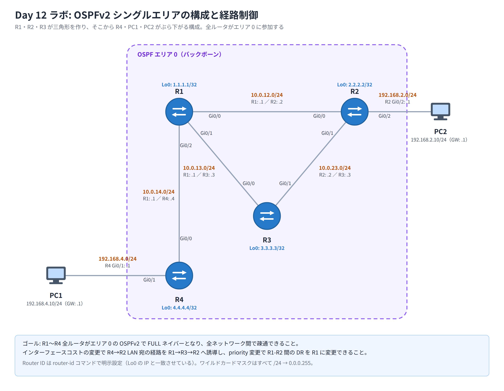

# Day 12 ラボ手順書: OSPFv2 シングルエリアの構成と経路制御

> 配置先: ドキュメント `02_ラボ手順書 > Week3 > Day12`
> 所要時間の目安: 2.5 時間 ／ 使用ツール: Cisco Packet Tracer 9.x

## ゴール

- ルータ 4 台（R1〜R4）でシングルエリア（**エリア 0**）の OSPFv2 を構成し、
  全ルータが **FULL** でネイバー確立し、全ネットワーク間で疎通が取れる状態を作る
- インターフェースのコストを変更し、冗長経路がある区間で**意図した経路へ
  トラフィックを誘導**する（経路制御）
- `show ip route` と `traceroute` を使って、コスト変更前後で実際の経路が
  変化したことを確認する
- `ip ospf priority` を使って DR（Designated Router）を狙ったルータへ変更する

## 完成トポロジ

R1・R2・R3 が三角形を作り、そこから R4 と PC1・PC2 がぶら下がる構成です。
Router ID の安定化のため、各ルータにループバック（Lo0）を作成します。



- R1 = Lo0 `1.1.1.1/32`　R2 = Lo0 `2.2.2.2/32`　R3 = Lo0 `3.3.3.3/32`　R4 = Lo0 `4.4.4.4/32`

### IP アドレス表

| 機器 | インターフェース | IPv4 アドレス | 接続先 | 備考 |
|---|---|---|---|---|
| R1 | Gi0/0 | 10.0.12.1/24 | R2 Gi0/0 | 三角形の 1 辺 |
| R1 | Gi0/1 | 10.0.13.1/24 | R3 Gi0/0 | 三角形の 1 辺 |
| R1 | Gi0/2 | 10.0.14.1/24 | R4 Gi0/0 | R4 への支線 |
| R1 | Lo0 | 1.1.1.1/32 | ― | Router ID 用 |
| R2 | Gi0/0 | 10.0.12.2/24 | R1 Gi0/0 | 三角形の 1 辺 |
| R2 | Gi0/1 | 10.0.23.2/24 | R3 Gi0/1 | 三角形の 1 辺 |
| R2 | Gi0/2 | 192.168.2.1/24 | PC2 | LAN 側（パッシブ） |
| R2 | Lo0 | 2.2.2.2/32 | ― | Router ID 用 |
| R3 | Gi0/0 | 10.0.13.3/24 | R1 Gi0/1 | 三角形の 1 辺 |
| R3 | Gi0/1 | 10.0.23.3/24 | R2 Gi0/1 | 三角形の 1 辺 |
| R3 | Lo0 | 3.3.3.3/32 | ― | Router ID 用 |
| R4 | Gi0/0 | 10.0.14.4/24 | R1 Gi0/2 | R1 への支線 |
| R4 | Gi0/1 | 192.168.4.1/24 | PC1 | LAN 側（パッシブ） |
| R4 | Lo0 | 4.4.4.4/32 | ― | Router ID 用 |
| PC1 | NIC | 192.168.4.10/24（GW: .1） | R4 Gi0/1 | ― |
| PC2 | NIC | 192.168.2.10/24（GW: .1） | R2 Gi0/2 | ― |

> **事前準備メモ**: Cisco 2911 は `GigabitEthernet0/0`・`0/1`・`0/2` の 3 ポートを
> **オンボードで**備えています（2 ポートのみなのは 2901）。R1・R2 の `Gi0/2` も
> 既定搭載のポートでそのまま使えるため、拡張モジュールの追加は不要です。

---

## 手順 1: トポロジの作成と IP アドレス設定（30 分）

1. Router **2911** を 4 台（R1〜R4）、PC を 2 台（PC1・PC2）配置する
2. 上記の完成トポロジ・IP アドレス表のとおりにケーブル（ストレート）で接続する
3. 各ルータで、接続したインターフェースに IP アドレスを設定し有効化する

   ```
   Router> enable
   Router# configure terminal
   Router(config)# hostname R1
   R1(config)# interface GigabitEthernet0/0
   R1(config-if)# ip address 10.0.12.1 255.255.255.0
   R1(config-if)# no shutdown
   R1(config-if)# exit
   R1(config)# interface GigabitEthernet0/1
   R1(config-if)# ip address 10.0.13.1 255.255.255.0
   R1(config-if)# no shutdown
   R1(config-if)# exit
   R1(config)# interface GigabitEthernet0/2
   R1(config-if)# ip address 10.0.14.1 255.255.255.0
   R1(config-if)# no shutdown
   R1(config-if)# exit
   ```

4. 同様に R2〜R4 も IP アドレス表のとおりに設定する
5. PC1・PC2 にも [Desktop] → [IP Configuration] から IP アドレス・サブネットマスク・
   デフォルトゲートウェイを設定する
6. 全リンクの●が緑になっていることを確認する

## 手順 2: ループバックインターフェースの作成（10 分）

各ルータにループバックを作成します。ループバックは物理リンクに依存しないため
**Router ID を安定させる**目的で使われます。

```
R1(config)# interface Loopback0
R1(config-if)# ip address 1.1.1.1 255.255.255.255
R1(config-if)# exit
```

R2 は `2.2.2.2`、R3 は `3.3.3.3`、R4 は `4.4.4.4` を同様に設定する。

## 手順 3: OSPF プロセスの起動と Router ID の明示設定（15 分）

各ルータで OSPF プロセスを起動し、Router ID を明示的に指定します。

```
R1(config)# router ospf 1
R1(config-router)# router-id 1.1.1.1
```

R2 は `router-id 2.2.2.2`、R3 は `router-id 3.3.3.3`、R4 は `router-id 4.4.4.4`
を設定する（すでに `router ospf 1` の中にいる状態で入力する）。

> Router ID はプロセス起動時に確定するため、後から `router-id` を変更した場合は
> `clear ip ospf process` で反映させる必要があります（手順 8 で使用します）。

## 手順 4: network 文でエリア 0 への参加（20 分）

各ルータで、接続している全ネットワーク（ループバック含む）をエリア 0 に
参加させます。ワイルドカードマスクは `/24` → `0.0.0.255`、`/32` → `0.0.0.0` です。

```
R1(config-router)# network 10.0.12.0 0.0.0.255 area 0
R1(config-router)# network 10.0.13.0 0.0.0.255 area 0
R1(config-router)# network 10.0.14.0 0.0.0.255 area 0
R1(config-router)# network 1.1.1.1 0.0.0.0 area 0
```

```
R2(config-router)# network 10.0.12.0 0.0.0.255 area 0
R2(config-router)# network 10.0.23.0 0.0.0.255 area 0
R2(config-router)# network 192.168.2.0 0.0.0.255 area 0
R2(config-router)# network 2.2.2.2 0.0.0.0 area 0
```

```
R3(config-router)# network 10.0.13.0 0.0.0.255 area 0
R3(config-router)# network 10.0.23.0 0.0.0.255 area 0
R3(config-router)# network 3.3.3.3 0.0.0.0 area 0
```

```
R4(config-router)# network 10.0.14.0 0.0.0.255 area 0
R4(config-router)# network 192.168.4.0 0.0.0.255 area 0
R4(config-router)# network 4.4.4.4 0.0.0.0 area 0
```

## 手順 5: パッシブインターフェースの設定（10 分）

PC を収容する LAN 側インターフェースには Hello を送る必要がありません。
R2 の PC2 側、R4 の PC1 側をパッシブに設定します。

```
R2(config-router)# passive-interface GigabitEthernet0/2
```

```
R4(config-router)# passive-interface GigabitEthernet0/1
```

## 手順 6: ネイバー関係の確認（15 分）

1. 各ルータで次を実行し、ネイバーの状態を確認する

   ```
   R1# show ip ospf neighbor
   ```

2. **確認**: R1 は R2・R3・R4 の 3 台とネイバーになっており、状態が **FULL**
   （R1-R2、R1-R3、R1-R4 の各リンクは 2 台しかいないため DR/BDR いずれかになる）
   であること
3. R2・R3・R4 でも同様に確認し、結果を記録する（RID、状態、DR/BDR の役割、
   接続インターフェース）

## 手順 7: ルーティングテーブルと疎通の確認（15 分）

1. 各ルータで OSPF から学習した経路を確認する

   ```
   R1# show ip route ospf
   ```

2. **確認**: 他ルータのループバックと LAN（192.168.2.0/24、192.168.4.0/24）が
   コード `O` で学習され、コスト値・ネクストホップが表示されていること
3. PC1（`192.168.4.10`）から PC2（`192.168.2.10`）へ ping を実行し、疎通することを
   確認する
4. R4 から R2 の LAN（`192.168.2.10`）へ traceroute を実行し、**現在の経路**
   （どのルータを経由するか）を記録する

   ```
   R4# traceroute 192.168.2.10
   ```

5. `show ip ospf interface GigabitEthernet0/0` を実行し、既定コスト・
   Hello/Dead タイマー・DR/BDR の情報を確認する

## 手順 8: コスト変更による経路制御（15 分）

R1-R2 間の直接リンク（`10.0.12.0/24`）のコストを上げて、R4 から R2 の LAN 宛の
トラフィックを **R1 → R3 → R2 の迂回経路**へ誘導します。

```
R1(config)# interface GigabitEthernet0/0
R1(config-if)# ip ospf cost 50
R1(config-if)# exit
```

1. `show ip route ospf` を再実行し、R2 の LAN（`192.168.2.0/24`）への
   ネクストホップが変化したことを確認する
2. R4 から再度 traceroute を実行し、経由するルータが変わったことを確認・記録する

   ```
   R4# traceroute 192.168.2.10
   ```

## 手順 9: DR の変更（15 分）

`10.0.12.0/24` セグメント（R1-R2 間）で、既定では Router ID の大きい R2
（`2.2.2.2`）が DR になっています。これを R1 に変更します。

```
R1(config)# interface GigabitEthernet0/0
R1(config-if)# ip ospf priority 200
R1(config-if)# exit
R1(config)# exit
R1# clear ip ospf process
```

（確認メッセージが出た場合は `yes` と入力する）

DR の選出は**非プリエンプティブ**なので、R1 だけプロセスを再起動しても、
すでに DR を名乗っている R2（`2.2.2.2`）が選出をやり直す際に自分の DR 状態を
維持してしまい、R1 は BDR に戻るだけで DR は交代しません。**現 DR である R2 側**
でも `clear ip ospf process` を実行し、両ルータ同時に選出をやり直させる必要が
あります。

```
R2# clear ip ospf process
```

（確認メッセージが出た場合は `yes` と入力する）

1. `show ip ospf neighbor` を R1・R2 双方で実行し、priority 200 を設定した R1 が
   DR に変わったことを確認する
2. 変更前後の DR・BDR の Router ID を記録する

## 手順 10: 総仕上げ確認と提出準備（5 分）

1. `show ip protocols` を実行し、Router ID・参加ネットワーク・パッシブ
   インターフェース・AD（110）が表示されることを確認する
2. ファイルを保存する: `File > Save As` → `day12_氏名.pkt`

### 観察レポート（コメント提出用）

以下 3 問に答えて、課題のコメントに記入してください。

1. コスト変更の前後で、R4 から R2 の LAN 宛の経路（traceroute の経由ルータ）は
   どう変わったか。変わった理由を**総コスト**の観点で説明せよ。
2. マルチアクセス区間で選出された DR と BDR の Router ID を記録し、なぜそのルータが
   DR に選ばれたのか（選出基準）を述べよ。また `priority` と
   `clear ip ospf process` 実行後にどう変化したか。
3. LAN 側インターフェースを `passive-interface` にした後、`show ip route ospf` で
   他ルータからそのネットワークが依然として学習できているか。パッシブ設定が
   **ネイバー形成**と**経路広告**に与える影響をそれぞれ説明せよ。

## 提出方法

1. `day12_氏名.pkt` を Backlog のラボ課題に**添付**する
2. 手順 6〜9 の確認結果（`show` コマンドの出力や traceroute 結果、
   スクリーンショット可）と観察レポートを課題の**コメント**に貼る
3. 課題の状態を「処理済み」に変更する

## うまくいかないとき

| 症状 | 確認すること |
|---|---|
| ネイバーが 1 つも表示されない | エリア ID・IP アドレス／サブネットマスクの入力ミス、ケーブルが緑か、`network` 文のワイルドカードマスクが正しいか |
| ネイバーが表示されるが FULL にならない | Hello/Dead タイマーの不一致、MTU の不一致（既定のままなら通常発生しない）、認証設定の有無の食い違い |
| passive にしたのに経路が消えた | `passive-interface` を設定しても `network` 文で該当ネットワークが area 0 に含まれているか確認（`network` 文自体を消していないか） |
| コスト変更後も経路が変わらない | `ip ospf cost` を設定したインターフェースが正しいか（迂回させたい直接経路の出力側インターフェース）、`show ip ospf interface` でコスト反映を確認 |
| `clear ip ospf process` 後に DR が変わらない | 対象インターフェースの `priority` が正しく設定されているか、両ルータで `clear ip ospf process` を実行したか |
| PC1-PC2 で ping が通らない | PC のデフォルトゲートウェイ設定、途中ルータの `show ip route` に経路が載っているか |

30 分試して解決しない場合は、状況（スクリーンショット + 試したこと）を
課題のコメントに書いて質問してください。
