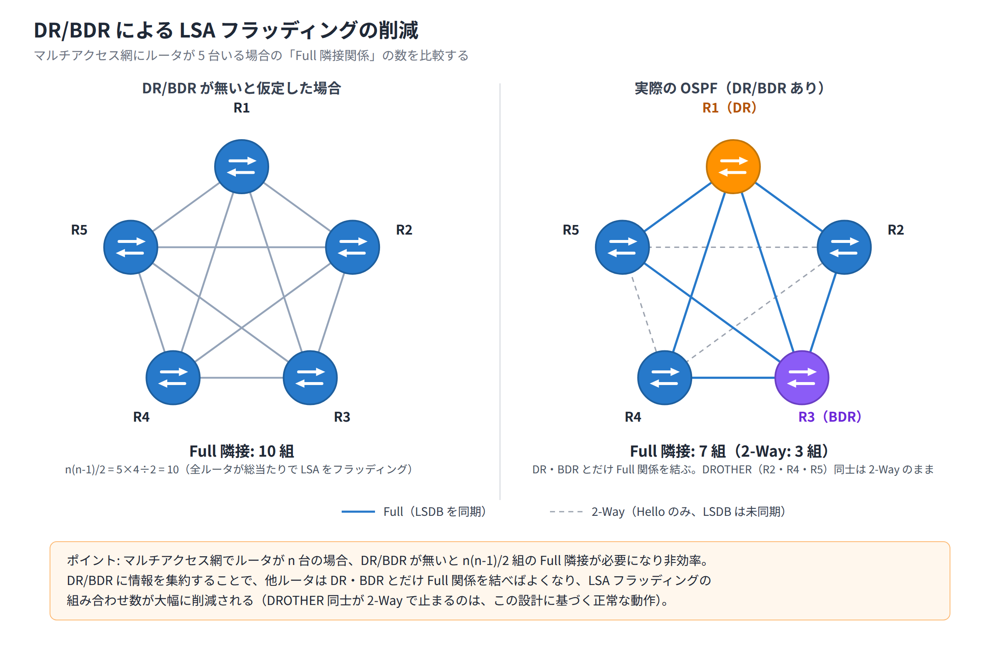

# Day 12 講義: OSPFv2（シングルエリア）

> 配置先: ドキュメント `01_教材 > Week3 > Day12`
> 学習時間の目安: 3.5 時間 ／ 準拠: CCNA 200-301 v1.1 ドメイン 3

## 学習目標

この講義を終えると、次のことができるようになります。

1. リンクステート型ルーティングの動作原理と、ディスタンスベクタ型との違いを説明できる
2. OSPF のネイバー確立に必要な条件と、状態遷移（Down〜Full）の意味を説明できる
3. Router ID の決定順序と DR/BDR の選出基準・目的を説明できる
4. OSPF のコスト計算式を理解し、経路制御のためにコストを調整できる
5. `router ospf` から `network` 文までの基本設定と、パッシブインターフェースの設定・効果を説明できる
6. 主要な `show` コマンドを使い、ネイバー状態や学習経路をトラブルシューティングできる

---

## ウォームアップ（朝の想起クイズ）

> 教材を見ずに、まず自力で思い出してください（分散学習: Day 5「TCP / UDP・
> スイッチング動作・物理層」 / Day 9「STP と EtherChannel」 / Day 11「ルーティングの
> 基礎と静的ルート」 の範囲から出題）。

**W1.** （Day 5）TCP のスリーウェイハンドシェイクの 3 つのパケットを順に答えよ。
また、HTTPS と SSH のウェルノウンポート番号をそれぞれ答えよ。

**W2.** （Day 9）STP のブリッジプライオリティの既定値はいくつか。また、LACP の
`active` / `passive` の組み合わせのうち、EtherChannel が**成立しない**組み合わせは
どれか。

**W3.** （Day 11）ルータが経路を選ぶ際の 3 段階ロジックを順に答えよ。また、
デフォルトルート（`0.0.0.0/0`）が `show ip route` に表示される際のコードは何か。

<details><summary>解答</summary>

- W1: **SYN、SYN/ACK、ACK の順**。HTTPS = **443**、SSH = **22**（いずれも TCP）
- W2: ブリッジプライオリティの既定値は **32768**。LACP は `passive` / `passive`
  の組み合わせのみ**成立しない**（少なくとも片方は `active` が必要）
- W3: **ロンゲストマッチ、AD（管理距離）、メトリック**の順。デフォルトルートは
  `show ip route` で **`S*`** と表示される

</details>

## 1. リンクステート型ルーティングと OSPF の位置づけ

### ディスタンスベクタとリンクステートの違い

Day11 までで扱った静的ルートに続き、本日からは**動的ルーティングプロトコル**を扱います。
動的ルーティングプロトコルは大きく 2 つの方式に分類されます。

| 方式 | 動き方 | 代表例 |
|---|---|---|
| **ディスタンスベクタ** | 隣接ルータから「このネットワークへは距離○」という**噂**を受け取り、それを信じてそのままテーブルに載せる | RIP |
| **リンクステート** | 各ルータが自分の周辺情報（リンクステート）を全ルータへ広告し合い、**ネットワーク全体の地図**を各自が組み立てたうえで、自分で最短経路を計算する | **OSPF** |

ディスタンスベクタは「噂を信じる方式」、リンクステートは「自分で全体地図を作る方式」と
イメージすると理解しやすくなります。OSPF（Open Shortest Path First）は
**リンクステート型**の代表的なルーティングプロトコルです。

### LSA・LSDB・SPF の関係

OSPF を理解する鍵は、次の 3 つの用語の関係です。

1. **LSA（Link State Advertisement／リンクステート広告）**: 各ルータが自分の
   インターフェースやネットワーク情報を広告するためのパケットの中身
2. **LSDB（Link State Database／リンクステートデータベース）**: エリア内の全ルータが
   交換した LSA を集めたデータベース。**同一エリア内の全ルータは同一の LSDB を持つ**
3. **SPF（Shortest Path First）アルゴリズム**: 各ルータが LSDB を基に
   **ダイクストラアルゴリズム**（起点から他の全地点までの最短経路をまとめて
   求める、グラフ理論の代表的な計算手法）を実行し、自分自身を根（root）とした
   **最短経路ツリー**を計算する処理

つまり OSPF ルータは「噂」ではなく「地図（LSDB）」を共有し、各自がその地図の上で
自分から見た最短経路を計算する、という点がディスタンスベクタと根本的に異なります。

### アドミニストレーティブディスタンス（AD）

Day11 で学んだ**AD（Administrative Distance）**は、同じ宛先ネットワークに対して
複数の情報源（プロトコル）から経路が学習された場合に、どれを信頼するかを決める
優先度の指標でした（数値が**小さいほど優先**されます）。OSPF の AD は **110** です。

| 情報源 | AD |
|---|---|
| 直接接続 | 0 |
| 静的ルート | 1 |
| EIGRP | 90 |
| **OSPF** | **110** |
| RIP | 120 |

OSPF は静的ルートや EIGRP よりは信頼度が低く扱われますが、RIP よりは信頼度が
高く扱われます。

> **試験のポイント**: OSPF の AD（110）と、静的ルート（1）・EIGRP（90）・RIP（120）
> との優先順位比較は頻出です。数値が小さいほど優先されることも合わせて覚えましょう。

### OSPFv2 と OSPFv3、シングルエリア

- **OSPFv2**: IPv4 ネットワーク用
- **OSPFv3**: IPv6 ネットワーク用

本日は **OSPFv2 のシングルエリア**構成を扱います。「シングルエリア」とは、
ネットワーク内の全ルータを**エリア 0（バックボーンエリア）**という 1 つのエリアだけに
所属させる、最もシンプルな OSPF の構成です（複数エリアに分割するマルチエリア構成は
以降の学習範囲になります）。

### プロトコル番号とマルチキャストアドレス

OSPF は TCP や UDP を使わず、**IP 上に直接プロトコル番号 89 として載る**という
特徴があります。信頼性の確保やパケット交換は OSPF 自身の仕組みで行います。

また、通信には次の 2 つのマルチキャストアドレスを使用します。

| マルチキャストアドレス | 用途 |
|---|---|
| `224.0.0.5` | 全 OSPF ルータ宛（AllSPFRouters） |
| `224.0.0.6` | DR / BDR 宛（AllDRouters） |

## 2. OSPF パケットとネイバー確立の条件・状態遷移

### OSPF の 5 種類のパケット

OSPF は次の 5 種類のパケットを使ってネイバー（隣接ルータ）の発見・情報交換を行います。

| パケット種別 | 略称 | 主な役割 |
|---|---|---|
| Hello | Hello | ネイバーの発見と維持（生存確認） |
| Database Description | DBD（DD） | LSDB の内容の要約情報を交換 |
| Link State Request | LSR | 不足している LSA の詳細を要求 |
| Link State Update | LSU | 要求された、または更新された LSA 本体を送信 |
| Link State Acknowledgment | LSAck | LSU を受信したことを確認応答 |

このうち**ネイバーの発見と維持を担うのが Hello パケット**です。

### Hello タイマーと Dead タイマー

Hello パケットは定期的に送信され、一定時間受信できないとネイバーは失効したと
みなされます。

- **Hello タイマー**: 既定 **10 秒**（Hello パケットの送信間隔）
- **Dead タイマー**: 既定 **40 秒**（＝ Hello の 4 倍。この間 Hello を受信しないと
  ネイバーをダウンとみなす）

この既定値は**ブロードキャスト網／ポイントツーポイント（P2P）網**での値です。

### ネイバー成立に一致が必要な項目

2 台のルータがネイバー関係を結ぶには、次の項目が**一致している必要**があります。

- **エリア ID**（同じエリアに属していること）
- **サブネット**（同一セグメント上にあること）
- **Hello / Dead タイマー**
- **認証**（設定している場合、方式・パスワードが一致）
- **スタブフラグ**（スタブエリアの設定が一致していること。スタブエリアは
  ネットワークを複数のエリアに分割するマルチエリア構成で使う概念で、本日の
  シングルエリア構成では通常は既定値のまま一致します）
- **MTU**（インターフェースの最大転送単位。ただし他の項目とは失敗の現れ方が
  異なります。不一致でも `show ip ospf neighbor` にネイバーは表示され、
  ExStart/Exchange で FULL に進めなくなるだけです。詳細は6章で扱います）

一方で、**Router ID はネイバー成立の一致条件ではありません**。ただし
**ネットワーク内の全ルータで一意（重複なし）でなければならず**、Router ID が
重複しているとネイバーが正しく成立しない原因になります。

> **試験のポイント**: エリア ID・Hello/Dead タイマー・サブネット・認証・
> スタブフラグの不一致は「ネイバーが `show ip ospf neighbor` に現れない」
> 原因になります。一方 MTU の不一致は「ネイバーは現れるが FULL にならない」
> 原因である点が異なるので、頻出のひっかけとして区別してください。Router ID は
> 「一致」ではなく「重複しない一意性」が求められる点にも注意してください。

### ネイバーの状態遷移

OSPF のネイバー関係は、次の順序で状態が遷移していきます。

```
Down → Init → 2-Way → ExStart → Exchange → Loading → Full
```

| 状態 | 意味 |
|---|---|
| **Down** | ネイバー情報がまだない初期状態 |
| **Init** | 相手から Hello を受信したが、自分の Router ID がまだ相手の Hello に載っていない |
| **2-Way** | 相手の Hello に自分の Router ID が載っている（＝双方向の疎通を確認） |
| **ExStart** | DBD 交換のマスタ／スレーブ関係を決定する |
| **Exchange** | DBD（LSDB の要約情報）を交換する |
| **Loading** | LSR/LSU を使って、不足している LSA の詳細情報をやり取りする |
| **Full** | LSDB の同期が完了した状態 |

### マルチアクセス網での状態の停止

イーサネットのようなマルチアクセス（ブロードキャスト）ネットワークでは、
DR（Designated Router）・BDR（Backup Designated Router）とその他のルータ
（DROTHER）との間でのみ **Full** まで遷移し、**DROTHER 同士は 2-Way で状態が
止まります**。これは異常ではなく、DR/BDR を介して情報を集約するための**正常な動作**
です（詳細は次章）。

`show ip ospf neighbor` コマンドでネイバーの状態を確認できます。安定状態は
**FULL** または **2WAY** のいずれかになります。

> **試験のポイント**: 状態遷移で FULL に到達しない、あるいは 2-Way で停止する意味
> （DROTHER 同士は 2-Way が正常）を問う問題が頻出です。「2-Way で止まっている＝
> 障害」と早合点しないようにしてください。

## 3. Router ID と DR/BDR 選出

### Router ID の決定順序

**Router ID（RID）**は、OSPF プロセス内でルータを一意に識別する 32 ビットの値
（IP アドレスの形式で表記）です。次の優先順位で決定されます。

1. `router-id` コマンドで**明示的に指定**した値（最優先）
2. 稼働している**ループバックインターフェースの中で最も高い IP アドレス**
3. 稼働している**物理インターフェースの中で最も高い IP アドレス**

Router ID は**OSPF プロセスの起動時に一度だけ確定**し、その後インターフェースの
IP を変更しても自動では更新されません。変更を反映するには
`clear ip ospf process` コマンドで OSPF プロセスを再起動する必要があります。

> **試験のポイント**: Router ID の決定順序（明示指定 → 最大ループバック IP →
> 最大物理 IP）は頻出です。あわせて「プロセス起動時に確定し、変更には
> プロセス再起動が必要」という点も押さえましょう。

### DR/BDR 選出

**DR/BDR の選出はブロードキャストや NBMA（Non-Broadcast Multi-Access。フレーム
リレー網のように、同一区間に複数の機器がいてもブロードキャストが使えない接続
形態）などのマルチアクセスネットワークでのみ行われ、P2P（ポイントツーポイント）
リンクでは行われません**。

DR/BDR を置く目的は、マルチアクセス網上で全ルータ同士が Full 関係を結ぶと
ネイバー数（n 台なら n(n-1)/2 組）分の LSA フラッディングが発生し非効率になるため、
**DR に情報を集約することでフラッディングの組み合わせ数を減らす**ことです。
他のルータは DR（および BDR）とだけ Full 関係を結び、LSA の交換窓口とします。



選出基準は次の順序で決まります。

1. インターフェースの **OSPF プライオリティが最大**のルータ（既定値は **1**）
2. プライオリティが同値の場合は **Router ID が最大**のルータ

プライオリティを **0** に設定したインターフェースは**選出対象から除外**され、
常に DROTHER となります。

ここが本日の山場です。「優先度が高いルータが後から参加すれば、そちらが DR に
なるはず」と考えてしまいがちですが、実際の動作はそうではありません。時間を
かけて読んで構いません。

DR/BDR の選出は**非プリエンプティブ**です。つまり、選出済みの DR が存在する状態で
後からより高いプライオリティを持つルータが参加しても、**既存の DR は交代しません**。

> 💼 **実務では**: 客先の /30 ルーテッドリンクで `show ip ospf interface` を確認すると、
> ネットワークタイプが `POINT_TO_POINT` になっていて DR/BDR 欄が空、ということがよく
> あります。これは「2 台しかいないリンクなので選出を省く設定が既に入っている」だけで
> 異常ではなく、逆にブロードキャスト型のまま放置され選出に時間がかかっているように
> 見えても、保守作業でネットワークタイプを勝手に変更するのは厳禁です。気付いた点は
> 手順書の想定外事象として記録し、先輩にエスカレーションするところまでが仕事です。

DR を変更したい場合は、対象インターフェースに `ip ospf priority` を設定したうえで、
OSPF プロセスの再起動またはネイバー関係のリセットを行って選出をやり直す必要があります。

`show ip ospf neighbor` の出力で、各ネイバーが DR・BDR・DROTHER のいずれの役割かを
確認できます。

> **試験のポイント**: DR/BDR 選出基準（プライオリティ最大 → Router ID 最大、
> 既定プライオリティ 1、priority 0 は選出対象外、非プリエンプティブ）は頻出です。

## 4. コスト計算とパスの選択

### OSPF のメトリック＝コスト

OSPF はメトリックとして**コスト**を使用します。コストはインターフェースの帯域幅から
次の式で計算されます。

```
インターフェースコスト = 参照帯域幅 ÷ インターフェース帯域幅
```

既定の**参照帯域幅は 100 Mbps（10^8 bps）**です。

| インターフェース | 帯域幅 | 既定コスト（計算値） |
|---|---|---|
| FastEthernet | 100 Mbps | 10^8 ÷ 10^8 = **1** |
| GigabitEthernet | 1000 Mbps | 10^8 ÷ 10^9 = 0.1 → 切り上げで **1** |

この表からわかるとおり、**参照帯域幅を変更しない既定状態では、FastEthernet と
GigabitEthernet のコストが同じ「1」になってしまう**という問題があります。これでは
高速な GigabitEthernet 経路を優先させることができません。

### 経路の総コスト

宛先ネットワークまでの**総コストは、そこに至るまでの各区間の「出力インターフェース側」
のコストの合計**です（受信側のコストは加算されません）。

### コストの調整方法

コストを調整する方法は主に 2 つあります。

1. **インターフェースに直接コストを設定**（最優先で適用される）

   ```
   Router(config-if)# ip ospf cost 10
   ```

2. **bandwidth コマンドで帯域幅の設定値を変更**し、計算されるコストを変える

   ```
   Router(config-if)# bandwidth 1000000
   ```

また、参照帯域幅そのものを変更することもできます。

```
Router(config-router)# auto-cost reference-bandwidth 10000
```

（この例では参照帯域幅を 10,000 Mbps＝10 Gbps に変更しています。）
**参照帯域幅は必ず全ルータで統一する**必要があります。バラバラだと、ルータごとに
コスト計算の基準が異なり、経路計算に矛盾が生じる可能性があります。

### 等コストロードバランシング

宛先までの総コストが等しい経路が複数存在する場合、OSPF は**等コストロード
バランシング**（Day11 で学んだ ECMP と同じ考え方です）を行います（既定で最大
**4 経路**まで）。

コストを意図的に上げることで、特定の経路を迂回させることもできます。これは
実務でも試験でも問われる**基本的な経路制御の手法**です。

> **試験のポイント**: コスト計算式（参照帯域幅 10^8 ÷ 帯域）と、Gigabit と
> FastEthernet が既定で同コスト 1 になってしまう問題は頻出です。

## 5. OSPF の設定コマンドとパッシブインターフェース

### OSPF プロセスの有効化

```
Router(config)# router ospf 1
```

`1` は**プロセス ID** です。プロセス ID は**そのルータだけで意味を持つローカルな値**
であり、ルータ間で一致させる必要はありません（範囲は 1〜65535）。

### network コマンド

OSPF に参加させたいインターフェースは `network` コマンドで指定します。

```
Router(config-router)# network 10.0.12.0 0.0.0.255 area 0
```

- **ネットワークアドレス**の後ろに**ワイルドカードマスク**（サブネットマスクの
  ビットを反転させたもの）を指定します。例えば `/24`（`255.255.255.0`）は
  `0.0.0.255` になります
- インターフェースを 1 つだけピンポイントで指定したい場合はホストのワイルドカード
  `0.0.0.0` を使用します
- `area 0` の部分でそのネットワークが属するエリアを指定します（シングルエリア構成
  では常に `area 0`）

**ワイルドカードマスクの求め方**: `255.255.255.255` から**サブネットマスクを
引き算**すると求まります。/24 以外のプレフィックスでもこの手順は変わりません。

| プレフィックス | サブネットマスク | ワイルドカードマスク（255.255.255.255 − マスク） |
|---|---|---|
| /24 | 255.255.255.0 | `0.0.0.255` |
| /25 | 255.255.255.128 | `0.0.0.127` |
| /26 | 255.255.255.192 | `0.0.0.63` |
| /30 | 255.255.255.252 | `0.0.0.3` |

例えば `10.1.4.0/30` を area 0 に参加させる場合は次のようになります。

```
Router(config-router)# network 10.1.4.0 0.0.0.3 area 0
```

> **試験のポイント**: /24 のようなオクテット境界だけでなく、/30・/26・/25 など
> 非オクテット境界のワイルドカードマスクへの変換も本試験の頻出範囲です。

### インターフェース単位での有効化（代替方法）

`network` コマンドの代わりに、インターフェースコンフィグモードで直接
OSPF を有効化することもできます。

```
Router(config-if)# ip ospf 1 area 0
```

### Router ID の明示設定

安定運用のため、Router ID は明示的に設定することが推奨されます。

```
Router(config-router)# router-id 1.1.1.1
```

### パッシブインターフェース

**パッシブインターフェース**に設定したインターフェースは、そこから**Hello パケットを
送信しなくなり**、そのインターフェース経由でのネイバー形成を行いません。
ただし、**そのインターフェースが属するネットワーク自体は、引き続き OSPF によって
広告され続けます**（LSA には含まれたままになります）。

```
Router(config-router)# passive-interface GigabitEthernet0/1
```

PC やサーバを収容するだけの LAN 側インターフェースは、そこにネイバーが現れる
必要がないため、**パッシブインターフェースにするのがセキュリティ・効率上の
ベストプラクティス**です（不要な Hello 送信を止め、不正なルータの参加も防げます）。

全インターフェースを既定でパッシブにしたうえで、必要なインターフェースだけ
個別に解除する方法もよく使われます。

```
Router(config-router)# passive-interface default
Router(config-router)# no passive-interface GigabitEthernet0/0
```

> 💼 **実務では**: 保守現場では `show ip protocols` の出力でどのインターフェースが
> パッシブになっているかを確認する場面がよくあります。LAN 側が passive になって
> いない構成に気付いても、その場の判断で `passive-interface` を追加設定しては
> いけません——変更は客先の合意と手順書（変更手順・戻し手順）を経て行うのが原則で、
> 気付いた点は所見として報告し、判断は先輩や設計担当に委ねます。こうした報告の
> 積み重ねが、構築案件へステップアップする評価材料になります。

> **試験のポイント**: passive-interface の効果（Hello 送信は止めるが、
> ネットワーク広告は継続する）を問う問題が頻出です。「経路も広告されなくなる」
> という誤りの選択肢に注意してください。

## 6. 確認・トラブルシューティングコマンド

主要な確認コマンドを整理します。

| コマンド | 確認できる内容 |
|---|---|
| `show ip ospf neighbor` | ネイバーの RID・状態（FULL/2WAY）・DR/BDR 役割・Dead タイマー残時間・接続インターフェース |
| `show ip protocols` | 動作中のルーティングプロトコル、Router ID、参加ネットワーク、パッシブインターフェース、AD |
| `show ip route ospf` | OSPF で学習した経路（コード `O`）とコスト値・ネクストホップ |
| `show ip ospf interface [IF]` | 該当インターフェースのエリア、コスト、Hello/Dead タイマー、DR/BDR、プライオリティ（`brief` オプションで一覧表示も可） |
| `show ip ospf database` | LSDB の内容（保有している LSA の一覧） |

### ネイバー不成立の典型的な原因

ネイバーが `show ip ospf neighbor` に現れない場合、次のような原因が考えられます。

- エリア ID の不一致
- Hello / Dead タイマーの不一致
- サブネットの不一致（別セグメントに見えている）
- Router ID の重複
- 認証の不一致
- 該当インターフェースが誤ってパッシブに設定されている

### ネイバーは現れるが FULL にならない典型的な原因

一方、ネイバーは `show ip ospf neighbor` に**表示されるものの**、状態が
**ExStart／Exchange で停止**し FULL まで進まない場合は、次が典型的な原因です。

- **MTU の不一致**: 2-Way までは MTU に関係なく成立しますが、DBD 交換
  （Exchange）で双方の MTU が食い違っていると、それ以降へ進めず停止します。
  `show ip ospf neighbor` で状態（ExStart/Exchange）を、`show interfaces` で
  各インターフェースの MTU を確認して切り分けます

> **試験のポイント**: MTU 不一致は「ネイバーが現れない」原因ではなく、
> 「現れるが FULL にならない（ExStart/Exchange で停止する）」原因である点に
> 注意してください。

### プロセスの再起動

Router ID やプライオリティの変更を反映させたい場合は、次のコマンドで
OSPF プロセスを再起動します。

```
Router# clear ip ospf process
```

> **試験のポイント**: ネイバー不成立の原因の切り分けは、まさに実務・試験双方で
> 頻出のテーマです。「どの show コマンドで何がわかるか」をセットで覚えましょう。

## 7. まとめ

- OSPF はリンクステート型で、LSA を交換して同一の LSDB を共有し、各ルータが
  SPF（ダイクストラ）で自分中心の最短経路を計算する
- OSPF の AD は 110（静的ルート 1、EIGRP 90 より低優先、RIP 120 より高優先）
- ネイバー成立にはエリア ID・サブネット・タイマー・認証・スタブフラグの一致が必要
  （不一致だとネイバー自体が現れない）。MTU の不一致はネイバーは現れるが
  FULL にならない別の失敗モードになる。Router ID は一致不要だが一意性が必須
- 状態遷移は Down、Init、2-Way、ExStart、Exchange、Loading、Full の順に進む。
  マルチアクセス網では DROTHER 同士は 2-Way で正常に停止する
- Router ID は明示設定、最大ループバック IP、最大物理 IP の順で決まる
- DR/BDR はプライオリティ（既定 1）、Router ID の順で選出され、非プリエンプティブ
- コストは参照帯域幅（既定 10^8）÷ 帯域幅で計算され、`ip ospf cost` で直接調整できる
- `network` 文はワイルドカードマスクと `area` 指定が必須。パッシブインターフェースは
  Hello を止めるが経路広告は継続する

---

## 確認問題（自己チェック・解答は末尾）

1. OSPF のアドミニストレーティブディスタンスはいくつか。また EIGRP・RIP と比べて
   優先度はどちらが高いか。
2. マルチアクセスネットワークで DROTHER 同士のネイバー状態が 2-Way のまま Full に
   ならないのは異常か、正常か。理由も述べよ。
3. あるルータにループバックインターフェースが設定されておらず、`router-id` コマンドも
   使われていない場合、Router ID はどのように決まるか。
4. GigabitEthernet インターフェース（参照帯域幅未変更）の既定コストはいくつか。
5. `passive-interface` を設定したインターフェースが属するネットワークは、OSPF に
   よって他ルータへ広告されるか。

<details><summary>解答</summary>

1. 110。EIGRP（90）より優先度は低く、RIP（120）より優先度は高い
2. 正常。DR/BDR を介して情報を集約する設計上、DROTHER 同士は Full まで進まず
   2-Way で停止するのが正しい動作
3. 稼働している物理インターフェースの中で最も IP アドレスが高いものが Router ID
   として選ばれる
4. 1（参照帯域幅 10^8 ÷ 帯域幅 10^9 = 0.1 だが、切り上げにより 1 となる）
5. 広告される。パッシブインターフェースは Hello の送信（ネイバー形成）だけを
   止めるものであり、ネットワークの広告自体は継続する

</details>

## 次のステップ

本日のラボ課題「[Day12] ラボ: OSPFv2 シングルエリアの構成と経路制御」に進み、
4 台のルータでエリア 0 の OSPF を構成してネイバーを FULL にし、コストを調整して
実際に経路が変化する様子を確認してください。
