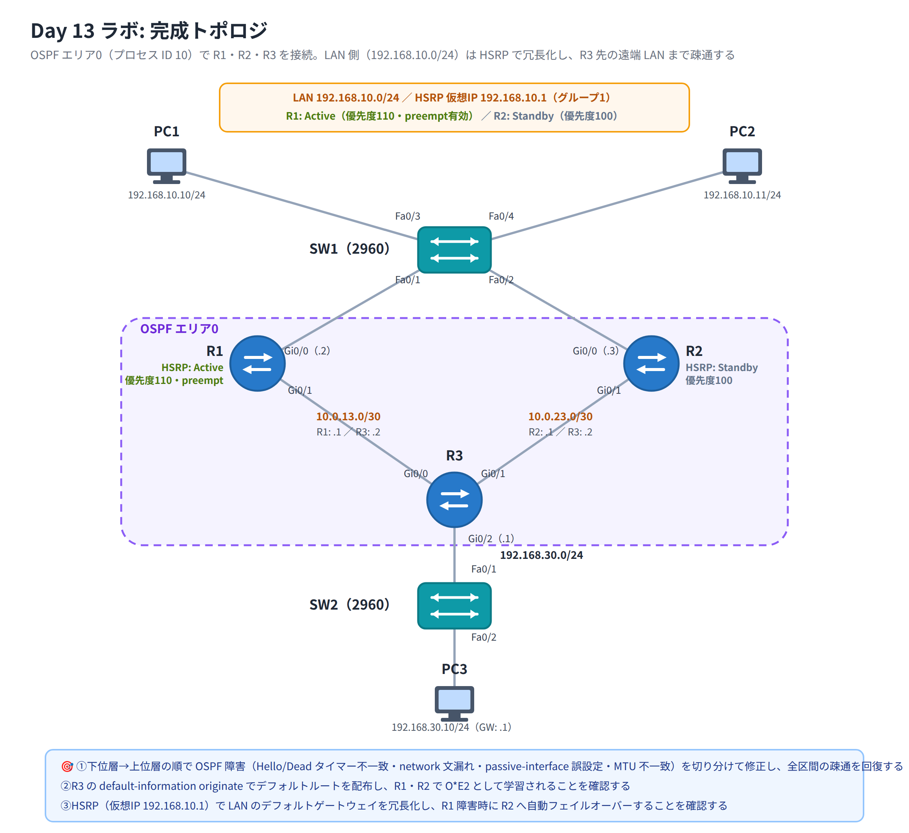

# Day 13 ラボ手順書: OSPF トラブルシューティングと HSRP による
デフォルトゲートウェイ冗長化

> 配置先: ドキュメント `02_ラボ手順書 > Week3 > Day13`
> 所要時間の目安: 2.5 時間 ／ 使用ツール: Cisco Packet Tracer 9.x

## ゴール

- 意図的なミスを含む OSPF トポロジを、下位層から上位層へと**体系的に切り分けて**
  発見・修正し、全区間の疎通を回復させる
- ASBR（R3）から OSPF ドメインへデフォルトルートを配布し、他ルータで
  `O*E2` として学習されることを確認する
- LAN のデフォルトゲートウェイを **HSRP** で冗長化し、Active ルータの障害時に
  Standby ルータが自動的に引き継ぐことを、連続 ping を実行しながら確認する

## 完成トポロジ

R1・R2 が LAN（`192.168.10.0/24`）を共有し、HSRP でゲートウェイを冗長化します。
R1・R2 はそれぞれ R3 と個別リンクで接続し、R3 の先に遠端 LAN
（`192.168.30.0/24`、PC3）があります。全ルータをエリア 0 のシングルエリア
OSPF（プロセス ID 10）で構成します。



> R3 の先には実際の ISP ルータを用意しません。手順 8 で、受け取ったパケットを
> そのまま捨てる仮想インターフェース **Null0**（ルータに内蔵された「ゴミ箱」の
> ようなインターフェース）宛のスタティックルート `ip route 0.0.0.0 0.0.0.0
> Null0` を使い、疑似的な「ISP 向けデフォルトルート」として
> `default-information originate` の動作を確認します。

### IP アドレス表

| 機器 | インターフェース | IPv4 アドレス | 接続先 | 備考 |
|---|---|---|---|---|
| R1 | Gi0/0 | 192.168.10.2/24 | SW1 Fa0/1 | LAN／HSRP（優先ルータ予定） |
| R1 | Gi0/1 | 10.0.13.1/30 | R3 Gi0/0 | OSPF コアリンク |
| R2 | Gi0/0 | 192.168.10.3/24 | SW1 Fa0/2 | LAN／HSRP |
| R2 | Gi0/1 | 10.0.23.1/30 | R3 Gi0/1 | OSPF コアリンク |
| R3 | Gi0/0 | 10.0.13.2/30 | R1 Gi0/1 | OSPF コアリンク |
| R3 | Gi0/1 | 10.0.23.2/30 | R2 Gi0/1 | OSPF コアリンク |
| R3 | Gi0/2 | 192.168.30.1/24 | SW2 Fa0/1 | 遠端 LAN |
| PC1 | NIC | 192.168.10.10/24（GW: .1） | SW1 Fa0/3 | HSRP 仮想 IP をゲートウェイに設定 |
| PC2 | NIC | 192.168.10.11/24（GW: .1） | SW1 Fa0/4 | HSRP 仮想 IP をゲートウェイに設定 |
| PC3 | NIC | 192.168.30.10/24（GW: .1） | SW2 Fa0/2 | R3 の物理 IP がそのままゲートウェイ |

- HSRP 仮想 IP: `192.168.10.1`（グループ 1） ／ R1 = Active 予定（priority 110、
  preempt 有効）、R2 = Standby 予定（priority 既定 100）

---

## 手順 1: トポロジの作成と IP アドレス設定・下位層確認（10 分）

1. Router **2911** を 3 台（R1〜R3）、Switch **2960** を 2 台（SW1・SW2）、
   PC を 3 台（PC1〜PC3）配置する
2. 上記トポロジ・IP アドレス表のとおりにケーブル（ストレート）で接続する
3. 各ルータで、接続したインターフェースに IP アドレスを設定し有効化する

   ```
   Router> enable
   Router# configure terminal
   Router(config)# hostname R1
   R1(config)# interface GigabitEthernet0/0
   R1(config-if)# ip address 192.168.10.2 255.255.255.0
   R1(config-if)# no shutdown
   R1(config-if)# exit
   R1(config)# interface GigabitEthernet0/1
   R1(config-if)# ip address 10.0.13.1 255.255.255.252
   R1(config-if)# no shutdown
   R1(config-if)# exit
   ```

4. 同様に R2・R3 も IP アドレス表のとおりに設定する（R3 は Gi0/0・Gi0/1・Gi0/2 の
   3 つ）
5. PC1〜PC3 にも [Desktop] → [IP Configuration] から IP アドレス・サブネット
   マスク・デフォルトゲートウェイを設定する
6. 全リンクの●が緑になっていることを、`show ip interface brief` と直結 PC 間の
   ping（例: PC1 から SW1 経由で PC2）で確認する。この時点では PC1↔PC3 の
   疎通はまだ確認しません（OSPF 未構成のため）

## 手順 2: OSPF プロセスの起動（15 分）

各ルータで OSPF プロセス（プロセス ID 10）を起動し、`network` 文と
`passive-interface` を投入します。**この手順どおりに投入すると、演習用に
仕込まれた設定ミスにより、一部区間でネイバーが正常に成立しません。**
以降の手順で、これらを自力で発見・修正していきます。

R1:

```
R1(config)# router ospf 10
R1(config-router)# network 192.168.10.0 0.0.0.255 area 0
R1(config-router)# network 10.0.13.0 0.0.0.3 area 0
R1(config-router)# passive-interface GigabitEthernet0/0
R1(config-router)# exit
R1(config)# interface GigabitEthernet0/1
R1(config-if)# ip ospf hello-interval 5
R1(config-if)# ip mtu 1400
R1(config-if)# exit
```

R2:

```
R2(config)# router ospf 10
R2(config-router)# network 192.168.10.0 0.0.0.255 area 0
R2(config-router)# passive-interface GigabitEthernet0/0
R2(config-router)# exit
```

（R2 では意図的に `10.0.23.0/30` 向けの `network` 文をまだ入力していません）

R3:

```
R3(config)# router ospf 10
R3(config-router)# network 10.0.13.0 0.0.0.3 area 0
R3(config-router)# network 10.0.23.0 0.0.0.3 area 0
R3(config-router)# network 192.168.30.0 0.0.0.255 area 0
R3(config-router)# passive-interface GigabitEthernet0/2
R3(config-router)# passive-interface GigabitEthernet0/1
R3(config-router)# exit
```

各ルータで `show ip ospf neighbor` を実行し、ネイバーの状態を記録してください。
この時点では **R1-R3 間・R2-R3 間ともにネイバーが正常に Full になりません**。

ここからが本日の山場です。4 つの障害を一つずつ切り分けていきますが、
「状態（State）を見る → 疑わしい原因を絞る → 設定を比較する」の順で進めれば
必ず特定できます。時間をかけて構いません。

## 手順 3: 障害 1（タイマ不一致・Init 停滞）の切り分けと修正（15 分）

1. R1 と R3 で `show ip ospf neighbor` を実行し、R1-R3 間のネイバー状態を確認する
   （現れない、または Init のまま停滞していないか）
2. 両ルータの `show ip ospf interface GigabitEthernet0/1`（R1）・
   `GigabitEthernet0/0`（R3）を実行し、**Hello interval / Dead interval** を
   比較する

   ```
   R1# show ip ospf interface GigabitEthernet0/1
   R3# show ip ospf interface GigabitEthernet0/0
   ```

3. **確認**: R1 側の Hello interval が `5` 秒（既定の 10 秒から変更されている）に
   なっており、R3 側と一致していないことを特定する
4. R1 側のタイマを既定値へ戻す

   ```
   R1(config)# interface GigabitEthernet0/1
   R1(config-if)# no ip ospf hello-interval
   R1(config-if)# exit
   ```

5. 再度 `show ip ospf neighbor` を確認する（次の障害が残っているため、
   まだ Full にはならない可能性があります。State を記録してください）

## 手順 4: 障害 2（network 文漏れ・状態 Down）の切り分けと修正（10 分）

1. R2 で `show ip protocols` を実行し、OSPF が広告対象としているネットワークの
   一覧を確認する

   ```
   R2# show ip protocols
   ```

2. **確認**: `10.0.23.0/30`（R2-R3 間リンク）が一覧に含まれておらず、
   `network` 文が漏れていることを特定する
3. 抜けているネットワークを追加する

   ```
   R2(config)# router ospf 10
   R2(config-router)# network 10.0.23.0 0.0.0.3 area 0
   R2(config-router)# exit
   ```

4. `show ip ospf neighbor` を R2・R3 双方で確認する（次の障害が残っているため、
   まだ Full にはならない可能性があります）

## 手順 5: 障害 3（passive-interface 誤設定）の切り分けと修正（10 分）

1. R3 で `show ip protocols` を実行し、Passive Interface の一覧を確認する

   ```
   R3# show ip protocols
   ```

2. **確認**: 本来 LAN 側（`GigabitEthernet0/2`）だけがパッシブであるべきところ、
   バックボーンリンクの `GigabitEthernet0/1`（R2 との接続）まで誤って
   パッシブに設定されていることを特定する
3. 誤設定を解除する

   ```
   R3(config)# router ospf 10
   R3(config-router)# no passive-interface GigabitEthernet0/1
   R3(config-router)# exit
   ```

4. R2・R3 で `show ip ospf neighbor` を確認し、R2-R3 間が **FULL** になったことを
   確認する

## 手順 6: 障害 4（MTU 不一致・Exstart 停滞）の切り分けと修正（10 分）

1. R1・R3 で `show ip ospf neighbor` を確認する。R1-R3 間のネイバーが
   **EXSTART** または **EXCHANGE** のまま停滞していないか確認する
2. 両ルータの IP MTU を比較する（OSPF の DBD MTU チェックは IP MTU を見るため、
   L2 の `show interfaces` ではなく `show ip interface` で確認します）

   ```
   R1# show ip interface GigabitEthernet0/1 | include MTU
   R3# show ip interface GigabitEthernet0/0 | include MTU
   ```

3. **確認**: R1 側の IP MTU が `1400`（既定の 1500 から変更されている）になっており、
   R3 側と一致していないことを特定する
4. R1 側の MTU を既定値へ戻す

   ```
   R1(config)# interface GigabitEthernet0/1
   R1(config-if)# no ip mtu
   R1(config-if)# exit
   ```

5. `show ip ospf neighbor` を R1・R3 双方で確認し、**FULL** になったことを確認する

## 手順 7: 全区間の疎通確認（10 分）

1. 各ルータで `show ip route ospf` を実行し、他ルータの LAN（`192.168.30.0/24`
   など）が OSPF で学習されていることを確認する
2. PC1（`192.168.10.10`）から PC3（`192.168.30.10`）へ ping を実行し、
   全区間の疎通が回復したことを確認する
3. 疎通しない場合は、手順 3〜6 のいずれかの修正が漏れていないか
   `show ip ospf neighbor` で全リンクが FULL であることを再確認する

## 手順 8: OSPF によるデフォルトルート配布（10 分）

R3 に疑似的な ISP 向けデフォルトルートを設定し、OSPF ドメイン全体へ配布します。

```
R3(config)# ip route 0.0.0.0 0.0.0.0 Null0
R3(config)# router ospf 10
R3(config-router)# default-information originate
R3(config-router)# exit
```

## 手順 9: 受信側での確認（5 分）

R1・R2 で次を実行し、デフォルトルートが学習されていることを確認します。

```
R1# show ip route
R2# show ip route
```

**確認**: `O*E2  0.0.0.0/0 [110/1] via 10.0.13.2` のように、`O*E2` として
デフォルトルートが表示されていること。あわせて R3 で
`show ip ospf database external` を実行し、外部 LSA が生成されていることを
確認する。

## 手順 10: R1 で HSRP を設定する（10 分）

LAN 側インターフェース（Gi0/0）に HSRP バージョン 2 とグループ 1 を設定します。
R1 を優先ルータ（Active）にするため、プライオリティを上げ、プリエンプトを
有効にします。

```
R1(config)# interface GigabitEthernet0/0
R1(config-if)# standby version 2
R1(config-if)# standby 1 ip 192.168.10.1
R1(config-if)# standby 1 priority 110
R1(config-if)# standby 1 preempt
R1(config-if)# exit
```

## 手順 11: R2 で HSRP を設定する（5 分）

R2 はプライオリティを既定値（100）のまま、同じグループに参加させます。

```
R2(config)# interface GigabitEthernet0/0
R2(config-if)# standby version 2
R2(config-if)# standby 1 ip 192.168.10.1
R2(config-if)# exit
```

## 手順 12: HSRP の状態確認と PC のゲートウェイ設定（10 分）

1. PC1・PC2 のデフォルトゲートウェイが `192.168.10.1`（HSRP 仮想 IP）に
   設定されていることを確認する（手順 1 で設定済み）
2. R1・R2 で次を実行し、状態を確認する

   ```
   R1# show standby brief
   R2# show standby brief
   ```

3. **確認**: R1 が **Active**、R2 が **Standby** であること、State 列の
   ほかに仮想 IP（`192.168.10.1`）と仮想 MAC アドレスが表示されていることを
   記録する

## 手順 13: 連続 ping の開始と Active 障害の発生（10 分）

1. PC1 の [Desktop] → [Command Prompt] で、遠端 PC3 宛に連続 ping を実行する

   ```
   ping -t 192.168.30.10
   ```

2. 連続 ping を実行したまま、R1 の Gi0/0 をシャットダウンし、Active 障害を
   人為的に発生させる

   ```
   R1(config)# interface GigabitEthernet0/0
   R1(config-if)# shutdown
   ```

## 手順 14: フェイルオーバーの確認（10 分）

1. R2 で `show standby` を実行し、状態が **Standby → Active** に遷移したことを
   確認する

   ```
   R2# show standby
   ```

2. PC1 の連続 ping 画面を観察し、R1 の shutdown 直後に数回だけ応答が途切れた
   （Request timed out）あと、ping が再び成功するようになることを確認し、
   何回程度失われたかを記録する

## 手順 15: 復旧とプリエンプトの確認（5 分）

1. R1 の Gi0/0 を復旧させる

   ```
   R1(config)# interface GigabitEthernet0/0
   R1(config-if)# no shutdown
   ```

2. `show standby brief` を R1・R2 双方で実行し、プリエンプト設定により
   R1 が再び **Active** を奪還したことを確認する

## 手順 16: 保存と提出（5 分）

1. ファイルを保存する: `File > Save As` → `day13_氏名.pkt`
2. 下記の観察レポートに解答する

### 観察レポート（コメント提出用）

以下 3 問に答えて、課題のコメントに記入してください。

1. 4 つの OSPF 障害それぞれについて、ネイバー状態（Down / Init / Exstart 等）と
   原因、確認に用いたコマンド、実施した修正を**表にまとめよ**。
2. R1・R2 の `show ip route` に現れたデフォルトルートは何コード（例: O*E2）で
   表示され、その配布元と広告に用いたコマンドは何か。
3. R1 の Gi0/0 を shutdown した際、`show standby` で R2 の状態はどう遷移し、
   PC からの連続 ping は何回程度失われたか。プリエンプトを有効にした場合と
   無効の場合で復旧挙動はどう変わるか説明せよ。

## 提出方法

1. `day13_氏名.pkt` を Backlog のラボ課題に**添付**する
2. 手順 3〜6・9・12・14・15 の確認結果（`show` コマンドの出力や連続 ping の
   様子、スクリーンショット可）と観察レポートを課題の**コメント**に貼る
3. 課題の状態を「処理済み」に変更する

## うまくいかないとき

| 症状 | 確認すること |
|---|---|
| R1-R3 間のネイバーが Init のまま進まない | `show ip ospf interface` で両側の Hello/Dead interval を比較（手順 3 の修正漏れ） |
| R2-R3 間にネイバーが全く現れない（設定直後） | `show ip protocols` で R2 の `network` 文に `10.0.23.0/30` が含まれているか（手順 4） |
| network 文を追加してもまだネイバーが現れない | R3 側の `show ip protocols` で Passive Interface に該当リンクが入っていないか（手順 5） |
| R1-R3 間が Exstart／Exchange で停滞する | `show ip interface \| include MTU` で両側の IP MTU が 1500 で揃っているか（手順 6。`show interfaces` の MTU は L2 の値のため `ip mtu` の変更を反映しません） |
| PC1-PC3 の ping が通らない | 全リンクの `show ip ospf neighbor` が FULL か、`show ip route ospf` に経路があるか |
| `O*E2` が学習されない | R3 で `ip route 0.0.0.0 0.0.0.0 Null0` と `default-information originate` の両方が投入されているか |
| `show standby brief` で Active/Standby が逆 | R1 の priority が 110 になっているか、`standby 1 ip` の仮想 IP が両ルータで一致しているか |
| R1 復旧後も R2 が Active のまま | R1 に `standby 1 preempt` が設定されているか |

30 分試して解決しない場合は、状況（スクリーンショット + 試したこと）を
課題のコメントに書いて質問してください。
