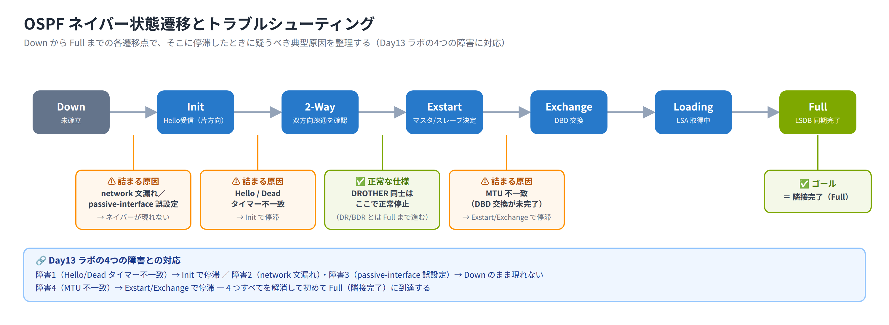

# Day 13 講義: OSPF 応用と FHRP

> 配置先: ドキュメント `01_教材 > Week3 > Day13`
> 学習時間の目安: 3.5 時間 ／ 準拠: CCNA 200-301 v1.1 ドメイン 3

## 学習目標

この講義を終えると、次のことができるようになります。

1. OSPF のネイバー確立条件と状態遷移（Down〜Full）を復習し、正常な停止と異常な
   停滞を区別できる
2. OSPF ネイバーが成立しない・Full まで進まない事例について、原因を切り分けて
   特定できる
3. `default-information originate` を使い、OSPF ドメインへデフォルトルートを
   配布する方法と `always` キーワードの必要性を説明できる
4. **FHRP（First Hop Redundancy Protocol）** の目的を説明し、HSRP・VRRP・GLBP の
   違いを比較できる
5. HSRP の状態遷移・プライオリティ・プリエンプトの動作を理解し、基本設定ができる

> **本日の範囲**: Day12 のシングルエリア基礎を前提に、本日はOSPFの**応用と切り分け**
> （MTU 不一致等のトラブルシュート・`default-information originate` によるデフォルト
> ルート配布・外部経路の E1/E2）を扱います。

---

## ウォームアップ（朝の想起クイズ）

> 教材を見ずに、まず自力で思い出してください（分散学習: Day 6「VLAN の基礎」 /
> Day 10「無線 LAN と検出プロトコル」 / Day 12「OSPFv2（シングルエリア）」 の
> 範囲から出題）。

**W1.** （Day 6）スイッチにおける VLAN の通常範囲（Normal Range）と拡張範囲
（Extended Range）の番号帯はそれぞれ何番から何番か。

**W2.** （Day 10）CDP の既定のアドバタイズ間隔（Hello）とホールドタイムは
何秒か。また、業界標準の検出プロトコルの名称と、それを規定する IEEE 規格番号は
何か。

**W3.** （Day 12）OSPF のインターフェースコストを求める既定の計算式と、
Cisco IOS における既定の基準帯域幅（reference bandwidth）はいくらか。

<details><summary>解答</summary>

- W1: 通常範囲は 1〜1005、拡張範囲は 1006〜4094
- W2: CDP は既定で Hello 60 秒・ホールドタイム 180 秒。業界標準は LLDP
  （IEEE 802.1AB）
- W3: コスト = 基準帯域幅 ÷ インターフェース帯域幅。Cisco IOS の既定の
  基準帯域幅は 10^8（100Mbps）

</details>

---

## 1. OSPF ネイバー確立の条件と状態遷移（復習）

Day12 で学んだ OSPF のネイバー確立条件と状態遷移を、トラブルシューティングの
土台として整理し直します。

### ネイバー成立に一致が必要な項目

2 台のルータが正常にネイバー関係を結び、隣接（**Adjacency**、Full 状態）に
至るためには、両インターフェースで次の項目が一致している必要があります。

| 一致が必要な項目 | 補足 |
|---|---|
| エリア ID | 同一エリアに属していること |
| サブネット / マスク | 同一セグメント上にあること |
| Hello / Dead タイマー | 送信間隔と失効時間 |
| 認証 | 設定している場合、方式・パスワードが一致 |
| スタブフラグ | スタブエリアの設定が一致していること |
| ネットワークタイプ | broadcast / point-to-point など |

一方で **Router ID は一致条件ではなく、ドメイン内で一意（重複なし）であることが
求められます**。Router ID は次の優先順位で決定されます。

1. `router-id` コマンドで**明示的に指定**した値（最優先）
2. 稼働している**ループバックインターフェースの中で最も高い IP アドレス**
3. 稼働している**物理インターフェースの中で最も高い IP アドレス**

Router ID が重複していると、ネイバーが不安定になったり正しく成立しなかったりする
原因になります。

表の**ネットワークタイプ**は、そのリンク上で DR/BDR を選出するかどうかなど、
OSPF の動作モードを決める設定です。Day12 で扱った DR/BDR は broadcast 型の
リンクでの話でしたが、point-to-point 型のリンクでは DR/BDR の選出自体を
行いません。片方が broadcast、もう片方が point-to-point のまま向かい合って
接続されていると、この設定が一致せずネイバーが正しく成立しません。

### 状態遷移のおさらい

```
Down → Init → 2-Way → Exstart → Exchange → Loading → Full
```

| 状態 | 意味 |
|---|---|
| Down | ネイバー情報がまだない初期状態 |
| Init | 相手から Hello を受信したが、自分の Router ID が相手の Hello にまだ載っていない |
| 2-Way | 相手の Hello に自分の Router ID が載っている（双方向疎通を確認） |
| Exstart | DBD 交換のマスタ／スレーブ関係を決定する |
| Exchange | DBD（LSDB の要約情報）を交換する |
| Loading | LSR/LSU で不足している LSA の詳細をやり取りする |
| Full | LSDB の同期が完了した状態 |

ブロードキャストネットワークでは、**DR・BDR とは Full まで進みますが、
DROTHER**（＝DR でも BDR でもない一般ルータ。`show ip ospf neighbor` の State 列に
`DROTHER` と表示されます）**同士は 2-Way で正常に停止します**。これは DR/BDR に
情報を集約する設計上の正常な動作であり、故障ではありません。

### 完全な隣接には MTU 一致が必要

Full まで到達するには、**両インターフェースの MTU（最大転送単位）が一致している**
必要があります。MTU が不一致だと DBD 交換（Exchange 状態相当のパケット）を
正しく完了できず、**Exstart または Exchange で状態が停滞**します。

### 確認コマンド

- `show ip ospf neighbor` — State 列（状態）と Dead Time（残り秒数）を読む
- `show ip ospf interface brief` — インターフェースが OSPF プロセスに
  参加しているか確認する

> **試験のポイント**: OSPF の状態遷移の順序（Down→Init→2-Way→Exstart→Exchange→
> Loading→Full）は頻出です。あわせて「DROTHER 同士は 2-Way で正常停止」という
> 点も覚えておきましょう。

## 2. OSPF ネイバー不成立の原因切り分け

実務でも試験でも、「なぜネイバーが Full にならないのか」を状態別に切り分ける力が
問われます。個々の組み合わせを丸暗記するのではなく、「今どの状態で止まっている
か」から「どの一致条件が壊れていそうか」を逆算する考え方をここで身につけます。
原因と状態の対応を整理します。

### 状態別の典型的な原因

| 観測される状態 | 典型的な原因 |
|---|---|
| Down のまま（ネイバーが全く現れない） | 物理／データリンク断、または `network` コマンド漏れでインターフェースが OSPF に入っていない |
| Init で停滞（2-Way に進めない） | 片方向 Hello（一方向のみ Hello が届く。例: 片側インターフェースの受信 ACL が OSPF マルチキャスト `224.0.0.5` を遮断、単方向リンク障害など） |
| ネイバー自体が成立しない（現れない） | サブネット／マスク不一致、エリア ID 不一致、認証不一致、**Hello／Dead タイマー不一致**（設定が一致しない Hello は相手に破棄され、隣接そのものが形成されないため、Init にすら進まずネイバーは表示されません） |
| Exstart／Exchange で停滞 | MTU 不一致（DBD 交換が完了しない） |
| ネイバーが全く現れない（Hello 自体が出ていない） | `passive-interface` の誤設定（バックボーン LAN 側に誤って設定しやすい） |
| ネイバーが成立しない／不安定 | ネットワークタイプ不一致（broadcast と point-to-point の組み合わせなど）、Router ID 重複 |

### Hello / Dead タイマーの既定値

タイマーはネットワークタイプによって既定値が異なります。両ルータで**必ず一致**
している必要があります。

| ネットワークタイプ | Hello（既定） | Dead（既定） |
|---|---|---|
| ブロードキャスト／P2P | 10 秒 | 40 秒 |
| NBMA | 30 秒 | 120 秒 |

> **試験のポイント**: ネイバーがそもそも成立しない（現れない）原因として、
> Hello・Dead タイマー不一致やサブネット・エリア ID・認証の不一致を切り分けさせる
> 問題が頻出です。既定値（ブロードキャスト／P2P で 10/40 秒）もあわせて覚えましょう。

### passive-interface の誤設定に注意

`passive-interface` を設定したインターフェースは Hello パケットを送出しなくなる
ため、そのインターフェース経由ではネイバーを一切作れません。LAN 側の端末収容
インターフェースに設定するのが本来の使い方ですが、**誤ってバックボーン側（ルータ間
リンク）に設定してしまうと、そこでネイバーが一切現れなくなります**。

> **試験のポイント**: `network` コマンド漏れや `passive-interface` の誤設定によって
> ネイバーができないケースを特定させる問題が頻出です。「State が表示されず、
> `show ip ospf interface brief` にそのインターフェース自体が出ない／Hello が
> 出ていない」ことに気づけるかがポイントです。

ここまでの内容を、状態遷移の流れに沿って整理すると次のようになります。



### 切り分けに使うコマンド

| コマンド | 用途 |
|---|---|
| `show ip ospf neighbor` | ネイバーの有無と状態（State）を確認 |
| `show ip ospf interface` | エリア・タイマー・MTU・DR/BDR・パッシブ設定などを確認 |
| `show ip protocols` | OSPF が有効なネットワーク、パッシブインターフェースの一覧を確認 |
| `show ip route ospf` | OSPF から学習できている経路を確認 |
| `debug ip ospf adj` | 隣接形成（Adjacency）の詳細な過程をリアルタイムに確認 |
| `debug ip ospf hello` | Hello パケットの送受信状況をリアルタイムに確認 |

### 切り分けの型（下位層から上位層へ）

トラブルシューティングは、次の順序で**下位層から上位層へ**確認を進めるのが基本です。

1. **物理層／データリンク層**: リンクが up しているか、ケーブル・ポートに誤りが
   ないか
2. **IP 疎通**: 直結セグメントで IP の疎通（同一サブネットか、アドレス設定に
   誤りがないか）が取れているか
3. **インターフェースが OSPF に入っているか**: `network` 文の漏れ、
   `passive-interface` の誤設定がないか
4. **タイマー／サブネット／エリア／認証／MTU の一致確認**: `show ip ospf
   interface` で両側の値を突き合わせる

> **試験のポイント**: OSPF ネイバーのトラブルシューティングは、
> 「下位層→上位層」の順で切り分ける型を身につけているかが問われます。
> いきなり MTU や認証を疑うのではなく、まず物理・IP 疎通・`network` 文の漏れが
> ないかを確認する順序を意識しましょう。

## 3. OSPF によるデフォルトルート配布（default-information originate）

社内ネットワークの出口（インターネットや他部門への境界）となるルータ
（**ASBR**、Autonomous System Boundary Router）から、OSPF ドメイン全体へ
デフォルトルート（`0.0.0.0/0`）を配布する方法を学びます。

### 基本コマンド

```
Router(config)# router ospf 10
Router(config-router)# default-information originate
```

`default-information originate` を実行すると、そのルータ自身が持つデフォルト
ルートを OSPF の**外部 LSA（Type 5 / AS-External LSA）**としてドメイン全体へ
広告します。受信側では既定でメトリックタイプ **E2（外部タイプ 2）** の経路として
学習されます。

### 前提条件と always キーワード

**既定では、実行したルータ自身のルーティングテーブルにデフォルトルートが
存在しないと広告されません。** 例えば、ISP 向けの静的デフォルトルートを
あらかじめ設定しておく必要があります。

```
Router(config)# ip route 0.0.0.0 0.0.0.0 <next-hop>
```

自身にデフォルトルートが存在しなくても常に広告したい場合は、`always`
キーワードを付けます。

```
Router(config-router)# default-information originate always
```

`always` を付けると、自身の出口が実際にはダウンしていても常にデフォルトルートを
広告し続けてしまうため、**誤設定によるブラックホール化（経路はあるが実際には
届かない状態）に注意**が必要です。

> 💼 **実務では**: `always` が付いているかどうかは設計書・手順書に意図が
> 書かれているはずの項目で、保守担当が現場判断で付け外ししてよい設定では
> ありません。「配下のエリア全体が死んだ出口へトラフィックを送り続けている」
> 症状に気づいたら、まず `show ip route` や `show ip ospf database external`
> で広告元と実際の経路を確認し、広告元ルータ自身がその出口へ本当に到達できて
> いるかを切り分けたうえで、手順書のエスカレーション基準に沿って先輩へ報告
> します。IP SLA と object tracking を組み合わせた自動退避構成の設計・変更は、
> 保守で経路の読み方と切り分けの勘所を認められたエンジニアが次に任されやすい
> 領域です。

> **試験のポイント**: `default-information originate` の動作と、`always`
> キーワードが必要になる条件（自身にデフォルトルートが存在しない場合でも
> 常に広告したいとき）を問う問題が頻出です。

### 受信側での見え方

デフォルトルートを受信した他のルータでは、外部経路として次のように表示されます。

```
O*E2  0.0.0.0/0 [110/1] via <next-hop>, GigabitEthernet0/1
```

- `O*E2` の `*` は**候補デフォルトルート**であることを示す印です（実際に
  ルーティングテーブルで採用されているデフォルトルートに付きます）。`E2` は
  **OSPF 外部経路タイプ 2** であることを示します
- **E2（既定）はメトリックが固定**され、途中のルータを何台経由しても
  広告時に設定されたメトリック値のまま変わりません
- `metric-type 1` を指定すると **E1（累積メトリック）** に変更でき、
  ドメイン内を経由するコストが加算されるようになります
- 表示例の `[110/1]` は、左側が **管理距離（AD、Administrative Distance）**
  で OSPF は内部・外部経路のいずれも既定で **AD 110**、右側が
  **メトリック（コスト）** を表します

```
Router(config-router)# default-information originate metric-type 1
```

### 検証コマンド

| コマンド | 実行場所 | 確認内容 |
|---|---|---|
| `show ip route` | 受信側ルータ | `O*E2 0.0.0.0/0` が学習されているか |
| `show ip ospf database external` | 配布元ルータ | 広告している外部 LSA の内容 |

> **試験のポイント**: 受信側での外部デフォルトルートの表示コード（`O*E2`）と、
> それが ASBR からの Type 5 External LSA（メトリックタイプは既定で E2）に
> よるものであることを問う問題が頻出です。あわせて AD（経路選択の優先度）と
> メトリック（同一プロトコル内のコスト）を混同しないようにしましょう。

## 4. FHRP の目的と 3 方式の比較（HSRP / VRRP / GLBP）

### FHRP とは何か、何を解決するのか

**FHRP（First Hop Redundancy Protocol）** とは、複数台のルータで
**1 つの仮想 IP アドレス**と**仮想 MAC アドレス**を共有し、LAN 上の端末から見た
**デフォルトゲートウェイを冗長化**する仕組みの総称です。デフォルトゲートウェイは、
Week0 P5 で「町の外へ出るときに必ず通る町の出口」にたとえた、あの設定項目です。

端末（PC）は仮想 IP アドレスをデフォルトゲートウェイとして設定するだけでよく、
実際にどのルータが転送を担当しているかを意識する必要はありません。ゲートウェイ側の
ルータに障害が発生しても、**端末側の設定を変更することなく**別のルータへ
自動的に切り替わります。

FHRP が解決する課題は、デフォルトゲートウェイが 1 台のルータに固定されることで
生じる**単一障害点（Single Point of Failure）**の排除です。

### 3 方式の比較

| 項目 | HSRP | VRRP | GLBP |
|---|---|---|---|
| 標準化 | シスコ独自 | 業界標準（RFC 5798） | シスコ独自 |
| 役割の呼び方 | Active / Standby | Master / Backup | AVG（Active Virtual Gateway）/ AVF（Active Virtual Forwarder） |
| 転送するルータ数 | Active の 1 台のみ | Master の 1 台のみ | 複数台で同時に転送可能（負荷分散） |
| プリエンプト既定 | 無効 | 有効 | 無効（AVG のプリエンプトは既定で無効） |

- **HSRP**（Hot Standby Router Protocol）: シスコ独自方式。Active / Standby の
  1 台構成で、Active のみが転送を行う
- **VRRP**（Virtual Router Redundancy Protocol）: 業界標準（RFC 5798）で、
  マルチベンダ環境でも利用できる。Master / Backup で構成される
- **GLBP**（Gateway Load Balancing Protocol）: シスコ独自方式。**AVG** が
  複数の **AVF** に対して負荷を分散させる点が HSRP・VRRP と最も異なる特徴で、
  複数台のルータが**同時に**転送を行える（ロードバランシング）

> **試験のポイント**: HSRP・VRRP・GLBP の違い（独自方式か標準か、
> Active-Standby 構成か負荷分散が可能か、プリエンプトの既定値）を比較させる
> 問題が頻出です。GLBP だけが複数台同時転送に対応する点を押さえましょう。

### 使い分けの要点

- シンプルな冗長化で、機器がすべてシスコ製 → **HSRP**
- 他社製ルータと混在する環境で標準プロトコルが必要 → **VRRP**
- 冗長化に加えて複数ルータへの負荷分散も行いたい → **GLBP**

## 5. HSRP の動作詳細（プライオリティ・プリエンプト）

### HSRP のバージョン

| 項目 | HSRP v1（既定） | HSRP v2 |
|---|---|---|
| グループ番号の範囲 | 0〜255 | 0〜4095 |
| 仮想 MAC アドレス | `0000.0c07.acXX`（XX = グループ番号） | `0000.0c9f.fXXX` |
| マルチキャストアドレス | `224.0.0.2` | `224.0.0.102` |
| 使用ポート | UDP 1985 | UDP 1985 |

v1 の仮想 MAC アドレスの末尾 `XX` は、**グループ番号を 16 進数で表したもの**が
入ります。バージョンを切り替えたい場合は次のコマンドを使用します。

```
Router(config-if)# standby version 2
```

> **試験のポイント**: HSRP v1→v2 の変更点は次の 4 点をワンセットで
> 覚えましょう。マルチキャストアドレス（v1: `224.0.0.2` → v2:
> `224.0.0.102`）、UDP ポート（v1・v2 とも変わらず 1985）、グループ番号の
> 範囲（v1: 0〜255 → v2: 0〜4095 に拡張）、仮想 MAC アドレス（v1:
> `0000.0c07.acXX` → v2: `0000.0c9f.fXXX`）。

### プライオリティと Active の選出

- プライオリティの**既定値は 100**（設定可能範囲は 0〜255）
- **プライオリティの値が高いルータが Active** になる
- プライオリティが**同値の場合は、IP アドレスが大きい方**のルータが Active になる

```
Router(config-if)# standby 1 priority 110
```

### プリエンプトは既定で無効

**プリエンプト（preempt、`standby <グループ番号> preempt`）**とは、より高い
プライオリティを持つルータが後から Active に復帰した際に、そのときの Active
ルータから座を強制的に奪い返す動作のことです。この機能は**既定で無効**です。
有効にしていないと、後から復旧した高プライオリティのルータが存在しても、
**Active の座を自動的に奪い返すことはありません**（先に Active になったルータが
そのまま Active であり続けます）。

```
Router(config-if)# standby 1 preempt
```

> **試験のポイント**: HSRP のプリエンプトが既定で無効であること、プライオリティの
> 既定値が 100 であること、Active の選出ルール（高プライオリティ優先、同値なら
> 高 IP アドレス優先）は繰り返し問われる重要ポイントです。

### 状態遷移とタイマー

HSRP のルータは次の順序で状態が遷移します。

```
Initial → Learn → Listen → Speak → Standby → Active
```

既定のタイマーは **Hello 3 秒 / Hold（Dead）10 秒**です。

### インターフェーストラッキング

**インターフェーストラッキング**（`standby <グループ番号> track`）を設定すると、
指定したインターフェース（多くは上位側の WAN やアップリンク）に障害が発生した際に
**自身のプライオリティを自動的に減算**できます。これをプリエンプトと組み合わせる
ことで、上位リンク障害時に自動的に Standby 側へ Active を譲るフェイルオーバーが
実現できます。

```
Router(config-if)# standby 1 track GigabitEthernet0/1 20
```

（上位リンクがダウンした場合、プライオリティを 20 減算する設定例）

> 💼 **実務では**: HSRP は多くの現場で L3 スイッチの SVI 上にすでに構築済みで、
> 保守担当が preempt や track の値を自分の判断で変更することは基本的に
> ありません。日常の監視・点検では `show standby brief` で Active／Standby
> と仮想 IP を両系突き合わせ、「片方がずっと Active のまま戻っていない」
> 「仮想 IP やグループ番号が両系で食い違っている」といった兆候を見つけたら、
> 原因の見当をつけつつも設定は変更せず、手順書の基準に沿って観測結果を先輩へ
> エスカレーションします。トラッキングと preempt を組み合わせた自動フェイル
> オーバー設計は、保守で切り分け力を認められた先に任されることが多い構築寄り
> の領域です。

### 端末側から見た挙動

端末（PC）は**仮想 IP アドレスをデフォルトゲートウェイとして設定**します。ARP
要求に対しては、Active ルータが**仮想 MAC アドレス**で応答します。Active に
障害が発生すると、Standby ルータが同じ仮想 IP・仮想 MAC を引き継ぐため、
**端末側の設定は一切変更する必要がありません**。

### 主要な設定・確認コマンド

| コマンド | 用途 |
|---|---|
| `standby version 2` | HSRP のバージョンを v2 に切り替える |
| `standby <grp> ip <仮想IP>` | グループの仮想 IP アドレスを設定する |
| `standby <grp> priority <値>` | プライオリティを設定する（既定 100） |
| `standby <grp> preempt` | プリエンプトを有効にする |
| `standby <grp> track <IF> [減算値]` | インターフェーストラッキングを設定する |
| `show standby` | 状態・タイマー・プライオリティなどの詳細を確認する |
| `show standby brief` | グループごとの状態を一覧表示する |

## 6. まとめ

- OSPF ネイバーが Full に至るには、エリア ID・サブネット・タイマー・認証・
  スタブフラグ・ネットワークタイプの一致と、MTU の一致（Exstart/Exchange 停滞の
  典型原因）が必要
- ネイバー不成立の切り分けは、下位層（物理／IP 疎通）→ OSPF への参加
  （`network` 漏れ・`passive-interface` 誤設定）→ タイマー／サブネット／エリア／
  認証／MTU の一致確認、という順で進める
- `default-information originate` で ASBR からデフォルトルートを OSPF ドメインへ
  配布できる。自身にデフォルトルートが無い場合は `always` が必要。受信側では
  `O*E2` として表示される
- FHRP はデフォルトゲートウェイの単一障害点を排除する仕組み。HSRP（シスコ独自・
  Active/Standby）、VRRP（標準・Master/Backup）、GLBP（シスコ独自・複数台同時
  転送）の 3 方式がある
- HSRP のプライオリティ既定値は 100、Active は高プライオリティ（同値は高 IP）で
  選出される。プリエンプトは既定で無効

---

## 確認問題（自己チェック・解答は末尾）

1. OSPF のネイバーが Exstart または Exchange で停滞している場合、まず疑うべき
   原因は何か。
2. `passive-interface` をルータ間のバックボーンリンクに誤って設定してしまうと、
   ネイバーの状態はどのように観測されるか。
3. 自身にデフォルトルートが存在しない ASBR で、常に OSPF ドメインへデフォルト
   ルートを広告したい場合に必要なコマンドは何か。
4. HSRP v1 でグループ番号が 5 の場合、仮想 MAC アドレスはどうなるか。
5. HSRP でプリエンプトを有効にしていないとき、障害から復旧した高プライオリティの
   ルータは自動的に Active に戻るか。

<details><summary>解答</summary>

1. MTU の不一致。DBD 交換が完了できず Exstart／Exchange で状態が停滞する
2. Hello パケットがそのインターフェースから送出されなくなるため、ネイバーが
   一切現れない（`show ip ospf interface brief` にそのインターフェースが
   OSPF 有効として出るが、ネイバーは表示されない）
3. `default-information originate always`
4. `0000.0c07.ac05`（グループ番号 5 を 16 進数 2 桁で表した `05` が末尾になる）
5. 戻らない。プリエンプトを有効にしない限り、先に Active になったルータが
   そのまま Active であり続ける

</details>

## 次のステップ

本日のラボ課題「[Day13] ラボ: OSPF トラブルシューティングと HSRP による
デフォルトゲートウェイ冗長化」に進み、意図的に組み込まれた OSPF の障害を
切り分けて全区間の疎通を回復させたうえで、HSRP によるゲートウェイ冗長化と
フェイルオーバーの動作を実際に確認してください。
