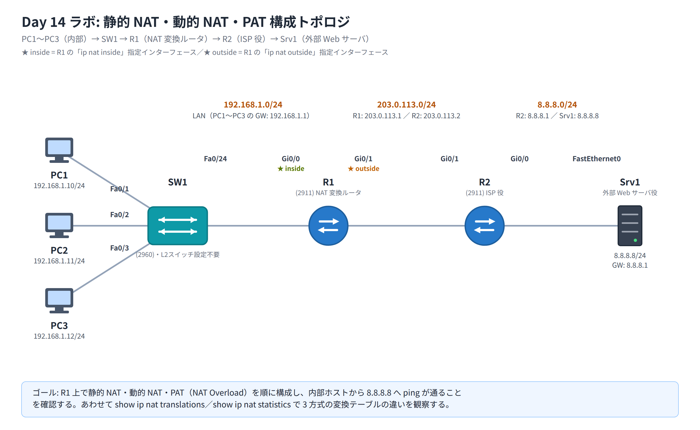

# Day 14 ラボ手順書: 静的 NAT・動的 NAT・PAT の構成と変換テーブルの観察

> 配置先: ドキュメント `02_ラボ手順書 > Week3 > Day14`
> 所要時間の目安: 2.5 時間 ／ 使用ツール: Cisco Packet Tracer 9.x

## ゴール

- 1 台のルータ上で静的 NAT・動的 NAT・PAT（NAT Overload）を順に構成できる
- 内部ホストから外部（模擬インターネット上のサーバ）へ通信したときに、変換テーブルが
  どのように生成されるかを `show ip nat translations` / `show ip nat statistics` で観察できる
- 3 方式の違い（1 対 1 固定・動的プール割当・ポート多重化）を実機挙動として説明できる

## 完成トポロジ



### IP アドレス表

| 機器 | インターフェース | IP アドレス | 備考 |
|---|---|---|---|
| PC1 | Fa0 | 192.168.1.10/24 | GW: 192.168.1.1 |
| PC2 | Fa0 | 192.168.1.11/24 | GW: 192.168.1.1 |
| PC3 | Fa0 | 192.168.1.12/24 | GW: 192.168.1.1 |
| SW1 | Fa0/1〜Fa0/3, Fa0/24 | — | L2 スイッチ、設定不要 |
| R1 | Gi0/0 | 192.168.1.1/24 | `ip nat inside` |
| R1 | Gi0/1 | 203.0.113.1/24 | `ip nat outside` |
| R2 | Gi0/1 | 203.0.113.2/24 | R1 との WAN リンク |
| R2 | Gi0/0 | 8.8.8.1/24 | Srv1 側セグメント |
| Srv1 | FastEthernet0 | 8.8.8.8/24 | GW: 8.8.8.1、外部 Web サーバ役 |

R1 の Gi0/0 が **inside**、Gi0/1 が **outside** です。グローバルアドレスとして
`203.0.113.0/24` 帯（演習用に静的・動的・PAT でそれぞれ別アドレスを使用）を利用します。

---

## 手順 1: 基本構成（30 分）

1. PC1〜PC3 に、それぞれ `192.168.1.10`〜`.12`、サブネットマスク `255.255.255.0`、
   デフォルトゲートウェイ `192.168.1.1` を設定する
2. Srv1 に `8.8.8.8`、サブネットマスク `255.255.255.0`、デフォルトゲートウェイ
   `8.8.8.1` を設定する
3. R1・R2 の各インターフェースに IP アドレスを設定し、`no shutdown` で有効化する

   ```
   R1(config)# interface GigabitEthernet0/0
   R1(config-if)# ip address 192.168.1.1 255.255.255.0
   R1(config-if)# no shutdown
   R1(config-if)# exit
   R1(config)# interface GigabitEthernet0/1
   R1(config-if)# ip address 203.0.113.1 255.255.255.0
   R1(config-if)# no shutdown
   ```

   ```
   R2(config)# interface GigabitEthernet0/1
   R2(config-if)# ip address 203.0.113.2 255.255.255.0
   R2(config-if)# no shutdown
   R2(config-if)# exit
   R2(config)# interface GigabitEthernet0/0
   R2(config-if)# ip address 8.8.8.1 255.255.255.0
   R2(config-if)# no shutdown
   ```

4. R2 で Srv1 方向と WAN 方向の疎通を確保する。**静的 NAT・動的 NAT で使う
   グローバルアドレス（`203.0.113.10` や `.20`〜`.21`）は、必ず R2 が経路を
   持てる範囲に含めておく必要があります**。本ラボでは R1 の外部インターフェース
   を `203.0.113.0/24` で構成しているため、これらのグローバルアドレスは R2 の
   connected ネットワークに含まれ、R1 の Proxy ARP により R2 は追加の
   ルーティング設定なしで戻りパケットを転送できます（R1→R2 側の到達確認は
   次で行う）
5. R1 にデフォルトルートを設定し、外部到達性を用意する（**変換前にこれを
   済ませておくことが重要**）

   ```
   R1(config)# ip route 0.0.0.0 0.0.0.0 203.0.113.2
   ```

6. R1 から `ping 8.8.8.8` を実行し、Srv1 まで到達できることを確認する
   （この時点では NAT 未設定のため、R2 の connected な 2 ネットワーク
   （`203.0.113.0/24` と `8.8.8.0/24`）だけで完結する単純な疎通確認です。
   もし外部インターフェースを `/30` のように狭いマスクで構成する場合は、
   静的・動的 NAT のグローバルアドレスが connected 範囲外になるため、
   `ip route 203.0.113.0 255.255.255.0 203.0.113.1` のような明示的な戻り経路を
   R2 に追加する必要があります）

## 手順 2: inside / outside インターフェースの割り当て（10 分）

```
R1(config)# interface GigabitEthernet0/0
R1(config-if)# ip nat inside
R1(config-if)# exit
R1(config)# interface GigabitEthernet0/1
R1(config-if)# ip nat outside
```

この設定がないと、以降どの NAT 方式を設定しても変換は行われません。

## 手順 3: 静的 NAT の構成と観察（20 分）

1. PC1（192.168.1.10）を固定的に `203.0.113.10` として外部公開する

   ```
   R1(config)# ip nat inside source static 192.168.1.10 203.0.113.10
   ```

2. PC1 のコマンドプロンプトから `ping 8.8.8.8` を実行する
3. R1 で変換テーブルを確認する

   ```
   R1# show ip nat translations
   ```

   - `Pro` 列が `---`、`Inside global` が `203.0.113.10`、`Inside local` が
     `192.168.1.10` の行が、通信の有無にかかわらず**常時**表示されることを確認する

4. 次の演習に備え、静的エントリを削除する

   ```
   R1(config)# no ip nat inside source static 192.168.1.10 203.0.113.10
   ```

## 手順 4: 動的 NAT の構成と観察（30 分）

1. 変換対象の内部アドレス範囲を ACL で定義する

   ```
   R1(config)# access-list 1 permit 192.168.1.0 0.0.0.255
   ```

2. グローバルアドレスプールを作成する（**あえて 2 個だけ**にし、後で枯渇を再現する）

   ```
   R1(config)# ip nat pool DYN 203.0.113.20 203.0.113.21 netmask 255.255.255.0
   ```

3. ACL とプールを結び付けて動的 NAT を有効化する

   ```
   R1(config)# ip nat inside source list 1 pool DYN
   ```

4. PC1 から `ping 8.8.8.8` を実行し、続けて PC2 からも `ping 8.8.8.8` を実行する
5. R1 で `show ip nat translations` を実行し、PC1 と PC2 にそれぞれ
   `203.0.113.20` と `203.0.113.21` が順に割り当てられている様子を確認する
6. PC3 から `ping 8.8.8.8` を試みる。プールのアドレスが 2 個とも使用中のため、
   PC3 の通信は変換されず失敗（タイムアウト）することを確認する
7. `show ip nat statistics` で、プールの使用状況（`allocated`、`misses` の
   増加など）を確認する
8. 動的 NAT の設定を撤去する

   ```
   R1(config)# no ip nat inside source list 1 pool DYN
   ```

## 手順 5: PAT（NAT Overload）の構成と観察（30 分）

1. R1 の Gi0/1（外部インターフェース）のアドレスに、内部ホストすべてを
   集約する PAT を設定する

   ```
   R1(config)# ip nat inside source list 1 interface GigabitEthernet0/1 overload
   ```

   （ACL 1 は手順 4 で作成したものをそのまま再利用します）

2. PC1・PC2・PC3 から**それぞれ** `ping 8.8.8.8` を実行する（同時期に実行することで
   複数エントリが同居する様子を観察しやすくなります）
3. R1 で `show ip nat translations` を実行し、次を確認する
   - 3 台すべてが同一のグローバルアドレス（`203.0.113.1`、Gi0/1 のアドレス）に
     変換されていること
   - `Pro` 列に `icmp` が表示され、内部・グローバルの双方に番号（TCP/UDP は
     ポート番号、ICMP はクエリ識別子）が付与されていること
4. `show ip nat statistics` を実行し、アクティブな変換数・ヒット数・ミス数・
   使用中のプール（インターフェースオーバーロードの場合は `interface` と
   表示される）を確認する

## 手順 6: クリアとデバッグの確認（20 分）

1. 動的に生成された変換エントリをクリアする

   ```
   R1# clear ip nat translation *
   ```

   直後に `show ip nat translations` を実行し、PAT のエントリが消えていることを
   確認する（この時点で静的 NAT エントリは設定していないため、テーブルは
   空になります）

2. `debug ip nat` を有効にする

   ```
   R1# debug ip nat
   ```

3. PC1 から再度 `ping 8.8.8.8` を実行し、コンソールに変換ログが
   リアルタイムに出力される様子を観察する（`s=192.168.1.10->203.0.113.1` の
   ような表示が確認できます）
4. 観察が終わったらデバッグを停止する

   ```
   R1# undebug all
   ```

## 手順 7: 記録と保存（10 分）

1. 各方式（静的 NAT／動的 NAT／PAT）を再設定した状態、または各手順で取得した
   `show running-config | include nat` の出力をそれぞれ控え、レポートに添付する
2. 変換テーブル（`show ip nat translations`）のスクリーンショットを、
   最低でも静的 NAT・動的 NAT・PAT の 3 パターン分取得する
3. `File > Save As` で `day14_氏名.pkt` として保存する

### 観察レポート（コメント提出用）

以下 3 問に答えて、課題のコメントに記入してください。

1. PAT 構成時の `show ip nat translations` において、3 台の PC が同一の
   グローバルアドレスに変換されながらも、戻りパケットが正しい各 PC に届くのは
   なぜか。出力のどの列（フィールド）がそれを可能にしているかを示して説明せよ。
2. 動的 NAT 構成で PC3 の ping が失敗した一方、PAT に変更すると 3 台とも
   成功した。この違いが生じた理由を、両方式のアドレス割り当ての仕組みの差から
   説明せよ。
3. 観察した変換テーブルから、静的 NAT エントリと動的／PAT エントリを見分ける
   具体的な特徴（表示上の差異）を 2 点挙げよ。

## 提出方法

1. `day14_氏名.pkt` を Backlog のラボ課題に**添付**する
2. `show ip nat translations` / `show ip nat statistics` のスクリーンショットと、
   観察レポートの回答を課題の**コメント**に貼る
3. 課題の状態を「処理済み」に変更する

## うまくいかないとき

| 症状 | 確認すること |
|---|---|
| どの方式でも変換が一切行われない | R1 の Gi0/0 に `ip nat inside`、Gi0/1 に `ip nat outside` が設定されているか |
| 静的 NAT なのに変換されない | `ip nat inside source static` のアドレス指定ミス、inside/outside の設定漏れ |
| 動的 NAT で誰も変換されない | ACL の対象範囲（`access-list 1`）が内部アドレスと一致しているか、プールのアドレス範囲・マスクが正しいか |
| PAT で複数ホストが変換されない | `overload` キーワードの付け忘れ |
| PC1 から Srv1 に ping が全く届かない（NAT 設定前から） | R1 のデフォルトルート、R1・R2 の各インターフェース IP・`no shutdown` を確認 |
| `show ip nat translations` に何も出ない | 変換対象の実トラフィック（ping 等）をまだ発生させていない可能性。ping 実行後に再確認 |

30 分試して解決しない場合は、状況（スクリーンショット + 試したこと）を
課題のコメントに書いて質問してください。
