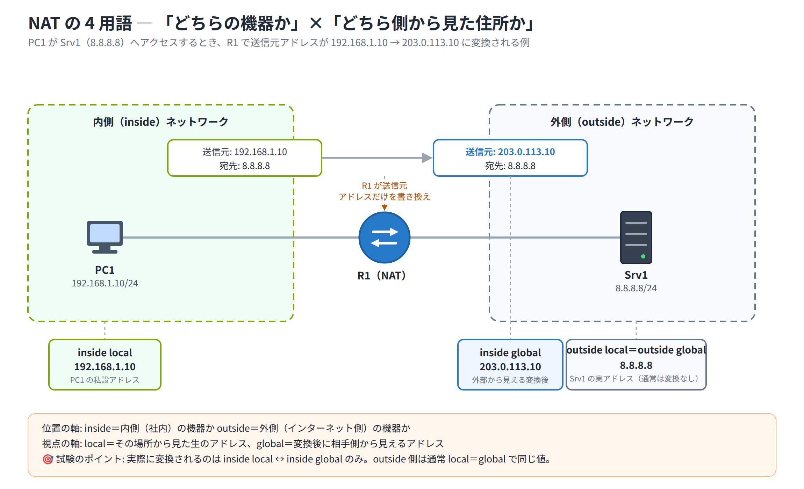

# Day 14 講義: NAT（ネットワークアドレス変換）

> 配置先: ドキュメント `01_教材 > Week3_ルーティングとサービス > Day14`
> 学習時間の目安: 3.5 時間 ／ 準拠: CCNA 200-301 v1.1 ドメイン 4

## 学習目標

この講義を終えると、次のことができるようになります。

1. 私設アドレス（RFC1918）と NAT が必要とされる背景を説明できる
2. inside local / inside global / outside local / outside global の 4 用語を、具体的なアドレスに当てはめて識別できる
3. 静的 NAT・動的 NAT・PAT（NAT Overload）の動作の違いと、それぞれの設定コマンドを説明できる
4. `show ip nat translations` などの確認コマンドの出力を読み、変換方式を判別できる

## ウォームアップ（朝の想起クイズ）

> 教材を見ずに、まず自力で思い出してください（分散学習: Day 7「トランクと VLAN 設計」 / Day 11「ルーティングの基礎と静的ルート」 / Day 13「OSPF 応用と FHRP」 の範囲から出題）。

**W1.** （Day 7）802.1Q トランクにおいて、ネイティブ VLAN のフレームは VLAN タグが付与されて送信されるか。また Cisco スイッチのデフォルトのネイティブ VLAN 番号はいくつか。

**W2.** （Day 11）スタティックルートのデフォルトの管理距離（AD）はいくつか。同じ宛先に OSPF の経路（AD 110）も存在する場合、どちらのルートがルーティングテーブルに採用されるか。

**W3.** （Day 13）HSRP のデフォルトの Hello タイマーと Hold タイマーはそれぞれ何秒か。また Active ルータ障害時、Standby ルータが Active に昇格するまでの目安時間は？

<details><summary>解答</summary>

- W1: ネイティブ VLAN のフレームは**タグなし（untagged）**で送信される。デフォルトのネイティブ VLAN は **VLAN 1**。
- W2: スタティックルートのデフォルト AD は **1**。AD は値が小さいほど優先されるため、スタティックルート（AD 1）が OSPF（AD 110）より優先されてルーティングテーブルに採用される。
- W3: Hello タイマーは **3 秒**、Hold タイマーは **10 秒**（デフォルト）。Hold タイマー切れでフェイルオーバーするため、Active への昇格までの目安は約 **10 秒**。

</details>

---

## 1. 私設アドレスと NAT が必要な理由

### IPv4 アドレス枯渇と私設アドレス

IPv4 アドレスは 32 ビットで約 43 億個しかなく、インターネットの急拡大により
グローバル（公開）アドレスが枯渇しました。この対策の 1 つが、組織内部だけで
自由に使い回せる**私設アドレス（プライベートアドレス）**です。**RFC1918** という
文書で、次の 3 つの範囲が私設アドレスとして予約されています。

| 範囲 | クラス | 用途の目安 |
|---|---|---|
| `10.0.0.0/8` | クラス A | 大規模組織全体 |
| `172.16.0.0/12` | クラス B | 中規模拠点 |
| `192.168.0.0/16` | クラス C | 小規模 LAN・家庭 |

これらのアドレスは世界中の無数の組織で重複して使われていて構いません。ただし
**インターネット上ではルーティングされない**（ISP のルータが転送しない）ため、
私設アドレスを持つ端末がそのままインターネットへ出ることはできません。そこで、
内部の私設アドレスを外部向けの公開（グローバル）アドレスに変換する仕組みが
**NAT（Network Address Translation：ネットワークアドレス変換）**です。

### NAT の目的

- **アドレスの節約**: 少数のグローバルアドレスで多数の内部端末を外部接続させる
- **内部トポロジの隠蔽**: 外部から見えるのは変換後のアドレスのみで、簡易的な
  セキュリティ効果がある
- **アドレス重複時のマージ対応**: 合併した 2 組織で私設アドレスが重複していても、
  NAT で変換すれば通信できる

### NAT のデメリット

- **エンドツーエンド接続性の喪失**: 送信元アドレスが途中で書き換わるため、
  本来の「端から端まで同一アドレスで通信する」という IP の原則が崩れる
- **遅延・CPU 負荷**: 変換処理はルータに追加の負荷をかける
- **一部アプリでのトラブル**: IP アドレスをペイロード（データ部分）に含める
  アプリケーション（一部の VoIP や古い FTP など）では、ヘッダだけを書き換える
  NAT では正しく動作しないことがある

### Day 1 の原則の例外としての NAT

Day 1 で「L3 ヘッダ（IP アドレス）は原則、送信元から宛先まで変わらない（NAT を除く）」
と学びました。NAT はまさにこの例外にあたる処理で、**L3 ヘッダの IP アドレス**
（PAT の場合はさらに **L4 ヘッダのポート番号**）を書き換えます。

> **試験のポイント**: NAT が L3（IP アドレス）を、PAT が L3 に加えて L4（ポート番号）
> を書き換える処理である、という動作原理を問う問題が頻出です。

## 2. NAT の用語 — inside/outside と local/global

NAT では次の 4 つの用語を正確に区別する必要があります。組み合わせると
「どちら側のネットワークにいる端末か」×「変換前か変換後か」の 4 象限になります。

| 用語 | 意味 |
|---|---|
| **inside local**（内部ローカル） | 内部ネットワークで実際に使われている私設アドレス |
| **inside global**（内部グローバル） | 内部端末が外部から見えるときの、変換後の公開アドレス |
| **outside local**（外部ローカル） | 外部ホストが内部ネットワークから見えるときのアドレス |
| **outside global**（外部グローバル） | 外部ホストが本来持っている公開アドレス |

通常の（内部から外部へアクセスする）NAT 構成では、外部ホストのアドレスを
変換することはほとんどないため、**outside local と outside global は同一の値**
になるのが一般的です。実務・試験で頻繁に登場し、実際に変換対象となるのは
**inside local ↔ inside global** の組です。

### 具体例で確認

内部 PC のアドレスが `192.168.1.10`、ルータでの変換後が `203.0.113.10`、
通信相手の外部サーバが `8.8.8.8` だとすると、次のように対応します。

| 用語 | 値 | 象限 |
|---|---|---|
| inside local | 192.168.1.10 | 内側×ローカル |
| inside global | 203.0.113.10 | 内側×グローバル |
| outside local | 8.8.8.8 | 外側×ローカル |
| outside global | 8.8.8.8 | 外側×グローバル |

> **試験のポイント（覚え方）**: **inside / outside** は「そのホストが内側の機器か
> 外側の機器か」、**local / global** は「内部ネットワークから見た住所か、外部
> （インターネット）から見た住所か」という**視点の軸**を表します。**実際に変換
> されるのは inside local ↔ inside global の組だけで、通常構成では outside
> local＝outside global** です。inside＝local と思い込まないよう注意してください。



### inside / outside インターフェースの指定

NAT を動作させるには、どのインターフェースが内部（inside）側で、どのインターフェースが
外部（outside）側かをルータに明示する必要があります。これが変換動作の**前提条件**です。

```
Router(config)# interface GigabitEthernet0/0
Router(config-if)# ip nat inside
Router(config)# interface GigabitEthernet0/1
Router(config-if)# ip nat outside
```

内部から外部へ出るパケットがこの 2 つのインターフェースをまたいで通過するとき、
**送信元アドレス（inside local）が inside global に変換**されます。

> **試験のポイント**: `ip nat inside` と `ip nat outside` のインターフェース割り当てが
> 変換の前提であることを問う問題が頻出です。付け忘れると NAT はまったく機能しません。

## 3. 静的 NAT（Static NAT）の動作と設定

**静的 NAT**は、1 つの inside local アドレスを 1 つの inside global アドレスに
**固定的**にマッピングする方式です。マッピングは管理者が手動で設定し、
ルータの再起動後も維持されます。

主な用途は、内部の Web サーバやメールサーバなど**外部に公開したいサーバ**の
アドレスを、常に同じグローバルアドレスで到達できるようにすることです。

### 設定コマンド

```
Router(config)# ip nat inside source static 192.168.1.10 203.0.113.10
Router(config)# interface GigabitEthernet0/0
Router(config-if)# ip nat inside
Router(config)# interface GigabitEthernet0/1
Router(config-if)# ip nat outside
```

- `192.168.1.10` が inside local、`203.0.113.10` が inside global
- インターフェースへの `ip nat inside` / `ip nat outside` は静的・動的・PAT の
  すべての方式に共通して必要

### 静的 NAT の特徴

- 双方向で**常に変換エントリが存在する**ため、外部から内部への通信開始（例:
  外部クライアントが社内 Web サーバへアクセス）が可能。サーバ公開に適する
- `show ip nat translations` を実行すると、静的エントリは経過時間の欄が
  `---` と表示され、通信の有無にかかわらず常時表示され続ける

```
Router# show ip nat translations
Pro Inside global      Inside local       Outside local      Outside global
--- 203.0.113.10       192.168.1.10       ---                ---
```

### 静的 PAT（ポートフォワーディング）

1 つのグローバルアドレスしか持たない場合でも、**特定のポート番号だけ**を内部の
サーバへ転送したいことがあります。これを**静的 PAT（ポートフォワーディング）**
と呼び、通常の静的 NAT にプロトコルとポート番号を追加して指定します。

```
Router(config)# ip nat inside source static tcp 192.168.1.10 80 203.0.113.10 80
```

この例では、`203.0.113.10` 宛の TCP 80 番ポート（HTTP）宛の通信だけを
`192.168.1.10` の Web サーバへ転送します。同じグローバルアドレスの別ポートを
別の内部サーバへ振り分けることもでき、少ないグローバルアドレスで複数の
内部サービスを公開したい場合に使われます。

## 4. 動的 NAT（Dynamic NAT）の動作と設定

**動的 NAT**は、あらかじめ用意した**グローバルアドレスのプール（在庫）**の中から、
空いているアドレスを通信の都度動的に割り当てる方式です。多数の内部ホストが
プールを共有しますが、変換自体は依然として**1 対 1**です（1 つの inside local に
1 つの inside global が割り当たる）。

### 必要な 2 つの要素

1. どの内部アドレスを変換対象にするかを指定する **ACL（アクセスリスト）**
2. 割り当てに使う**グローバルアドレスプール**

### 設定手順

```
Router(config)# ip nat pool NATPOOL 203.0.113.20 203.0.113.29 netmask 255.255.255.0
Router(config)# access-list 1 permit 192.168.1.0 0.0.0.255
Router(config)# ip nat inside source list 1 pool NATPOOL
Router(config)# interface GigabitEthernet0/0
Router(config-if)# ip nat inside
Router(config)# interface GigabitEthernet0/1
Router(config-if)# ip nat outside
```

- `ip nat pool` でプール名・開始アドレス・終了アドレス・サブネットマスクを定義
- `access-list 1` で変換対象とする内部アドレス範囲を許可
- `ip nat inside source list 1 pool NATPOOL` で ACL とプールを結び付けて動的 NAT を有効化

### 動的 NAT の特徴

- プールのアドレス数を超える同時セッションが発生すると、**新規の変換ができず
  パケットがドロップ**される（オーバーロードを使わない場合）
- 変換エントリは一定時間通信がないと**タイムアウトで自動的に解放**される
- `show ip nat translations` で動的に生成されたエントリを確認できる

> **試験のポイント**: 動的 NAT でプールが枯渇した場合の挙動（新規変換不可・
> ドロップ）と、PAT（後述）ならこれを回避できる点を問う問題が頻出です。

## 5. PAT（NAT Overload / ポートアドレス変換）の動作と設定

**PAT（Port Address Translation）**は、複数の内部ホストを**1 つ（または少数）の
グローバルアドレス**に集約する多対 1 の変換方式です。Cisco の設定上は
**NAT Overload**とも呼ばれます。家庭用ルータや多くの企業ネットワークで
最も一般的に使われる方式です。

### 識別の仕組み

複数の内部ホストが同じグローバルアドレスを共有すると、戻りパケットをどの
内部ホストに届ければよいか区別できなくなります。そこで PAT では、
グローバルアドレスに加えて **L4 のポート番号**を組み合わせて識別します。
変換テーブルには「プロトコル・内部 IP:ポート・グローバル IP:ポート」の
組み合わせが記録され、戻りパケットのポート番号をもとに正しい内部ホストへ
振り分けられます。

### 設定コマンド（インターフェースのアドレスを使う場合）

```
Router(config)# access-list 1 permit 192.168.1.0 0.0.0.255
Router(config)# ip nat inside source list 1 interface GigabitEthernet0/1 overload
Router(config)# interface GigabitEthernet0/0
Router(config-if)# ip nat inside
Router(config)# interface GigabitEthernet0/1
Router(config-if)# ip nat outside
```

### 設定コマンド（プールを使う場合）

```
Router(config)# ip nat pool NATPOOL 203.0.113.20 203.0.113.20 netmask 255.255.255.0
Router(config)# access-list 1 permit 192.168.1.0 0.0.0.255
Router(config)# ip nat inside source list 1 pool NATPOOL overload
```

いずれの場合も、末尾に **`overload`** キーワードを付けることでポート番号を
使った多対 1 変換（PAT）が有効になります。付け忘れると通常の動的 NAT として
扱われ、プールのアドレス数以上のホストを同時に変換できません。

### 確認

```
Router# show ip nat translations
Pro Inside global          Inside local         Outside local        Outside global
tcp 203.0.113.1:1025       192.168.1.10:1025    8.8.8.8:80           8.8.8.8:80
tcp 203.0.113.1:1026       192.168.1.11:1030    8.8.8.8:80           8.8.8.8:80
icmp 203.0.113.1:512       192.168.1.10:512     8.8.8.8:512          8.8.8.8:512
```

> ICMP には TCP/UDP のようなポート番号がありません。この欄には代わりに
> **ICMP クエリ識別子（Query ID）**が入ります。表示される位置はポート番号と
> 同じですが、意味が異なる点に注意してください。

- **Pro（プロトコル）列**に `tcp` / `udp` / `icmp` が表示され、**番号付き**の
  エントリが並ぶことが PAT の特徴（TCP/UDP はポート番号、ICMP はクエリ識別子）
- PAT は外部から内部への通信開始を基本的に許さない（内部発信のセッションに
  対してのみステートフルに変換する）ため、簡易的な保護機能にもなる

> **試験のポイント**: 「1 つのグローバルアドレスで多数の内部ホストを収容する
> 方式はどれか」という分類問題、`overload` キーワードの有無・位置を問う設定問題、
> および「ICMP にはポート番号が無くクエリ識別子が使われる」という引っかけが頻出です。

> 💼 **実務では**: 一般企業の拠点は、ISP から割り当てられた 1 個（〜数個）の
> グローバル IP に対して社内全端末を PAT で束ねて外部接続し、公開したい
> Web/メールサーバだけを静的 NAT（または静的 PAT/ポートフォワーディング）で
> DMZ に出す、という構成がほぼ定番です。新人がやりがちなミスは、静的 NAT や
> 動的プールで払い出す inside global アドレスを ISP 側（上流ルータ/ファイアウォール）
> へ戻す経路を用意し忘れることです。まさにこのラボの WAN リンク構成が示す通り、
> 変換自体は動いても戻りが届かず「ping が返らない」障害になります。グローバル
> アドレスは必ず NAT ルータ宛にルーティングされている必要がある、と現場では
> 最初に確認します。

### 3 方式の比較

| 方式 | マッピング比率 | グローバルアドレス節約 | 主用途 | プール枯渇時の挙動 | 代表コマンド |
|---|---|---|---|---|---|
| 静的 NAT | 1 対 1（固定） | なし（1 端末が 1 グローバル IP を専有） | サーバ公開（Web/メールなど） | 該当なし（プールを使わない） | `ip nat inside source static <local> <global>` |
| 動的 NAT | 1 対 1（動的割当） | 限定的（プール数まで） | 内部端末が交代でグローバル IP を使う | 新規変換不可・パケットはドロップ | `ip nat inside source list <ACL> pool <name>` |
| PAT（NAT Overload） | 多 対 1（ポートで識別） | 大きい（少数の IP で大量端末を収容） | 一般的なインターネット接続（家庭・企業） | ポート枯渇までは新規セッション可（実務上ほぼ枯渇しない） | `ip nat inside source list <ACL> interface <IF> overload` |

## 6. 確認・トラブルシューティングコマンド

| コマンド | 用途 |
|---|---|
| `show ip nat translations` | 現在の変換テーブルを一覧表示。`verbose` を付けると作成・使用時刻やタイムアウトも表示される |
| `show ip nat statistics` | 変換の総数、ヒット/ミス数、アクティブな変換数、プールの使用状況を表示 |
| `clear ip nat translation *` | 動的に生成された変換エントリを手動でクリア（静的エントリは消えない） |
| `debug ip nat` | 変換処理の様子をリアルタイムに表示（本番環境では負荷に注意し、確認後は `undebug all` で停止） |

> 💼 **実務では**: `debug ip nat` は変換ごとにログを吐くため、トラフィックの多い
> 本番ルータでは CPU を跳ね上げて通信断を招くことがあり、原則使いません。
> 切り分けは `show ip nat translations` の件数や `show ip nat statistics`
> （アクティブな変換数・ミス数・プール使用率）で行うのが定石です。また NAT/変換
> テーブルが上限に達すると新規通信だけが不安定に落ちる障害が起き、これは
> ping は通るのにアプリだけ繋がらない形で現れます。新人が最も多く踏むのは
> `ip nat inside` と `ip nat outside` の付け間違い・付け忘れで、NAT が「全く効かない」
> ときはまずここを疑います。

### よくある障害の切り分けポイント

- `ip nat inside` / `ip nat outside` の付け忘れ（片方だけ設定していないか）
- ACL の対象範囲のミス（変換したいアドレスが `permit` されていない）
- PAT で `overload` キーワードの付け忘れ
- 動的 NAT でのプール枯渇

変換エントリは、内部から外部へ向かう**実際のトラフィックが流れたとき**に
作成されます。設定しただけでは何も表示されないため、`ping` やトレースなどで
実際に通信を発生させてから `show ip nat translations` を確認することが大切です。

> **試験のポイント**: `show ip nat translations` の出力を読み、プロトコルや
> ポート番号の有無から静的 NAT か PAT かを判別させる問題が頻出です。

## まとめ

- IPv4 アドレス枯渇に対応するため、RFC1918 の私設アドレス（10/8、172.16/12、
  192.168/16）が内部ネットワークで再利用され、NAT が外部通信を仲介する
- inside local / inside global / outside local / outside global の 4 用語を、
  実際に変換されるのは主に inside local ↔ inside global であることとあわせて理解する
- 静的 NAT（1 対 1 固定・サーバ公開向き）、動的 NAT（プールから動的に 1 対 1 割当）、
  PAT / NAT Overload（多対 1、ポート番号で識別）の 3 方式の違いを押さえる
- `ip nat inside` / `ip nat outside` のインターフェース指定がすべての方式の前提
- `show ip nat translations` / `show ip nat statistics` で変換の状態を確認できる

---

## 確認問題（自己チェック・解答は末尾）

1. RFC1918 で定められた私設アドレスの範囲を 3 つ答えよ。
2. 内部 PC の私設アドレスと、それが外部から見えるときの変換後アドレスは、
   それぞれ何と呼ばれるか。
3. 複数の内部ホストを 1 つのグローバルアドレスに集約する変換方式の名称と、
   識別に使う情報は何か。
4. 動的 NAT でプールのアドレスが枯渇すると、新規セッションはどうなるか。
5. `show ip nat translations` の出力で、経過時間欄が `---` と表示されるのは
   どの方式のエントリか。

<details><summary>解答</summary>

1. `10.0.0.0/8`、`172.16.0.0/12`、`192.168.0.0/16`
2. inside local（内部ローカル）と inside global（内部グローバル）
3. PAT（NAT Overload）。L4 のポート番号を使って内部ホストを識別する
4. 新規の変換ができず、パケットはドロップされる
5. 静的 NAT

</details>

## 次のステップ

本日のラボ課題「[Day14] ラボ: 静的 NAT・動的 NAT・PAT の構成と変換テーブルの観察」に
進み、1 台のルータ上で 3 つの方式を順に構成しながら、`show ip nat translations` /
`show ip nat statistics` の出力の違いを実機で確認してください。
