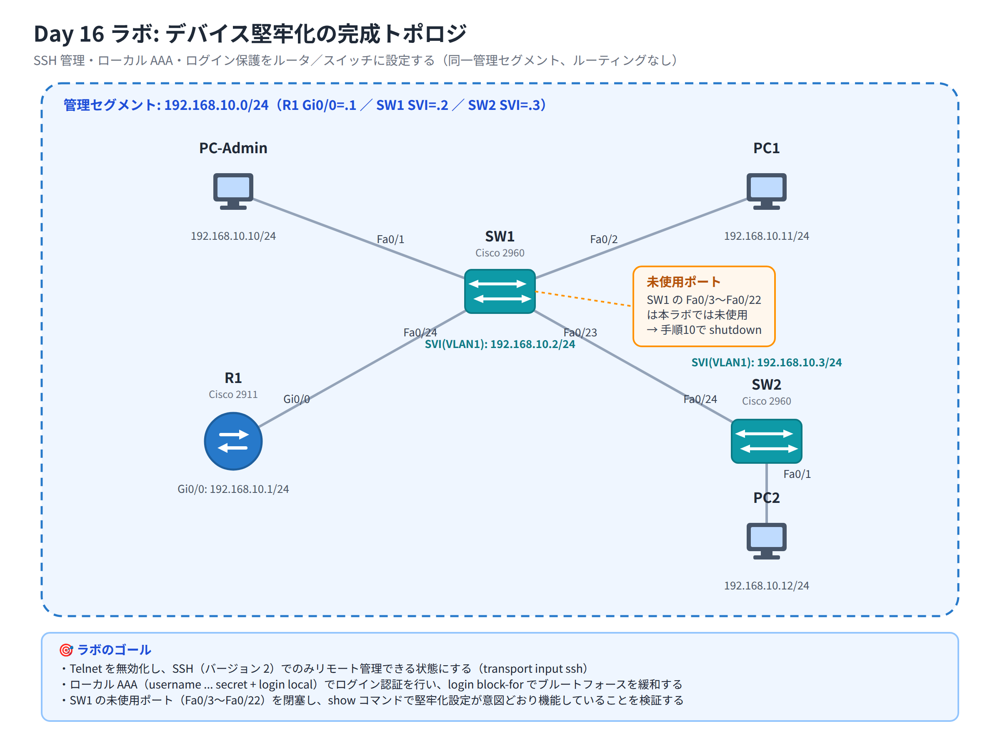

# Day 16 ラボ手順書: デバイス堅牢化 — SSH 管理とログイン保護の実装

> 配置先: ドキュメント `02_ラボ手順書 > Week4 > Day16`
> 所要時間の目安: 2.5 時間 ／ 使用ツール: Cisco Packet Tracer 9.x

## ゴール

- ルータとスイッチに対してデバイス堅牢化（ハードニング）の基本設定を行える
- Telnet を無効化し、SSH でのみリモート管理できる状態を構成できる
- ローカル AAA（`username ... secret` + `login local`）でログイン認証を行える
- `login block-for` によるブルートフォース攻撃の緩和と、未使用ポートの閉塞を実施できる
- `show` コマンドを使って、設定した堅牢化が意図どおり機能しているか検証できる

## 完成トポロジ



SW1 の Fa0/3〜Fa0/22 は本ラボでは未使用ポートとして扱い、後半の手順で閉塞します。

### IP アドレス表

| 機器 | インタフェース | IP アドレス | サブネットマスク |
|---|---|---|---|
| R1 | Gi0/0 | 192.168.10.1 | 255.255.255.0 |
| SW1 | VLAN1（SVI） | 192.168.10.2 | 255.255.255.0 |
| SW2 | VLAN1（SVI） | 192.168.10.3 | 255.255.255.0 |
| PC-Admin | NIC | 192.168.10.10 | 255.255.255.0 |
| PC1 | NIC | 192.168.10.11 | 255.255.255.0 |
| PC2 | NIC | 192.168.10.12 | 255.255.255.0 |

> 本ラボではルーティングは扱わず、すべての機器が同一の管理セグメント上にいる前提で
> 進めます（デフォルトゲートウェイの設定は不要です）。

---

## 手順 1: トポロジの作成と基本接続（15 分）

1. Packet Tracer を新規作成し、ルータ **2911** を 1 台（R1）、スイッチ **2960** を
   2 台（SW1、SW2）、PC を 3 台（PC-Admin、PC1、PC2）配置する
2. ケーブル（ストレート）で次のとおり接続する
   - R1 `GigabitEthernet0/0` — SW1 `FastEthernet0/24`
   - SW1 `FastEthernet0/1` — PC-Admin
   - SW1 `FastEthernet0/2` — PC1
   - SW1 `FastEthernet0/23` — SW2 `FastEthernet0/24`
   - SW2 `FastEthernet0/1` — PC2
3. 各 PC の [Desktop] → **IP Configuration** で、上表の IP アドレス / サブネットマスクを
   設定する
4. R1 の `GigabitEthernet0/0` に IP アドレスを設定し、`no shutdown` する

   ```
   R1(config)# interface gigabitEthernet 0/0
   R1(config-if)# ip address 192.168.10.1 255.255.255.0
   R1(config-if)# no shutdown
   ```

5. リンクがすべて緑になったことを確認し、`day16_氏名.pkt` として保存する

## 手順 2: hostname・ドメイン名・enable secret の設定（15 分）

SSH の鍵生成には、ホスト名とドメイン名の設定が**必須**です。R1・SW1・SW2 それぞれで
実施します（以下は R1 の例。SW1・SW2 も同様に、ホスト名を `SW1` / `SW2` に読み替えて
設定してください）。

```
Router(config)# hostname R1
R1(config)# ip domain-name lab.local
R1(config)# enable secret Cisco@12345
```

`enable password` は使用しません。`enable secret` はハッシュ化されて保存されるため、
デバイス保護として `enable password` より優れています。

## 手順 3: ローカル AAA によるログイン認証（15 分）

コンソール回線と VTY 回線に、ローカルユーザによる認証を適用します（各機器で実施）。

```
R1(config)# username admin secret Admin@12345
R1(config)# line console 0
R1(config-line)# login local
R1(config-line)# exit
R1(config)# line vty 0 4
R1(config-line)# login local
R1(config-line)# password Vty@12345
R1(config-line)# exit
```

`login local` により、`username ... secret` で登録したローカルアカウント（今回は
ローカル AAA）で認証されるようになります。VTY に追加した `password Vty@12345` は
`login local` が優先されるため実際の認証には使用されません。次の手順 4 で
`service password-encryption` による **Type 7** 難読化の挙動を実際に観察するための
デモ用の平文パスワードです。SW1・SW2 の VTY にも同様に設定してください。

## 手順 4: service password-encryption の有効化（10 分）

```
R1(config)# service password-encryption
```

設定後、`show running-config` を実行し、`enable secret` と `username admin secret`
が **Type 5**（`secret 5 ...`）のハッシュとして、手順 3 で VTY に追加した
`password Vty@12345` が **Type 7**（`password 7 ...`）の難読化として、それぞれ
表示が変わっていることを確認してください。

```
R1# show running-config | include (secret|password)
```

> Type 5 はハッシュ化（一方向）、Type 7 は可逆な難読化で強度が低い方式です。
> 同じコマンドの出力内で両者の表示形式を見比べ、講義の内容とあわせて確認して
> おきましょう。

## 手順 5: SSH の有効化（15 分）

R1 で RSA 鍵を生成し、SSH バージョン 2 を使用するよう設定します。

```
R1(config)# crypto key generate rsa
How many bits in the modulus [512]: 1024
R1(config)# ip ssh version 2
```

同様に SW1・SW2 でも `crypto key generate rsa`（1024 bit 以上）と
`ip ssh version 2` を設定してください。

## 手順 6: VTY を SSH 限定にする（10 分）

```
R1(config)# line vty 0 4
R1(config-line)# transport input ssh
R1(config-line)# exec-timeout 5 0
R1(config-line)# exit
```

- `transport input ssh`: VTY 回線への接続方式を SSH のみに限定します（Telnet を拒否）
- `exec-timeout 5 0`: 無操作状態が 5 分続くと自動的にログアウトします

SW1・SW2 の VTY にも同じ設定を行ってください。

## 手順 7: Telnet と SSH の接続確認（15 分）

PC-Admin の [Desktop] → **Command Prompt** から、R1 への接続を試します。

```
telnet 192.168.10.1
```

→ 接続が拒否される、またはタイムアウトすることを確認し、結果を記録してください。

```
ssh -l admin 192.168.10.1
```

→ ユーザ名（プロンプトが出ない場合は `-l admin` で指定済み）とパスワード
（`Admin@12345`）を入力し、ログインできることを確認してください。

## 手順 8: login block-for によるブルートフォース緩和（20 分）

```
R1(config)# login block-for 60 attempts 3 within 30
```

30 秒以内に 3 回ログインに失敗すると、60 秒間すべてのログイン試行がブロックされる
設定です。PC-Admin から、わざと**誤ったパスワード**で SSH ログインを 3 回連続して
試みてください。

```
ssh -l admin 192.168.10.1
（誤ったパスワードを入力 × 3 回）
```

その後、R1 の特権 EXEC で次を実行し、ログインがブロックされている状態を確認します。

```
R1# show login
```

## 手順 9: 警告バナーの設定（5 分）

```
R1(config)# banner motd #
This system is for authorized use only.
Unauthorized access is prohibited and may be subject to legal action.
#
```

## 手順 10: SW1 の未使用ポートの閉塞（10 分）

SW1 の `Fa0/3`〜`Fa0/22` は本ラボでは使用しないため、範囲指定でまとめて `shutdown` します。

```
SW1(config)# interface range fastEthernet 0/3-22
SW1(config-if-range)# shutdown
```

## 手順 11: 管理 IP（SVI）の設定と DNS ルックアップの無効化（15 分）

SW1・SW2 それぞれに管理用 IP アドレス（VLAN1 の SVI）を設定します。

```
SW1(config)# interface vlan 1
SW1(config-if)# ip address 192.168.10.2 255.255.255.0
SW1(config-if)# no shutdown
SW1(config-if)# exit
SW1(config)# no ip domain-lookup
```

SW2 も同様に `192.168.10.3 255.255.255.0` を設定してください。R1 にも
`no ip domain-lookup` を設定します。`no ip domain-lookup` を設定しておかないと、
コマンドを打ち間違えたときに DNS 解決待ちで端末がしばらく応答しなくなるため、
実務でも定番の設定です。

## 手順 12: 設定の保存（5 分）

R1・SW1・SW2 それぞれで、設定を保存します。

```
R1# copy running-config startup-config
```

## 手順 13: 総合検証（15 分・本日のメイン）

R1 の特権 EXEC で、次のコマンドを実行し、それぞれの出力を記録してください。

```
R1# show ip ssh
R1# show running-config | include transport
R1# show interfaces status
R1# show login
```

- `show ip ssh`: SSH が有効でバージョン 2 が使われていること
- `show running-config | include transport`: VTY が `transport input ssh` に
  なっていること
- `show interfaces status`（SW1 で実行）: `Fa0/3`〜`Fa0/22` が `disabled` に
  なっていること
- `show login`: 手順 8 で発生したログイン失敗・ブロックの状態

### 観察レポート（コメント提出用）

以下 3 問に答えて、課題のコメントに記入してください。

1. Telnet と SSH で R1 への接続をそれぞれ試み、結果の違いとその理由
   （`transport input ssh` の効果）を説明せよ。
2. 故意に誤ったパスワードで規定回数ログインを失敗させたとき、`show login` の出力は
   どう変化したか。`login block-for` が緩和する攻撃の種類は何か。
3. `show running-config` でパスワードがどのように表示されているか。`enable secret` と
   `username ... secret`、`service password-encryption`（Type 7）それぞれの
   暗号化強度の違いを述べよ。

## 手順 14: 提出（5 分）

1. `day16_氏名.pkt` を Backlog のラボ課題に**添付**する
2. 手順 7・8・13 のコマンド結果（スクリーンショット可）と観察レポートを
   課題の**コメント**に貼る
3. 課題の状態を「処理済み」に変更する

## うまくいかないとき

| 症状 | 確認すること |
|---|---|
| `crypto key generate rsa` が失敗する / 選択肢が出ない | `hostname` と `ip domain-name` が先に設定されているか |
| SSH で接続できない | `ip ssh version 2` の設定、VTY の `transport input ssh`、`username ... secret` の設定漏れ |
| Telnet がまだ通ってしまう | `line vty 0 4` の `transport input` が `ssh` のみになっているか（`all` のままになっていないか） |
| `show login` がブロック状態を示さない | `login block-for` の `attempts` 回数・`within` 秒数内に本当に失敗しているか、時間内に再試行しているか |
| 未使用ポートが `disabled` にならない | `interface range fastEthernet 0/3-22` の範囲指定ミス、`shutdown` の入力漏れ |
| PC からスイッチの SVI に届かない | SVI に `no shutdown` を入れ忘れていないか、VLAN1 のポートが正しいか |

30 分試して解決しない場合は、状況（スクリーンショット + 試したこと）を
課題のコメントに書いて質問してください。
