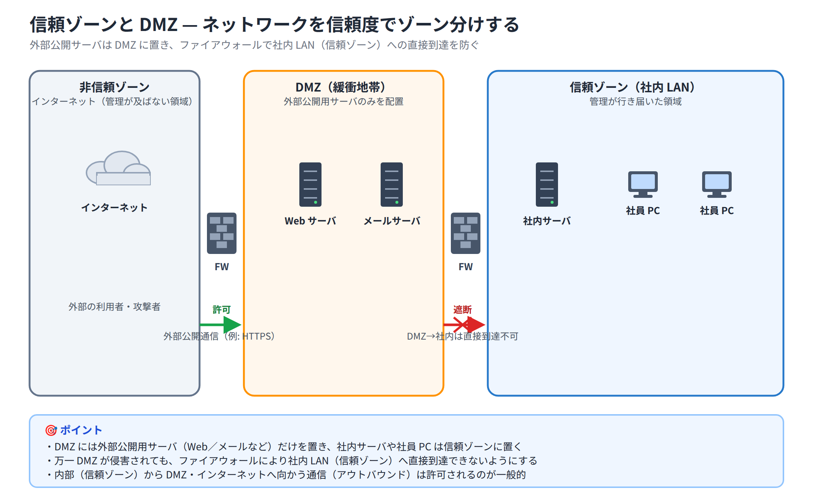

# Day 16 講義: セキュリティの概念とデバイス保護

> 配置先: ドキュメント `01_教材 > Week4 > Day16`
> 学習時間の目安: 3.5 時間 ／ 準拠: CCNA 200-301 v1.1 ドメイン 5

## 学習目標

この講義を終えると、次のことができるようになります。

1. 脆弱性・エクスプロイト・脅威・緩和策の関係と、CIA トライアド（機密性・完全性・可用性）を説明できる
2. スプーフィング・MITM・DoS/DDoS・フィッシング・ソーシャルエンジニアリングなど代表的な攻撃手口を識別できる
3. AAA（認証・認可・アカウンティング）の役割と、RADIUS と TACACS+ の違いを説明できる
4. enable secret / SSH / login block-for などデバイス堅牢化のベストプラクティスを説明できる
5. セキュリティプログラムを構成するユーザ教育・トレーニング・物理アクセス制御の役割を説明できる

---

## ウォームアップ（朝の想起クイズ）

> 教材を見ずに、まず自力で思い出してください（分散学習: Day 9「STP と EtherChannel」 /
> Day 13「OSPF 応用と FHRP」 / Day 15「IP サービス総合」 の範囲から出題）。

**W1.** （Day 9）LACP で片方のスイッチのポートを `active`、もう片方を `passive` に
設定した組み合わせでは EtherChannel は成立するか。また、両方とも `passive` に
設定した組み合わせではどうか。

**W2.** （Day 13）HSRP のプライオリティの既定値はいくつか。また、プリエンプト
（`standby <グループ番号> preempt`）は既定で有効か無効か。

**W3.** （Day 15）Syslog の severity は 0〜7 のどちらが重大度が高いか。また、
severity 6 の名称は何か。

<details><summary>解答</summary>

W1. `active`/`passive` の組み合わせは成立する。`passive`/`passive` の組み合わせは、
双方が受動的で誰も要求を出さないため成立しない。
W2. プライオリティの既定値は 100。プリエンプトは既定で無効。
W3. 数値が小さいほど重大（0 が最重大の Emergency）。severity 6 は Informational。

</details>

---

## 1. セキュリティの基本用語と考え方

### 4 つの基本用語

セキュリティを議論するとき、次の 4 つの用語を混同しないことが重要です。

| 用語 | 意味 | 具体例 |
|---|---|---|
| **脆弱性（Vulnerability）** | システムに存在する弱点・欠陥 | パッチ未適用の OS、弱いパスワード設定 |
| **エクスプロイト（Exploit）** | 脆弱性を実際に突くための手段・コード | 脆弱性を悪用する攻撃コード（exploit code） |
| **脅威（Threat）** | 脆弱性を突いて被害を与える可能性のある危険そのもの | 攻撃者、マルウェア、自然災害 |
| **緩和策（Mitigation）** | リスクを下げるための対策 | パッチ適用、ファイアウォール導入、教育 |

つまり「脅威（攻撃者）」が「脆弱性（弱点）」を「エクスプロイト（攻撃手段）」を使って突こうとするのに対し、
「緩和策」でそのリスクを下げる、という関係になります。

### リスクの考え方

リスクは、次のようにイメージすると理解しやすくなります。

```
リスク ≒ 脅威 × 脆弱性 × 資産価値
```

- **資産（Asset）**: 守るべき対象（サーバ、データ、顧客情報、ブランドの信用など）
- **攻撃対象領域（Attack Surface）**: 攻撃者が侵入・攻撃を試みることができる接点の総体
  （公開しているポート、稼働中のサービス、Web アプリの入力欄など）。
  攻撃対象領域が広いほど、リスクは高まります。

### CIA トライアド

情報セキュリティの目的は、次の 3 要素（**CIA トライアド**。「トライアド」は 3 つ 1 組を
意味する語です）を守ることに集約されます。

| 要素 | 意味 | 侵害される例 |
|---|---|---|
| **機密性（Confidentiality）** | 許可された人だけが情報にアクセスできる | 情報漏えい、盗聴 |
| **完全性（Integrity）** | 情報が改ざんされず正確である | データ改ざん、なりすまし送信 |
| **可用性（Availability）** | 必要なときに情報・サービスを利用できる | DoS 攻撃によるサービス停止 |

> **試験のポイント**: 脆弱性・エクスプロイト・脅威・緩和策の 4 用語の定義と相互関係を
> 問う問題が頻出です。「攻撃者が使う手段」はエクスプロイト、「攻撃者そのもの・攻撃の可能性」は
> 脅威、と整理して覚えましょう。

### 多層防御と最小権限の原則

- **多層防御（Defense in Depth）**: 単一の対策に頼らず、境界防御・端末対策・認証・監視など
  複数の層でセキュリティを重ねる考え方です。1 つの層が突破されても、次の層で防ぐことができます。
- **最小権限の原則（Least Privilege）**: ユーザやプロセスには、業務に必要な最小限の権限だけを
  与えるという原則です。権限を絞ることで、アカウントが乗っ取られた場合の被害を小さくできます。

### セキュリティ境界: 信頼ゾーンと DMZ

ネットワークは、信頼度に応じてゾーンに分けて設計します。

- **信頼ゾーン（Trusted Zone）**: 社内 LAN など、管理が行き届いた領域
- **非信頼ゾーン（Untrusted Zone）**: インターネットなど、管理が及ばない領域
- **DMZ（DeMilitarized Zone、非武装地帯）**: 信頼ゾーンと非信頼ゾーンの中間に置く緩衝地帯。
  外部に公開する Web サーバやメールサーバなどを置き、万一 DMZ が侵害されても
  社内 LAN 側には直接到達できないようにします。



### 内部脅威と外部脅威

- **内部脅威（Insider Threat）**: 従業員・委託先など、正規のアクセス権を持つ人物による脅威。
  悪意の有無を問わず、誤操作による情報漏えいも含まれます。検知が難しいのが特徴です。
- **外部脅威**: 組織の外部（インターネット上の攻撃者など）からの脅威。境界防御で対応しやすい
  一方、内部脅威は境界防御だけでは防げません。

## 2. 攻撃の種類と手口

### スプーフィング（Spoofing）

**スプーフィング**とは、送信元情報を偽装してなりすます攻撃の総称です。

| 種類 | 概要 |
|---|---|
| **IP スプーフィング** | 送信元 IP アドレスを偽装し、正規の送信元になりすます |
| **MAC スプーフィング** | 送信元 MAC アドレスを偽装し、フィルタリングを回避したり別端末になりすます |
| **DHCP スプーフィング** | 偽の DHCP サーバを立て、誤ったゲートウェイ情報などを配布する |
| **ARP スプーフィング** | 偽の ARP 応答を送り、他端末の通信を自分に誘導する |

### MITM（中間者攻撃）

**MITM（Man-in-the-Middle、中間者攻撃）**は、通信を行う 2 者の間に攻撃者が割り込み、
通信内容を盗聴・改ざんする攻撃です。代表的な手口が **ARP ポイズニング**（ARP スプーフィングを
利用して自分を経由させる）です。

- **緩和策**: 通信そのものを暗号化すること（Web 通信を暗号化する **HTTPS**、IP 通信そのものを
  暗号化する規格である **IPsec** など）が最も有効です。暗号化されていれば、途中で盗聴されても
  内容を読み取られません。

### DoS / DDoS

- **DoS（Denial of Service、サービス拒否）**: サーバやネットワークのリソース（帯域・CPU・
  メモリ・接続数など）を枯渇させ、正規利用者がサービスを使えない状態にする攻撃です。
  CIA トライアドの**可用性**を直接狙います。
- **DDoS（Distributed DoS、分散型サービス拒否）**: 多数の乗っ取られた端末（**ボットネット**）
  から同時に攻撃を仕掛ける DoS 攻撃です。発信元が分散しているため遮断が難しくなります。

### リフレクション攻撃・アンプ攻撃

攻撃者が偽装した送信元 IP（被害者の IP）でリクエストを送り、応答を被害者に集中させる手口です。
**DNS** や **NTP** など、小さなリクエストに対して大きな応答を返すプロトコルを悪用すると、
攻撃トラフィックが増幅（アンプ）されるため、**DNS リフレクション/アンプ攻撃**などと呼ばれます。

### フィッシングとその亜種

| 用語 | 概要 |
|---|---|
| **フィッシング（Phishing）** | 偽のメールやサイトで不特定多数を騙し、認証情報などを盗む |
| **スピアフィッシング** | 特定の個人・組織を狙って作り込まれたフィッシング |
| **ホエーリング（Whaling）** | 経営層など「大物（whale）」を狙うスピアフィッシング |
| **ビッシング（Vishing）** | 電話（Voice）を使ったフィッシング |
| **スミッシング（Smishing）** | SMS を使ったフィッシング |

### ソーシャルエンジニアリング

**ソーシャルエンジニアリング**は、技術的な脆弱性ではなく**人間の心理**を突いて情報を得たり
不正アクセスを許させたりする手口です。

- **なりすまし電話**: 上長や情シスを装って情報を聞き出す
- **テールゲーティング（Tailgating）**: 入退室管理のある場所で、認証済みの人にくっついて
  一緒に入室する
- **プリテキスティング（Pretexting）**: もっともらしい口実（プリテキスト）を作り、
  相手を信用させて情報を引き出す

### マルウェアとパスワード攻撃

| マルウェアの種類 | 概要 |
|---|---|
| **ウイルス** | 他のファイルに寄生し、実行されることで感染を広げる |
| **ワーム** | 単体で自己増殖し、ネットワークを介して自動的に拡散する |
| **トロイの木馬** | 正規のソフトウェアを装って侵入する |
| **ランサムウェア** | データを暗号化し、復号と引き換えに金銭を要求する |

パスワード攻撃としては、あらゆる組み合わせを総当たりで試す**ブルートフォース攻撃**と、
辞書に載っている単語やよく使われるパスワードを試す**辞書攻撃**が代表的です。

> **試験のポイント**: スプーフィング・MITM・DoS/DDoS・フィッシング・ソーシャルエンジニアリング
> の攻撃シナリオが提示され、どの種類の攻撃かを判別させる問題が頻出です。「偽装」はスプーフィング、
> 「割り込んで盗聴」は MITM、「可用性を奪う」は DoS/DDoS、「メールで騙す」はフィッシング、
> 「人の心理を突く」はソーシャルエンジニアリング、と整理しておきましょう。

## 3. AAA — 認証・認可・アカウンティング

### AAA の 3 要素

ネットワーク機器やサービスへのアクセス管理は、次の 3 つの機能（**AAA**）で構成されます。

| 要素 | 英語 | 役割 |
|---|---|---|
| **認証** | Authentication | 「あなたは誰か」を確認する（ユーザ名・パスワードなど） |
| **認可** | Authorization | 「何をすることを許すか」を決める（コマンド実行権限など） |
| **アカウンティング** | Accounting | 「誰が何をしたか」を記録する（ログ、監査証跡） |

> **試験のポイント**: AAA のそれぞれ（認証/認可/アカウンティング）が具体的に何を担うかを
> 識別させる問題が頻出です。「ログイン成功後にどのコマンドを打てるか」は認可、
> 「いつ・誰が・何をしたかの記録」はアカウンティング、と区別しましょう。

### ローカル AAA と外部 AAA サーバ

- **ローカル AAA**: 各機器に `username` コマンドなどでユーザ情報を持たせる方式。
  設定は簡単ですが、機器台数が増えると管理が煩雑になります。
- **外部 AAA サーバ**: RADIUS や TACACS+ サーバでユーザ情報を集中管理する方式。
  多数の機器のアカウントを一元管理・一元変更できるため、大規模環境で使われます。

ここが今日の山場です。時間をかけて構いません。RADIUS と TACACS+ は用途が似ているため
混同しやすく、CCNA でも定番の比較ポイントです。一度で覚えようとせず、表の項目を
1 つずつ見比べながら整理してください。

### RADIUS と TACACS+ の比較

| 項目 | RADIUS | TACACS+ |
|---|---|---|
| トランスポート/ポート | UDP 1812（認証・認可）/ 1813（アカウンティング） | TCP 49 |
| 暗号化範囲 | パスワード部分のみ暗号化 | パケット全体を暗号化 |
| AAA の扱い | 認証と認可を統合して処理 | 認証・認可・アカウンティングを分離できる |
| コマンド認可 | 柔軟性は低い | コマンド単位の認可が柔軟にできる |
| 主な用途 | 業界標準。マルチベンダ環境やリモートアクセス認証で広く利用 | Cisco 機器のデバイス管理（コマンド認可）に強み |

> **試験のポイント**: RADIUS と TACACS+ の違い（トランスポート/ポート、暗号化範囲、
> AAA の分離可否、用途）を問う問題が頻出です。「UDP・パスワードのみ暗号化」= RADIUS、
> 「TCP 49・パケット全体暗号化・コマンド認可が柔軟」= TACACS+ と対で覚えましょう。

### 802.1X によるポートベース認証

**802.1X** は、有線・無線 LAN のポート（アクセス）単位で認証を行う規格です。3 つの役割が
登場します。

- **サプリカント（Supplicant）**: 接続しようとする端末側のソフトウェア
- **オーセンティケータ（Authenticator）**: スイッチや AP など、認証が通るまでポートを
  制限する機器
- **認証サーバ（Authentication Server）**: 実際に認証情報を検証する RADIUS サーバなど

認証が成功するまで、そのポートは通常の通信を許可しません。

### 認証の 3 要素と多要素認証（MFA）

認証に使う「証拠」は、次の 3 種類に分類されます。

| 要素の種類 | 具体例 |
|---|---|
| **知識**（Something you know） | パスワード、PIN |
| **所持**（Something you have） | セキュリティトークン、スマートフォンの認証アプリ |
| **生体**（Something you are） | 指紋、顔認証、虹彩 |

**多要素認証（MFA、Multi-Factor Authentication）**とは、**異なる種類**の要素を 2 つ以上
組み合わせる認証方式です。ここで重要なのは「数」ではなく「種類」である点です。
例えばパスワードと秘密の質問を両方要求しても、どちらも「知識」要素なので MFA には
なりません。パスワード（知識）とスマートフォンの認証アプリ（所持）の組み合わせであれば
MFA が成立します。

> **試験のポイント**: 多要素認証は「異なる種類の要素の組み合わせ」であることを問う問題が
> 頻出です。同じ種類の要素を 2 つ使っても MFA にはならない点に注意しましょう。

### デジタル証明書（Digital Certificate、証明書ベース認証）

パスワードに代わる認証手段として、**デジタル証明書（Digital Certificate）**による
認証があります。この仕組みの背景には、**公開鍵**と**秘密鍵**という対になる 2 つの鍵を
1 組で使う暗号方式があります。公開鍵は誰に渡してもよい鍵、秘密鍵は本人だけが厳重に
保管する鍵で、秘密鍵を持っていることは対になる公開鍵を使って確認できます。認証局
（CA、Certificate Authority）が発行する**公開鍵証明書（Public Key Certificate）**を
端末やユーザに割り当て、秘密鍵の所持を証明させることで本人・端末を認証する方式です。

- 認証の 3 要素のうち、**「所持」（Something you have）**要素に相当します
  （証明書＝秘密鍵を持っていることを証明する）
- 有線・無線 LAN の 802.1X 環境では、パスワードの代わりに証明書で認証する
  **EAP-TLS** などの方式で広く使われます
- パスワードのように盗まれたり使い回されたりしにくいため、**フィッシングや
  パスワード漏えいに強い**認証手段とされています

> **試験のポイント**: パスワードの代替となる認証手段（デジタル証明書、多要素認証、
> 生体認証）を識別させる問題が頻出です。証明書ベース認証は「所持」要素に分類される
> ことを押さえましょう。

## 4. パスワードポリシーとデバイス保護のベストプラクティス

### 強固なパスワードの要件

- 十分な**最小長**を確保する（一般に 8 文字以上、可能なら 10〜12 文字以上）
- 大文字・小文字・数字・記号を組み合わせた**複雑さ**を持たせる
- **定期的な変更**を行う
- 他システムとの**使い回しを禁止**する
- 辞書に載っている単語や、氏名・誕生日などの推測されやすい語を避ける

### enable secret と enable password

Cisco IOS には特権 EXEC モードを保護するコマンドが 2 種類あります。

```
R1(config)# enable secret Str0ngP@ss!
R1(config)# enable password OldWeakPass
```

| コマンド | 保存方式 | 推奨度 |
|---|---|---|
| `enable secret` | MD5（または SHA-256 などのより強いハッシュ）でハッシュ化して保存 | 推奨 |
| `enable password` | 平文、または弱い可逆暗号でしか保護されない | 非推奨 |

両方を設定した場合は `enable secret` が優先されます。パスワードの安全性を高めるため、
**必ず `enable secret` を使用**し、`enable password` は使わないようにします。

### service password-encryption

`service password-encryption` を有効にすると、`running-config` 内に残っている平文パスワード
（`username` の平文パスワードなど）が **Type 7** という方式で難読化されます。

```
R1(config)# service password-encryption
```

ただし、Type 7 は**可逆（元のパスワードに戻せる）**であり、専用ツールで容易に復号できるため
強度は低いものです。あくまで「肩越しに画面を見られたときの目隠し」程度と考えるべきで、
本質的な保護には `enable secret` や `username ... secret` のような、より強いハッシュ方式
（Type 8 = PBKDF2、Type 9 = scrypt など）を使う必要があります。

> **試験のポイント**: `enable secret` と `enable password`、`service password-encryption`
> （Type 7）の強度差を問う問題が頻出です。「ハッシュ化」と「Type 7 の弱い難読化」を
> 混同しないようにしましょう。

### Telnet の廃止と SSH の利用

**Telnet** は通信内容（パスワードを含む）が**平文**で流れるため、盗聴されると認証情報が
そのまま漏えいします。代わりに、通信を暗号化する **SSH（Secure Shell）**、特に脆弱性が
修正された **SSH バージョン 2** を使用します。

```
R1(config)# ip domain-name lab.local
R1(config)# crypto key generate rsa
R1(config)# ip ssh version 2
R1(config)# line vty 0 4
R1(config-line)# transport input ssh
```

`transport input ssh` を設定することで、VTY 回線（リモート管理用の仮想回線）を SSH のみに
限定し、Telnet での接続を拒否できます。

> 💼 **実務では**: 保守現場では SSH 設定を一から組む機会は少なく、すでに構築済みの
> 環境が手順書どおりに動いているかを確認するのが基本の仕事です。接続できないときは
> `show ssh` や `show users`、`show line` で状態を確認し、鍵未生成なのか回線側の制限
> なのかをまず切り分けます。`transport input` などセキュリティに関わる設定は
> 「動かないから」と自分の判断で変更してはいけない客先ルールの代表格で、切り分けが
> ついたら結果を持って先輩にエスカレーションし、変更が必要なら手順書と承認を経てから
> 行います。ISE や TACACS+ による一元管理の設計は構築チームの領域ですが、保守で
> 切り分けと報告の質を評価されると、そうした構築案件に関わる足がかりになります。

### 未使用ポート・サービスの無効化

使っていないスイッチポートやサービスは、それ自体が攻撃対象領域を広げます。

```
SW1(config)# interface range fastEthernet 0/3-22
SW1(config-if-range)# shutdown
```

不要なポートを `shutdown` しておくことで、第三者が空いているポートに勝手に機器を
接続することを防げます。同様に、使わないサービス（HTTP サーバなど）も無効化します。

### ログイン試行の制限とタイムアウト

```
R1(config)# login block-for 60 attempts 3 within 30
R1(config)# line vty 0 4
R1(config-line)# exec-timeout 5 0
```

- `login block-for 60 attempts 3 within 30`: 30 秒以内に 3 回ログインに失敗すると、
  60 秒間すべてのログイン試行をブロックします。ブルートフォース攻撃の緩和に有効です。
- `exec-timeout 5 0`: 無操作状態が 5 分続くと自動的にログアウトします。
  離席時に端末を放置されるリスクを減らします。

> 💼 **実務では**: `login block-for` のクワイエットモードは、監視中に「急にログイン
> できなくなった」というアラートや問い合わせとして保守側に飛んでくることがあります。
> ブルートフォース攻撃なのか、単に自分や同僚が短時間にパスワードを打ち間違えただけ
> なのかを、作業ログや直近の変更予定と突き合わせて切り分けるのが最初の一手です。
> 焦って何度もログインを再試行するとブロック時間が延びるだけなので、切り分けが
> つかない場合は無理をせず先輩にエスカレーションし、コンソール接続での復旧要否を
> 相談します。設定変更が必要と判断した場合も、保守担当の一存で客先機器を触らず、
> 手順書と承認のプロセスに沿って進めます。

### バナー・ログ・時刻同期

```
R1(config)# banner motd #
This system is for authorized use only. Unauthorized access is prohibited.
#
```

- **警告バナー（banner motd）**: ログイン画面に法的な警告文を表示し、無許可アクセスへの
  注意喚起・法的根拠とします。
- **集中ログ（Syslog）**: 各機器のログを 1 か所に集約し、異常の検知や事後調査に使います。
- **時刻同期（NTP）**: 複数機器のログの時刻がずれていると、事象の前後関係を追えなくなる
  ため、NTP で時刻を揃えることが重要です。

> **試験のポイント**: デバイス堅牢化のベストプラクティス（SSH 有効化・Telnet 無効化・
> 未使用ポートの shutdown・強固なパスワードの使用）を選ばせる問題が頻出です。

## 5. セキュリティプログラムとユーザ教育

技術的対策だけでは組織のセキュリティは守れません。**セキュリティプログラム**は、
次の 3 本柱で構成されます。

| 柱 | 対象 | 内容 |
|---|---|---|
| **ユーザ認識向上教育（User Awareness）** | 全社員 | 不審メール・フィッシングの見分け方、パスワード衛生などの啓発（フィッシング訓練メールなど） |
| **トレーニング（Training）** | 職務担当者 | 職務に応じた専門的な技能教育（管理者向けの機器操作研修など） |
| **物理アクセス制御** | 施設・機器 | 施錠、入退室管理（IC カード等）、監視カメラ、サーバラックの施錠などの物理的保護 |

これらに加えて、組織としての行動基準を定めた**セキュリティポリシー**（例: **AUP**
＝ Acceptable Use Policy、許容可能な利用ポリシー）を文書化し、全員に周知・運用することが
重要です。また、機器やソフトウェアの脆弱性を放置しないための**パッチ管理**と、
何を保有しているかを把握するための**資産インベントリ**の整備も、セキュリティプログラムを
支える基盤となります。

> **試験のポイント**: セキュリティプログラムの構成要素（ユーザ認識向上・トレーニング・
> 物理アクセス制御）を問う問題が頻出です。「全社員向けの啓発」と「職務別の専門教育」の
> 違いを区別しておきましょう。

## 6. まとめ

- 脆弱性・エクスプロイト・脅威・緩和策の関係を整理し、CIA トライアド（機密性・完全性・
  可用性）でセキュリティの目的を捉える
- スプーフィング・MITM・DoS/DDoS・フィッシング・ソーシャルエンジニアリングなど、
  攻撃手口の特徴を判別できるようにする
- AAA（認証・認可・アカウンティング）の役割と、RADIUS（UDP、パスワードのみ暗号化）
  と TACACS+（TCP 49、パケット全体暗号化）の違いを押さえる
- 多要素認証は「異なる種類の要素」の組み合わせで成立する
- `enable secret` を使い、Telnet を廃して SSH を使い、未使用ポートを閉じ、
  `login block-for` でブルートフォースを緩和するのが機器堅牢化の基本
- セキュリティはユーザ教育・トレーニング・物理アクセス制御を含む総合的なプログラムで守る

---

## 確認問題（自己チェック・解答は末尾）

1. 「脆弱性を突くために攻撃者が使う手段・コード」を指す用語は何か。
2. 通信経路に割り込んで盗聴・改ざんを行う攻撃を何と呼ぶか。また、その代表的な緩和策は何か。
3. RADIUS と TACACS+ のうち、パケット全体を暗号化し、TCP 49 番を使うのはどちらか。
4. パスワードと「秘密の質問」の組み合わせが多要素認証（MFA）にならない理由を説明せよ。
5. `enable secret` と `enable password` のうち、CCNA の学習において常に使うべきなのはどちらか。その理由も述べよ。

<details><summary>解答</summary>

1. エクスプロイト（Exploit）
2. MITM（中間者攻撃）。緩和策は通信の暗号化（HTTPS や IPsec など）
3. TACACS+
4. パスワードと秘密の質問は、どちらも「知識」要素であり、異なる種類の要素を組み合わせて
   いないため。MFA は異なる種類の要素（知識・所持・生体）を 2 つ以上組み合わせる必要がある
5. `enable secret`。ハッシュ化されて保存されるため、平文または弱い可逆暗号でしか
   保護されない `enable password` より安全だから

</details>

## 次のステップ

本日のラボ課題「[Day16] ラボ: デバイス堅牢化 — SSH 管理とログイン保護の実装」に進み、
講義で学んだ `enable secret`、SSH、`login block-for`、未使用ポートの `shutdown` などを
Packet Tracer 上のルータ・スイッチに実際に設定して検証してください。
