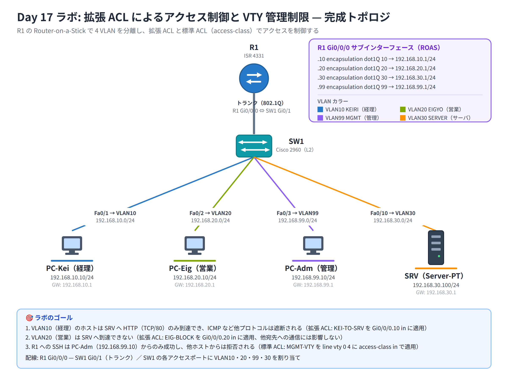

# Day 17 ラボ手順書: 拡張 ACL によるアクセス制御と VTY 管理制限

> 配置先: ドキュメント `02_ラボ手順書 > Week4 > Day17`
> 所要時間の目安: 2.5 時間 ／ 使用ツール: Cisco Packet Tracer 9.x

## ゴール

- 小規模企業ネットワークで拡張 ACL を用いた要件ベースのアクセス制御を実装できる
- ヒットカウンタと ping / ブラウザ検証で、意図した通信のみが成立していることを確認できる
- 標準 ACL を用いて、管理 VTY へのアクセスを特定端末のみに制限できる

達成すべき状態は次の 3 点です。

1. 経理 VLAN（VLAN10）のホストはサーバへ **HTTP のみ**到達でき、ICMP など他プロトコルは遮断される
2. 営業 VLAN（VLAN20）は**サーバへ到達できない**
3. **SSH による R1 への接続は管理 PC からのみ成功**し、他のホストからは拒否される

## 完成トポロジ



### IP アドレス表

| 機器 | インターフェース / VLAN | IP アドレス | サブネットマスク | ゲートウェイ |
|---|---|---|---|---|
| R1 | Gi0/0/0.10（VLAN10 経理） | 192.168.10.1 | 255.255.255.0 | — |
| R1 | Gi0/0/0.20（VLAN20 営業） | 192.168.20.1 | 255.255.255.0 | — |
| R1 | Gi0/0/0.30（VLAN30 サーバ） | 192.168.30.1 | 255.255.255.0 | — |
| R1 | Gi0/0/0.99（VLAN99 管理） | 192.168.99.1 | 255.255.255.0 | — |
| PC-Kei | Fa0/1 / VLAN10 | 192.168.10.10 | 255.255.255.0 | 192.168.10.1 |
| PC-Eig | Fa0/2 / VLAN20 | 192.168.20.10 | 255.255.255.0 | 192.168.20.1 |
| PC-Adm | Fa0/3 / VLAN99 | 192.168.99.10 | 255.255.255.0 | 192.168.99.1 |
| SRV | Fa0/10 / VLAN30 | 192.168.30.100 | 255.255.255.0 | 192.168.30.1 |

使用機器: Router ISR 4331 × 1 = R1、L2 スイッチ 2960 × 1 = SW1、
Server-PT × 1 = SRV、PC × 3（PC-Kei = 経理、PC-Eig = 営業、PC-Adm = 管理）。
配線: R1 Gi0/0/0 — SW1 Gi0/1（トランク）。

---

## 手順 1: VLAN とスイッチポートの設定（20 分）

1. SW1 で VLAN を作成します。

   ```
   Switch(config)# vlan 10
   Switch(config-vlan)# name KEIRI
   Switch(config-vlan)# vlan 20
   Switch(config-vlan)# name EIGYO
   Switch(config-vlan)# vlan 30
   Switch(config-vlan)# name SERVER
   Switch(config-vlan)# vlan 99
   Switch(config-vlan)# name MGMT
   Switch(config-vlan)# exit
   ```

2. 各アクセスポートに VLAN を割り当てます。

   ```
   Switch(config)# interface FastEthernet0/1
   Switch(config-if)# switchport mode access
   Switch(config-if)# switchport access vlan 10
   Switch(config-if)# exit
   Switch(config)# interface FastEthernet0/2
   Switch(config-if)# switchport mode access
   Switch(config-if)# switchport access vlan 20
   Switch(config-if)# exit
   Switch(config)# interface FastEthernet0/3
   Switch(config-if)# switchport mode access
   Switch(config-if)# switchport access vlan 99
   Switch(config-if)# exit
   Switch(config)# interface FastEthernet0/10
   Switch(config-if)# switchport mode access
   Switch(config-if)# switchport access vlan 30
   Switch(config-if)# exit
   ```

3. R1 との接続ポートをトランクにします。

   ```
   Switch(config)# interface GigabitEthernet0/1
   Switch(config-if)# switchport mode trunk
   Switch(config-if)# exit
   ```

## 手順 2: Router-on-a-Stick の構成（25 分）

1. R1 の物理インターフェースを有効化します。

   ```
   Router(config)# interface GigabitEthernet0/0/0
   Router(config-if)# no shutdown
   Router(config-if)# exit
   ```

2. 各 VLAN 用のサブインターフェースを作成し、`encapsulation dot1Q` と
   IP アドレスを設定します（4 つ分繰り返します）。

   ```
   Router(config)# interface GigabitEthernet0/0/0.10
   Router(config-subif)# encapsulation dot1Q 10
   Router(config-subif)# ip address 192.168.10.1 255.255.255.0
   Router(config-subif)# exit

   Router(config)# interface GigabitEthernet0/0/0.20
   Router(config-subif)# encapsulation dot1Q 20
   Router(config-subif)# ip address 192.168.20.1 255.255.255.0
   Router(config-subif)# exit

   Router(config)# interface GigabitEthernet0/0/0.30
   Router(config-subif)# encapsulation dot1Q 30
   Router(config-subif)# ip address 192.168.30.1 255.255.255.0
   Router(config-subif)# exit

   Router(config)# interface GigabitEthernet0/0/0.99
   Router(config-subif)# encapsulation dot1Q 99
   Router(config-subif)# ip address 192.168.99.1 255.255.255.0
   Router(config-subif)# exit
   ```

## 手順 3: 端末設定と ACL 適用前の疎通確認（20 分）

1. PC-Kei・PC-Eig・PC-Adm・SRV に、IP アドレス表のとおり IP / サブネットマスク /
   デフォルトゲートウェイを設定します（[Desktop] → IP Configuration）
2. **ACL を設定する前に**、全 VLAN 間で ping による疎通ができることを確認します
   （この時点で失敗する場合は VLAN・トランク・サブインターフェースの設定ミスです）

   ```
   PC> ping 192.168.30.100
   PC> ping 192.168.20.10
   ```

3. SRV の HTTP サービスを有効化します（[Desktop] → [Services] → HTTP → On）
4. PC-Kei の [Desktop] → Web Browser から `http://192.168.30.100` にアクセスし、
   デフォルトページが表示されることを確認します（土台の検証完了）

## 手順 4: 経理 VLAN → サーバの拡張 ACL 作成と適用（30 分・本日のメイン）

1. 経理 VLAN から SRV への HTTP のみを許可する名前付き拡張 ACL を作成します。

   ```
   Router(config)# ip access-list extended KEI-TO-SRV
   Router(config-ext-nacl)# permit tcp 192.168.10.0 0.0.0.255 host 192.168.30.100 eq 80
   Router(config-ext-nacl)# deny ip any any log
   Router(config-ext-nacl)# exit
   ```

   `deny ip any any log` は暗黙の deny と同じ効果を持ちますが、明示的に書いて
   `log` を付けることで、あとから `show access-lists` のヒットカウンタや
   Syslog で末尾遮断の動作を観察できるようにします。

2. 拡張 ACL は「送信元にできるだけ近いインターフェース」に適用する原則に
   従い、Gi0/0/0.10 の in 方向に適用します。

   ```
   Router(config)# interface GigabitEthernet0/0/0.10
   Router(config-subif)# ip access-group KEI-TO-SRV in
   Router(config-subif)# exit
   ```

3. **検証 1**: PC-Kei から SRV への通信を確認します。

   ```
   PC> ping 192.168.30.100
   ```

   → **失敗**すること（ICMP は permit されていないため）

   PC-Kei の Web Browser から `http://192.168.30.100` にアクセス
   → **成功**すること（TCP/80 のみ permit されているため）

## 手順 5: 営業 VLAN → サーバの遮断（20 分）

1. 営業 VLAN からサーバへの到達を止める ACL を作成します。

   ```
   Router(config)# ip access-list extended EIG-BLOCK
   Router(config-ext-nacl)# deny ip 192.168.20.0 0.0.0.255 host 192.168.30.100
   Router(config-ext-nacl)# permit ip any any
   Router(config-ext-nacl)# exit
   ```

2. Gi0/0/0.20 の in 方向に適用します。

   ```
   Router(config)# interface GigabitEthernet0/0/0.20
   Router(config-subif)# ip access-group EIG-BLOCK in
   Router(config-subif)# exit
   ```

3. **検証 2**: PC-Eig から SRV への到達を確認します。

   ```
   PC> ping 192.168.30.100
   ```

   → **失敗**すること。また PC-Eig から他の宛先（例: 192.168.10.10）への
   通信は permit ip any any により影響を受けないことも確認してください

## 手順 6: ヒットカウンタの確認（15 分）

1. 各 ACL のヒットカウンタを確認します。

   ```
   Router# show access-lists
   ```

2. KEI-TO-SRV の permit 行（HTTP アクセス分）と deny 行（ping 失敗分）の
   matches 数が、手順 4 で行った操作回数と一致しているかを確認します
3. カウンタをリセットして、もう一度同じ操作を行い、増分を確認します。

   ```
   Router# clear access-list counters
   ```

## 手順 7: SSH の有効化（Day16 復習）（15 分）

1. R1 に SSH 管理用の基本設定を行います。

   ```
   Router(config)# hostname R1
   R1(config)# ip domain-name ccna-lab.local
   R1(config)# crypto key generate rsa
   How many bits in the modulus [512]: 1024
   R1(config)# username admin secret Cisco12345
   R1(config)# line vty 0 4
   R1(config-line)# transport input ssh
   R1(config-line)# login local
   R1(config-line)# exit
   ```

## 手順 8: 標準 ACL による VTY アクセス制限（20 分）

1. 管理 PC（PC-Adm）だけを許可する標準名前付き ACL を作成します。

   ```
   Router(config)# ip access-list standard MGMT-VTY
   Router(config-std-nacl)# permit host 192.168.99.10
   Router(config-std-nacl)# exit
   ```

2. VTY 回線に適用します（`ip access-group` ではなく **`access-class`** を
   使う点に注意してください）。

   ```
   Router(config)# line vty 0 4
   Router(config-line)# access-class MGMT-VTY in
   Router(config-line)# exit
   ```

3. **検証 3**: PC-Adm から R1 へ SSH 接続します。

   ```
   PC> ssh -l admin 192.168.99.1
   ```

   → **成功**すること

   PC-Eig から同様に SSH 接続を試みます（PC-Kei は手順 4 の KEI-TO-SRV
   により Gi0/0/0.10 の in 方向で SSH 自体が遮断されてしまうため、
   access-class 単体の効果を切り分けられません。EIG-BLOCK は末尾が
   `permit ip any any` のため、PC-Eig の SSH は受信 ACL を通過し、
   access-class の判定まで到達します）。

   ```
   PC> ssh -l admin 192.168.99.1
   ```

   → **拒否**されること（接続自体が確立しない、またはタイムアウトする）

## 手順 9: 最終確認と保存（5 分）

1. `show ip interface GigabitEthernet0/0/0.10` を実行し、KEI-TO-SRV が
   in 方向に適用されていることを確認します
2. `show running-config` で全 ACL の内容と適用状況を最終確認します
3. `copy running-config startup-config` で設定を保存します
4. ファイルを保存します: `File > Save As` → `day17_氏名.pkt`

### 観察レポート（コメント提出用）

以下 3 問に答えて、課題のコメントに記入してください。

1. PC-Kei からサーバへの HTTP は成功したが ping は失敗しました。
   `show access-lists` のヒットカウンタも示しながら、なぜプロトコルによって
   結果が分かれたのかを、ACL の評価ロジックと `eq 80` の条件に基づいて
   説明してください
2. 拡張 ACL KEI-TO-SRV を「宛先近く」ではなく「送信元近く（Gi0/0/0.10 in）」
   に置いた理由を、もし宛先近くに置いた場合に生じる不都合とあわせて
   述べてください
3. VTY 制限にインターフェースの `ip access-group` ではなく line vty の
   `access-class in` を使い、かつ拡張ではなく標準 ACL で足りたのはなぜか。
   PC-Adm と PC-Eig の SSH の結果を根拠に説明してください

## 提出方法

1. `day17_氏名.pkt` を Backlog のラボ課題に**添付**する
2. 手順 6 のヒットカウンタ出力（スクリーンショット可）と、観察レポートの
   回答を課題の**コメント**に貼る
3. 課題の状態を「処理済み」に変更する

## うまくいかないとき

| 症状 | 確認すること |
|---|---|
| ACL 適用前から VLAN 間 ping が失敗する | サブインターフェースの `encapsulation dot1Q <番号>` の番号違い、トランクポートの設定漏れ |
| PC-Kei から HTTP も失敗する | ACL の記述順序（プロトコル/送信元/宛先/ポート）、`eq 80` の誤記、末尾 deny が permit より先に書かれていないか |
| PC-Kei から ping が成功してしまう | `deny ip any any` が抜けていないか（暗黙 deny 頼みでも動作はするが要件通りか確認）、ACL が正しいインターフェース・方向に適用されているか |
| PC-Adm からも SSH が拒否される | `access-class` の名前と ACL 名の綴り違い、`permit host` のアドレス誤り、`login local` の設定漏れ |
| PC-Eig から SSH が成功してしまう | `access-class MGMT-VTY in` が正しい line vty に適用されているか、`show ip interface` ではなく `show line` 系で確認が必要な点に注意 |
| ヒットカウンタが 0 のまま増えない | 想定した通信を実際に発生させたか、`clear access-list counters` 直後で正しいか、ACL の適用インターフェースが違っていないか |

30 分試して解決しない場合は、状況（スクリーンショット + 試したこと）を
課題のコメントに書いて質問してください。
