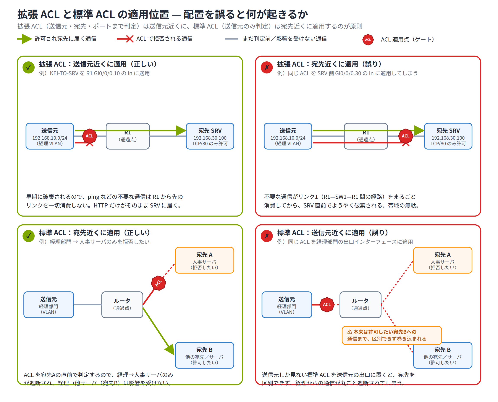

# Day 17 講義: ACL（アクセスコントロールリスト）

> 配置先: ドキュメント `01_教材 > Week4 > Day17`
> 学習時間の目安: 3.5 時間 ／ 準拠: CCNA 200-301 v1.1 ドメイン 5

## 学習目標

この講義を終えると、次のことができるようになります。

1. ACL（アクセスコントロールリスト）の役割と、インターフェースへの適用ルール（方向・プロトコルごとに 1 つ）を説明できる
2. ACL の評価ロジック（トップダウン・最初の一致・暗黙の deny）を説明できる
3. プレフィックス長からワイルドカードマスクを求め、host / any キーワードと対応付けられる
4. 標準 ACL を構成し、宛先近くに適用する原則を説明できる
5. 拡張 ACL を構成し、送信元近くに適用する原則を説明できる
6. VTY 回線へのアクセス制限や show コマンドによる検証・トラブルシュートができる

---

## ウォームアップ（朝の想起クイズ）

> 教材を見ずに、まず自力で思い出してください（分散学習: Day 10「無線 LAN と検出
> プロトコル」 / Day 14「NAT」 / Day 16「セキュリティの概念とデバイス保護」 の
> 範囲から出題）。

**W1.** （Day 10）無線 LAN で、有線の CSMA/CD に相当する衝突回避の方式の名称は
何か。また、2.4GHz 帯で相互に干渉しない 3 つのチャネル番号を答えよ。

**W2.** （Day 14）PAT の設定で、動的 NAT と区別して多対 1 変換を有効にするために
末尾に付けるキーワードは何か。また、inside local と inside global のうち、外部から
見える変換後の公開アドレスはどちらか。

**W3.** （Day 16）RADIUS と TACACS+ のうち、コマンド単位の認可を柔軟に行えるのは
どちらか。また、`login block-for 60 attempts 3 within 30` は何を防ぐための設定か。

<details><summary>解答</summary>

W1. CSMA/CA（衝突回避）。互いに干渉しない 2.4GHz 帯のチャネルは 1・6・11。
W2. `overload` キーワード。外部から見える公開アドレスは inside global。
W3. コマンド単位の認可が柔軟なのは TACACS+。`login block-for` は、指定時間内に
指定回数ログインに失敗すると一定時間すべてのログインをブロックする設定で、
ブルートフォース（総当たり）攻撃の緩和が目的。

</details>

---

## 1. ACL の役割と全体像 — パケットフィルタとその仕組み

**ACL（Access Control List / アクセスコントロールリスト）** とは、パケットの
L3（IP ヘッダ）/ L4（TCP・UDP ヘッダ）の情報 —送信元 IP アドレス、宛先 IP
アドレス、プロトコル、ポート番号など— を条件として、通信を **許可（permit）**
するか **拒否（deny）** するかを判定する仕組みです。1 つ 1 つのパケットを
個別に、それ以前の通信の状態を記憶せずに判定するため、**ステートレス**な
フィルタと呼ばれます（状態を保持するファイアウォールとの違いです）。

ACL は「怪しい通信を遮断するセキュリティ機能」というイメージが強いですが、
実際にはそれだけではありません。次のように、通信を**識別するための汎用ツール**
として、ルータの多くの機能から参照されます。

| 用途 | 概要 |
|---|---|
| セキュリティ | 特定の送信元・宛先・サービスへの通信を遮断する |
| 経路制御 | ルートマップ（route-map。条件に一致した通信だけ経路を変える設定）等と組み合わせ、特定トラフィックだけ経路を変える |
| NAT 対象の識別 | どのアドレスを変換対象にするかを ACL で指定する |
| QoS 分類 | Day 15 で学んだ QoS（優先制御）の対象トラフィックを ACL で分類する |
| VTY アクセス制限 | リモート管理接続を許可する送信元を限定する |

### 適用の基本ルール

ACL は、**1 つのインターフェースの 1 つの方向（in または out）につき、
1 つのプロトコル（IPv4 など）あたり 1 つの ACL しか適用できません**。
同じインターフェースに in 方向の ACL と out 方向の ACL をそれぞれ 1 つずつ、
合計 2 つ適用することは可能です。

- **in**: パケットがインターフェースに**入ってきた直後**（ルーティングの判断より前）に評価される
- **out**: ルーティングの判断が終わり、そのインターフェースから**出ていく直前**に評価される

この違いは、後述する標準 ACL / 拡張 ACL の適用位置の判断に直結するため、
必ず区別できるようにしておきましょう。

ACL は複数の **ACE（Access Control Entry）**、つまり 1 行 1 行の permit /
deny 文の集まりであり、上から順に並んだ**順序付きリスト**です。ACE の並び順が
動作に直接影響する点は次章で詳しく扱います。

最後に覚えておきたい例外があります。**ACL はルータ自身が生成する（送信元となる）
トラフィックには適用されません**。たとえばルータから ping や NTP、Syslog 送信
などを行う場合、その通信はルータの出力インターフェースに設定された out 方向の
ACL では基本的にフィルタされません。

ただしこれは **out 方向に限った話**であり、対になる重要な事実として、**in 方向の
ACL はそのインターフェースに入ってくる全トラフィック（＝ルータ自身の IP アドレス
宛の管理通信を含む）を評価します**。この非対称性のため、サブインターフェースに
in 方向の広い deny を含む ACL を置くと、そこから発生するはずのルータ自身宛の
SSH・ping などの管理通信まで巻き込んで遮断してしまうことがあるので注意が必要です。

## 2. ACL の評価ロジック — 順次評価・最初の一致・暗黙の deny

ACL の動作を正しく理解する上でもっとも重要なのが、この評価ロジックです。

1. パケットが ACL の適用されたインターフェース・方向を通過しようとすると、
   ACL の**先頭の ACE から順番に**（トップダウンに）条件と照合されます
2. **最初に一致した ACE**で処理（permit または deny）が確定し、それより下の
   ACE は一切評価されません（**first match** の原則）
3. リストのどの ACE にも一致しなかった場合、すべての ACL の末尾には
   目に見えない **暗黙の deny any（implicit deny）** が存在し、そのパケットは
   破棄されます

```
access-list 100 permit tcp 192.168.10.0 0.0.0.255 host 192.168.30.100 eq 80
access-list 100 deny   ip  any any log
                                        ← （表示されないが必ず存在する）
                                        deny ip any any  ★暗黙の deny
```

> **試験のポイント**: 末尾の「暗黙の deny any」によって、どの ACE にも一致しない
> パケットは自動的に破棄されることと、そのために ACL には**最低 1 つの permit**
> が必要であることが頻出です。permit を 1 行も書かなければ、その ACL は
> 実質的に「すべて遮断」として動作してしまいます。

### 行の並び順が結果を左右する

評価は最初に一致した時点で終了するため、**より限定的（specific）な条件を
上に、より広い（general）条件を下に**置くのが基本原則です。たとえば
「192.168.10.5 だけは拒否し、192.168.10.0/24 の残りは許可したい」場合、
deny host 192.168.10.5 を先に、permit 192.168.10.0 0.0.0.255 を後に書かなければ
なりません。順序を逆にすると、広い permit が先に一致してしまい、意図した
deny の行が一切評価されなくなります。

> **試験のポイント**: 「上から順・最初の一致で評価が確定する」という原則を、
> 行順序を誤ったシナリオ（意図した ACE がヒットしない）を示して問う問題が
> 頻出です。

### 破棄の通知とステートレス性

ACL の暗黙 deny（または明示的な deny）によってパケットが破棄されると、
ルータは送信元に対して **ICMP unreachable（到達不能）** メッセージを返す
ことがあります。

また ACL はステートレスであるため、**ある通信の「戻り」のトラフィックは
自動的には通りません**。たとえば拡張 ACL で「サーバへの HTTP 要求」だけを
permit しても、その ACL の設置場所・方向によっては応答パケットが別途評価の
対象になります。双方向の通信を成立させるには、要求方向と応答方向の両方を
考慮した設計が必要です（`established` キーワードによる簡易的な対応は
第 5 章で扱います）。

## 3. ワイルドカードマスク — ACL のアドレス一致条件

ACL で IP アドレスの範囲を指定する際には、サブネットマスクではなく
**ワイルドカードマスク（wildcard mask）** を使います。似た見た目の数字ですが、
意味はまったく逆です。

| | サブネットマスク | ワイルドカードマスク |
|---|---|---|
| ビット `0` の意味 | ホスト部 | **一致必須**（照合する） |
| ビット `1` の意味 | ネットワーク部 | **任意**（無視してよい） |

> ここが今日の山場です。ワイルドカードマスクはサブネットマスクと数字の意味が
> 正反対になるため、最初は混乱して当然です。焦らず、表と計算式を何度も見比べ
> ながら理解して構いません。

### 変換方法

ワイルドカードマスクは、次の計算で機械的に求められます。

```
ワイルドカードマスク = 255.255.255.255 − サブネットマスク
```

| プレフィックス長 | サブネットマスク | ワイルドカードマスク |
|---|---|---|
| /24 | 255.255.255.0 | 0.0.0.255 |
| /25 | 255.255.255.128 | 0.0.0.127 |
| /26 | 255.255.255.192 | 0.0.0.63 |
| /27 | 255.255.255.224 | 0.0.0.31 |
| /28 | 255.255.255.240 | 0.0.0.15 |
| /30 | 255.255.255.252 | 0.0.0.3 |

> **試験のポイント**: プレフィックス長からワイルドカードマスクを求める計算
> （例: /26 → 0.0.0.63）は頻出です。オクテットごとに 255 から引き算する手順を
> 覚えておきましょう。

> 💼 **実務では**: ワイルドカードマスクの取り違えは現場の定番バグです。ACL に
> 誤ってサブネットマスク（255.255.255.0 など）をそのまま貼り付けても IOS は
> エラーを出さずに受理してしまい、意図と全く違うアドレス範囲に一致する「黙って
> 壊れる」障害になります。適用後は必ず `show access-lists` のヒットカウンタで、
> 想定した行に想定どおりの通信が当たっているかを実トラフィックで確認しましょう。
> ワイルドカードは「サブネットマスクのビット反転（0 と 1 が逆）」と覚え、疑わしい
> ときは `255.255.255.255 − サブネットマスク` で機械的に検算するのが安全です。

### 複数オクテットにまたがるワイルドカードマスク

ここまでの例はすべて最終オクテットのみが `255` 以外でしたが、`255.255.255.255 −
サブネットマスク` の計算は**複数オクテットにまたがるワイルドカードマスク**にも
そのまま適用でき、複数のサブネットを 1 行の ACE でまとめて一致させられます。

| ワイルドカードマスク指定 | 意味 |
|---|---|
| `172.16.0.0 0.0.255.255` | 172.16.0.0/16 全体（172.16.0.0〜172.16.255.255）に一致 |
| `10.1.0.0 0.0.3.255` | 10.1.0.0〜10.1.3.255 の連続する 4 つの /24 サブネットに一致 |

たとえば `10.1.0.0 0.0.3.255` は、`255.255.255.255 − 255.255.252.0`（/22 相当）と
同じ計算で求められます。第 3 オクテットの `3` は「下位 2 ビットは任意」を意味し、
10.1.**0**.x〜10.1.**3**.x の 4 サブネットをまとめて一致させます。

> **試験のポイント**: 「このワイルドカードマスクは何を一致させるか」を複数
> オクテットで問う問題も出題されます。単一オクテットの計算と同じ手順（255 から
> サブネットマスクを引く）をオクテットごとに機械的に適用すれば求められます。

### 特殊なワイルドカードマスクとキーワード

| 指定したいこと | ワイルドカードマスクによる表記 | 等価なキーワード |
|---|---|---|
| ホスト 1 台のみ（全ビット一致） | `10.1.1.1 0.0.0.0` | `host 10.1.1.1` |
| 全アドレス（全ビット任意） | `0.0.0.0 255.255.255.255` | `any` |
| サブネット全体 | `192.168.10.0 0.0.0.255`（ネットワークアドレス + 逆マスク） | — |

`host` キーワードと `any` キーワードは、それぞれ `0.0.0.0` と
`255.255.255.255` というワイルドカードマスクの**省略記法**です。CLI 上で
書き方が変わるだけで意味は同じである点を押さえておきましょう。

サブネット全体を指定するときは、そのサブネットの**ネットワークアドレス**に
プレフィックス長から逆算したワイルドカードマスクを組み合わせます
（例: 192.168.10.0/24 全体 → `192.168.10.0 0.0.0.255`）。

なお、連続しないアドレス群（偶数ホストのみ等）を 1 行で表す高度な
ワイルドカードマスクも技術的には作成できますが（例: `0.0.0.254` で
最下位ビットを無視し偶数/奇数ホストをまとめて指定）、実務・試験では
まず「/プレフィックス長からの機械的な変換」を確実にできることが優先です。

## 4. 標準 ACL — 番号付き・名前付きと適用位置の原則

**標準 ACL（Standard ACL）** は、**送信元 IP アドレスのみ**を条件に判定する、
もっともシンプルな ACL です。番号付きの場合、番号の範囲は次のとおりです。

| 種別 | 番号範囲 |
|---|---|
| 標準 ACL | 1〜99、1300〜1999（拡張範囲） |
| 拡張 ACL（次章） | 100〜199、2000〜2699（拡張範囲） |

表の「拡張範囲」は、番号が不足したときに後から追加された番号の範囲という意味で、
次章で説明する「拡張 ACL」という ACL の種類とは別の話です。標準 ACL にも
拡張 ACL にも、それぞれ拡張範囲の番号が用意されています。混同しないように
注意してください。

### 番号付き標準 ACL の設定例

```
Router(config)# access-list 10 permit 192.168.1.0 0.0.0.255
Router(config)# access-list 10 deny   any
Router(config)# interface GigabitEthernet0/1
Router(config-if)# ip access-group 10 out
```

`ip access-group <番号または名前> in|out` で、インターフェースの指定した
方向に ACL を適用します。

### 名前付き標準 ACL の設定例

```
Router(config)# ip access-list standard BLOCK-SALES
Router(config-std-nacl)# permit 192.168.10.0 0.0.0.255
Router(config-std-nacl)# deny   any
Router(config-std-nacl)# exit
Router(config)# interface GigabitEthernet0/1
Router(config-if)# ip access-group BLOCK-SALES out
```

名前付き ACL では `ip access-list standard <名前>` でサブモードに入り、
`permit` / `deny` を入力します。名前付き ACL の大きな利点は、**シーケンス
番号**を使って特定の行だけを挿入・削除できることです。

```
Router(config)# ip access-list standard BLOCK-SALES
Router(config-std-nacl)# do show access-lists BLOCK-SALES
   10 permit 192.168.10.0 0.0.0.255
   20 deny any
Router(config-std-nacl)# 15 deny host 192.168.10.99
```

`show` は特権 EXEC コマンドのため、ACL のサブ設定モードのままでは実行できません。
`do` を先頭に付けることで、設定モードを抜けずに特権 EXEC コマンドを実行できます。

上のように行番号（シーケンス番号）を指定して新しい行を挿入すれば、
既存の行を削除・再入力せずに順序を制御できます。

### 適用位置の原則: 宛先の近く

標準 ACL は送信元アドレスしか見ないため、**適用するインターフェースを
間違えると、意図しない通信まで巻き込んで遮断してしまう**危険があります。
たとえば「経理部門から人事サーバへの通信を拒否する」ACL を、経理部門の
出口（送信元に近い場所）に適用すると、経理部門から**人事サーバ以外への
通信**まで一緒に遮断されてしまいます。

そのため標準 ACL は、原則として**宛先にできるだけ近いインターフェース**
に適用します。宛先の直前で初めて「送信元が経理部門かどうか」を判定すれば、
経理部門から他の宛先への通信には影響を与えません。

> **試験のポイント**: 標準 ACL は宛先近く、拡張 ACL（次章）は送信元近くに
> 適用するという配置原則は、トポロジ図を示した設問で頻出です。

### 番号付き ACL の削除に関する注意

番号付き ACL では、`no access-list 10 permit ...` のように**特定の 1 行だけ
削除できず**、`no access-list 10` を実行すると ACL 全体（すべての ACE）が
削除されてしまう点に注意してください（IOS のバージョンにより単一行の
削除に対応する場合もありますが、確実に行単位で編集したいときは名前付き
ACL のシーケンス番号を使うのが安全です）。

## 5. 拡張 ACL — 送信元/宛先/プロトコル/ポートによる詳細制御

**拡張 ACL（Extended ACL）** は、送信元 IP アドレスに加えて **宛先 IP
アドレス・プロトコル（ip / tcp / udp / icmp）・ポート番号** まで条件に
指定できる、より詳細なフィルタです。番号範囲は **100〜199 および
2000〜2699（拡張範囲）** です。

### 基本構文

```
access-list <番号> permit|deny <プロトコル> <送信元> <宛先> [eq <ポート>]
```

**プロトコル → 送信元 → 宛先 → ポート条件** の順序を厳守します。この順序を
誤ると、まったく違う意味の ACE になってしまいます。

```
Router(config)# access-list 100 permit tcp 192.168.10.0 0.0.0.255 host 192.168.30.100 eq 80
Router(config)# access-list 100 deny   ip  any any
Router(config)# interface GigabitEthernet0/1
Router(config-if)# ip access-group 100 in
```

上の例は、「192.168.10.0/24 から 192.168.30.100 の TCP/80（HTTP）宛の通信のみ
許可し、それ以外はすべて拒否する」という ACL です。

### ポート条件の演算子

| 演算子 | 意味 |
|---|---|
| `eq` | 指定したポート番号と等しい |
| `gt` | 指定したポート番号より大きい |
| `lt` | 指定したポート番号より小さい |
| `range <開始> <終了>` | 指定した範囲内 |

よく使われるポート番号は次のとおりです。

| サービス | プロトコル | ポート番号 |
|---|---|---|
| HTTP | TCP | 80 |
| HTTPS | TCP | 443 |
| SSH | TCP | 22 |
| Telnet | TCP | 23 |
| FTP | TCP | 21 |
| DNS（domain） | TCP/UDP | 53 |
| SMTP | TCP | 25 |

### established キーワード

```
access-list 101 permit tcp any 192.168.10.0 0.0.0.255 established
```

`established` を末尾に付けると、**ACK または RST フラグがセットされた
TCP セグメント**（＝すでに確立済みの通信の戻りパケット）だけを許可
できます。これにより、内部から開始された通信の戻りトラフィックだけを
簡易的に通す、という片方向開始の制御が可能になります。ただし ACL 自体は
ステートレスであり、本格的な状態管理を行うファイアウォールの代替には
ならない点に注意してください。

### 適用位置の原則: 送信元の近く

拡張 ACL は宛先やプロトコルまで詳細に判定できるため、**不要な通信を
できるだけ早い段階（送信元に近いインターフェース）で破棄**するのが原則です。
早期に破棄することで、ルータ内部やその先のリンクの帯域・処理負荷を
無駄に消費しません。

> **試験のポイント**: 標準 ACL＝宛先近く、拡張 ACL＝送信元近く、という
> 対比は非常によく出題されます。「なぜその位置か」を自分の言葉で説明できる
> ようにしておきましょう。

配置を誤ると具体的に何が起きるかを、4 章の標準 ACL・本章の拡張 ACL それぞれ
「正しい配置」「誤った配置」の 2 パターンで比較すると次のようになります。



拡張 ACL を宛先近くに置くと、不要な通信が経路の大半を消費してから最後に
捨てられるだけで「無駄」が生じるのに対し、標準 ACL を送信元近くに置くと、
本来は許可したい別の宛先への通信まで送信元だけで判定されて巻き込まれてしまう
という、**性質の異なる失敗**になる点を区別して覚えておきましょう。

### 名前付き拡張 ACL

```
Router(config)# ip access-list extended KEI-TO-SRV
Router(config-ext-nacl)# permit tcp 192.168.10.0 0.0.0.255 host 192.168.30.100 eq 80
Router(config-ext-nacl)# deny   ip  any any log
```

拡張 ACL も標準 ACL と同様に、名前付きにするとシーケンス番号による
行の挿入・削除ができ、可読性・保守性が高まるため実務・試験の両方で
推奨されます。

## 6. ACL の応用と検証 — VTY 制限・ロギング・トラブルシュート

### VTY 回線への適用

SSH や Telnet でルータ・スイッチにログインできる送信元を制限したい場合、
インターフェースに使う `ip access-group` ではなく、**VTY 回線専用のコマンド
`access-class`** を使います。

```
Router(config)# ip access-list standard MGMT-VTY
Router(config-std-nacl)# permit host 192.168.99.10
Router(config-std-nacl)# exit
Router(config)# line vty 0 4
Router(config-line)# access-class MGMT-VTY in
```

> **試験のポイント**: VTY 回線に ACL を適用するときは `ip access-group`
> ではなく **`access-class <ACL> in`** を使うことが頻出の落とし穴です。
> インターフェースへの適用方法と混同しないようにしましょう。

> 💼 **実務では**: `access-class` を line vty に適用する瞬間が最も事故が多い
> ポイントです。permit を書き忘れたまま適用したり、自分の接続元 IP を含め忘れると、
> その場で全 SSH セッションが切れてリモートから二度と入れなくなります
> （remote lockout）。現場では必ずコンソールまたは別セッションを 1 本開いた
> ままで適用し、動作確認後に保存します。本番の VTY は踏み台（jump host）や
> 管理サブネットのみに絞り、`transport input ssh` で Telnet を無効化し、
> 拒否された接続は `log` で記録するのが定石です。新人がやりがちなのは
> 「permit host 自分の PC」を入れ忘れて自爆するパターンです。

VTY 制限では管理アクセスを行おうとしている**送信元だけ**を見れば十分
なため、多くの場合は標準 ACL で足ります。`in` はルータ自身への着信
SSH/Telnet 接続を、`out` はルータ自身が発信する Telnet/SSH 接続
（踏み台としての利用など）を制御します。

### 検証コマンド

| コマンド | 用途 |
|---|---|
| `show access-lists` | すべての ACL の内容と、各 ACE の**ヒットカウンタ（matches）**を表示 |
| `show ip access-lists` | IPv4 の ACL のみを表示 |
| `show ip interface <インターフェース>` | どの ACL がどの方向（in/out）で適用されているかを確認 |
| `clear access-list counters` | ヒットカウンタをリセット |

```
Router# show access-lists KEI-TO-SRV
Extended IP access list KEI-TO-SRV
    10 permit tcp 192.168.10.0 0.0.0.255 host 192.168.30.100 eq www (12 matches)
    20 deny ip any any log (3 matches)
```

行末の `(12 matches)` のような表示が**ヒットカウンタ**です。permit 行が
期待どおりヒットしているか、逆に暗黙 deny（または明示 deny）に想定外の
通信が落ちていないかを、この数値で切り分けられます。

### ロギング

ACE の末尾に `log` を付けると、その行に一致したパケットの情報を **Syslog**
に記録できます（Syslog の仕組み自体は Day 15・Day 16 で学んだ内容と
関連します）。デバッグや不正アクセスの調査に役立ちますが、トラフィック量が
多い環境ではログ生成自体がルータの負荷になる点にも注意してください。

### 典型的なミスと切り分け手順

| ミスの種類 | 症状 | 確認方法 |
|---|---|---|
| 適用方向の誤り（in/out） | 期待と逆の通信が通る/止まる | `show ip interface` で方向を確認 |
| 送信元と宛先の取り違え | 意図と逆のアドレスで判定される | ACE の記述順序を再確認 |
| permit の欠落 | すべての通信が暗黙 deny で遮断 | `show access-lists` の暗黙 deny 相当行の matches を確認 |
| 行順序の誤り | 特定の行が一切ヒットしない | より限定的な条件が上にあるか確認 |

これらは単独ではなく組み合わさって発生することも多いため、**まず
`show ip interface` で適用状況（ACL 番号・方向）を確認し、次に
`show access-lists` のヒットカウンタで実際の一致状況を確認する**、という
順序で切り分けると効率的です。

## 7. まとめ

- ACL は L3/L4 の情報でパケットを permit/deny する**ステートレス**なフィルタで、1 インターフェース・1 方向・1 プロトコルにつき 1 つまで適用できる
- 評価は**上から順・最初の一致で確定**し、末尾には常に**暗黙の deny any**が存在するため、ACL には最低 1 つの permit が必要
- ワイルドカードマスクは「0 = 一致必須、1 = 任意」で、`255.255.255.255 − サブネットマスク`で求められる。`host`＝`0.0.0.0`、`any`＝`255.255.255.255`
- 標準 ACL（1〜99・1300〜1999）は送信元のみで判定し、**宛先近く**に適用する
- 拡張 ACL（100〜199・2000〜2699）は送信元・宛先・プロトコル・ポートで判定し、**送信元近く**に適用する
- VTY 回線への適用は `ip access-group` ではなく **`access-class in`**
- `show access-lists` のヒットカウンタと `show ip interface` の適用状況で検証・トラブルシュートを行う

---

## 確認問題（自己チェック・解答は末尾）

1. ACL のリストのどの ACE にも一致しなかったパケットは、最終的にどう処理されるか。
2. プレフィックス長 /27 に対応するワイルドカードマスクを答えよ。
3. 標準 ACL と拡張 ACL は、それぞれどちらの近く（送信元/宛先）に適用するのが原則か。
4. VTY 回線に ACL を適用するときに使うコマンドは何か。
5. 「192.168.20.0/24 から特定サーバへの通信のみ拒否し、他はすべて許可したい」場合、拒否したい行と許可したい行はどちらを上に置くべきか、その理由とともに答えよ。

<details><summary>解答</summary>

1. リスト末尾の暗黙の deny any により破棄される
2. 0.0.0.31
3. 標準 ACL は宛先の近く、拡張 ACL は送信元の近く
4. `access-class <ACL 名または番号> in`（`line vty 0 4` のサブモードで実行）
5. 拒否したい限定的な行（deny）を上に、広い許可（permit）を下に置く。評価は最初に一致した時点で確定するため、広い permit を先に置くと deny の行が一切評価されなくなってしまう

</details>

## 次のステップ

本日のラボ課題「[Day17] ラボ: 拡張 ACL によるアクセス制御と VTY 管理制限」に
進み、今日学んだワイルドカードマスク・拡張 ACL・標準 ACL による VTY 制限を
Packet Tracer 上で実際に構成し、ヒットカウンタで動作を確認してください。
