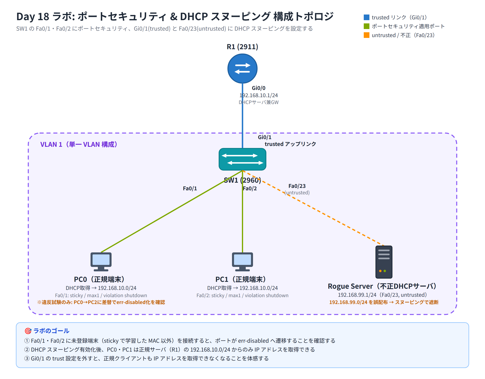

# Day 18 ラボ手順書: ポートセキュリティと DHCP スヌーピングによる L2 セキュリティ強化

> 配置先: ドキュメント `02_ラボ手順書 > Week4 > Day18`
> 所要時間の目安: 2.5 時間 ／ 使用ツール: Cisco Packet Tracer 9.x

## ゴール

- アクセス層スイッチにポートセキュリティ（sticky ＋ violation shutdown）を
  設定し、未許可端末が接続されたときにポートが err-disabled へ遷移すること
  を確認できる
- err-disabled になったポートを復旧できる
- DHCP スヌーピングを有効化し、不正 DHCP サーバからのアドレス配布が遮断
  され、正規サーバからのみ IP アドレスを取得できることを検証できる

達成すべき状態は次の 3 点です。

1. Fa0/1・Fa0/2 は登録済み端末（sticky で学習した MAC）以外を接続すると
   err-disabled になる
2. DHCP スヌーピング有効化後、PC0・PC1 は正規サーバ（R1）の
   192.168.10.0/24 からのみ IP アドレスを取得できる
3. アップリンク（Gi0/1）の trust 設定を外すと、正規クライアントも IP
   アドレスを取得できなくなることを体感する

## 完成トポロジ



### IP アドレス表

| 機器 | インターフェース | IP アドレス | サブネットマスク | 備考 |
|---|---|---|---|---|
| R1 | Gi0/0 | 192.168.10.1 | 255.255.255.0 | 正規 DHCP サーバ兼デフォルトゲートウェイ |
| PC0 | Fa0 | DHCP 取得 | DHCP 取得 | SW1 Fa0/1 に接続 |
| PC1 | Fa0 | DHCP 取得 | DHCP 取得 | SW1 Fa0/2 に接続 |
| PC2 | Fa0 | DHCP 取得 | DHCP 取得 | 違反試験用（通常は未接続） |
| Rogue Server | Fa0 | 192.168.99.1 | 255.255.255.0 | 不正 DHCP サーバ、SW1 Fa0/23 に接続（誤って 192.168.99.0/24 を配布） |

全機器 VLAN 1（本日は VLAN セキュリティではなく L2 セキュリティ機能そのものに
焦点を当てるため、単一 VLAN 構成とします）。

---

## 手順 1: R1 の DHCP サーバ設定（15 分）

1. R1 の CLI に入り、Gi0/0 に IP アドレスを設定する

   ```
   Router(config)# interface gi0/0
   Router(config-if)# ip address 192.168.10.1 255.255.255.0
   Router(config-if)# no shutdown
   Router(config-if)# exit
   ```

2. DHCP プールを設定する

   ```
   Router(config)# ip dhcp excluded-address 192.168.10.1
   Router(config)# ip dhcp pool LAN
   Router(dhcp-config)# network 192.168.10.0 255.255.255.0
   Router(dhcp-config)# default-router 192.168.10.1
   Router(dhcp-config)# exit
   ```

## 手順 2: 不正 DHCP サーバ（Rogue Server）の準備（10 分）

1. Rogue Server をクリック → [Desktop] → **IP Configuration** で
   `192.168.99.1` / `255.255.255.0` を静的に設定する
2. [Services] タブ → **DHCP** を On にし、Default Gateway を
   `192.168.99.1`、Start IP Address を `192.168.99.2`、Subnet Mask を
   `255.255.255.0` に設定して Save する

   > これは意図的な誤設定です。正規セグメント（192.168.10.0/24）とは
   > 異なるレンジを配布する「不正 DHCP サーバ」役を再現しています。

## 手順 3: SW1 のアクセスポート固定とポートセキュリティ設定（30 分）

1. Fa0/1・Fa0/2 を access モードに固定する（DTP を無効化する）

   ```
   Switch(config)# interface range fa0/1-2
   Switch(config-if-range)# switchport mode access
   Switch(config-if-range)# exit
   ```

2. 各ポートにポートセキュリティを設定する

   ```
   Switch(config)# interface fa0/1
   Switch(config-if)# switchport port-security
   Switch(config-if)# switchport port-security maximum 1
   Switch(config-if)# switchport port-security mac-address sticky
   Switch(config-if)# switchport port-security violation shutdown
   Switch(config-if)# exit
   Switch(config)# interface fa0/2
   Switch(config-if)# switchport port-security
   Switch(config-if)# switchport port-security maximum 1
   Switch(config-if)# switchport port-security mac-address sticky
   Switch(config-if)# switchport port-security violation shutdown
   Switch(config-if)# exit
   ```

3. PC0・PC1 を接続し、[Desktop] → Command Prompt で
   `ipconfig /release` → `ipconfig /renew` を実行して通信を発生させ、
   sticky MAC アドレスを学習させる

4. 学習結果を保存する

   ```
   Switch# copy running-config startup-config
   ```

5. 登録された MAC アドレスを確認する

   ```
   Switch# show port-security address
   ```

## 手順 4: 違反試験（25 分）

1. PC0 を SW1 の Fa0/1 から取り外す（ワークスペース上のケーブルをクリックして
   選択し、Delete キーで削除する）
2. 代わりに PC2（別の MAC アドレスを持つ端末）を Fa0/1 に接続する（Day 1 で
   使ったのと同じ手順で、接続アイコン→ストレートケーブルを選び、PC2 と
   SW1 Fa0/1 をクリックしてつなぐ）
3. PC2 の [Desktop] → Command Prompt で `ipconfig /release` に続けて
   `ipconfig /renew` を実行する。Packet Tracer の PC はリンクアップしただけ
   では自発的にフレームを送信しないため、明示的にトラフィックを発生させる
   必要があります。この DHCP 要求（ブロードキャストの `DHCPDISCOVER`）に
   PC2 の MAC アドレスが乗ってスイッチへ届くと、Fa0/1 に登録済みの MAC
   （PC0 のもの）とは異なる未登録の MAC として検出され、ポートセキュリティ
   違反が発火します
4. 次のコマンドでポートの状態を確認する

   ```
   Switch# show interfaces fa0/1 status
   Switch# show port-security interface fa0/1
   ```

5. **確認**: `show interfaces status` の Status 欄が `err-disabled` に
   なっていること、`show port-security interface` の Violation Count が
   増加していることを記録する

### 復旧

1. Fa0/1 を一旦シャットダウンしてから再起動する

   ```
   Switch(config)# interface fa0/1
   Switch(config-if)# shutdown
   Switch(config-if)# no shutdown
   Switch(config-if)# exit
   ```

2. PC2 を取り外し、正しい PC0 を Fa0/1 に戻す
3. `show interfaces fa0/1 status` で `connected` に復旧していることを確認する

## 手順 5: DHCP スヌーピングの有効化（30 分）

1. 現時点（DHCP スヌーピング無効）での PC0・PC1 の DHCP 取得状況を確認する

   ```
   ipconfig /release
   ipconfig /renew
   ipconfig
   ```

   Rogue Server が稼働している場合、192.168.99.x のアドレスを誤って
   取得してしまう可能性があることを観察する。

2. SW1 でグローバルに DHCP スヌーピングを有効化する

   ```
   Switch(config)# ip dhcp snooping
   Switch(config)# ip dhcp snooping vlan 1
   ```

3. 正規 DHCP サーバ（R1）側のアップリンクを信頼ポートに設定する

   ```
   Switch(config)# interface gi0/1
   Switch(config-if)# ip dhcp snooping trust
   Switch(config-if)# exit
   ```

   Rogue Server が接続された Fa0/23 は既定の untrusted のままにしておく
   （何も設定しない）。

4. Packet Tracer 上で疎通しない場合は、Option 82 の挿入を無効化する

   ```
   Switch(config)# no ip dhcp snooping information option
   ```

5. PC0・PC1 で DHCP を再取得する

   ```
   ipconfig /release
   ipconfig /renew
   ipconfig
   ```

6. **確認**: PC0・PC1 が 192.168.10.0/24（正規レンジ）のアドレスのみを
   取得できることを確認する

7. 検証コマンドを実行し、結果を記録する

   ```
   Switch# show ip dhcp snooping
   Switch# show ip dhcp snooping binding
   ```

## 手順 6: 対比実験 — trust を外すとどうなるか（20 分）

1. Gi0/1 の trust 設定を一時的に外す

   ```
   Switch(config)# interface gi0/1
   Switch(config-if)# no ip dhcp snooping trust
   Switch(config-if)# exit
   ```

2. PC0 で再度 `ipconfig /release` → `ipconfig /renew` を実行する
3. **観察**: 正規サーバ（R1）からの `DHCPOFFER`／`DHCPACK` も untrusted
   ポート経由になったため破棄され、正規クライアントも IP アドレスを
   取得できなくなることを確認する
4. 確認後、必ず trust 設定を元に戻しておく

   ```
   Switch(config)# interface gi0/1
   Switch(config-if)# ip dhcp snooping trust
   Switch(config-if)# exit
   Switch# copy running-config startup-config
   ```

### 観察レポート（コメント提出用）

以下 3 問に答えて、課題のコメントに記入してください。

1. Fa0/1 に未登録 MAC の端末を接続したとき、ポートの状態
   （`show interfaces status` / `show port-security interface` の表示）は
   どう変化したか。violation モードを `restrict` に変えた場合との挙動の
   違いも述べよ。
2. DHCP スヌーピング有効化前と後で、クライアントが取得した IP アドレスは
   どう変わったか。不正 DHCP サーバからの配布が遮断されたことをどの
   コマンド出力から確認できたか。
3. Gi0/1 の `ip dhcp snooping trust` を外すと正規クライアントも IP
   アドレスを取得できなくなった理由を、trusted / untrusted ポートの
   動作原理から説明せよ。

## 手順 7: 提出（10 分）

1. `day18_氏名.pkt` として保存し、Backlog のラボ課題に**添付**する
2. 手順 4〜6 の各コマンド出力（スクリーンショット可）と、観察レポートの
   回答を課題の**コメント**に貼る
3. 課題の状態を「処理済み」に変更する

## うまくいかないとき

| 症状 | 確認すること |
|---|---|
| ポートセキュリティが有効化できない（エラーになる） | 対象ポートが `switchport mode access` になっているか（DTP の dynamic のままでは有効化不可） |
| sticky MAC が保存されない | `copy running-config startup-config` を実行したか。sticky は学習しただけでは running-config 止まり |
| Fa0/1 が err-disabled から戻らない | `shutdown` → `no shutdown` を実行したか。誤った端末（PC2）を接続したままにしていないか |
| DHCP スヌーピング有効化後もクライアントが IP を取得できない | `ip dhcp snooping` と `ip dhcp snooping vlan 1` の両方が設定されているか。Gi0/1 が `trust` になっているか。Option 82 の無効化（`no ip dhcp snooping information option`）を試したか |
| Rogue Server のアドレスを取得し続ける | Rogue Server 側の Fa0/23 が誤って `trust` になっていないか確認する |

30 分試して解決しない場合は、状況（スクリーンショット + 試したこと）を
課題のコメントに書いて質問してください。
