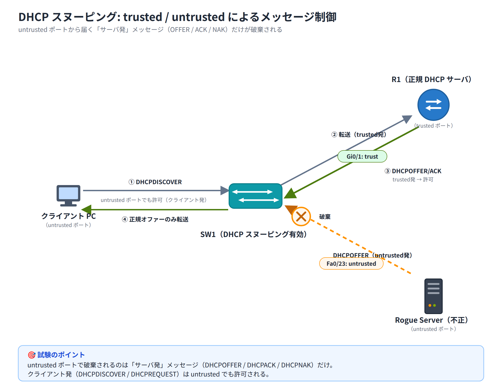

# Day 18 講義: レイヤ 2 セキュリティと VPN 概要

> 配置先: ドキュメント `01_教材 > Week4 > Day18`
> 学習時間の目安: 3.5 時間 ／ 準拠: CCNA 200-301 v1.1 ドメイン 4 / 5

## 学習目標

この講義を終えると、次のことができるようになります。

1. 代表的な L2（レイヤ 2）攻撃（MAC フラッディング・DHCP スプーフィング・ARP スプーフィング・VLAN ホッピング）の仕組みと、対策機能との対応関係を説明できる
2. ポートセキュリティを設定し、違反モード（protect / restrict / shutdown）ごとの挙動の違いを説明できる
3. DHCP スヌーピングの trusted / untrusted ポートの考え方と、破棄されるメッセージの種類を説明できる
4. ダイナミック ARP インスペクション（DAI）の動作原理と、DHCP スヌーピングへの依存関係を説明できる
5. サイト間 VPN とリモートアクセス VPN の違いを説明できる
6. IPsec が提供する 4 つのセキュリティサービスと、ESP / AH の役割の違いを説明できる

---

## ウォームアップ（朝の想起クイズ）

> 教材を見ずに、まず自力で思い出してください（分散学習: Day 11「ルーティングの
> 基礎と静的ルート」 / Day 15「IP サービス総合」 / Day 17「ACL」 の範囲から
> 出題）。

**W1.** （Day 11）静的ルートの既定の AD（Administrative Distance）はいくつか。
また、フローティングスタティックとして機能させるには、この AD をどのように
設定する必要があるか。

**W2.** （Day 15）DHCP リレーエージェントを有効にするコマンドは何か。また、
このコマンドはルータのどちら側（クライアント側／サーバ側）のインタフェースに
設定するか。

**W3.** （Day 17）標準 ACL と拡張 ACL は、それぞれインタフェースのどちら寄り
（送信元の近く／宛先の近く）に適用するのが原則か。

<details><summary>解答</summary>

W1. 既定の AD は 1。フローティングスタティックにするには、ダイナミック
ルーティングプロトコル（例: OSPF の AD 110）よりも大きい AD 値（例: 120 など）
を明示的に指定し、通常時は使われずルートが消えたときのバックアップとして
機能させる。
W2. `ip helper-address <DHCPサーバのIP>`。DHCP クライアントが接続されている
側（VLAN の SVI など）のインタフェースに設定する。
W3. 標準 ACL は宛先の近くに、拡張 ACL は送信元の近くに適用するのが原則。

</details>

---

## 1. レイヤ 2 の脅威とアクセス層セキュリティの考え方

これまでの Day では ACL やパスワード管理など、主に L3（ネットワーク層）以上の
セキュリティを扱ってきました。しかし、通信は必ず **L2（データリンク層）** を
経由します。L2 はカプセル化の最も下層に近い部分であり、ここが破られてしまうと、
上位層でどれだけ強固な暗号化・認証を行っていても、通信経路の途中に割り込まれる
**中間者攻撃（MITM: Man-in-the-Middle）** が成立してしまう可能性があります。
これは「セキュリティは最も弱い層のレベルで決まる」という考え方の典型例です。

### 代表的な L2 攻撃

| 攻撃 | 概要 |
|---|---|
| **MAC フラッディング** | 大量の偽 MAC アドレスを送りつけ、スイッチの **CAM テーブル**（MAC アドレステーブル）を溢れさせる。テーブルが溢れるとスイッチは宛先ポートを特定できず、全ポートへフラッディングするようになり、攻撃者が本来届かないはずのフレームを盗聴できてしまう |
| **MAC スプーフィング** | 他ホストの MAC アドレスを詐称し、そのホスト宛の通信を奪ったり、なりすましたりする |
| **DHCP スプーフィング** | 攻撃者が**不正な DHCP サーバ（Rogue DHCP）**を設置し、偽のデフォルトゲートウェイや DNS サーバの情報を配布して通信を自分経由に誘導する |
| **DHCP 枯渇攻撃** | 大量の偽クライアントを装って DHCP サーバのアドレスプールを使い切らせ、正規端末が IP アドレスを取得できなくする（DoS） |
| **ARP スプーフィング／ポイズニング** | 偽の ARP 応答（自分の MAC アドレスがデフォルトゲートウェイの IP に対応すると詐称）を送りつけ、他ホストの通信を自分経由に迂回させる MITM 攻撃 |
| **VLAN ホッピング** | トランクネゴシエーション（DTP）の悪用や二重タグ付けにより、本来到達できないはずの VLAN へフレームを送り込む（Day 16 で扱ったトランク堅牢化が対策） |

### 対策の 3 点セット

L2 攻撃には、それぞれに対応する防御機能があります。この対応関係は試験で
頻出です。

| 攻撃 | 対策機能 |
|---|---|
| MAC フラッディング／スプーフィング | **ポートセキュリティ** |
| 不正 DHCP／DHCP 枯渇攻撃 | **DHCP スヌーピング** |
| ARP スプーフィング | **DAI（ダイナミック ARP インスペクション）** |

これらの対策は、原則として**アクセス層スイッチの端末収容ポート（エッジポート）**
に適用します。信頼できる上流（アップリンク）側のポートは、検査を免除する
「trust（信頼）」側として扱うのが基本方針です。

また、Day 16 で学んだとおり、**未使用ポートは shutdown し、未使用の VLAN に
割り当てておく**ことも、L2 セキュリティの基本的な堅牢化として今日の内容と
セットで押さえておきましょう。

> **試験のポイント**: 各 L2 対策がどの攻撃に対応するか（ポートセキュリティ =
> MAC フラッディング、DHCP スヌーピング = 不正 DHCP、DAI = ARP スプーフィング）
> の紐付けを問う問題が頻出です。

## 2. ポートセキュリティ

**ポートセキュリティ（Port Security）** は、1 つのアクセスポートで学習・許可する
MAC アドレスの数を制限し、MAC フラッディングや MAC スプーフィングを防ぐ機能です。

### 前提条件

ポートセキュリティを有効化するには、対象ポートが **`switchport mode access`**
（または `trunk`）に固定されている必要があります。Day 7 で学んだ DTP
（Dynamic Trunking Protocol。隣接するスイッチ同士が自動でトランク化するかを
交渉するプロトコル）によってネゴシエーションが行われる `dynamic` の状態の
ままでは有効化できません。

### 設定コマンド

```
Switch(config)# interface fa0/1
Switch(config-if)# switchport mode access
Switch(config-if)# switchport port-security
Switch(config-if)# switchport port-security maximum 1
Switch(config-if)# switchport port-security mac-address sticky
Switch(config-if)# switchport port-security violation shutdown
```

- **`switchport port-security`**: ポートセキュリティ機能そのものを有効化する
- **`switchport port-security maximum <数>`**: 許可する MAC アドレス数の上限
  （既定値は **1**）

> **試験のポイント**: アクセスポートに音声 VLAN（Day 6 で学んだ、IP 電話の音声を
> データ VLAN と分離するための VLAN）で IP 電話を収容し、その配下に PC を接続する
> 構成（デイジーチェーン。IP 電話に PC を数珠つなぎに接続し、1 つのポートで
> 両方を収容する構成）では、電話と PC の両方の MAC アドレスを
> 学習するため最低 2 個の MAC が必要です。`maximum 1` のままだと一方が違反と
> みなされてしまうため、`maximum 2`（環境によっては 3）に引き上げる必要が
> あります。

- **MAC アドレスの登録方法**は次の 3 通りがあります。

| 方法 | コマンド | 特徴 |
|---|---|---|
| 静的登録 | `switchport port-security mac-address <MAC>` | 管理者が MAC アドレスを直接指定する |
| 動的学習 | （設定不要・既定の動作） | 通信から自動学習するが running-config には残らない（再起動で消える） |
| **sticky** | `switchport port-security mac-address sticky` | 動的に学習した MAC アドレスを **running-config に自動的に書き込む**。`copy running-config startup-config` で保存すれば再起動後も維持される |

### 違反モード（violation）

上限を超える MAC アドレスからのフレームを受信した場合の挙動は、
`switchport port-security violation` で 3 種類から選べます。表中の
**err-disabled** は、Day 9 で BPDU Guard のところで学んだのと同じ、エラーを
検知したスイッチがポートを強制的に無効化する状態のことです。

| モード | ポートの状態 | フレーム | 通知（Syslog/SNMP） | 違反カウンタ |
|---|---|---|---|---|
| **shutdown**（既定） | **err-disabled** に遷移（ポート停止） | 破棄 | あり | 増加 |
| **restrict** | 稼働を継続 | 破棄 | あり | 増加 |
| **protect** | 稼働を継続 | 破棄 | **なし** | **増加しない** |

> **試験のポイント**: violation モード 3 種の違い、特に既定が shutdown で
> あること、ログ通知とカウンタ増加の有無（protect だけがどちらも無し）を
> 問う問題が頻出です。

### err-disabled からの復旧

`shutdown` モードで違反が発生しポートが err-disabled になった場合、通信は
完全に止まります。復旧方法は 2 通りあります。

```
Switch(config)# interface fa0/1
Switch(config-if)# shutdown
Switch(config-if)# no shutdown
```

もしくは、自動復旧を事前に設定しておくこともできます。

```
Switch(config)# errdisable recovery cause psecure-violation
```

> 💼 **実務では**: 保守現場で多いのは、監視システムの err-disabled 検知
> アラートや「このポートだけ通信できない」というユーザー報告への一次対応です。
> まず `show port-security interface <if>` で Port Status と違反カウンタを
> 確認し、MAC 上限超過かリンクダウンかを切り分けます。sticky ポートが席替えや
> PC 交換で err-disabled に落ちるのは典型パターンで、手順書に shut/no shut
> による復旧が明記されていればその場で対応しますが、`maximum` や
> `violation` モードの変更は設計判断にあたるため客先で勝手に行わず、
> 繰り返し発生する場合は切り分け結果を添えて先輩やリーダーへ
> エスカレーションします。

### 確認コマンド

| コマンド | 内容 |
|---|---|
| `show port-security` | スイッチ全体のポートセキュリティ状況の一覧 |
| `show port-security interface <if>` | 該当ポートの違反数・Port Status などの詳細。**Port Status: Secure-up=正常稼働 / Secure-shutdown=違反による err-disabled 停止 / Secure-down=リンクダウン（未接続・admin down）** |
| `show port-security address` | 学習・登録された MAC アドレスの一覧 |

## 3. DHCP スヌーピング

**DHCP スヌーピング（DHCP Snooping）** は、不正な DHCP サーバ（Rogue DHCP）に
よる偽ゲートウェイの配布や、DHCP メッセージを利用した DoS 攻撃を防ぐ機能です。
スイッチが DHCP のやり取りを監視し、不正な応答を遮断します。

### trusted / untrusted の考え方

DHCP スヌーピングでは、スイッチの各ポートを **trusted（信頼）** と
**untrusted（非信頼）** に分類します。既定では**すべてのポートが untrusted**
です。

- **untrusted ポート**から送られてきた、**DHCP サーバが送るはずのメッセージ**
  （`DHCPOFFER` / `DHCPACK` / `DHCPNAK`）は**破棄**されます
- 正規の DHCP サーバや DHCP リレーが接続されている**上流ポート**を
  `ip dhcp snooping trust` に設定し、そこからのサーバ発メッセージのみを
  許可します

> **試験のポイント**: untrusted ポートで破棄されるのは、クライアント発の
> メッセージ（`DHCPDISCOVER`/`DHCPREQUEST`）ではなく、**サーバ発のメッセージ
> （`DHCPOFFER`/`DHCPACK`）**である点を問う問題が頻出です。



> 💼 **実務では**: 保守現場で「全社で IP が取れなくなった」という大規模アラートが
> 上がった際、DHCP スヌーピングの trust 設定漏れは定番の疑い先の一つです。
> `show ip dhcp snooping` でどのポートが untrusted のままかを確認すれば
> 切り分けはできますが、trust 設定の追加・変更は手順書に明記された復旧手順で
> ない限り自己判断で行わず、影響が全社規模に及び得ることから即座に
> エスカレーションするのが原則です。トポロジ図をもとに trust/untrusted の
> 設計を行う構築作業は、保守で切り分けの実績と正確な報告を積んでから
> 任されるようになるステップアップ案件です。

### 設定コマンド

```
Switch(config)# ip dhcp snooping
Switch(config)# ip dhcp snooping vlan 10
Switch(config)# interface gi0/1
Switch(config-if)# ip dhcp snooping trust
```

- `ip dhcp snooping`（グローバル）と `ip dhcp snooping vlan <VLAN>`
  の**両方が揃って初めて**、該当 VLAN で DHCP スヌーピングが動作します

### バインディングテーブル

DHCP スヌーピングは、正規のやり取りを監視しながら **DHCP スヌーピング
バインディングテーブル** を自動生成します。ここには MAC アドレス・IP
アドレス・リース期間・VLAN・ポートの情報が記録され、この後で学ぶ **DAI** や
IP Source Guard の判定材料として使われます。

### DHCP 枯渇攻撃対策

```
Switch(config-if)# ip dhcp snooping limit rate 10
```

untrusted ポートから届く DHCP パケットのレート（1 秒あたりのパケット数、pps）
を制限し、大量の偽リクエストによるプールの枯渇を防ぎます。

### Option 82 の扱い（Packet Tracer での注意点）

DHCP スヌーピングは既定で **Option 82**（リレーエージェント情報）を DHCP
パケットに挿入しようとします。この際、`giaddr`（Gateway IP Address）が 0
の untrusted パケットを破棄してしまう場合があり、ルータをリレーとして使う
構成や Packet Tracer での検証時に正規の通信まで止まってしまうことがあります。
このような場合は次のコマンドで Option 82 の挿入を無効化します。

```
Switch(config)# no ip dhcp snooping information option
```

### 確認コマンド

| コマンド | 内容 |
|---|---|
| `show ip dhcp snooping` | グローバル設定・対象 VLAN・各ポートの trust/untrust 状態 |
| `show ip dhcp snooping binding` | バインディングテーブル（MAC・IP・リース・VLAN・ポート） |

## 4. ダイナミック ARP インスペクション（DAI）

ここが今日の山場です。DHCP スヌーピングとの依存関係が絡むところなので、
時間をかけて構いません。

**DAI（Dynamic ARP Inspection）** は、ARP スプーフィング／ポイズニング
（偽のデフォルトゲートウェイ MAC アドレスを広めて通信を横取りする MITM 攻撃）
を防ぐ機能です。

### 動作原理

DAI は、untrusted ポートを通過する ARP 要求・応答を、**DHCP スヌーピング
バインディングテーブル**に記録された IP アドレス・MAC アドレス・ポートの
情報と照合します。整合しない（詐称された）ARP パケットは破棄されます。

> **試験のポイント**: DAI は単独では動作せず、**DHCP スヌーピングが先に
> 有効化されている**ことが前提です（バインディングテーブルが判定の根拠に
> なるため）。この依存関係を問う問題が頻出です。

DHCP スヌーピングバインディングテーブルは、DHCP でアドレスを取得した
やり取りを監視して自動生成されるものなので、固定 IP アドレスを使う端末は
そもそも DHCP をしておらず、テーブルに情報が存在しません。そのままでは
DAI に弾かれてしまいます。この場合は **ARP ACL**
（`ip arp inspection filter`）を使って、個別に許可する IP-MAC の組み合わせを
定義します。

### 設定コマンド

```
Switch(config)# ip arp inspection vlan 10
Switch(config)# interface gi0/1
Switch(config-if)# ip arp inspection trust
```

スイッチ間のリンクや上流ポートは `ip arp inspection trust` にして検査対象外
にします（既定は untrusted）。

任意で、L2 ヘッダの MAC アドレスと ARP ペイロード内の MAC アドレスの整合性
までチェックすることもできます。

```
Switch(config)# ip arp inspection validate src-mac dst-mac ip
```

### 確認コマンド

| コマンド | 内容 |
|---|---|
| `show ip arp inspection` | VLAN ごとの DAI 有効状況・trust/untrust |
| `show ip arp inspection statistics` | 許可・破棄されたパケット数の統計 |

> **補足**: Packet Tracer 9.x では DAI 自体が実装されていません。そのため
> 本日のラボはポートセキュリティと DHCP スヌーピングのみで実施し、DAI は
> 概念の理解にとどめます。

## 5. VPN の分類 — サイト間 VPN とリモートアクセス VPN

**VPN（Virtual Private Network）** は、インターネットのような公衆網の上に
暗号化された論理的なトンネルを作り、拠点間やユーザを安全に接続する技術です。
VPN は大きく 2 種類に分類されます。

### サイト間 VPN（Site-to-Site VPN）

拠点のルータやファイアウォール同士（ゲートウェイ間）でトンネルを確立し、
**ネットワーク全体**を接続する方式です。トンネルはゲートウェイ機器が透過的に
処理するため、各拠点の端末側には VPN に関する設定は不要です。本社と支社を
常時接続するような用途に向いており、通常 **IPsec** を使って実現します。

### リモートアクセス VPN（Remote Access VPN）

個々のユーザ端末（在宅勤務・出張中の PC など）が、本社ネットワークへ個別に
接続する方式です。端末側に **クライアントソフトウェア**（Cisco Secure
Client、旧称 AnyConnect など）をインストールし、**SSL/TLS**（Day 5 で学んだ
HTTPS でも使われている、通信を暗号化する規格）ベース（または IPsec ベース）
で暗号化された接続を確立します。

| 項目 | サイト間 VPN | リモートアクセス VPN |
|---|---|---|
| 接続する単位 | ゲートウェイ（ルータ/FW）間 | 個々のユーザ端末 |
| 端末側の設定 | 不要（透過的） | クライアントソフトが必要 |
| 典型的な用途 | 拠点ネットワーク全体の常時接続 | 在宅・出張ユーザの一時的な接続 |
| 主な技術 | IPsec | SSL/TLS（または IPsec） |

> **試験のポイント**: サイト間 VPN とリモートアクセス VPN の違い（ゲートウェイ
> 間接続かクライアント接続か、クライアントソフトの要否）を問う問題が頻出です。

### GRE トンネル

**GRE（Generic Routing Encapsulation）** は、IP 以外のプロトコルやマルチ
キャストも運べる汎用のトンネリング技術ですが、**それ自体は暗号化を行いません**。
機密性が必要な通信を GRE トンネルで運ぶ場合は、**GRE over IPsec**
（GRE トンネルをさらに IPsec で保護する構成）を用います。

### 使い分けの判断

- 拠点ネットワーク全体を常時接続したい → **サイト間 VPN**
- 不特定多数の個人ユーザが一時的に接続したい → **リモートアクセス VPN**

## 6. IPsec の概要

**IPsec（IP Security）** は、L3（ネットワーク層）で動作する暗号化の
フレームワークです。単一のプロトコルではなく、複数のプロトコルの**集合**
として構成されています。

### IPsec が提供する 4 つのセキュリティサービス

| サービス | 内容 | 主な技術 |
|---|---|---|
| **機密性（Confidentiality）** | データを暗号化し、盗聴されても内容を読めなくする | AES など |
| **完全性（Integrity）** | データが通信途中で改ざんされていないことを保証する | SHA などのハッシュ関数 |
| **認証（Authentication）** | 通信相手が正当な相手であることを確認する | 事前共有キー（PSK）またはデジタル証明書（RSA） |
| **アンチリプレイ（Anti-Replay）** | 過去に送られたパケットの再送（リプレイ攻撃）を検知・拒否する | シーケンス番号 |

> **試験のポイント**: IPsec が提供する機密性・完全性・認証・アンチリプレイの
> 4 つのサービスを説明できるようにしてください。記述式で問われることもあります。

### IPsec を構成するプロトコル

| プロトコル | プロトコル番号 | 提供する機能 |
|---|---|---|
| **ESP**（Encapsulating Security Payload） | 50 | 暗号化 + 完全性（実務での主流） |
| **AH**（Authentication Header） | 51 | 完全性・認証のみ（**暗号化は行わない**） |

> **試験のポイント**: ESP と AH の役割の違い、特に **AH は暗号化を行わない**
> という点を問う問題が頻出です。覚え方の一例: 「**AH は Authentication のみ**、
> 番号は 51（ESP の 50 の次）」。

| サービス | ESP | AH |
|---|---|---|
| 暗号化 | ○ | × |
| 完全性 | ○ | ○ |
| 認証 | ○ | ○ |
| アンチリプレイ | ○ | ○ |

AH だけが暗号化の列のみ × になる点を視覚的に押さえておきましょう。

### 鍵交換（IKE）

IPsec で使う SA（セキュリティアソシエーション。暗号化方式や鍵などの合意情報）
や鍵は、**IKE（Internet Key Exchange、IKEv1/IKEv2）** によって自動的に確立
されます。IKE は **UDP 500** を使用し、NAT を越える環境では **NAT-T
（NAT Traversal）** として **UDP 4500** を使用します。

> **試験のポイント**: 覚え方の一例: 「500 → NAT-T は末尾に 4 を足して 4500」。

### 動作モード

| モード | 内容 |
|---|---|
| **トンネルモード** | 元の IP パケット全体（ヘッダごと）を暗号化し、新しい IP ヘッダを外側に付加する。サイト間 VPN で一般的 |
| **トランスポートモード** | ペイロード部分のみを暗号化し、元の IP ヘッダはそのまま使う |

CCNA では IPsec の**設定そのもの**ではなく、「サイト間 VPN とリモートアクセス
VPN の違い」「IPsec が何を提供するか」を説明できるレベルが問われます。

## 7. まとめ

- L2 攻撃には MAC フラッディング・DHCP スプーフィング・ARP スプーフィング・
  VLAN ホッピングなどがあり、それぞれに対応する対策機能がある
- **ポートセキュリティ**は MAC アドレス数を制限し、違反時の挙動を
  protect / restrict / shutdown（既定）から選べる。sticky は学習した
  MAC を running-config に保存する
- **DHCP スヌーピング**は trusted/untrusted ポートを分け、untrusted 側から
  来るサーバ発メッセージ（OFFER/ACK/NAK）を破棄して不正 DHCP を防ぐ
- **DAI** は DHCP スヌーピングのバインディングテーブルを使って ARP の正当性を
  検証し、ARP スプーフィングを防ぐ（DHCP スヌーピングへの依存が前提）
- VPN は**サイト間**（ゲートウェイ間・透過的）と**リモートアクセス**
  （クライアント端末・クライアントソフト必要）に大別される
- **IPsec** は機密性・完全性・認証・アンチリプレイを提供する L3 の暗号化
  フレームワークで、ESP（暗号化あり）と AH（暗号化なし）で構成される

---

## 確認問題（自己チェック・解答は末尾）

1. ポートセキュリティの violation モードのうち、違反時にポートを
   err-disabled に遷移させる既定のモードはどれか。
2. sticky で学習した MAC アドレスは、どこに書き込まれるか。
3. DHCP スヌーピングにおいて、untrusted ポートから来た場合に破棄される
   メッセージの種類を 2 つ挙げよ。
4. DAI が ARP パケットの正当性を判定する際に参照する情報源は何か。
5. サイト間 VPN とリモートアクセス VPN のうち、端末にクライアントソフトの
   インストールが必要なのはどちらか。

<details><summary>解答</summary>

1. shutdown
2. running-config（`copy running-config startup-config` で保存すれば起動時にも維持される）
3. DHCPOFFER と DHCPACK（DHCPNAK も可）
4. DHCP スヌーピングバインディングテーブル（IP・MAC・ポートの対応情報）
5. リモートアクセス VPN

</details>

## 次のステップ

本日のラボ課題「[Day18] ラボ: ポートセキュリティと DHCP スヌーピングによる
L2 セキュリティ強化」に進み、未許可端末が err-disabled に落ちる様子と、
不正 DHCP サーバからの配布が遮断される様子を実際に確認してください。
