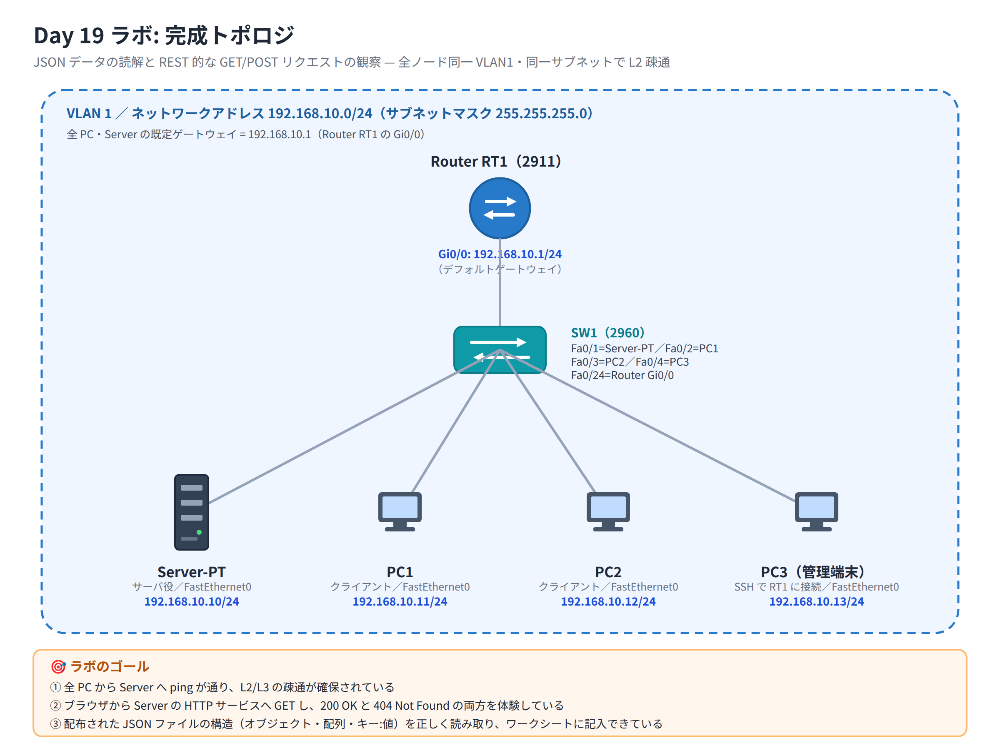

# Day 19 ラボ手順書: JSON データの読解と REST 的な GET/POST リクエストの観察

> 配置先: ドキュメント `02_ラボ手順書 > Week4 > Day19`
> 所要時間の目安: 2.5 時間 ／ 使用ツール: Cisco Packet Tracer 9.x

## ゴール

- 機器情報を表す JSON データを正しく読み解き、設問に答えられる
- Packet Tracer 内の Server-PT（HTTP サービス／IoT レジストレーションサーバ）に
  対して GET / POST 相当のリクエストを送り、レスポンスのステータスコードと
  JSON ボディを観察できる
- REST の「要求 → 応答」モデルと、それが成立する前提であるレイヤ2/レイヤ3の
  到達性（アンダーレイ）の関係を説明できる

達成すべき状態は次の 3 点です。

1. 全 PC から Server へ ping が通り、L2/L3 の疎通が確保されている
2. ブラウザから Server の HTTP サービスへ GET し、200 OK と 404 Not Found の
   両方を体験している
3. 配布された JSON ファイルの構造（オブジェクト・配列・キー:値）を正しく読み取り、
   ワークシートに記入できている

## 完成トポロジ



### IP アドレス表

| 機器 | インターフェース | IP アドレス | サブネットマスク | デフォルトゲートウェイ |
|---|---|---|---|---|
| Server-PT | FastEthernet0 | 192.168.10.10 | 255.255.255.0 | 192.168.10.1 |
| PC1 | FastEthernet0 | 192.168.10.11 | 255.255.255.0 | 192.168.10.1 |
| PC2 | FastEthernet0 | 192.168.10.12 | 255.255.255.0 | 192.168.10.1 |
| PC3（管理端末） | FastEthernet0 | 192.168.10.13 | 255.255.255.0 | 192.168.10.1 |
| Router | GigabitEthernet0/0 | 192.168.10.1 | 255.255.255.0 | — |

全ノードは同一 VLAN1・同一サブネット（192.168.10.0/24）で L2 疎通します。
JSON 解析演習（手順 3）はネットワーク接続が無くても各 PC 単体で実施できます。

---

## 手順 1: トポロジの作成と IP 設定（30 分）

1. Packet Tracer を起動し、新規ファイルを開く
2. [End Devices] から **PC** を 3 台、[End Devices] → **Server-PT** を 1 台、
   [Network Devices] → [Switches] から **2960** を 1 台、[Network Devices] →
   [Routers] から **2911** を 1 台配置する
3. ストレートケーブルで次のとおり接続する
   - Server-PT `FastEthernet0` — SW1 `FastEthernet0/1`
   - PC1 `FastEthernet0` — SW1 `FastEthernet0/2`
   - PC2 `FastEthernet0` — SW1 `FastEthernet0/3`
   - PC3 `FastEthernet0` — SW1 `FastEthernet0/4`
   - Router `GigabitEthernet0/0` — SW1 `FastEthernet0/24`
4. 上記の IP アドレス表に従い、Server-PT と PC1〜PC3 の IP Configuration に
   IP アドレス・サブネットマスク・デフォルトゲートウェイを設定する
5. 全リンクの●が緑になったら、`File > Save As` で `day19_氏名.pkt` として保存する

## 手順 2: Router の基本設定と管理経路の確保（25 分）

Router の CLI（Config タブまたは端末）で次を設定します。

```
enable
configure terminal
hostname RT1
enable secret cisco12345
interface GigabitEthernet0/0
 ip address 192.168.10.1 255.255.255.0
 no shutdown
 exit
ip domain-name lab19.local
crypto key generate rsa
1024
username admin secret Admin12345
line vty 0 4
 login local
 transport input ssh
 exit
end
write memory
```

- `crypto key generate rsa` 実行後にキー長を聞かれたら **1024** を入力する
- PC3（管理端末）から SSH で RT1 に接続できることを確認する

```
ssh -l admin 192.168.10.1
```

## 手順 3: JSON データの読解（30 分・ネットワーク接続不要）

配布された機器情報 JSON ファイル `device_info.json` を、各 PC の Text Editor
（[Desktop] → [Text Editor]）で開きます。内容は次のとおりです（配布データと
同一のものをここに示します）。

```json
{
  "devices": [
    {
      "hostname": "SW1",
      "managementIp": "192.168.10.20",
      "role": "access-switch",
      "interfaces": [
        { "name": "FastEthernet0/1", "status": "up" },
        { "name": "FastEthernet0/2", "status": "up" },
        { "name": "FastEthernet0/3", "status": "up" },
        { "name": "FastEthernet0/4", "status": "down" },
        { "name": "FastEthernet0/24", "status": "up" }
      ],
      "isActive": true
    },
    {
      "hostname": "RT1",
      "managementIp": "192.168.10.1",
      "role": "gateway-router",
      "interfaces": [
        { "name": "GigabitEthernet0/0", "status": "up" }
      ],
      "isActive": true
    }
  ]
}
```

1. `devices` キーの値がオブジェクトの**配列**であることを確認する
2. 配列の 0 番目（インデックス 0）の要素が `SW1` の情報であることを確認する
3. `SW1` の `interfaces` 配列は何個の要素を持つか数える
4. 各インターフェースの `status` キーの値（`up`/`down`）をすべて書き出す
5. `RT1` の `managementIp` の値を読み取り、手順 2 で設定した IP アドレスと
   一致することを確認する

これらの結果をワークシートに記入してください（後述の観察レポート Q1 に対応）。

## 手順 4: HTTP サービスへの GET リクエストと成功応答の観察（30 分）

1. Server-PT をクリック → [Services] タブ → **HTTP** を選択し、`On` に設定する
2. PC1 の [Desktop] → **Web Browser** を開く
3. URL 欄に `http://192.168.10.10` と入力してアクセスし、Server-PT の初期
   HTML ページが表示されることを確認する
4. ブラウザの表示（またはページ内の応答表示）で、リクエストが成功していること
   （ステータス **200 OK** 相当）を確認する
5. 続けて存在しないパスを要求する。例: `http://192.168.10.10/nopage.html`
6. **404 Not Found** が返ることを確認し、GET リクエストが「取得」の操作である
   こと、404 が「4xx: クライアントエラー」に分類されることを確認する

## 手順 5: 認証が必要なリソースへのアクセス（401 相当の再現）と POST 相当の観察（35 分）

> Packet Tracer の Server-PT には HTTP 認証機能（数値のステータスコード 401 を
> 返す機能）自体がありません。未認証時は代わりに**ログイン用の Web ページ
> （アクセス拒否・入力フォーム）**が返るだけなので、本手順では「PT では数値
> コードは表示されないため、概念対応として理解する」ことを目的とします。

1. Server-PT の [Services] タブで、IoT レジストレーションサーバまたは
   ユーザ認証機能を有効化する（[Services] → 該当のサービスを `On`）
2. PC2 の Web Browser または PT の HTTP クライアント機能から、認証が必要な
   ページ・機能へアクセスし、正しい認証情報を入力せずにアクセスを試みる
3. アクセスが拒否され、ログイン（認証情報の入力）を求める画面が返ることを
   確認する。これが REST でいう **401 Unauthorized（未認証）** に概念的に
   対応することを理解する（PT 上に数値の「401」は表示されない）
4. 次に、PC2 から正しいユーザ名・パスワードで認証を行い、IoT デバイスの
   登録操作（新規リソースの作成 = POST 相当）を実行する
5. 登録操作の後、デバイスの**登録一覧に新しいデバイスが追加されていること**
   を確認する。これが REST でいう **POST（Create）＝ 201 Created** に概念的に
   対応することを理解する（PT 上に数値の「201」は表示されない）
6. GET（情報取得）と POST 相当（新規作成）の違いを、実際の操作を通じて比較する

## 手順 6: アンダーレイの確認（レイヤ2/レイヤ3疎通）（20 分）

1. PC1〜PC3 それぞれから Server へ ping を実行し、結果を記録する

   ```
   ping 192.168.10.10
   ```

2. PC1 から `tracert 192.168.10.10` を実行し、経路を確認する
3. PC1 の Command Prompt で `arp -a` を実行し、Server の MAC アドレスが
   解決されていることを確認する
4. これらの結果から、手順 4・5 で行った HTTP（REST 的）通信が、L2（MAC 到達性）
   と L3（IP 到達性）の上に成り立っていること（＝アンダーレイが機能して
   初めてオーバーレイのアプリケーション通信が成立すること）を確認する

## 手順 7: 設定情報と JSON 表現の対比（15 分）

1. RT1 に SSH（またはコンソール）でログインし、次を実行する

   ```
   show ip interface brief
   show running-config
   ```

2. `show ip interface brief` の出力にある `GigabitEthernet0/0` の IP アドレスと
   ステータスが、手順 3 の JSON の `RT1` エントリの `managementIp` と
   `interfaces[0].status` にどう対応するかを比較する
3. 「CLI の表形式の情報」と「JSON のキー:値構造の情報」が同じ内容を
   別の表現で表していることをワークシートにまとめる

### 観察レポート（コメント提出用）

以下 3 問に答えて、課題のコメントに記入してください。

1. 配布された機器情報 JSON のうち、`SW1` の `interfaces` 配列に含まれる
   インターフェースは何個で、それぞれの `status` キーの値は何だったか。JSON の
   該当箇所を引用して答えよ。
2. 存在しない URL にアクセスしたとき返ってきたステータスコードは何番で、
   どの分類（2xx/4xx/5xx）に属するか。また、認証が必要なリソースに
   未認証でアクセスした場合は何番が返ったか。
3. 今回 GET で情報を取得し、POST 相当でデバイスを登録した。この REST 通信が
   成立するために事前に必要だったレイヤ2/レイヤ3の条件（アンダーレイ）は
   何か、ping・tracert・arp の結果を根拠に説明せよ。

## 手順 8: 提出（10 分）

1. `day19_氏名.pkt` を Backlog のラボ課題に**添付**する
2. 手順 1・6 の ping/tracert の結果（スクリーンショット可）と、手順 3〜5・
   観察レポートの回答を課題の**コメント**に貼る
3. 課題の状態を「処理済み」に変更する

## うまくいかないとき

| 症状 | 確認すること |
|---|---|
| ping が全てタイムアウト | 各機器の IP / サブネットマスクの入力ミス、ケーブルが緑か、Router の `no shutdown` を忘れていないか |
| ブラウザで Server にアクセスできない | Server-PT の [Services] タブで HTTP が `On` になっているか、URL の IP アドレスが正しいか |
| 404 ではなく接続失敗になる | HTTP サービス自体が起動していない可能性。サービスを再度 `On` にして数秒待つ |
| 認証機能で 401 相当の挙動（ログイン要求画面）が再現できない | 有効化したサービス（IoT レジストレーション／ユーザ認証）の設定を再確認し、未登録アカウントでアクセスしているか確認する |
| SSH 接続ができない | `crypto key generate rsa` を実行したか、`transport input ssh` が設定されているか、`username`/`secret` が正しいか |

30 分試して解決しない場合は、状況（スクリーンショット + 試したこと）を
課題のコメントに書いて質問してください。
