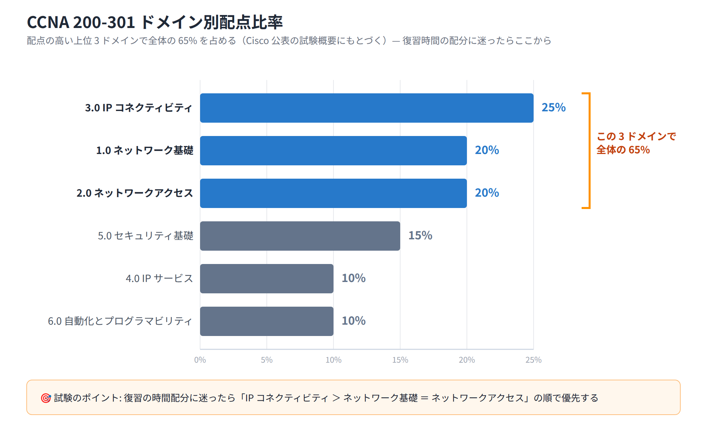

# Day 20 講義: 総復習と修了試験対策

> 配置先: ドキュメント `01_教材 > Week4 > Day20`
> 学習時間の目安: 3.5 時間 ／ 準拠: CCNA 200-301 v1.1 全ドメイン総復習

## 学習目標

この講義を終えると、次のことができるようになります。

1. CCNA 200-301 の 6 ドメインの配点比率を把握し、週次テストの誤答から自分の弱点分野を特定して復習の優先順位を付けられる
2. ドメイン 1・2（ネットワーク基礎・ネットワークアクセス）の重要ポイントを一通り説明できる
3. ドメイン 3・4（IP コネクティビティ・IP サービス）の重要ポイントを一通り説明できる
4. ドメイン 5・6（セキュリティ基礎・自動化とプログラマビリティ）の重要ポイントを一通り説明できる
5. CCNA 試験の出題形式・受験手続き・当日の流れを理解し、時間配分の戦略を立てられる
6. 研修修了後、合格に向けた具体的な自習計画を立てられる

---

## ウォームアップ（朝の想起クイズ）

> 教材を見ずに、まず自力で思い出してください（分散学習: Day 13「OSPF 応用と
> FHRP」 / Day 17「ACL」 / Day 19「自動化とプログラマビリティ」 の範囲から
> 出題）。

**W1.** （Day 13）HSRP のプライオリティの既定値はいくつか。また `preempt` を
設定していない場合、後から復旧した高プライオリティのルータは Active の座を
自動的に奪い返せるか。

**W2.** （Day 17）/27 に対応するワイルドカードマスクは何か。また、標準 ACL と
拡張 ACL は、それぞれ経路上のどちら側（宛先の近く／送信元の近く）に適用する
のが原則か。

**W3.** （Day 19）REST API で新規リソースを作成する HTTP メソッドと、成功時の
代表的なステータスコードは何か。また Ansible と Terraform の構成記述言語を
それぞれ答えよ。

<details><summary>解答</summary>

- W1: 既定値は 100。`preempt` 未設定では、先に Active になったルータがその
  まま Active であり続け、高プライオリティのルータが復旧しても自動的には
  Active を奪い返さない
- W2: /27 のワイルドカードマスクは `0.0.0.31`。標準 ACL は宛先の近く、拡張
  ACL は送信元の近くに適用するのが原則
- W3: 新規作成は **POST**、成功時の代表的なステータスコードは **201**。
  Ansible は **YAML**、Terraform は **HCL** で構成を記述する

</details>

---

## 1. 修了テストに向けた総復習の進め方と弱点分析

いよいよ Day 20、研修の最終日です。本日は新しい技術を学ぶのではなく、これまで
19 日間かけて学んできた内容を **6 つのドメイン**の視点で横断的に復習し、最後に
総合演習ラボですべての機能を 1 つのネットワークに統合します。まずは、限られた
復習時間をどこに配分するべきかを考えましょう。

### ドメインごとの配点比率

CCNA 200-301 は、次の 6 つのドメイン（出題分野）から構成されます。配点比率は
Cisco が公開している試験概要にもとづくものです。

| ドメイン | 名称 | 配点比率 |
|---|---|---|
| 1.0 | ネットワーク基礎 | 20% |
| 2.0 | ネットワークアクセス | 20% |
| 3.0 | IP コネクティビティ | 25% |
| 4.0 | IP サービス | 10% |
| 5.0 | セキュリティ基礎 | 15% |
| 6.0 | 自動化とプログラマビリティ | 10% |



配点比率を見ると、**ドメイン 3（IP コネクティビティ）が最大の 25%**、次いで
**ドメイン 1・2 がそれぞれ 20%** です。この 3 ドメインだけで全体の 65% を占める
ため、復習の時間配分に迷ったら、まずこの 3 分野（ルーティング・スイッチング・
基礎知識）を優先してください。ドメイン 4・6 は配点こそ 10% ですが、出題数自体は
一定数あるため手を抜かず、しかし相対的な優先度は下げて構いません。

### 弱点分析: 週次テストの誤答をドメイン別に集計する

Week1〜3 で受けた週次テスト（Day5・Day10・Day15）の誤答を振り返り、**ドメイン別
に正答数・誤答数を集計**してください。ドメインごとの正答率が **70% 未満**の分野は
「弱点」として、本日の復習で重点的に扱う対象とします。

集計の例（架空のデータ）:

| ドメイン | 出題数 | 正答数 | 正答率 | 判定 |
|---|---|---|---|---|
| 1. ネットワーク基礎 | 12 | 10 | 83% | 良好 |
| 2. ネットワークアクセス | 14 | 8 | 57% | **弱点** |
| 3. IP コネクティビティ | 18 | 15 | 83% | 良好 |
| 4. IP サービス | 8 | 5 | 63% | **弱点** |

このように弱点が可視化できたら、本日の該当セクション（この例なら「2. ドメイン
1・2」「3. ドメイン 3・4」）を読む際に、特にその分野の説明を丁寧に確認し、
自分の言葉で説明できるかを試してください。

### 誤答の原因分類と対策

誤答は「なぜ間違えたか」によって対策がまったく異なります。次の 3 分類で
自分の誤答を仕分けてみましょう。

| 分類 | 特徴 | 対策 |
|---|---|---|
| **知識不足** | そもそも根拠となる知識が身についていない、選択肢を見ても判断できない | 該当分野の教材を読み直し、自分の言葉で他人に説明できるレベルまで再学習する |
| **問題文の読み違い** | 知識はあるが「誤っているものはどれか」「最も適切なもの」等の条件を見落とした | 設問文中の否定語・限定語（「誤っている」「最も」「唯一」等）に下線を引く練習をする |
| **時間切れ** | 正解は導けるが、制限時間内に解ききれなかった | 時間を計った問題演習を繰り返し、1 問あたりの解答スピードを上げる |

原因を混同すると対策が的外れになります。たとえば「知識不足」なのに問題数を
こなすだけでは定着しません。逆に「読み違い」なのに教材を再読しても効果は
薄く、設問の読み方のトレーニングが必要です。

### 試験の時間配分を意識する

CCNA の本試験は、**約 100〜120 問を 120 分**で解答します。単純計算すると、
1 問あたり平均 **60〜70 秒**の配分になります。選択式の問題はこのペースで
解答できますが、後述する**シミュレーション問題**（実機に近い CLI 環境を
操作して設定・確認を行う形式）は数分かかることもあるため、シミュレーション
問題に時間を取られすぎて他の問題に手が回らなくなる事態を避ける練習が
重要です。

### 計算問題は確実な得点源

サブネット計算・ワイルドカードマスクの算出・有効ホスト数の計算などの
「計算問題」は、知識があれば必ず正解できる**確実な得点源**です。曖昧な
記憶ではなく、**手順を暗記して即答できる状態**まで仕上げておくことが、
本試験全体のスコアを底上げする最も効率のよい対策です。

### 本日の進め方

本日の講義では、6 ドメインを次の順序で一気に横断復習します。

1. ドメイン 1・2（ネットワーク基礎・ネットワークアクセス）
2. ドメイン 3・4（IP コネクティビティ・IP サービス）
3. ドメイン 5・6（セキュリティ基礎・自動化とプログラマビリティ）
4. CCNA 試験そのものの概要・受験手続き
5. 研修修了後の学習ガイダンス

そして講義の後の**総合演習ラボ**で、VLAN・トランク・ルーティング（OSPF）・
FHRP（HSRP）・DHCP・NAT・ACL・SSH・ポートセキュリティをすべて 1 つの
ネットワークに統合し、これまでの知識が実際にどう組み合わさって動くのかを
体験します。

## 2. ドメイン 1・2 要点総復習（ネットワーク基礎・ネットワークアクセス）

### OSI 7 層と PDU、機器の動作層

Day 1 で学んだとおり、通信は階層に分けて整理されます。カプセル化の順序と
各層の PDU（Protocol Data Unit、各層でのデータの単位）の名称は必ず即答
できるようにしておきましょう。

| 層 | PDU 名 | 主な機器・技術 |
|---|---|---|
| L4 トランスポート層 | セグメント | TCP, UDP |
| L3 ネットワーク層 | パケット | IP, ルータ |
| L2 データリンク層 | フレーム | Ethernet, スイッチ |
| L1 物理層 | ビット | UTP ケーブル, 光ファイバ |

機器の動作層は、**スイッチ = MAC アドレス（L2）で転送**、**ルータ = IP
アドレス（L3）で転送**、**L3 スイッチ = L2 のスイッチング機能に加えて
VLAN 間ルーティングなどの L3 機能も持つ**、という対応を押さえてください。

### サブネット計算・VLSM・私設アドレス

IPv4 アドレスの計算問題は最頻出分野の 1 つです。ネットワークアドレス・
ブロードキャストアドレス・有効ホスト数の求め方、および **VLSM
（Variable Length Subnet Mask、可変長サブネットマスク）** による
必要ホスト数に応じたアドレス設計は、必ず手順を体に染み込ませておいて
ください。

> **試験のポイント**: プレフィックス長からサブネットマスク・ブロックサイズ・
> 有効ホスト数を即答できる状態にしておきましょう。
>
> - **有効ホスト数** = 2^(ホストビット数) − 2
> - **マジックナンバー** = 256 − （マスクが掛かるオクテットの値）。
>   マジックナンバーの倍数がネットワーク境界（アドレス）になる

| プレフィックス長 | サブネットマスク | ブロックサイズ | 有効ホスト数 |
|---|---|---|---|
| /24 | 255.255.255.0 | 256 | 254 |
| /25 | 255.255.255.128 | 128 | 126 |
| /26 | 255.255.255.192 | 64 | 62 |
| /27 | 255.255.255.224 | 32 | 30 |
| /28 | 255.255.255.240 | 16 | 14 |
| /29 | 255.255.255.248 | 8 | 6 |
| /30 | 255.255.255.252 | 4 | 2 |

例: `192.168.1.130/26` はマジックナンバーが 256−192=64 のため、境界は
0・64・128・192…と並びます。130 は 128〜191 の範囲に含まれるため、
ネットワークアドレスは `192.168.1.128`、ブロードキャストアドレスは
`192.168.1.191` です。

RFC1918 で定義された私設アドレス（プライベートアドレス）の範囲は次のとおりです。

| クラス | 範囲 | CIDR 表記 |
|---|---|---|
| クラス A | 10.0.0.0〜10.255.255.255 | 10.0.0.0/8 |
| クラス B | 172.16.0.0〜172.31.255.255 | 172.16.0.0/12 |
| クラス C | 192.168.0.0〜192.168.255.255 | 192.168.0.0/16 |

これらの範囲に含まれるアドレスかどうかを見て「私設アドレス」と「グローバル
（パブリック）アドレス」を判定する問題も頻出です。

### IPv6 アドレスタイプ

| タイプ | プレフィックス | 用途 |
|---|---|---|
| リンクローカル | fe80::/10 | 同一リンク内のみで有効。ルータの隣接関係などに使用 |
| GUA（グローバルユニキャストアドレス） | 2000::/3 | インターネットで一意にルーティング可能なアドレス |
| ULA（ユニークローカルアドレス） | fc00::/7 | 私設アドレスに相当。組織内での利用を想定 |
| マルチキャスト | ff00::/8 | 1 対多の通信に使用（IPv6 にはブロードキャストが存在しない） |

**SLAAC（Stateless Address Autoconfiguration）** は、ルータが送信する
RA（Router Advertisement）を受け取った端末が、DHCPv6 サーバなしで
自律的に IPv6 アドレスを生成する仕組みです。ホスト部の生成方式の 1 つが
**EUI-64** で、端末の 48 ビット MAC アドレスを 64 ビットのインター
フェース ID に変換して使用します。

### TCP/UDP とポート番号

| 項目 | TCP | UDP |
|---|---|---|
| 接続 | コネクション型（3 ウェイハンドシェイク） | コネクションレス型 |
| 信頼性 | 再送・順序制御あり | なし（アプリ側で対応） |
| 速度 | 相対的に低速 | 相対的に高速 |
| 用途例 | HTTP, FTP, SSH | DNS（一部）, DHCP, 音声/映像 |

3 ウェイハンドシェイクは **SYN → SYN/ACK → ACK** の順で行われ、コネクション
を確立してからデータ転送に入ります。

主要なポート番号は確実に暗記してください。

| サービス | ポート番号 | プロトコル |
|---|---|---|
| HTTP | 80 | TCP |
| HTTPS | 443 | TCP |
| SSH | 22 | TCP |
| Telnet | 23 | TCP |
| DNS | 53 | TCP/UDP |
| DHCP（サーバ/クライアント） | 67 / 68 | UDP |
| FTP（制御/データ） | 21 / 20 | TCP |
| SMTP | 25 | TCP |
| NTP | 123 | UDP |
| SNMP | 161（ポーリング）/ 162（トラップ） | UDP |

### VLAN・トランク・VLAN 間ルーティング

**VLAN（Virtual LAN）** は、物理的な配線構成に関わらず論理的にブロードキャスト
ドメインを分割する技術です。VLAN が異なれば、同じスイッチに接続されていても
互いにブロードキャストが届きません。

複数の VLAN のトラフィックを 1 本のリンクで運ぶ仕組みが **802.1Q トランク**
です。フレームに VLAN ID を示す 4 バイトのタグを挿入しますが、**ネイティブ
VLAN** に属するフレームだけはタグが付与されません（アンタグド）。

> **試験のポイント**: 両端のスイッチでネイティブ VLAN が食い違っていると、
> トラフィックが誤った VLAN に配送されたり、CDP がネイティブ VLAN 不一致の
> 警告を出したりします。トランク両端のネイティブ VLAN は必ず一致させる
> 必要がある、という点は頻出です。

VLAN をまたいだ通信には L3 の処理が必要です。代表的な 2 つの方式を
比較します。

| 方式 | 概要 |
|---|---|
| **Router-on-a-Stick** | ルータの 1 つの物理インターフェースにサブインターフェースを複数作成し、それぞれに `encapsulation dot1Q <VLAN ID>` と IP アドレスを設定して VLAN ごとのゲートウェイとする |
| **L3 スイッチの SVI** | スイッチ上に VLAN ごとの仮想インターフェース（SVI: Switched Virtual Interface）を作成し、`ip routing` を有効化してスイッチ自体にルーティングさせる |

### STP と EtherChannel

**STP（Spanning Tree Protocol）** は、スイッチ間の冗長リンクによって発生する
**L2 ループ**（ブロードキャストストームや MAC アドレステーブルの不安定化を
招く）を防ぐプロトコルです。

- **ルートブリッジの選出**: 最小のブリッジ ID（プライオリティ + MAC アドレス）
  を持つスイッチがルートブリッジになる
- **ポートロール**: ルートポート（ルートブリッジへの最短経路ポート）、
  指定ポート（セグメントごとに 1 つ選ばれる転送ポート）、非指定ポート
  （ブロッキング状態になるポート）
- **ポートステート**: ブロッキング → リスニング → ラーニング → フォワーディング
  （従来の STP は遷移に最大 50 秒）
- **RSTP（Rapid STP）**: 状態遷移を高速化した改良版。数秒でフォワーディング
  状態に到達する
- **PortFast**: 端末を接続するアクセスポートで STP の状態遷移をスキップし、
  即座にフォワーディング状態にする機能
- **BPDU Guard**: PortFast を設定したポートに BPDU（STP の制御フレーム）が
  届いた場合、そのポートを自動的に errdisable にして不正なスイッチの
  接続を防ぐ機能

**EtherChannel** は、複数の物理リンクを論理的に 1 本の高帯域リンクとして
束ねる技術です。**LACP（Link Aggregation Control Protocol）** のネゴシエー
ションモードには **active**（能動的にネゴシエーションを開始）と
**passive**（相手からの要求を待つ）があり、双方が passive 同士だと
EtherChannel は形成されません。

### 無線 LAN と隣接検出プロトコル

無線 LAN は **2.4GHz・5GHz・6GHz** の周波数帯を使用し、**SSID**（ネットワーク
名）と**チャネル**で識別・分離されます。セキュリティ方式は **WPA2** から
より安全な **WPA3** への移行が進んでいます。

企業ネットワークでは、AP の管理を集中化するために **WLC（Wireless LAN
Controller）** と **Lightweight AP（軽量 AP、自身では認証処理等を行わず
WLC に処理を委ねる AP）** の構成が使われ、両者の間は **CAPWAP
（Control And Provisioning of Wireless Access Points）** というトンネル
プロトコルで通信します。

**CDP（Cisco Discovery Protocol）** は Cisco 独自の隣接機器検出プロトコル、
**LLDP（Link Layer Discovery Protocol）** はベンダー中立の標準プロトコル
です。どちらも隣接機器のホスト名・IP アドレス・接続ポートなどを自動的に
収集できます。

## 3. ドメイン 3・4 要点総復習（IP コネクティビティ・IP サービス）

### ルーティングテーブルの読み方と経路選択の優先順位

`show ip route` で表示されるルーティングテーブルの各行には、経路の
プロトコル種別（記号）、宛先ネットワーク、AD 値/メトリック、ネクストホップ、
出力インターフェースなどが表示されます。

ルータが同じ宛先への複数の経路情報を持つ場合、次の順序で使用する経路を
決定します。

> **試験のポイント**: 経路選択の優先順位「**ロンゲストマッチ（最長一致）
> → アドミニストレイティブディスタンス（AD）→ メトリック**」は非常に
> よく出題されます。まずプレフィックス長が最も長く一致する経路が選ばれ、
> 次に AD 値が最小の経路（情報源としての信頼性）、最後にメトリック
> （その情報源内でのコストの低さ）で決まる、という順序を正確に覚えて
> ください。

### アドミニストレイティブディスタンス（AD）値

| 経路情報源 | AD 値 |
|---|---|
| 直結ネットワーク | 0 |
| 静的ルート | 1 |
| EIGRP | 90 |
| OSPF | 110 |
| RIP | 120 |

AD 値は「その情報源がどれだけ信頼できるか」を表す指標で、**値が小さいほど
優先度が高い**ことを意味します。

**静的ルート**はネクストホップ IP アドレス指定、または出力インターフェース
指定で設定します。宛先・マスクとも `0.0.0.0` で指定するものが**デフォルト
ルート**（該当する経路がないときに使われる経路）です。

**フローティングスタティックルート**は、通常使う経路（例: OSPF、AD110）
より**大きい AD 値**（例: 130）を明示的に指定した静的ルートで、通常時は
使用されず、主経路が落ちたときにのみバックアップとして機能します。

### OSPF

**OSPF（Open Shortest Path First）** はリンクステート型のダイナミック
ルーティングプロトコルです。ネイバー（隣接ルータ）が **Full** 状態まで
正常に到達するためには、両インターフェースで次の項目が一致している
必要があります。

> **試験のポイント**: OSPF のネイバー確立条件（**エリア番号・Hello/Dead
> タイマー・サブネット・認証設定・MTU**の一致）を問う問題は頻出です。
> 特に MTU 不一致は Exstart/Exchange 状態での停滞という特徴的な症状で
> 出題されることが多いので、状態名とセットで覚えておきましょう。

| 一致が必要な項目 | 不一致時の主な症状 |
|---|---|
| エリア番号 | ネイバーが確立しない |
| Hello/Dead タイマー | ネイバーが確立しない、または不安定になる |
| サブネット（同一セグメント） | ネイバーが確立しない |
| 認証設定 | ネイバーが確立しない |
| MTU | Exstart/Exchange 状態で停滞する |

マルチアクセスネットワーク（イーサネットセグメントなど）では、不要な
隣接関係の増加を抑えるために **DR（Designated Router）** と **BDR
（Backup DR）** が選出されます。選出基準は**インターフェースの OSPF
プライオリティが最大**のルータ、同値の場合は **Router ID が最大**の
ルータです。

OSPF のインターフェースコストは、既定では次の式で計算されます。

```
コスト = 参照帯域幅（既定 10^8 = 100,000,000）÷ インターフェース帯域幅（bps）
```

**Router ID** は、①`router-id` コマンドによる明示指定、②最大のループバック
インターフェース IP、③最大の物理インターフェース IP、の優先順位で決定
されます。**passive-interface** を設定したインターフェースは Hello の
送信（＝ネイバー形成）を停止しますが、そのインターフェースが属する
ネットワーク自体は引き続き OSPF で広告されます。

### FHRP（HSRP）

**FHRP（First Hop Redundancy Protocol）** は、デフォルトゲートウェイを
冗長化する仕組みの総称です。

> **試験のポイント**: **HSRP** の仮想 IP アドレス・仮想 MAC アドレス
> （`0000.0c07.acXX`、XX はグループ番号の 16 進数）を Active ルータが
> 応答すること、プライオリティの既定値が **100**、そして **preempt**
> を設定していないと、いったん Standby に降格したルータは元のプライオリティ
> の高さだけでは Active に復帰しない、という点が頻出です。

| プロトコル | 開発元 | 特徴 |
|---|---|---|
| **HSRP** | Cisco 独自 | Active/Standby の 1 台のみが転送。仮想 IP + 仮想 MAC |
| **VRRP** | 業界標準（RFC） | HSRP に類似。マスタ/バックアップという用語を使用 |
| **GLBP** | Cisco 独自 | 複数台（最大 4 台）のルータが**同時に**転送できる |

### DHCP

DHCP はクライアントに IP アドレス等を自動割り当てするプロトコルで、
**DORA**（**D**iscover → **O**ffer → **R**equest → **A**ck）の 4 段階の
メッセージ交換で動作します。DHCP サーバは UDP 67、クライアントは UDP 68
を使用します。

ルータ自体を DHCP サーバとして動作させる場合は `ip dhcp pool` で
プールを作成し、`network`（配布範囲）・`default-router`（デフォルト
ゲートウェイ）・`dns-server` 等を設定します。

クライアントと DHCP サーバが異なるサブネットにある場合、DHCP の
Discover はブロードキャストのためルータを越えて届きません。クライアント
側インターフェースに **`ip helper-address <DHCP サーバ IP>`**（DHCP
リレー）を設定すると、ルータがブロードキャストをユニキャストに変換して
サーバへ転送します。

### NAT

**NAT（Network Address Translation）** は、私設アドレスとグローバル
アドレスを相互変換する技術です。用語の対応を正確に覚えてください。

| 用語 | 意味 |
|---|---|
| inside local | 内部ホストが持つ変換前（私設）アドレス |
| inside global | 内部ホストが外部から見えるときの変換後（公開）アドレス |
| outside local | 外部ホストが内部から見えるときのアドレス |
| outside global | 外部ホストが持つ本来の（グローバル）アドレス |

> **試験のポイント**: PAT（NAT オーバーロード、**overload** キーワードで
> 有効化）は、複数の内部ホストを 1 つのグローバルアドレスに集約しながら、
> **L4 のポート番号**を組み合わせて変換テーブルに記録することで、戻り
> パケットを正しい内部ホストに振り分けます。`show ip nat translations`
> の出力でポート番号付きのエントリが並ぶのが PAT の特徴です。

> 💼 **実務では**: 企業のインターネット境界はほぼ例外なく PAT（1 つの払い出し
> グローバル IP に社内全端末を集約）で構成します。トラブルの筆頭は
> inside/outside の付け間違いで、`ip nat inside`/`outside` がどちらか片方でも
> 抜けると変換が起きず全社が外に出られなくなります。障害切り分けの定石は
> `show ip nat translations` を見て空なら「変換対象トラフィックがそもそも
> 通っていない（ACL 範囲外・ルーティング未達）」を先に疑うことです。逆に
> 社内サーバを外部公開する要件では動的 PAT では足りず、静的 NAT
> （ポートフォワード）が別途必要になる点を新人はよく取りこぼします。

- **静的 NAT**: `ip nat inside source static <内部IP> <外部IP>` で 1 対 1 固定
  変換。サーバの常時公開に適する
- **動的 NAT**: `ip nat pool` で用意したアドレスプールから都度割り当てる
- **PAT（オーバーロード）**: `ip nat inside source list <ACL> interface <IF> overload`
  で、1 つのグローバルアドレスをポート番号で多重化して共有する

### その他の IP サービス

| サービス | 要点 |
|---|---|
| **NTP** | 時刻同期プロトコル（UDP 123）。**stratum**（階層）が小さいほど基準時刻に近い。自身を基準時刻源にするには `ntp master` |
| **Syslog** | ログメッセージを集約するプロトコル。**severity レベル**は 0（Emergency、最重大）〜7（Debugging、最詳細）の 8 段階 |
| **SNMP** | 機器の監視・管理プロトコル。マネージャからのポーリングは UDP 161、エージェントからの Trap は UDP 162。SNMPv3 は認証・暗号化に対応し安全性が高い |
| **SSH / FTP / TFTP** | SSH（TCP22）は暗号化されたリモート管理、FTP（TCP20/21）はファイル転送、TFTP（UDP69）は軽量なファイル転送（IOS イメージ転送等に使用） |
| **QoS 概要** | 分類（トラフィックの識別）→ マーキング（優先度の付与）→ キューイング（優先度に応じた出力順序制御）→ ポリシング/シェーピング（帯域制御。ポリシングは超過分を即時破棄、シェーピングはバッファして遅延送出） |

## 4. ドメイン 5・6 要点総復習（セキュリティ基礎・自動化）

### セキュリティの基本用語と攻撃の種類

| 用語 | 意味 |
|---|---|
| 脆弱性（Vulnerability） | システムに存在する弱点・欠陥 |
| エクスプロイト（Exploit） | 脆弱性を悪用する手法・コード |
| 脅威（Threat） | 脆弱性を悪用しようとする主体や事象 |
| 緩和（Mitigation） | リスクを低減するための対策 |

代表的な攻撃の種類には、送信元を偽装する**スプーフィング**、通信経路の
途中に介入し傍受・改ざんする **MITM（Man-In-The-Middle）**、サービスを
過負荷にして利用不能にする **DoS/DDoS**、正規のサービスを装って情報を
詐取する**フィッシング**などがあります。**AAA**（Authentication・
Authorization・Accounting、認証・認可・アカウンティング）や、パスワードに
加えて別の要素（ワンタイムコード等）を組み合わせる**多要素認証（MFA）**
は、これらの脅威への対策として重要です。

### デバイスの堅牢化

| 設定 | 目的 |
|---|---|
| `enable secret` | 特権モードパスワードを暗号化して保存する（`enable password` より優先・安全） |
| `service password-encryption` | 設定ファイル中の各種平文パスワードを簡易暗号化する |
| VTY を SSH 限定にする | `transport input ssh` で Telnet（平文通信）を無効化する |
| 未使用ポートの `shutdown` | 物理的に空いているポートからの不正接続を防ぐ |
| ログインバナー（`banner motd` 等） | 権限のないアクセスへの警告を表示する |

### ACL（アクセスコントロールリスト）

> **試験のポイント**: ACL は上から順に条件を評価し、最初に一致した行の
> 動作（permit/deny）が適用されます。どの行にも一致しない通信は、末尾の
> **暗黙の deny（明示的に書かなくても存在する `deny any`）** によって
> 拒否されます。また **標準 ACL は宛先の近くに、拡張 ACL は送信元の近くに**
> 適用するのが原則で、これは標準 ACL が送信元アドレスしか判断材料を
> 持たないため、宛先近くに置かないと意図しない通信まで止めてしまう
> ことがあるためです。**ワイルドカードマスクの計算**（サブネットマスクの
> ビット反転、`0` が一致必須・`1` が任意）も頻出です。

| 種別 | 判定材料 | 番号範囲（番号付き） | 適用推奨位置 |
|---|---|---|---|
| 標準 ACL | 送信元 IP アドレスのみ | 1〜99, 1300〜1999 | 宛先の近く |
| 拡張 ACL | 送信元/宛先 IP・プロトコル・ポート番号等 | 100〜199, 2000〜2699 | 送信元の近く |

名前付き ACL（`ip access-list standard/extended <名前>`）は番号の代わりに
名前で管理でき、行の追加・削除が容易です。VTY 回線へのアクセス制限には、
インターフェースの `ip access-group` ではなく **`access-class <ACL名> in`**
を使用します。

### レイヤ 2 セキュリティ

> **試験のポイント**: **ポートセキュリティ**の violation（違反）モードの
> 違いは頻出です。**protect**（超過フレームを破棄するのみ・ログなし）、
> **restrict**（破棄に加えてログ/カウンタを記録）、**shutdown**（ポートを
> errdisable にする・既定モード）の 3 種類を区別してください。また
> `switchport port-security mac-address sticky` を設定すると、動的に
> 学習した MAC アドレスが実行コンフィグに自動的に固定登録されます
> （**sticky MAC**）。

> 💼 **実務では**: 既定の violation shutdown のまま運用すると、社員の PC
> 入れ替え・ドッキングステーション接続・IP 電話 + PC のぶら下げ（maximum 1
> 超過）などで日常的にポートが errdisable に落ち、ヘルプデスクへの問い合わせ
> が多発します。現場では errdisable recovery の自動化や maximum 値の見直しで
> 運用負荷を下げるのが定石です。もう一つの落とし穴が sticky MAC で、
> `switchport port-security mac-address sticky` は実行コンフィグに書かれる
> だけなので `copy running-config startup-config` を忘れると再起動で学習済み
> MAC が消え、翌朝つながらないという事故になります。設定後の保存まで含めて
> 手順化するのがプロの習慣です。

| 技術 | 目的 |
|---|---|
| ポートセキュリティ | ポートごとに許可する MAC アドレス数・アドレスを制限し、不正な端末の接続を防ぐ |
| DHCP スヌーピング | 信頼できないポートからの不正な DHCP サーバ応答を遮断する |
| DAI（Dynamic ARP Inspection） | DHCP スヌーピングの情報をもとに、不正な ARP 応答（ARP スプーフィング）を検知・遮断する |

### VPN の分類

| 種別 | 概要 |
|---|---|
| サイト間 VPN | 拠点と拠点のネットワーク同士を、インターネット経由で常時接続する |
| リモートアクセス VPN | 個々の端末が VPN クライアントを使ってオフィスネットワークに接続する |

**IPsec** は、VPN でよく使われる暗号化・認証のプロトコル群です。CCNA では
実装の詳細ではなく、暗号化された安全なトンネルを構築する技術という
概念レベルの理解が求められます。

### SDN とコントローラベースネットワーク

Day 19 で学んだとおり、SDN（Software-Defined Networking）はコントロール
プレーン（経路を決める機能）とデータプレーン（転送する機能）を分離し、
コントローラに集中管理させる考え方です。**アンダーレイ**（物理ネット
ワーク）・**オーバーレイ**（アンダーレイ上に構築される論理ネットワーク）・
**ファブリック**（両者 + コントローラの全体）の 3 用語を区別し、コントローラ
が機器を制御する**南向きインターフェース（SBI）**と、アプリケーションと
連携する**北向きインターフェース（NBI）**の役割を押さえてください。
**Cisco Catalyst Center** は、Design・Policy・Provision・Assurance の
4 機能を持つ代表的なコントローラです。

### REST API と JSON

> **試験のポイント**: REST API の HTTP メソッドと CRUD 操作の対応
> （GET=読み取り、POST=作成、PUT/PATCH=更新、DELETE=削除）、および
> HTTP ステータスコードの分類（**2xx=成功、4xx=クライアントエラー、
> 5xx=サーバエラー**。特に 200・201・401・404・500 の意味）は非常に
> よく出題されます。

JSON（JavaScript Object Notation）はオブジェクト `{}` と配列 `[]` を
組み合わせてデータを表現する軽量フォーマットで、REST API のリクエスト・
レスポンスのボディとして広く使われます。キーは必ず二重引用符で囲み、
末尾の要素の後にカンマを付けないという構文ルールも確認しておきましょう。

### 構成管理ツール

| ツール | エージェント | モデル | 言語 |
|---|---|---|---|
| Ansible | エージェントレス | Push | YAML |
| Terraform | エージェントレス | 宣言的 | HCL |
| Puppet / Chef | エージェントベース | Pull | 独自 DSL / Ruby |

**Ansible** は SSH ベースでエージェントレスに動作し、YAML の Playbook に
あるべき状態を記述します。**Terraform** は HCL で「最終的にどうあるべきか」
を宣言的に記述し、主にインフラのプロビジョニング（IaC）に使われます。

### AI がネットワーク運用に与える影響（v1.1 追加）

CCNA 200-301 v1.1（2024 年 8 月改訂）では、**生成 AI**（新しいコンテンツ
を生成する）と**予測 AI**（過去データから将来を予測する）がネットワーク
運用に与える影響が試験範囲に加わりました。異常検知の高速化、トラブル
シューティング支援、運用の自動化・省力化といった利点がある一方、AI の
出力は必ず人間が検証する必要がある点、データプライバシーへの配慮が
必要な点も押さえておきましょう。

## 5. CCNA 試験の概要・受験手続き・試験当日の流れ

### 試験の基本情報

| 項目 | 内容 |
|---|---|
| 試験番号 | 200-301（バージョン v1.1、2024 年 8 月改訂） |
| 出題数 | 約 100〜120 問 |
| 試験時間 | 120 分 |
| スコア | 1000 点満点でスコアリング（合格ラインは非公開、目安は 825 点前後） |

出題形式には、単一または複数の正解を選ぶ**多肢選択式**、項目をドラッグ
して正しい対応関係を作る**ドラッグ&ドロップ**、実機に近い CLI 環境を
操作して設定・確認を行う**シミュレーション/シムレット**があります。
**本試験のシミュレータは Packet Tracer とは別物**（Cisco 独自の試験
環境）である点に注意してください。操作感が異なるため、コマンドの
正確さそのものを重視した練習が有効です。

### 受験手続き

1. **Cisco アカウントの作成**（Cisco.com のアカウント）
2. **Pearson VUE での予約**（試験日時・受験方法を選択）
3. **受験方法の選択**: テストセンターでの受験、または自宅等から受験する
   **オンライン受験（OnVUE）**

### 試験当日の注意点

- **写真付きの本人確認書類**が必須です
- 私物（スマートフォン・筆記用具・時計等）の持ち込みは原則不可です
- CCNA の本試験は**一度次の問題へ進むと前の問題に戻れません**。見直しを
  前提とした解き方はできないため、各問題でその場で決着をつける必要が
  あります

### 時間配分の戦略

- シミュレーション問題を後回しにしすぎない（時間切れで手を付けられなく
  なるリスクを避ける）
- 計算問題で詰まったら、印を付けて（または見切りをつけて）先に進む
  判断も必要です（前の問題には戻れないため、粘りすぎに注意）
- 残り時間を常に意識し、ペース配分（1 問 60〜70 秒目安）を保つ

### 合格後

CCNA 認定の有効期限は **3 年間**です。再認定（更新）は、上位試験
（CCNP など）に合格するか、**Continuing Education（CE）クレジット**
（対象のトレーニングや活動でポイントを積み上げる制度）を取得すること
で行えます。

## 6. 研修修了後の学習ガイダンス

研修はあくまでスタートラインです。ここからの過ごし方が合否を大きく
左右します。

### 受験までのスケジュール

修了後は **2〜4 週間の自習期間**（問題演習中心）を経てから受験することを
推奨します。この期間中に、時間を計った**模擬試験を最低 3 回**は解いて
ください。回を重ねるごとに時間配分の感覚が身につきます。

### 弱点分野の優先復習

本日の「1. 総復習の進め方」で特定した弱点ドメインを最優先で復習して
ください。単に正解を覚えるのではなく、**間違えた問題は「なぜその選択肢が
正解で、他が誤りなのか」を根拠まで説明できる**状態を目指しましょう。

### ラボの反復とコマンド出力の読解訓練

Packet Tracer で本日の総合演習ラボの構成を**繰り返し構築**し、`show`・
`debug` コマンドの出力を自力で読めるように訓練してください。設定を
覚えるだけでなく、「なぜこの出力になっているか」を説明できることが
実務にもつながる真の理解です。

### 計算系の毎日反復

サブネット計算・ワイルドカードマスク・IPv6 の省略記法などの計算系は、
**毎日少数を反復**することで瞬時に解ける状態を維持できます。数日空けると
感覚が鈍るため、受験直前まで継続することをお勧めします。

### 研修の修了条件と発展学習

本研修の修了条件は、**修了テストの正答率 75% 以上**、かつ**総合演習
ラボの要件充足**です。合格後は、**CCNP Enterprise** など上位資格への
挑戦や、Cisco Networking Academy（**NetAcad**）での継続学習も
検討してみてください。

## まとめ

- CCNA 200-301 の配点比率は「IP コネクティビティ 25% > ネットワーク基礎/
  ネットワークアクセス 各 20% > セキュリティ基礎 15% > IP サービス/自動化
  各 10%」。配点の高い分野を優先して復習する
- 週次テストの誤答をドメイン別に集計し、正答率 70% 未満を弱点として
  特定する。誤答は「知識不足」「読み違い」「時間切れ」に分類し、原因別に
  対策する
- ドメイン 1・2 は OSI/カプセル化・アドレス計算・VLAN/トランク/STP・
  無線 LAN の基礎が中心
- ドメイン 3・4 は経路選択の優先順位・OSPF・HSRP・DHCP・NAT・その他
  IP サービスが中心。特に AD 値と OSPF ネイバー確立条件は頻出
- ドメイン 5・6 は ACL・ポートセキュリティ・SDN・REST API・構成管理
  ツールが中心。ACL の評価順序とワイルドカードマスクは確実に得点したい
  分野
- 本試験は 100〜120 問を 120 分で解答し、1 問前に戻れない一方通行方式。
  時間配分と計算問題での即答力がスコアを左右する
- 修了後は 2〜4 週間の自習と模擬試験 3 回以上、弱点分野の重点復習、
  ラボの反復構築を経て受験するのが望ましい

---

## 確認問題（自己チェック・解答は末尾）

1. CCNA 200-301 の 6 ドメインのうち、最も配点比率が高いドメインはどれか。
2. ルータが複数の経路情報から実際に使用する経路を決定する際の優先順位を、
   正しい順序で答えよ。
3. OSPF のネイバーが Exstart/Exchange 状態で停滞している場合、まず疑うべき
   不一致項目は何か。
4. 標準 ACL と拡張 ACL は、それぞれ通信経路のどこに適用するのが原則か。
5. CCNA 本試験について、出題数・試験時間・前の問題に戻れるかどうかを
   それぞれ答えよ。

<details><summary>解答</summary>

1. IP コネクティビティ（配点比率 25%）
2. ロンゲストマッチ（最長一致）→ アドミニストレイティブディスタンス（AD）
   → メトリック
3. MTU の不一致
4. 標準 ACL は宛先の近く、拡張 ACL は送信元の近く
5. 出題数は約 100〜120 問、試験時間は 120 分、一度次の問題へ進むと
   前の問題には戻れない

</details>

## 次のステップ

本日午後の総合演習ラボ「[Day20] ラボ: 総合演習 — 小規模企業ネットワークの
構築」に進みます。VLAN・トランク・Router-on-a-Stick・HSRP・OSPF・DHCP・
NAT・拡張 ACL・ポートセキュリティ・SSH 管理という、これまで 19 日間で
学んだ要素をすべて 1 つのネットワークに統合し、実際に動作させて検証
します。本日の総復習で整理した知識が、実機の設定・確認コマンドの中で
どうつながっているかを体感してください。
